# How to migrate RFC Lookups from SAP Process Orchestration to Cloud Integration
<!-- description --> This tutorial explores two different solutions to implement RFC Lookup using the Cloud Integration capability of the SAP Integration Suite. 


## Intro

In SAP Process Orchestration, a Remote Function Call (RFC) Lookup is a feature that enables communication between different systems or components within the SAP landscape and it is used during the execution of a mapping program. The SAP Java Connector (SAP JCo) is a development library that enables a Java application to communicate with SAP systems using SAP's RFC protocol and it will be used in both solutions. For more information refer to the [SAP Java Connector](https://help.sap.com/doc/saphelp_gbt10/1.0/en-US/48/70792c872c1b5ae10000000a42189c/content.htm?no_cache=true).

## Prerequisites
- Ensure that the function module is available in your SAP system.

## You will learn
- How to implement RFC Lookup on Cloud Integration using Groovy Script and UDF (User-Defined Function) on Message Mapping.

### Use Case 1 - Implement RFC Calls in Cloud Integration Using Groovy Script

The first approach can be done by using a Groovy Script on Integration Flow. This Script dynamically retrieves the RFC destination and RFC names from the properties, sets the RFC Request fields parameters from properties, executes the RFC call, and converts the response into XML format. 

Using a Groovy Script provides flexibility in implementation by allowing dynamic adjustment of import parameters based on exchange properties in the Integration Flow. This capability allows developers to adapt to many different RFC scenarios without change the Groovy Script. However, this Groovy Script just execute a single RFC call per call, so any need for executing multiple RFC calls would require changes to the code.

The implementation of this solution can be done by following the next steps:

1.  Create an Integration Flow on Cloud Integration.

2.  Add a content modifier called “Set Properties & RFC Fields” to define the following Exchange Properties:

    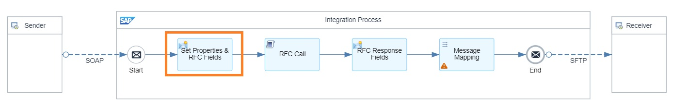  

    - RFCDestination: name of the RFC Destination you will use. (For more information refer to the: [Create RFC Destinations](https://help.sap.com/docs/connectivity/sap-btp-connectivity-cf/create-rfc-destinations)).

    *In this tutorial, the solution was implemented using the BAPI_FLIGHT_CHECKAVAILABILITY RFC. Feel free to adjust the properties according to your specific requirements.*

    - RFCName: Name of the RFC you will use.
    - payload: After the request-reply step, it is necessary to retrieve the original incoming message. This step ensures that subsequent operations have access to the initial data. You can achieve this by using ${in.body}.
    - InputParameter_*: This is the prefix for the name of the RFC Request field. Each property should start with this prefix followed by the specific name of the RFC Request field. For each property, specify the XPath of the corresponding field to map from the source structure of the message mapping.

    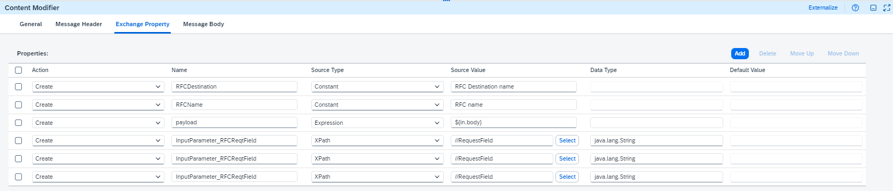 
    
    *Note: You can add or remove properties as needed.*
    
3.  Create a new Groovy Script in the Integration Flow and paste the code below or import the following Groovy Script on the References.
    
    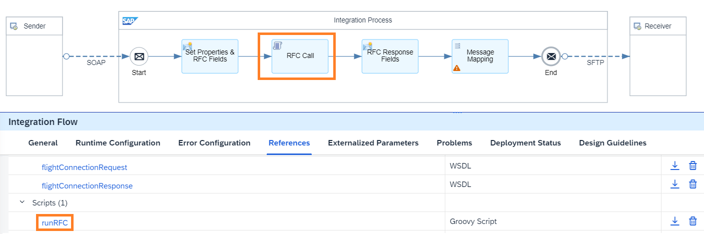

    The *runRFC* Groovy Script is the following:

    ```Groovy
        import com.sap.gateway.ip.core.customdev.util.Message
        import com.sap.conn.jco.*

        def Message processRFCCall(Message message) {
            def destinationName = message.getProperty("RFCDestination")
            def rfcName = message.getProperty("RFCName")

            try {
                
                JCoDestination jcoDestination = JCoDestinationManager.getDestination(destinationName)
                JCoFunction function = jcoDestination.getRepository().getFunction(rfcName)

                if (function != null) {
                    def parameterList = function.getImportParameterList()

                    message.getProperties().each { key, value ->
                        if (key.startsWith("InputParameter_")) {
                            def paramName = key.substring("InputParameter_".length())
                            try {
                                parameterList.setValue(paramName, value)
                            } catch (Exception e) {
                                throw new Exception("Error setting parameter '${paramName}': ${e.getMessage()}")
                            }
                        }
                    }

                    function.execute(jcoDestination)

                    def result = function.toXML()
                    message.setBody(result)
                } else {
                    throw new Exception("ERROR: RFC function '${rfcName}' not found")
                }

            } catch (JCoException e) {
                throw new Exception("ERROR executing RFC function: ${e.getMessage()}")
            } catch (Exception e) {
                throw new Exception("Unexpected error: ${e.getMessage()}")
            }

            return message
        }
    ``` 

4.  Define a content modifier called 'RFC Response Fields' to capture and store the values of response fields extracted from the RFC.

    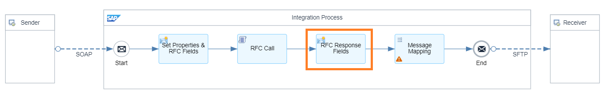
    
5. Add exchange properties (as needed) and specify the XPath of the RFC response fields.

    

    *Note: You can add or remove properties as needed.*

6.  Create a message mapping by adding the source and target messages previously imported in the 'References' section of the Integration Flow. 

    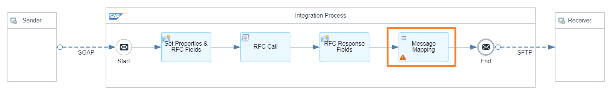

7. In this example, the source message is 'flightConnectionRequest' and the target message is 'flightConnectionResponse'. It was done a 1:1 mapping on the Connection node from 'flightConnectionResponse' and additionally, on the 'Seats' node, the 'getProperty' function was added, and a constant was defined using the output parameter from the previous step for the RFC response fields.

    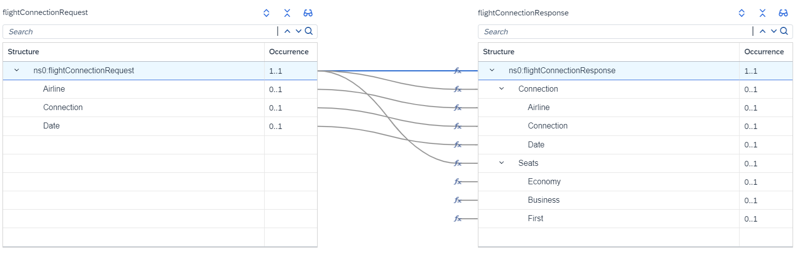

8.  Next, for the target fields required, add a constant and "getProperty" from the standard functions and enter the name of the Exchange Property defined in the previous step.

    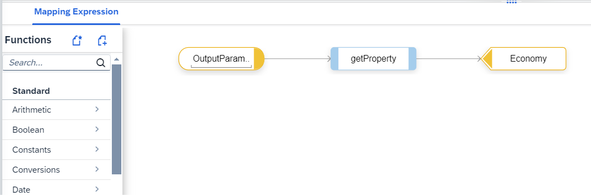

9.  Save the integration flow, deploy it, and trigger a message.

    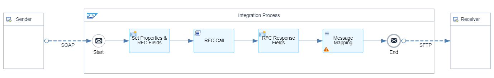

    The mapping result is the following:

    ```XML
        <?xml version="1.0" encoding="UTF-8"?>
            <ns0:flightConnectionResponse xmlns:ns0="http://pimas.com">
                <Connection>
                    <Airline>AA</Airline>
                    <Connection>0017</Connection>
                    <Date>20230921</Date>
                </Connection>
                <Seats>
                    <Economy>15</Economy>
                    <Business>0</Business>
                    <First>2</First>
                </Seats>
            </ns0:flightConnectionResponse>
    ``` 

### Use Case 2 - Implement RFC Calls in Cloud Integration Using a UDF on Message Mapping

The second approach in Cloud Integration is done by using UDF on Message Mapping within an Integration Flow. This UDF performs similar tasks to the Groovy Script described in the previous steps. It retrieves the RFC destination and RFC's names dynamically from the exchange properties. However, the developers still need to edit and customize the UDF code to align with their specific requirements, for example, the RFC request and response fields. Additionally, the UDF just execute a single RFC call per execution. Consequently, if there's a need for multiple RFC calls, it would require changes to the UDF code.

On the other hand, if the message mapping includes multiple RFC calls, each call will require its own UDF code. As a result, the developers will need to create and adjust the UDF code for each RFC call, ensuring that it aligns with the specific requirements of the corresponding RFC request and response fields.

The implementation of this solution can be done by following the next steps:

1.  Create an Integration Flow on Cloud Integration.

2.  Add a content modifier called “Set Properties” and define the following properties:

    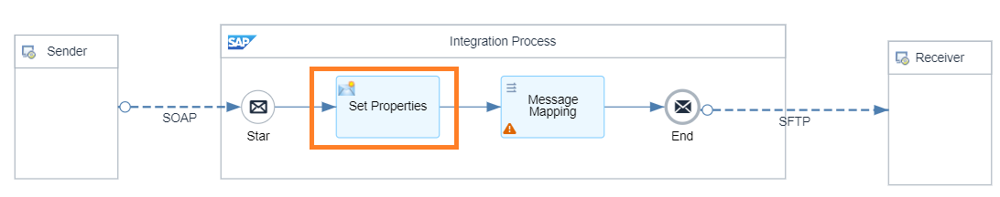
    - RFCDestination: Name of the RFC Destination you will use.
    - RFCName: Name of the RFC you will use.
    - payload: After the request-reply step, it is necessary to retrieve the original incoming message. This step ensures that subsequent operations have access to the initial data. You can achieve this by using ${in.body}.

    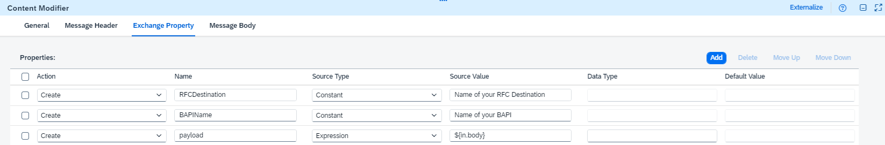

3.  Create a message mapping by adding the source and target messages previously imported in the 'References' section of the Integration Flow. 

    

4. In this example, the source message is 'flightConnectionRequest', the target message is 'flightConnectionResponse' and it was done a 1:1 mapping on the Connection node.

    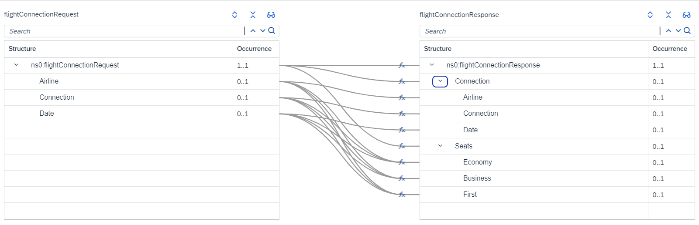

5.  Open the Message Mapping, search for the fields you would need to implement the RFC Lookup.

6.  On Functions, click on “Create” and put the name “runRFC”. Paste the code below.

    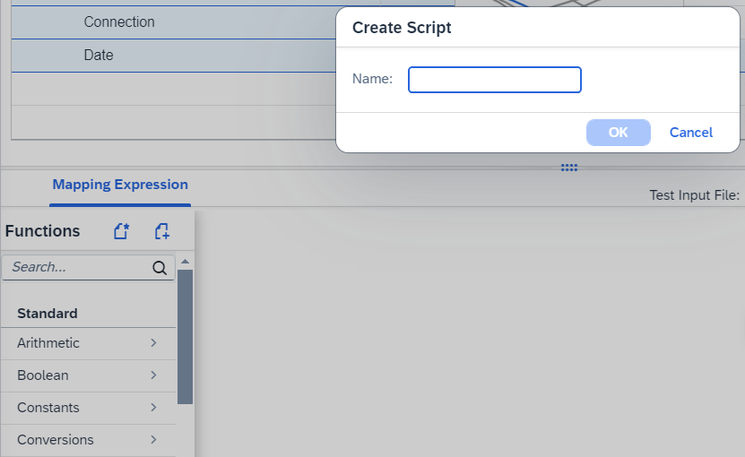

    The *runRFC* code is the following:

    ```Groovy
        import com.sap.it.api.mapping.*;
        import com.sap.conn.jco.*;

        public void runRFC(String[] RFCRequestField1, String[] RFCRequestField2, String[] RFCRequestField3, Output OutputParameter1, Output OutputParameter2, Output OutputParameter3, MappingContext context) throws JCoException {
            
            String destinationName = context.getProperty("RFCDestination");
            String rfcname = context.getProperty("RFCName");

            JCoDestination jcoDestination = JCoDestinationManager.getDestination(destinationName);
            JCoFunction function = jcoDestination.getRepository().getFunction(rfcname);

            if (function != null) {
                function.getImportParameterList().setValue("RFCRequestField1", RFCRequestField1 [0]); 
                function.getImportParameterList().setValue("RFCRequestField2", RFCRequestField2 [0]); 
                function.getImportParameterList().setValue("RFCRequestField3", RFCRequestField3 [0]); 

                function.execute(jcoDestination);

                JCoParameterList outputParams = function.getExportParameterList();
                JCoStructure availibility = outputParams.getStructure("AVAILIBILITY");

                String output1 = availibility.getString("OutputParameter1");
                String output2 = availibility.getString("OutputParameter2");
                String output3 = availibility.getString("OutputParameter3");

                OutputParameter1.addValue(output1);
                OutputParameter2.addValue(output2);
                OutputParameter3.addValue(output3);
            } else {
                OutputParameter1.addValue("ERROR: RFC function not found");
                OutputParameter2.addValue("ERROR: RFC function not found");
                OutputParameter3.addValue("ERROR: RFC function not found");
            }
        }
    ``` 

7. Edit the UDF code, define and replace the following parameters:

    - RFCRequestField1, RFCRequestField2, RFCRequestField3 = Name of the RFC Request fields.
    - OutputParameter1, OutputParameter2, OutputParameter3 = Name of the RFC Response fields.
    - output1, output2 and output3 = Values retrieved from the RFC response fields.

    >*Note: The getStructure method is important to handle the response structures, however, it’s necessity may depend on the specific RFC that is being used. If a particular RFC doesn’t include a structured response, the getStructure method may not be needed. In this tutorial, it was used the BAPI_FLIGHT_CHECKAVAILIBILITY RFC where the getStructure method was needed to process the “AVAILIBILITY” structure in the response data, as you can see on the image below. It's essential to understand the requirements of each RFC and adjust the UDF code, accordingly, using methods like getStructure only when necessary.*

    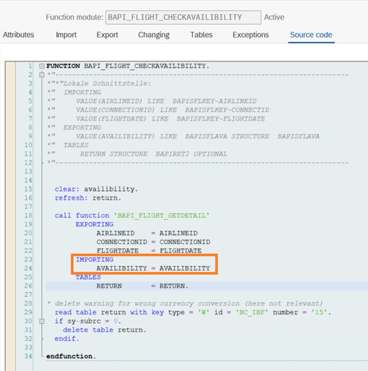

    >*Note: This configuration depends on the number of the RFC Request fields, RFC Response fields and the mapping you are developing. You can add or remove properties as needed.*

8. In this case, map the 'flightConnectionRequest' source fields (Airline, Connection and Date) to the RFC request fields (AIRLINEID, CONNECTIONID and FLIGHTDATE). Regarding the output fields, map the RFC output fields (ECONOFREE, BUSINFREE and FIRSTFREE) to the Seats node on the 'flightConnectionResponse' target structure (Economy, Business and First) in the message mapping.

    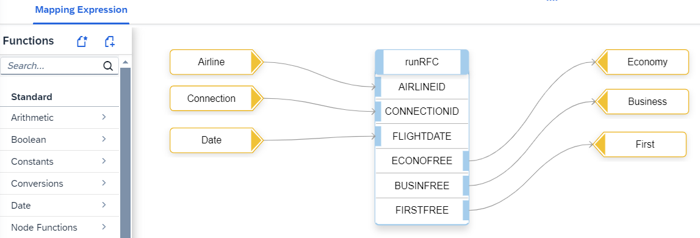

9.  Save the integration flow, deploy it, and trigger a message.

    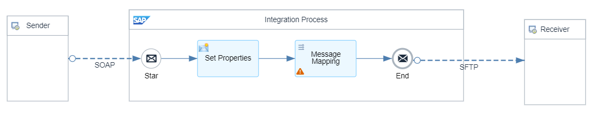

    The mapping result is the following:

    ```XML
            <?xml version="1.0" encoding="UTF-8"?>
                    <ns0:flightConnectionResponse xmlns:ns0="http://pimas.com">
                        <Connection>
                            <Airline>AA</Airline>
                            <Connection>0017</Connection>
                            <Date>20230921</Date>
                        </Connection>
                        <Seats>
                            <Economy>15</Economy>
                            <Business>0</Business>
                            <First>2</First>
                        </Seats>
                    </ns0:flightConnectionResponse>
    ``` 

### Use Case 3 - Implement Multiple RFC Calls in Cloud Integration Using UDF on a Single Message Mapping

The third approach in Cloud Integration involves using a single message mapping with different RFC calls using UDF (User-Defined Function) within an Integration Flow. In this case, the main difference between the UDF used in this additional use case and the one used in Use Case 2 is the addition of an input parameter to specify the RFC that will be used on the message mapping and some code adjustments.

Similar to the Use Case 2, the developers still need to edit and customize both UDF codes to align the requirements (RFC request and response fields). Additionally, both UDF just execute a single RFC call per execution.

The implementation of this solution can be done by following the next steps:

1.  Create an Integration Flow on Cloud Integration.

2.  Add a content modifier called “Set Properties” and define the following properties:

    
    - RFCDestination: Name of the RFC Destination you will use.
    - RFC#: Name of the RFCs you will use on message mapping.
    - payload: After the request-reply step, it is necessary to retrieve the original incoming message. This step ensures that subsequent operations have access to the initial data. You can achieve this by using ${in.body}.

    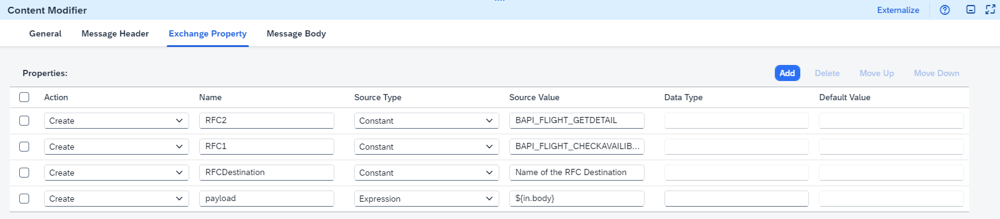

3.  As described on Use Case 2, create a message mapping by adding the source and target messages previously imported in the ‘References’ section of the Integration Flow.

    

4. In this example, the source message is “flightConnection_req”, the target message is defined by “flightConnection_resp” structure and it was done a 1:1 mapping from the “Connection” node to the “info” node on source side. 

    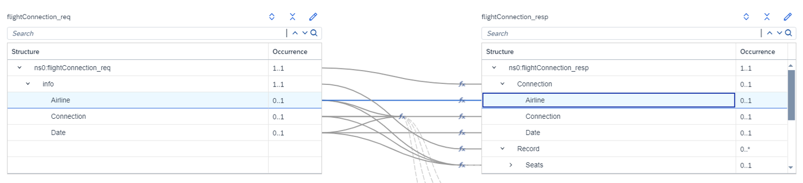

5.  As previously done on Use Case 2, it was used the Economy, Business, and First fields under the "Record" node on target structure to implement the UDF code. Under Functions, click on "Create" and put the name "runRFCBAPI_FLIGHT_CHECKAVAILIBILITY" and paste the following code:


    ```Groovy
        import com.sap.it.api.mapping.*;
        import com.sap.conn.jco.*;

        public void runRFCBAPI_FLIGHT_CHECKAVAILIBILITY(String[] rfcName, String[] RFCRequestField1, String[] RFCRequestField2, String[] RFCRequestField3, Output OutputParameter1, Output OutputParameter2, Output OutputParameter3, MappingContext context) throws JCoException {
            
            String destinationName = context.getProperty("RFCDestination");

            JCoDestination jcoDestination = JCoDestinationManager.getDestination(destinationName);
            JCoFunction function = jcoDestination.getRepository().getFunction(rfcName[0]);

            if (function != null) {
                function.getImportParameterList().setValue("RFCRequestField1", RFCRequestField1 [0]); 
                function.getImportParameterList().setValue("RFCRequestField2", RFCRequestField2 [0]); 
                function.getImportParameterList().setValue("RFCRequestField3", RFCRequestField3 [0]); 

                function.execute(jcoDestination);

                JCoParameterList outputParams = function.getExportParameterList();
                JCoStructure availibility = outputParams.getStructure("AVAILIBILITY");

                String output1 = availibility.getString("OutputParameter1");
                String output2 = availibility.getString("OutputParameter2");
                String output3 = availibility.getString("OutputParameter3");

                OutputParameter1.addValue(output1);
                OutputParameter2.addValue(output2);
                OutputParameter3.addValue(output3);
            } else {
                OutputParameter1.addValue("ERROR: RFC function not found");
                OutputParameter2.addValue("ERROR: RFC function not found");
                OutputParameter3.addValue("ERROR: RFC function not found");
            }
        }
    ``` 
    >*Note: Since the RFC used in this example is the same as the one used in Use 2, the main difference is the addition of the “String[] rfcname” parameter, which will be mapped with the RFC name. The line “String rfcname = context.getProperty("RFCName")” has been removed since this will not be used to retrieve the name of the RFC from the properties. Additionally, the line “JCoFunction function = jcoDestination.getRepository().getFunction(rfcName)” has been modified to JCoFunction function = jcoDestination.getRepository().getFunction(rfcName[0]).*

7. Edit the runRFCBAPI_FLIGHT_CHECKAVAILIBILITY UDF code, define and replace the following parameters:

    - RFCRequestField1, RFCRequestField2, RFCRequestField3 = Name of the RFC Request fields.
    - OutputParameter1, OutputParameter2, OutputParameter3 = Name of the RFC Response fields.
    - output1, output2 and output3 = Values retrieved from the RFC response fields.

    >*Note: In this example it was tested the RFC used in Use Case 2, and it was used the getStructure method to handle the response structures. If a particular RFC doesn’t include a structured response, the getStructure method may not be needed. In this tutorial, it was used the BAPI_FLIGHT_CHECKAVAILIBILITY RFC where the getStructure method was needed to process the “AVAILIBILITY” structure in the response data. It is important to understand the requirements of each RFC and adjust the UDF code.*

8. After adding the runRFCBAPI_FLIGHT_CHECKAVAILABILITY UDF on message mapping, add the “GetProperty” function, then, add a constant and define the property name that was previously specified in the content modifier and identify the RFC that will be used.

    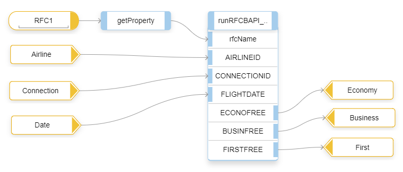

    >*Note: In this case, map the source fields (Airline, Connection and Date) to the RFC request fields (AIRLINEID, CONNECTIONID and FLIGHTDATE). Regarding the output fields, map the RFC output fields (ECONOFREE, BUSINFREE and FIRSTFREE) to the fields on the target structure (Economy, Business and First) in the message mapping.*

9. The second part of the implementation is focused on the second RFC. As done on the previous steps, you need to add a second UDF to represent the BAPI_FLIGHT_GETDETAIL RFC. Please adjust the parameters described in Step 5 done previously.

8. After adding the runRFCBAPI_FLIGHT_GETDETAIL UDF on message mapping, select the “GetProperty” function as done previously for the first RFC and add a constant with the name of the property which will have the RFC name.

    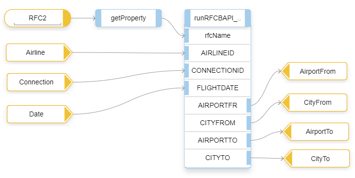

    >*Note: In this case, map the RFC output fields (AIRPORTFT, CITYFROM, AIRPORTTO and CITYTO) to the field from the target structure (AirportFrom, CityFrom, AirportTo and CityTo) in the message mapping.*

9.  Save the integration flow, deploy it, and trigger a message.

    

    The mapping result is the following:

    ```XML
            <?xml version="1.0" encoding="UTF-8"?>
                    <ns0:flightConnection_resp xmlns:ns0="http://pimas.com">
                        <Connection>
                            <Airline>AA</Airline>
                            <Connection>0017</Connection>
                            <Date>20230921</Date>
                        </Connection>
                        <Record>
                            <Seats>
                                <Economy>10</Economy>
                                <Business>0</Business>
                                <First>2</First>
                            </Seats>
                        </Record>
                        <Details>
                            <AirportFrom>JFK</AirportFrom>
                            <CityFrom>NEW YORK</CityFrom>
                            <AirportTo>SFO</AirportTo>
                            <CityTo>SAN FRANCISCO</CityTo>
                        </Details>
                    </ns0:flightConnection_resp>
    ``` 


### Test yourself


