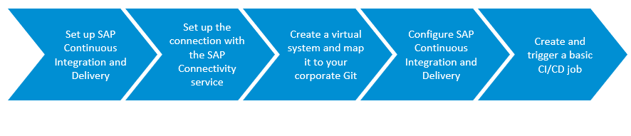
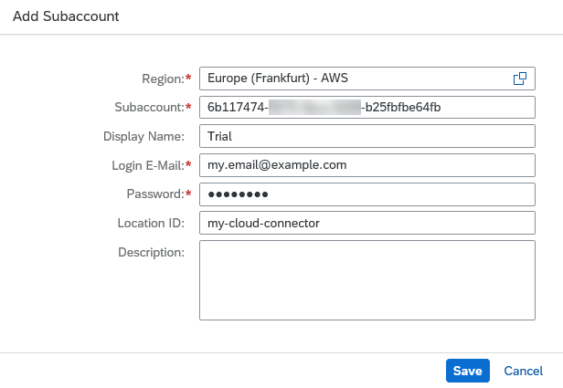
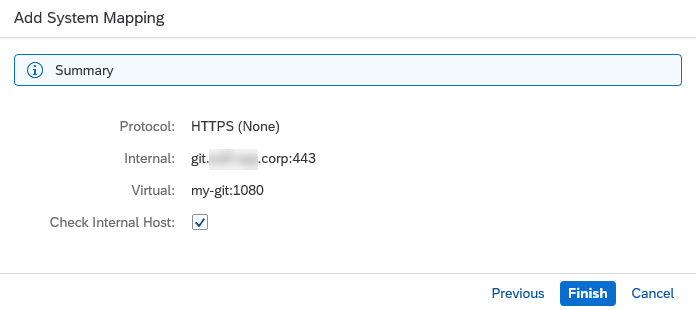
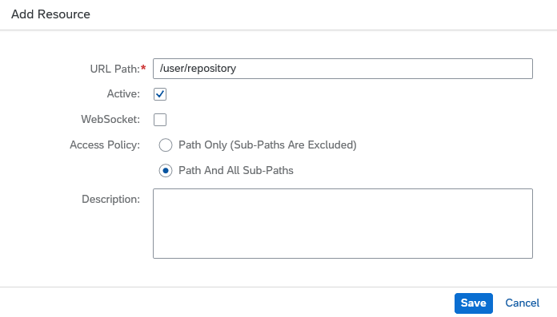
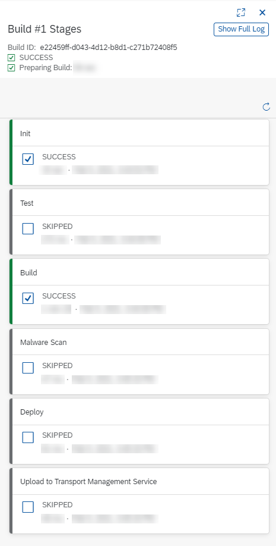

## Prerequisites
 - You have an account on SAP Business Technology Platform. See [Trial Accounts](https://help.sap.com/viewer/65de2977205c403bbc107264b8eccf4b/Cloud/en-US/046f127f2a614438b616ccfc575fdb16.html) or [Enterprise Accounts](https://help.sap.com/viewer/65de2977205c403bbc107264b8eccf4b/Cloud/en-US/171511cc425c4e079d0684936486eee6.html).
 - You're an administrator of your global account and Org Manager of your subaccount on SAP Business Technology Platform. See [About Roles in the Cloud Foundry Environment](https://help.sap.com/viewer/65de2977205c403bbc107264b8eccf4b/Cloud/en-US/09076385086b4da3bd1808d5ef572862.html).
 - You've installed the Cloud Connector of the SAP Connectivity service. See [Install the SAP Connectivity Service Cloud Connector in your System Landscape](cp-connectivity-install-cloud-connector).
 - You have an SAP Fiori project in the Cloud Foundry environment in a public Git repository in your corporate network. See [Create an SAP Fiori Project](https://help.sap.com/viewer/584e0bcbfd4a4aff91c815cefa0bce2d/Cloud/en-US/46664de4d6944471b6c29a0681bfd0fc.html).
    &nbsp;
    **Note:** Technically, you can use any Git in your corporate network. However, we recommend using GitHub Enterprise or Bitbucket Server because with them you can create webhooks to trigger your jobs automatically.

## Details
### You will learn
  - How to set up SAP Continuous Integration and Delivery
  - How to connect SAP Continuous Integration and Delivery with your corporate Git using SAP Connectivity service
  - How to create and trigger a basic continuous integration and delivery (CI/CD) job in SAP Continuous Integration and Delivery

### What is this tutorial about?

This tutorial helps you use SAP Continuous Integration and Delivery with Git repositories in corporate networks that are not exposed to the Internet. To establish a connection between your repository and the Continuous Integration & Delivery service, you'll use the SAP Connectivity service.

The tutorial comprises five main stages:

1. Enable SAP Continuous Integration and Delivery, assign yourself the administrator role for it, and access the service.

2. Add your subaccount on SAP BTP to the SAP Connectivity service.

3. In the SAP Connectivity service, add a system mapping and a resource.

4. In SAP Continuous Integration and Delivery, configure credentials for your cloud connector and add your Git repository.

5. Configure and run a basic job for SAP Continuous Integration and Delivery.

> For more information about SAP Continuous Integration and Delivery and the SAP Connectivity service, see:

>- [SAP Continuous Integration and Delivery](https://help.sap.com/viewer/product/DRAFT/CONTINUOUS_DELIVERY/Cloud/en-US)

>- [Continuous Integration and Delivery by SAP](https://help.sap.com/viewer/product/CICD_OVERVIEW/Cloud/en-US?task=discover_task)

>- [SAP Connectivity Service](https://help.sap.com/viewer/product/CP_CONNECTIVITY/Cloud/en-US)

---

[ACCORDION-BEGIN [Step 1: ](Set up SAP Continuous Integration and Delivery)]

Enable SAP Continuous Integration and Delivery, assign yourself the administrator role for it, and access the service.

1. In your subaccount in the SAP BTP cockpit, choose  **Services** **&rarr;** **Service Marketplace**.

2. In the **Extension Suite – Development Efficiency** category, choose **Continuous Integration & Delivery**.

3. In the detail view of SAP Continuous Integration and Delivery, choose **Create**.

4. In the **New Instance or Subscription** pop-up, select the following values from the drop-down lists:

    | Parameter     | Value                             |
    | ------------- | ----------------------------------------------------------------------------------------------------------- |
    | Service       | Continuous Integration & Delivery                                                                           |
    | Plan          | Depending on whether you use a trial account or an enterprise account, either choose **trial – Subscription** (trial) or **default - Subscription** (enterprise) |

5. Choose **Create**.

6. From the navigation pane, choose  **Security** **&rarr;** **Trust Configuration**.

    >If you use an enterprise account, you need to be a User & Role Administrator of your subaccount to view the  **Security** section. See [Managing Subaccounts Using the Cockpit](https://help.sap.com/viewer/65de2977205c403bbc107264b8eccf4b/Cloud/en-US/55d0b6d8b96846b8ae93b85194df0944.html).

7. Choose the name of your identity provider.

8. Enter your e-mail address.

9. Choose **Show Assignments**.

10. Choose **Assign Role Collection**.

11. From the dropdown list, select **CICD Service Administrator** and confirm your choice with **Assign Role Collection**.

12. Navigate back to your subaccount overview and from the navigation pane, choose **Service Marketplace**.

13. In the **Extension Suite – Development Efficiency** category, choose **Continuous Integration & Delivery**.

14. Choose  *(Actions)* **&rarr;** **Go to Application**.

[DONE]
[ACCORDION-END]

[ACCORDION-BEGIN [Step 2: ](Set up the connection with the SAP Cloud Connector)]

Add your SAP BTP subaccount to the SAP Cloud Connector.

1. In the SAP Cloud Connector, choose  **Connector** **&rarr;** **Add Subaccount**.

    >If you haven't added a subaccount to the Cloud Connector yet, the procedure 	is slightly different. In this case, you start at  **Define Subaccount** and fill in the **First Subaccount** form. The required values, however, are the same.

2. In the **Add Subaccount** pop-up, enter the following information:

    >You can find all information about your subaccount in your subaccount overview in the SAP BTP cockpit.

    | Parameter         | Value                                                                                                                                 |
    | ----------------- | ------------------------------------------------------------------------------------------------------------------------------------- |
    | Region            | Enter the region in which your subaccount resides. To find the correct region, compare your API endpoint with [Regions and Hosts Available for the Cloud Foundry Environment](https://help.sap.com/viewer/65de2977205c403bbc107264b8eccf4b/Cloud/en-US/350356d1dc314d3199dca15bd2ab9b0e.html#loiof344a57233d34199b2123b9620d0bb41).                                                                                   |
    | Subaccount        | Enter the ID of your subaccount.                                                                                                      |
    | Display Name      | Freely choose a name for your subaccount.                                                                                             |
    | Subaccount User   | Enter the e-mail address that relates to your subaccount.                                                                             |
    | Password          | Enter the password for your subaccount.                                                                                               |
    | Location ID       | Freely choose a location ID for your subaccount. You'll need this ID for the connection with SAP Continuous Integration and Delivery. |
    | Description       | Optionally, enter a description for your subaccount.                                                                                  |

    !

3. Choose **Save**.

[DONE]
[ACCORDION-END]

[ACCORDION-BEGIN [Step 3: ](Create a virtual system and map it to your corporate Git)]

In the SAP Connectivity service, add a system mapping and a resource.

1. From the navigation pane in the SAP Connectivity service, choose the display name of your subaccount **&rarr;** **Cloud To On-Premise**.

2. To map a new system, choose **+** *(Add)*.

3. In the **Add System Mapping** pop-up, select **Non-SAP System** as **Back-end Type** and choose **Next**.

4. From the drop-down list, select the protocol of your on-premise Git server, and choose **Next**.

5. Enter your internal host and port, and choose **Next**.

6. For **Virtual Host**, enter `my-git`, and for **Virtual Port**, enter `1080`.

	Thereby, you'll create a virtual host that can be reached through `http://my-git:1080`. The virtual host is also needed to configure CI/CD jobs in SAP Continuous Integration and 	Delivery.

    >Even though the virtual host uses HTTP, the connection for the actual data transfer between the cloud connector and SAP Continuous Integration and Delivery is encrypted (HTTPS).

7. Choose **Next**.

8. As **Principal Type**, select **None**, and choose **Next**.

9. For **Host In Request Header**, select **Use Virtual Host**, and choose **Next**.

10. Optionally, enter a description and choose **Next**.

11. In the summary, select **Check Internal Host**, and choose **Finish**.

    !

12. Make sure that your new mapping is selected, and in the **Resources Of my-git:1080** area, choose **+** *(Add)*.

13. In the **Add Resource** pop-up, enter the path to your repository, for example `user/repository` out of `http://my-corporate-git/user/repository`.

14. Select **Active** and **Path And All Sub-Paths**, and choose **Save**.

    !

[DONE]
[ACCORDION-END]

[ACCORDION-BEGIN [Step 4: ](Configure SAP Continuous Integration and Delivery)]

In SAP Continuous Integration and Delivery, configure credentials for your cloud connector and add your Git repository.

1. In SAP Continuous Integration and Delivery, go to the **Credentials** tab and choose **+** *(Create credentials)*.

2. In the **Create Credentials** pop-up, enter the following values:

    | Parameter     | Value                                                                                                                                                           |
    | ------------- | --------------------------------------------------------------------------------------------------------------------------------------------------------------- |
    | Name          | Freely choose a unique name for your credential. Only use lowercase letters, numbers, and hyphens, and a maximum of 253 characters.                             |
    | Description   | Enter a meaningful description for your credential.                                                                                                             |
    | Type          | From the drop-down list, choose **Cloud Connector**.                                                                                                            |
    | Location ID   | Enter the location ID of your cloud connector. You can find it in the SAP BTP cockpit under  **Connectivity** **&rarr;** **Cloud Connectors**. |

3. Choose **Create**.

4. Switch to the **Repositories** tab and choose **+** *(Add repository)*.

5. In the **Add Repository** pop-up, enter the following values:

    | Parameter          | Value                                                                                                                                                          |
    | ----------------- | --------------------------------------------------------------------------------------------------------------------------------------------------------------- |
    | Name              | Freely choose a unique name for your repository. We recommend using a name that refers to the actual repository in your source code management system.          |
    | Clone URL         | Enter a composition of the virtual host you've created in step 3.6 and the path of the resource you've created in step 3.13, for example `http://my-git:1080/user/repository`. Please make sure that you use the virtual host instead of the real host name and port of your on-premise system.                                                                     |
    | Credentials       | As your repository isn't private, leave this field empty.                                                                                                       |
    | Cloud Connector   | From the drop-down list, choose your Cloud Connector credential.                                                                                                |

6. If you want to receive events from your source code management system, you need to add a webhook event receiver to your repository and configure a webhook in Git. Depending on the type of Git you use, this process differs.  

    For how to add a webhook event receiver and a webhook, see [Add a repository](https://help.sap.com/viewer/SAP-Cloud-Platform-Continuous-Integration-and-Delivery/fc55872ed1f04e7fb78bdee01a977d5a.html) and [Creating Webhooks](https://help.sap.com/viewer/99c72101f7ee40d0b2deb4df72ba1ad3/Cloud/en-US/a273cffe863b4663b23942a9bb73071d.html).

    >You can only establish webhooks between SAP Continuous Integration and Delivery and GitHub or Bitbucket Server repositories.

    If you don't want to add a webhook event receiver and a webhook, choose **Remove**.

7. Choose **Add**.

[VALIDATE_4]
[ACCORDION-END]

[ACCORDION-BEGIN [Step 5: ](Create and trigger a basic CI/CD job)]

Configure and run a basic job for SAP Continuous Integration and Delivery.

1. In SAP Continuous Integration and Delivery, go to the **Jobs** tab and choose **+** *(Create job)*.

2. In the **General Information** section of the **Create Job** pane, enter the following values:

    | Parameter          | Value                                                                                                                                                           |
    | ------------------ | --------------------------------------------------------------------------------------------------------------------------------------------------------------- |
    | Job Name           | Freely choose a unique name for your job. We recommend using a name that contains both your Git project name and branch.                       |
    | Repository         | From the drop-down list, choose your repository.                                                                                                                |
    | Branch             | Enter the branch of your repository for which you want to configure your CI/CD job.                                                                             |
    | Pipeline           | From the drop-down list, choose **SAP Fiori in the Cloud Foundry environment.**                                                                                 |
    | Version            | If you create a new job, the latest version is selected by default.                                                                                             |
    | State              | To enable your job, choose **ON**.                                                                                                                              |

3. In the **Build Retention** section, enter the following values:

    | Parameter     | Value                                                                                                                                          |
    | ------------- | ---------------------------------------------------------------------------------------------------------------------------------------------- |
    | Keep logs for | Enter the time after which your builds are automatically deleted.                                                                              |
    | Keep maximum  | Enter the maximum number of builds you want to keep. If your number of builds exceeds this maximum, the oldest ones are deleted automatically. |

4. In the **Stages section**, choose **Job Editor** as **Configuration Mode**.

5. For the **Build stage**, enter a name for your application.

6. Switch all other stages off and choose **OK**.

    >As this tutorial focuses on the connection between SAP Continuous Integration and 	Delivery and your corporate Git repository, we've decided to configure only a very basic CI/CD pipeline in it. For how to configure more elaborate ones, see [Supported Pipelines](https://help.sap.com/viewer/DRAFT/99c72101f7ee40d0b2deb4df72ba1ad3/Cloud/en-US/e293286b06df426ab1cfa235332a2606.html).

7. To trigger your CI/CD pipeline, choose  *(Trigger build)*.

    As a result, a new build tile appears in the **Builds** section of your job. If you choose it, the **Build Stages** view opens and you can watch the individual stages of your build run through.

    !

[DONE]
[ACCORDION-END]

---

**Congratulations!**

You have successfully connected SAP Continuous Integration and Delivery with your corporate Git repository, and configured and run a basic CI/CD job for it.
