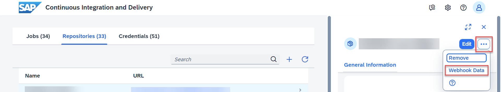

# Get Started with an SAP Cloud Application Programming Model Project in SAP Continuous Integration and Delivery
<!-- description --> Configure and run a basic CI/CD pipeline for your SAP Cloud Application Programming Model project.

## Prerequisites
 - You have an account on SAP Business Technology Platform. See [Trial Accounts](https://help.sap.com/viewer/65de2977205c403bbc107264b8eccf4b/Cloud/en-US/046f127f2a614438b616ccfc575fdb16.html) or [Enterprise Accounts](https://help.sap.com/viewer/65de2977205c403bbc107264b8eccf4b/Cloud/en-US/046f127f2a614438b616ccfc575fdb16.html).
 - You're an Administrator of your global account and Org Manager of your subaccount on SAP BTP.
 - In your GitHub repository, you have an SAP Cloud Application Programming Model project. See [Getting Started](https://cap.cloud.sap/docs/get-started/).

## You will learn
  - How to set up SAP Continuous Integration and Delivery
  - How to create and run a basic job for an SAP Cloud Application Programming Model project
  - How to automate the builds of your CI/CD job trough a webhook in GitHub

### Set up SAP Continuous Integration and Delivery

Enable SAP Continuous Integration and Delivery, add the required permissions, and access the service.

 
1. In your subaccount in the SAP BTP cockpit, choose **Services** → **Service Marketplace**.

2. Search for `Continuous Integration & Delivery` and choose the appearing service tile.

    

    > **Note:** If in the **Service Marketplace**, you can't see the **Continuous Integration & Delivery** tile, you might need to add the required entitlements to your subaccount. See [Configure Entitlements and Quotas from Your Global Account](https://help.sap.com/docs/btp/sap-business-technology-platform/configure-entitlements-and-quotas-for-subaccounts#configure-entitlements-and-quotas-from-your-global-account).

3. Choose **Create**.
   
4. In the **New Instance or Subscription** pop-up, select the **Subscription** plan and choose **Create**.

5. From the navigation pane, choose **Security** **&rarr;** **Users**.

    >**Note:** If you use an enterprise account, you need to be a User & Role Administrator of your subaccount to view the **Security** section. See [Managing Subaccounts Using the Cockpit](https://help.sap.com/viewer/65de2977205c403bbc107264b8eccf4b/Cloud/en-US/55d0b6d8b96846b8ae93b85194df0944.html).

6. Choose the name of your user.

7. From the **Role Collections** section, choose **...** **&rarr;** **Assign Role Collection**.

8. From the dropdown list, select **CICD Service Administrator** and **CICD Service Developer**. Confirm your choice with **Assign Role Collection**.

    

9.  Navigate back to your subaccount overview and from the navigation pane, choose **Services** → **Service Marketplace**.

10. Search for `Continuous Integration & Delivery` and choose the appearing service tile.

11. Choose **Go to Application**.

    

As a result, the user interface of the SAP Continuous Integration and Delivery service opens.

### Configure your SAP BTP credentials

Create credentials for deploying your application to SAP BTP, Cloud Foundry environment.

1. In the **Credentials** tab in SAP Continuous Integration and Delivery, choose **+** *(Create Credentials)*.

    

2. For **Name**, enter a freely chosen name for your credentials, which is unique in your SAP BTP subaccount, for example **`cfdeploy`**.

3. As **Type**, select **Basic Authentication**.

4. For **Username**, enter your username for the SAP BTP cockpit.

5. For **Password**, use your password for the SAP BTP cockpit.

    

6. Choose **Create**.

### (Optional) Configure your GitHub credentials

>**Note:** If your GitHub repository is not private, you can skip this section.

If your GitHub repository is private, configure credentials for it, so that SAP Continuous Integration and Delivery can connect to it.

1. In the **Credentials** tab in SAP Continuous Integration and Delivery, choose **+** *(Create Credentials)*.

2. For **Name**, enter a freely chosen name for your credential, which is unique in your SAP BTP subaccount, for example **`github`**.

3. As **Type**, select **Basic Authentication**.

4. For **Username**, enter your GitHub username.

5. For **Password**, use a [personal access token](https://docs.github.com/en/github/authenticating-to-github/keeping-your-account-and-data-secure/creating-a-personal-access-token).
    >**Note:** When creating the token, select **repo** as scope.

6. Choose **Create**.

### Add your repository to SAP Continuous Integration and Delivery

Connect SAP Continuous Integration and Delivery to the repository in which your project sources reside.

1. In SAP Continuous Integration and Delivery, choose **Repositories** → **+** *(Add)*.

    

2. In the **Add Repository** pane, add a name for your repository.

3. In GitHub, copy the HTTPS clone URL of the repository that contains your application.

4. Paste it into the **Clone URL** field in the **Add Repository** pane in SAP Continuous Integration and Delivery.

5. (Optional) If your GitHub repository is private, choose the GitHub credentials you've created in the previous step from the **Credentials** drop-down list.

### Add a webhook in GitHub

Configure a webhook between your GitHub repository and SAP Continuous Integration and Delivery to automate the builds of your job.

A webhook with GitHub allows you to automate SAP Continuous Integration and Delivery builds: Whenever you push changes to your GitHub repository, a webhook push event is sent to the service to trigger a build of the connected job.

The following graphic illustrates this flow:

1. In the **WEBHOOK EVENT RECEIVER** section of the **Add Repository** pane, choose **GitHub** as **Type** from the drop-down list.

2. In the **Webhook Credential** drop-down list, choose **Create Credentials**.

3. In the **Create Credentials** pop-up, enter a name for your credential, which is unique in your SAP BTP subaccount, for example **`webhook`**.
   
4. Choose **Generate** next to **Secret** to generate a random token string.
   
    >**Caution:** Note down the secret as you won't be able to see it again.

5. Choose **Create**.
   
6. Choose **Add**.

7. In the **Repositories** tab in SAP Continuous Integration and Delivery, choose your repository.
   
8. In your repository pane, choose **...** → **Webhook Data**.
   
    

    As a result, the **Webhook Creation** pop-up opens.

9.  In your project in GitHub, go to the **Settings** tab.

10. From the navigation pane, choose **Webhooks**.

11. Choose **Add webhook**.

12. Enter the **Payload URL**, **Content type**, and **Secret** from the **Webhook Creation** pop-up in SAP Continuous Integration and Delivery. For all other settings, leave the default values.

13. Choose **Add webhook**.
   

### Create and trigger a basic CI/CD job

Configure a basic job for SAP Cloud Application Model projects.

1. In SAP Continuous Integration and Delivery, go to the **Jobs** tab and choose **+** *(Create job)*.

2. In the **General Information** section of the **Create Job** pane, enter the following values:

    * **Job Name:** Freely choose a unique name for your job.
    * **Repository:** From the drop-down list, choose your repository.
    * **Branch:** Enter the branch of your repository for which you want to configure your CI/CD job, for example, `main`.
    * **Pipeline:** From the drop-down list, choose **SAP Cloud Application Programming Model**.
    * **Version:** If you create a new job, the latest version is selected by default.
    * **State:** To enable your job, choose **ON**.

3.  In the  **Build Retention** section, keep the default values.

4. In the **Stages** section, choose **Job Editor** as **Configuration Mode**.

5. For the **Build** stage, keep the default values.

6. For the **Acceptance** stage, enter the following values for the **Deploy to Cloud Foundry Space** step:

    * **Application Name:** Enter a unique application name.
    * **API Endpoint:** Enter the URL of your SAP BTP, Cloud Foundry API Endpoint. You can find it in the overview of your subaccount in the SAP BTP cockpit, under the **Cloud Foundry Environment:** tab.
    * **Org Name:** Enter the name of your Cloud Foundry organization. You can also find it in the overview of your subaccount.
    * **Space:** Enter the name of the Cloud Foundry space in which you want to test your application.
    * **Credentials:** From the drop-down list, choose the SAP BTP credentials you created.
   
     

7. Switch all other stages off and choose **Create**.
   
    >**Note:** As this tutorial focuses on how to get started with SAP Continuous Integration and Delivery, we've decided to configure only a very basic CI/CD pipeline in it. For how to configure more elaborate ones, see [Supported Pipelines](https://help.sap.com/docs/continuous-integration-and-delivery/sap-continuous-integration-and-delivery/supported-pipelines?language=en-US&version=Cloud).

8. To run your CI/CD pipeline, choose **Run**.

As a result, a build of the connected job is triggered and a new build tile appears in the **Builds** section of your job. If you choose it, the **Build Stages** view opens and you can watch the individual stages of your build run through. The pipeline run might take a few minutes.