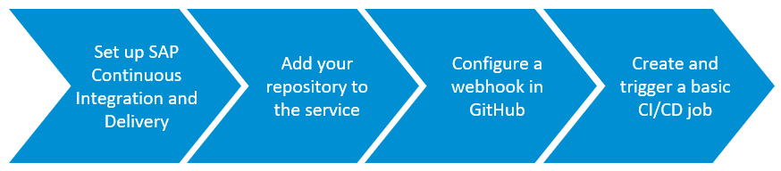
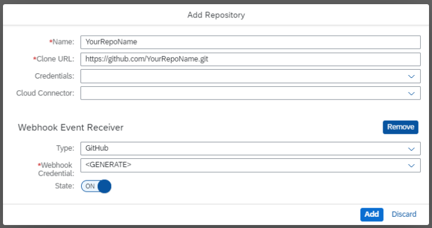
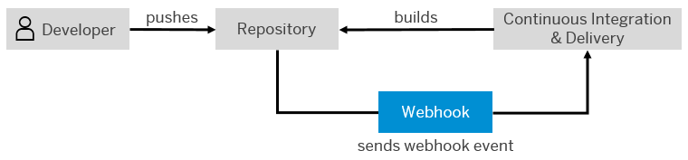
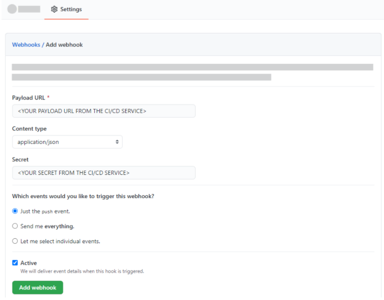
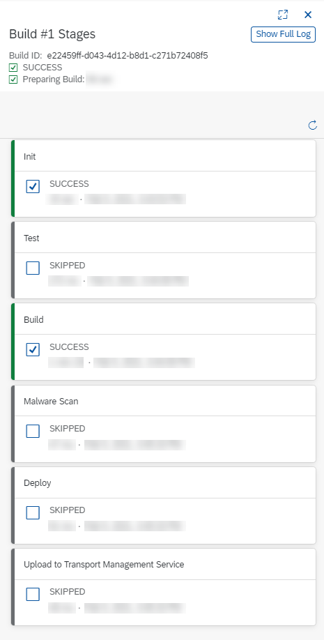

## Prerequisites
 - You have an account on SAP Business Technology Platform. See [Trial Accounts](https://help.sap.com/viewer/65de2977205c403bbc107264b8eccf4b/Cloud/en-US/046f127f2a614438b616ccfc575fdb16.html) or [Enterprise Accounts](https://help.sap.com/viewer/65de2977205c403bbc107264b8eccf4b/Cloud/en-US/046f127f2a614438b616ccfc575fdb16.html).
 - You're an administrator of your global account and Org Manager of your subaccount on SAP Business Technology Platform.
 - In your public GitHub repository, you have an SAP Fiori project in the Cloud Foundry environment. See [Create an SAP Fiori Project](https://help.sap.com/viewer/584e0bcbfd4a4aff91c815cefa0bce2d/Cloud/en-US/46664de4d6944471b6c29a0681bfd0fc.html).
    **Note:** You can also use SAP Continuous Integration and Delivery with private GitHub repositories and other source code management systems. For more information, see [SAP Continuous Integration and Delivery](https://help.sap.com/viewer/product/CONTINUOUS_DELIVERY/Cloud/en-US).

## Details
### You will learn
  - How to set up SAP Continuous Integration and Delivery
  - How to create and run a basic job for an SAP Fiori project in the continuous integration and delivery service
  - How to automate the builds of your CI/CD job trough a webhook in GitHub

### What is this tutorial about?

This tutorial helps you set up and use SAP Continuous Integration and Delivery for an SAP Fiori project in the Cloud Foundry environment.

The tutorial comprises four main stages:

1. Enable SAP Continuous Integration and Delivery, assign yourself the administrator role for it, and access the service.

2. Connect SAP Continuous Integration and Delivery with the repository in which your sources reside.

3. Configure a webhook between your GitHub repository and SAP Continuous Integration and Delivery to automate the builds of your job.

4. Configure a basic job for SAP Fiori projects in the Cloud Foundry environment.

> For more information about SAP Continuous Integration and Delivery, see:

>- [SAP Continuous Integration and Delivery](https://help.sap.com/viewer/product/DRAFT/CONTINUOUS_DELIVERY/Cloud/en-US)

>- [Continuous Integration and Delivery by SAP](https://help.sap.com/viewer/product/CICD_OVERVIEW/Cloud/en-US?task=discover_task)

---

[ACCORDION-BEGIN [Step 1: ](Set up SAP Continuous Integration and Delivery)]

Enable SAP Continuous Integration and Delivery, assign yourself the administrator role for it, and access the service.

1. In your subaccount in the SAP BTP cockpit, choose  **Services** **&rarr;** **Service Marketplace**.

2. In the **Extension Suite – Development Efficiency** category, choose **Continuous Integration & Delivery**.

3. In the detail view of SAP Continuous Integration and Delivery, choose **Create**.

4. In the **New Instance or Subscription** pop-up, select the following values from the drop-down lists:

    | Parameter     | Value                             |
    | ------------- | ----------------------------------------------------------------------------------------------------------- |
    | Service       | Continuous Integration & Delivery                                                                           |
    | Plan          | Depending on whether you use a trial account or an enterprise account, either choose **trial – Subscription** (trial) or **default - Subscription** (enterprise) |

5. Choose **Create**.

6. From the navigation pane, choose  **Security** **&rarr;** **Trust Configuration**.

    >If you use an enterprise account, you need to be a User & Role Administrator of your subaccount to view the  **Security** section. See [Managing Subaccounts Using the Cockpit](https://help.sap.com/viewer/65de2977205c403bbc107264b8eccf4b/Cloud/en-US/55d0b6d8b96846b8ae93b85194df0944.html).

7. Choose the name of your identity provider.

8. Enter your e-mail address.

9. Choose **Show Assignments**.

10. Choose **Assign Role Collection**.

11. From the dropdown list, select **CICD Service Administrator** and confirm your choice with **Assign Role Collection**.

12. Navigate back to your subaccount overview and from the navigation pane, choose **Service Marketplace**.

13. In the **Extension Suite – Development Efficiency** category, choose **Continuous Integration & Delivery**.

14. Choose  *(Actions)* **&rarr;** **Go to Application**.

[DONE]
[ACCORDION-END]

[ACCORDION-BEGIN [Step 2: ](Add your repository to SAP Continuous Integration and Delivery)]

Connect SAP Continuous Integration and Delivery with the repository in which your sources reside.

1. In the **Repositories** tab in SAP Continuous Integration and Delivery, choose **+** *(Add)*.

2. In the **Add Repository** pop-up, add a name for your repository.

    >We recommend using a name that refers to the actual repository in your source code management system.

3. In GitHub, copy the HTTPS clone URL of your repository and paste it into the **Clone URL** field in the **Add Repository** pop-up in SAP Continuous Integration and Delivery.

4. As your repository isn't private and your source code management system isn't hosted in an internal network, leave both the **Credentials** field and the **Cloud Connector** field empty.

5. To receive events from your source code management system through webhooks for triggering builds, you need a webhook event receiver.

    In the **Webhook Event Receiver** section of the **Add Repository** pop-up, make sure that as **Type**, **GitHub** is selected.

6. For **Webhook Credential**, choose **<** **GENERATE** **>** and make sure that the **State** is set to **ON**.

7. Choose **Add**.

[DONE]
[ACCORDION-END]

[ACCORDION-BEGIN [Step 3: ](Add a webhook in GitHub)]

Configure a webhook between your GitHub repository and SAP Continuous Integration and Delivery to automate the builds of your job.

A webhook with GitHub allows you to automate SAP Cloud Platform Continuous Integration and Delivery builds: Whenever you push changes to your GitHub repository, a webhook push event is sent to the service to trigger a build of the connected job.

The following graphic illustrates this flow:

1. In the **Repositories** tab in SAP Continuous Integration and Delivery, choose the repository that you've just added.

2. In the detail view of your repository, choose **Webhook Data**

    As a result, the Webhook Data pop-up opens. This pop-up provides the information you need to create a webhook in GitHub.

3. In your project in GitHub, go to the **Settings** tab.

4. From the navigation pane, choose **Webhooks**.

5. Choose **Add webhook**.

6. Enter the **Payload URL**, **Content type**, and **Secret** from the **Webhook Data** pop-up in SAP Continuous Integration and Delivery. For all other settings, leave the default values.

    !

7. Choose **Add webhook**.

[VALIDATE_3]
[ACCORDION-END]

[ACCORDION-BEGIN [Step 4: ](Create and trigger a basic CI/CD job)]

Configure a basic job for SAP Fiori projects in the Cloud Foundry environment.

1. In SAP Continuous Integration and Delivery, go to the **Jobs** tab and choose **+** *(Create job)*.

2. In the **General Information** section of the **Create Job** pane, enter the following values:

    | Parameter          | Value                                                                                                                                                           |
    | ------------------ | --------------------------------------------------------------------------------------------------------------------------------------------------------------- |
    | Job Name           | Freely choose a unique name for your job. We recommend using a name that contains both your GitHub project name and branch.                       |
    | Repository         | From the drop-down list, choose your repository.                                                                                                                |
    | Branch             | Enter the branch of your repository for which you want to configure your CI/CD job.                                                                             |
    | Pipeline           | From the drop-down list, choose **SAP Fiori in the Cloud Foundry environment.**                                                                                 |
    | Version            | If you create a new job, the latest version is selected by default.                                                                                             |
    | State              | To enable your job, choose **ON**.                                                                                                                              |

3. In the **Build Retention** section, enter the following values:

    | Parameter     | Value                                                                                                                                          |
    | ------------- | ---------------------------------------------------------------------------------------------------------------------------------------------- |
    | Keep logs for | Enter the time after which your builds are automatically deleted. Choose a range between 1 and 28 days.                                                                             |
    | Keep maximum  | Enter the maximum number of builds you want to keep. If your number of builds exceeds this maximum, the oldest ones are deleted automatically. Choose a range between 1 and 99 builds.|

4. In the **Stages section**, choose **Job Editor** as **Configuration Mode**.

5. For the **Build stage**, enter a name for your application.

6. Switch all other stages off and choose **OK**.

    >As this tutorial focuses on how to get started with SAP Continuous Integration and Delivery, we've decided to configure only a very basic CI/CD pipeline in it. For how to configure more elaborate ones, see [Supported Pipelines](https://help.sap.com/viewer/DRAFT/99c72101f7ee40d0b2deb4df72ba1ad3/Cloud/en-US/e293286b06df426ab1cfa235332a2606.html).

7. To trigger your CI/CD pipeline, create and commit a code change in your GitHub project.

    As a result, a build of the connected job is triggered and a new build tile appears in the **Builds** section of your job. If you choose it, the **Build Stages** view opens and you can watch the individual stages of your build run through.

    !

[DONE]
[ACCORDION-END]

---

**Congratulations!**

You have successfully connected SAP Continuous Integration and Delivery with your GitHub repository, created a webhook, and configured and run a basic CI/CD job for your SAP Fiori project.
