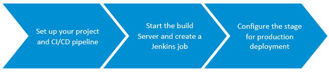
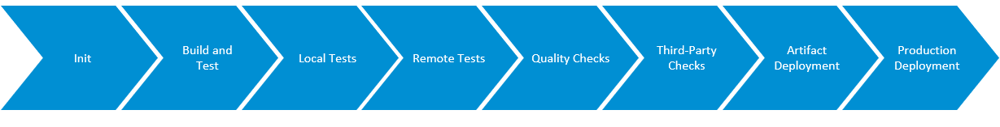
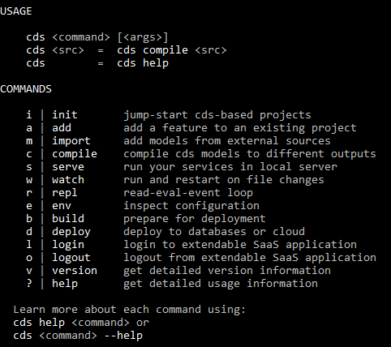
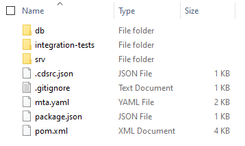
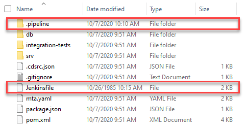
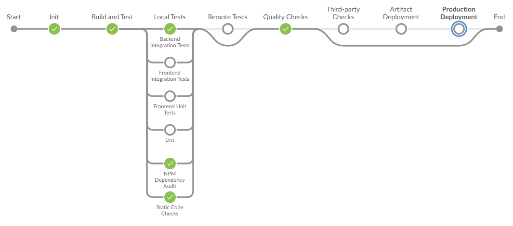
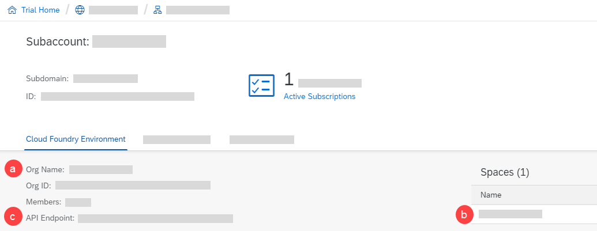
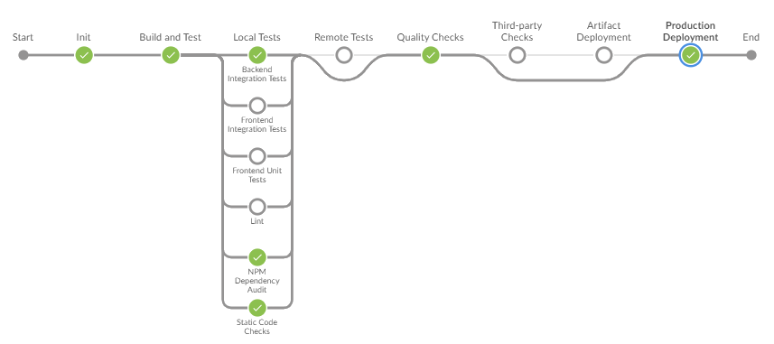

## Prerequisites
 - You have set up CI/CD for the SAP Cloud SDK. See [Set Up Continuous Integration and Delivery for SAP Cloud SDK](https://developers.sap.com/tutorials/cloudsdk-ci-cd.html).
 - You have installed the latest LTS release of [Node.js](https://nodejs.org/en).
 - You have installed [Apache Maven](https://maven.apache.org/).
 - You have installed [Java](https://www.java.com/en/).
 - You have an account and repository in [GitHub](https://github.com/).
 - You have installed [Docker](https://www.docker.com/) on your machine.
 - You have an [SAP Cloud Platform trial account](https://www.sap.com/cmp/td/sap-cloud-platform-trial.html).
 - In your SAP Cloud Platform trial account, you have created a [trial SAP HANA Cloud instance](https://saphanajourney.com/hana-cloud/learning-article/how-to-create-your-trial-sap-hana-cloud-instance/).
 - Your trial SAP HANA Cloud instance is running.

## Details
### You will learn
  - How to use project "Piper" to set up a CI/CD pipeline for CAP-based projects on SAP Cloud Platform
  - How to set up a CI/CD build server and run your pipeline
  - How to use a CI/CD pipeline to deploy an application in the Cloud Foundry environment

### What Is This Tutorial About?

In this tutorial, you'll set up a continuous integration and delivery pipeline for a CAP-based sample project on SAP Cloud Platform, configure its stage for productive deployment, and run it.

The tutorial consists of 3 main stages:



1. Prepare your setup, create a sample project, and set up your CI/CD pipeline.

2. Start the Jenkins build server, create and run a job for your pipeline.

3. Add production deployment to your CI/CD pipeline.

>For more information about CI/CD and SAP solutions that help you apply it, see [Continuous Integration and Delivery by SAP](https://help.sap.com/viewer/product/CICD_OVERVIEW/Cloud/en-US?task=discover_task).

### About the SAP Cloud Application Programming Model (CAP)

The SAP Cloud Application Programming Model is a framework of languages, libraries, and tools for building enterprise-grade services and applications.

It features a mix of open-source and SAP technologies, and offers both best practices and a set of out-of-the-box solutions for recurring tasks.

>For more information, see [About CAP](https://cap.cloud.sap/docs/about/).


### About Project "Piper"

Project "Piper" is an open-source project that provides preconfigured Jenkins pipelines, which you can use in your own Jenkins master infrastructure and adapt according to your needs, if necessary.

It consists of a [shared library](https://github.com/SAP/jenkins-library), which contains the description of steps, scenarios, and utilities required to use Jenkins pipelines, and a set of [Docker images](https://github.com/SAP/devops-docker-images) that can be used to implement best practice processes.

>For more information, see [Project "Piper"](https://sap.github.io/jenkins-library/).

### About the SAP Cloud SDK Pipeline

The SAP Cloud SDK pipeline is a continuous integration and delivery pipeline based on [project "Piper"](https://sap.github.io/jenkins-library/). It's a centrally maintained and ready-made open-source pipeline that helps you implement and ensure important application qualities.

It comprises the following stages:



>For more information, see [SAP Cloud SDK Pipeline](https://sap.github.io/jenkins-library/pipelines/cloud-sdk/introduction/).

---

[ACCORDION-BEGIN [Step 1: ](Prepare your setup and create a sample project)]

Install the `cds` development kit and create a sample project for the SAP Cloud Application Programming Model (CAP).

1. The `cds` development kit comprises the command line client and the development toolkit for CAP.

    To install it globally, execute the following command:

    ```Shell/Bash
    npm i -g @sap/cds-dk
    ```

    Run the following command to check if the installation was successful:

    ```Shell/Bash
    cds
    ```

    The response should look as follows:

    

    >If you encounter any problems when installing the `cds` development kit, have a look at [this troubleshooting section](https://cap.cloud.sap/docs/advanced/troubleshooting#npm-installation).

    >For more information on Core Data Services (CDS), see [Core Data Services (CDS)](https://cap.cloud.sap/docs/cds/).

2. In a directory of your choice, create a sample project for CAP:

    ```Shell/Bash
    cds init bookshop --add java,mta,samples,hana
    ```

    In your directory, you now have a folder called *bookshop* with the following content:

    !

[DONE]
[ACCORDION-END]

[ACCORDION-BEGIN [Step 2: ](Set up your CI/CD pipeline)]

Add the SAP Cloud SDK pipeline of project "Piper" to your sample project.

1. Navigate into the directory in which you've create your sample project:

    ```Shell/Bash
    cd bookshop
    ```

2. Add the SAP Cloud SDK pipeline to your project:

    ```Shell/Bash
    cds add pipeline
    ```

    In your sample project, you should now have a new folder called *.pipeline*, which contains the file  *config.yml*, as well as a file called *Jenkinsfile*:

    !

    The *.pipeline/config.yml* file is the configuration file for your CI/CD pipeline. Here, you can define where to deploy your application productively, for example.

    >For an overview of all configuration options, see [SAP Cloud SDK Pipeline Configuration](https://sap.github.io/jenkins-library/pipelines/cloud-sdk/configuration/).

    In the *Jenkinsfile*, the actual pipeline is implemented and executed.

3. Open the *Jenkinsfile* in an editor of your choice and change the value of `pipelineVersion` to `v42`:

    ```
    String pipelineVersion = "v42"
    ```

4. Push your sample project to your GitHub repository.

[DONE]
[ACCORDION-END]

[ACCORDION-BEGIN [Step 3: ](Start the Jenkins build server)]

Start the CX Server as build server for your CI/CD pipeline.

The CX Server, as well, is part of project "Piper". It's a lifecycle-management tool to bootstrap a preconfigured Jenkins instance on your own (virtual) server. It uses Docker images and, thanks to its lifecycle-management scripts, can be used out-of-the-box.

>For more information about the CX Server, see:

>- [Infrastructure](https://sap.github.io/jenkins-library/infrastructure/overview/) (project "Piper" documentation)
>- [https://github.com/SAP/devops-docker-cx-server](https://github.com/SAP/devops-docker-cx-server) (CX Server on GitHub)


1. Create a new directory and initialize the CX Server by executing the following command:

    ```Shell/Bash
    docker run -it --rm -u $(id -u):$(id -g) -v "${PWD}":/cx-server/mount/ ppiper/cx-server-companion:latest init-cx-server
    ```

    As a result, a few files are created in your working directory.

2. Start the Jenkins server through the following two commands:

    ```Shell/Bash
    chmod +x ./cx-server
    ./cx-server start
    ```

3. Open Jenkins in a browser of your choice by entering the IP or domain name of your host machine. For more information, see [Operations Guide for CX Server](https://github.com/SAP/devops-docker-cx-server/blob/master/docs/operations/cx-server-operations-guide.md).

4. Jenkins asks you to log in to create new jobs:

    !

    For the login, use the default credentials. To view them, run the following command:

    ```Shell/Bash
    ./cx-server initial-credentials
    ```

    >**Note:** We recommend to change the default credentials immediately.

[DONE]
[ACCORDION-END]

[ACCORDION-BEGIN [Step 4: ](Create and run a Jenkins job)]

Create and run a build job for your project in Jenkins.

1. From the navigation pane in Jenkins, choose **New Item**.

2. Enter a name for your build job, select **Multibranch Pipeline**, and choose **OK**.

3. Under **Branch Sources**, choose **Add Source** &rarr; **Git**.

4. In your repository in GitHub, choose **Code** and copy your repository URL for HTTPS.

5. In Jenkins, enter your copied repository URL as **Project Repository** and choose **Save**.

    As a result, Jenkins scans your GitHub repository and triggers a build.

6. To view the status of your build, choose **Open Blue Ocean** from the navigation pane.

7. Choose on your job to see a detailed log of your job as well as a graphical representation of your pipeline.

    When the build job has finished successfully, your pipeline should look as follows:

    !


[VALIDATE_1]
[ACCORDION-END]

[ACCORDION-BEGIN [Step 5: ](Add production deployment to your CI/CD pipeline)]

Configure the *Production Deployment* stage of your CI/CD pipeline.

1. In your SAP Cloud Platform trial account, choose your subaccount tile.

    You now get an overview of the information related to your subaccount:

    !

2. In the *.pipeline/config.yml* of your sample project, use this information to configure the following three parameters of the `productionDeployment` stage :

    | Parameter      | Value |
    | ----------- | ----------- |
    | `org`      | Enter your **Org Name** (a).       |
    | `space`   | Enter your **Space Name** (b).        |
    | `apiEndpoint`   | Enter your **API Endpoint** (c).        |

3. In your Jenkins project, choose **Credentials** &rarr; **System** &rarr; **Global credentials (unrestricted)**.

4. Choose **Add Credentials** and provide your **Username**, **Password**, and an **ID**.

5. In your *.pipeline/config.yml*, add the **ID** of your newly created credentials as value to the `credentialsId` parameter.

6. Remove the number signs in front of the `productionDeployment` stage, except for `appName: 'myAppName'` and `manifest: 'manifest.yml'`.

    Your `productionDeployment` stage should now look as follows (with your previously entered values):

    ```YAML
    productionDeployment:
      cfTargets:
        - org: '<YOUR ORG NAME>'
          space: '<YOUR SPACE NAME>'
          apiEndpoint: '<YOUR API ENDPOINT>'
  #   appName: 'myAppName'
  #   manifest: 'manifest.yml'
          credentialsId: '<YOUR CREDENTIALS ID>'
    ```

7. In the `General project setup` of your *.pipeline/config.yml*, define your productive branch. For example:

    ```YAML
    ### General project setup
    general:
      productiveBranch: main
    ```

8. In the *package.json* of your project, define your repository and add the `cds` parameter, so that the file looks as follows:

    ```
    {
        "name": "bookshop-cds",
        "version": "1.0.0",
        "description": "Generated by cds-services-archetype",
        "license": "ISC",
        "repository": "<YOUR REPOSITORY>",
        "cds": {
          "hana" : { "deploy-format": "hdbtable" }
        }
    }
    ```

8. In Jenkins, trigger a new build of your pipeline.

    When the build job has finished successfully, your pipeline should look as follows:

    !

[DONE]
[ACCORDION-END]

**Congratulations!**

You've successfully built a CI/CD pipeline with project "Piper" for your development with the SAP Cloud Application Programming Model (CAP).
