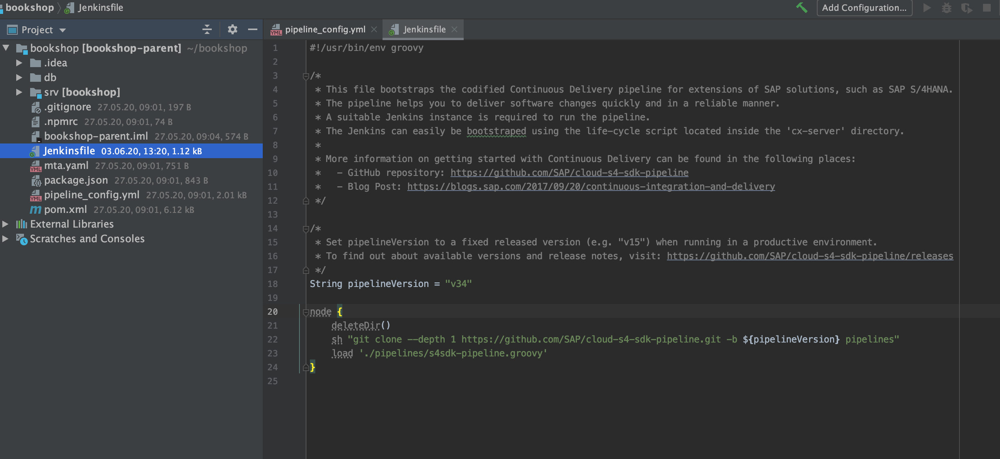
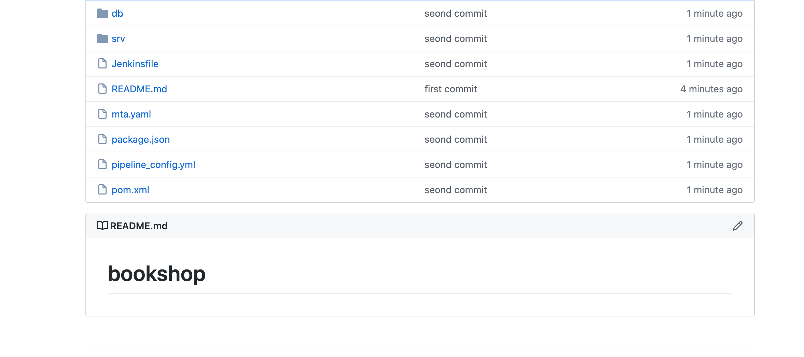
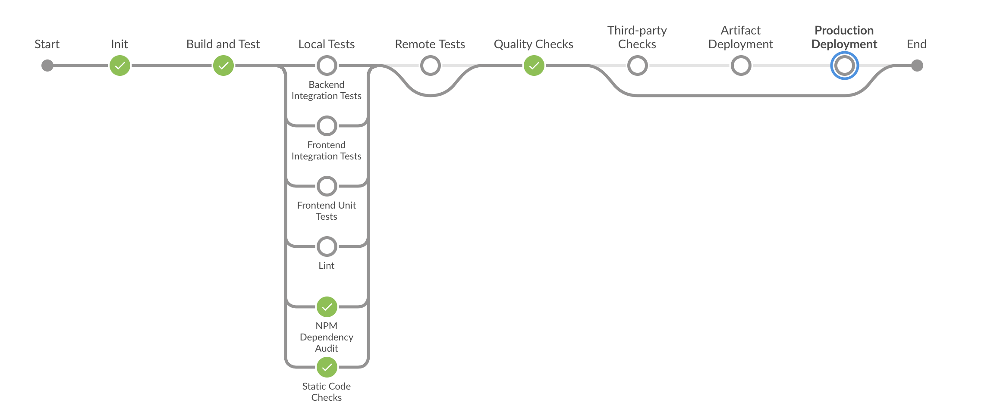
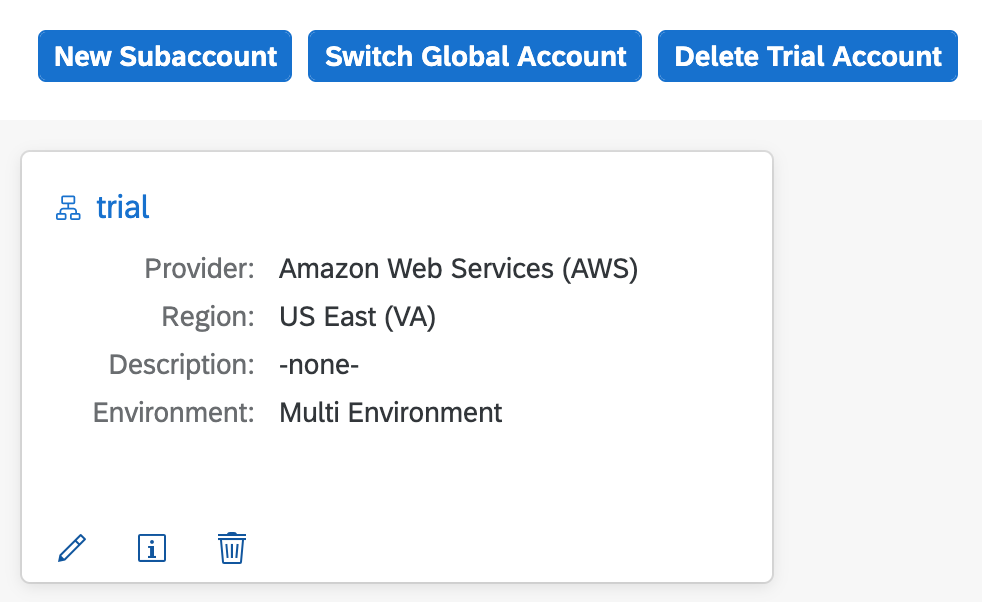
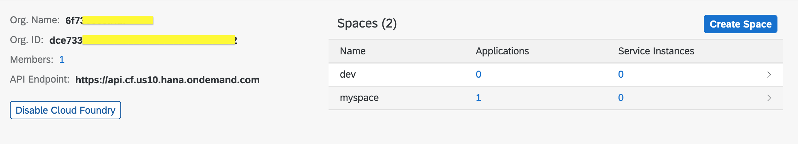
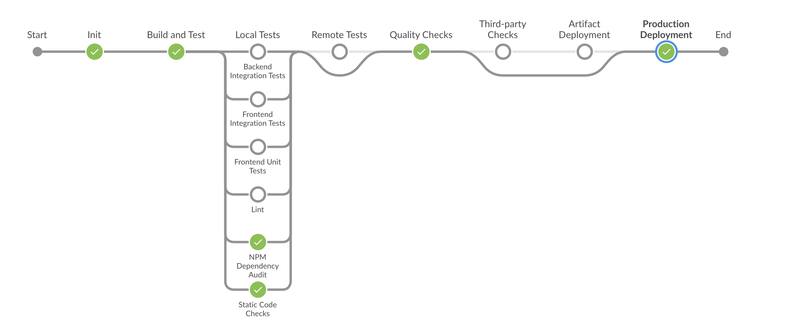
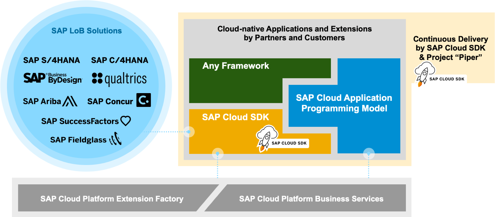

## Prerequisites
 - [Set up CI/CD](https://developers.sap.com/tutorials/cloudsdk-ci-cd.html)

## Details
### You will learn
  - How to set up a CI/CD pipeline for projects based on the SAP Cloud Application Programming Model on SAP Cloud Platform

SAP Cloud Application Programming Model enables you to quickly create business applications by allowing you to focus on your business domain. It offers a consistent end-to-end programming model for full-stack development on SAP Cloud Platform.

You can use a sophisticated CI/CD pipeline without having to write or maintain the pipeline yourself. Rather, you can take advantage of the open sourced SAP Cloud SDK pipeline from project "Piper", maintained by the SAP Cloud SDK team on [GitHub](https://sap.github.io/jenkins-library/pipelines/cloud-sdk/introduction/).

---

[ACCORDION-BEGIN [Step 1: ](Create a project based on the SAP Cloud Application Programming Model)]

For local development, you need to install the `cds` command line tools once, which in turn require Node.js , as follows:

1. Install Node.js from <https://nodejs.org>
  (use the latest LTS release)

2. Install the `cds` development kit globally

    ```
    npm i -g @sap/cds-dk
    cds  #> test-run it
    ```

3. Get the sample project

    ```
    cds init --add java,mta,bookshop
    ```

Please find more information about the SAP Cloud Application Programming Model in its [documentation](https://cap.cloud.sap/docs/get-started/).

[DONE]
[ACCORDION-END]

[ACCORDION-BEGIN [Step 2: ](Setup a Continuous Delivery pipeline)]

SAP offers a pipeline which helps you to implement continuous delivery out-of-the-box. To add this pipeline to your project run the following command

```
cds add pipeline
```

Now, you can see that your project contains two new files.

-  Jenkinsfile
-  .pipeline/config.yml or pipeline_config.yml in older versions of `cds`


The SAP Cloud SDK for Continuous Delivery is based on Jenkins. Jenkins offers the possibility to implement build pipelines as code. However, as explained before, you don't have to write any line of code. As you can see in `Jenkinsfile`, the actual pipeline implemented as open source and executed here. We call this approach a centrally maintained pipeline.

!

Set `pipelineVersion` to a fixed released version (e.g. "v34") when running in a productive environment.

For available versions and release notes please visit: <https://github.com/SAP/cloud-s4-sdk-pipeline/releases>

However, You still want to control the behavior of this pipeline. Therefore, the command adds a configuration file in `.pipeline/config.yml`. Please note that in older versions of `cds` the file is named  `pipeline_config.yml` and is located in the root of the project.

You can use the `config.yml`, for example, to control where to deploy your application productively. Of course, there are many more configuration options you can use in order to control the behavior of the pipeline. You will find more information about this in the pipeline documentation.

Now, You'll need to push the code to a git repository. This is required because the pipeline gets your code via git. This might be GitHub, or any other cloud or on-premise git solution you have in your company.

!

Having an example ready which already contains the build pipeline, we need something to run the pipeline.

[DONE]
[ACCORDION-END]

[ACCORDION-BEGIN [Step 3: ](Start Jenkins server)]

Next, start your build server instance. We'll utilize the so called Cx-Server for that, which is developed by SAP's project "piper". It is based on popular and battle-tested open source components, such as Jenkins, Docker and Nexus. Thanks to the Cx-Server provided life-cycle management scripts, it is ready to work within a few minutes.

To start the build server, you just need a machine which has Docker installed. Create a new directory and initialize Cx-Server by using this `docker run` command:

```
docker run -it --rm -u $(id -u):$(id -g) -v "${PWD}":/cx-server/mount/ ppiper/cx-server-companion:latest init-cx-server
```

This creates a few files in your current working directory. The shell script Cx-Server and the configuration file `server.cfg` are of special interest.

Now, you can start the Jenkins server by using the following command:

```
chmod +x ./cx-server
./cx-server start
```

Congratulations! Your Jenkins is now starting up. Once it is running, you can open it by entering the IP or domain name of your host machine in your favorite browser.

>If Jenkins asks you to login for creating a new job so in terminal run this command `./cx-server initial-credentials` to find the default credentials.

> **IMPORTANT:** We recommend to change the default password immediately.

Jenkins should welcome you with the following screen:

!

Next, you can continue with the basic setup and start building your project by adding your source code repository.

>For configure the SAP cloud SDK Cx-Server, please follow the [Cx-Server operations guide](https://github.com/SAP/devops-docker-cx-server/blob/master/docs/operations/cx-server-operations-guide.md).


### Create a Jenkins job for your project
To create a build job for your project, navigate to **New Item** in the Jenkins main menu. On the following screen, choose **Multi-branch Pipeline** and specify a name for your project´s build job.


If your repository is set to private, please also create and use a pair of suitable credentials and choose them for your repository. If you are using github.com, this will also protect you from running into rate limitations.

Next, you need to connect your project on Jenkins for running the build. Switch to Git and copy the `URL` of project repository. Look for **Branch Sources** at Jenkins screen and go to **Add Source** and add the link of your Git repository and click **Save**.

Jenkins will now scan your repository and trigger a build.

The best way to get an overview of the build status is to open the job, navigate to the currently running build, and open it in the blue ocean UI of Jenkins.

!

Please have a look at this sample visual representation of the pipeline:

!

[VALIDATE_1]


[DONE]
[ACCORDION-END]

[ACCORDION-BEGIN [Step 5: ](Production deployment)]

As explained you can configure the behaviour of the pipeline using the file `.pipeline/config.yml`. In this step, we will configure the production deployment as an example.

In order to deploy applications, you need to create a free trial account. You can create your account by visiting [SCP Cloud Foundry](https://cloudplatform.sap.com/try.html)

After creating your account and activating it via email, you can log in to your personal `Cloud Cockpit`. For your first visit, it should look like this:


Now click the `Home` button in the upper navigation bar and then click `Start Cloud Foundry Trial`.


After selecting your region, your account will be automatically set up for development with `Cloud Foundry`.



In order to deploy applications on `SAP Cloud Foundry` you need to provide the API endpoint and other properties. You can get them by going inside your trial.



Configure `config.yml` for Cloud Foundry settings.

```
#config.yml
productionDeployment:
  cfTargets:
   - space: 'my-space'
     org: 'my-org'
     credentialsId: 'credentials'
     apiEndpoint: '<Cloud Foundry API endpoint>'
```

Now you require credentials. It can be created in the Jenkins by navigating to **Credentials > System > Global Credentials**.

!

On this screen, click **Add Credentials** and enter username, password, as well as an ID for your credentials record.

you can now leverage this credentials record by adding the credentials configuration property to the `productionDeployment` stage of your `config.yml`.

Pipeline will look like this after production deployment stage:

!

For further details regarding stage production deployment, Please refer to [pipeline documentation]( https://github.com/SAP/cloud-s4-sdk-pipeline/blob/master/configuration.md#productiondeployment)

For a detailed documentation of the individual properties please consult the [Step documentation](https://sap.github.io/jenkins-library/steps/cloudFoundryCreateService/).

[DONE]
[ACCORDION-END]


[ACCORDION-BEGIN [Step 6: ](More information)]

This picture puts everything into context of the broader SAP ecosystem:

!

As you can see, [SAP Cloud SDK](https://developers.sap.com/topics/cloud-sdk.html) is a natural companion for SAP Cloud Application Programming Model applications, providing useful features like tight integration with SAP LoB solutions such as SAP S/4HANA and SAP SuccessFactors.

More detailed information on the qualities checked by the pipeline can be found [here](https://sap.github.io/jenkins-library/pipelines/cloud-sdk/cloud-qualities/)


[DONE]
[ACCORDION-END]
