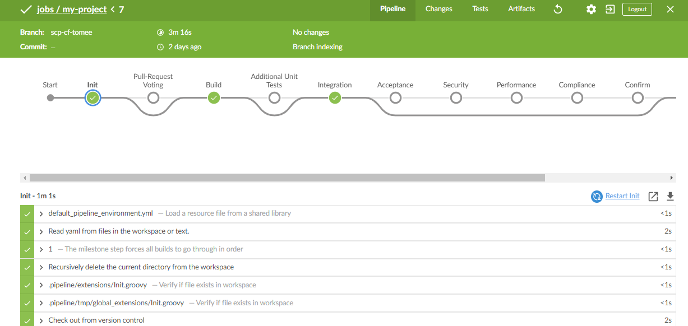

## Prerequisites
For getting started with Continuous Integration and Delivery (`Cx`) in your project, you need to assure the following prerequisites.
**Linux host with Docker**: For instantiating the SAP Cloud SDK Cx-Server, you need to provide a suitable host or virtual machine with a Linux operating system and Docker installed. Please also ensure that the user with whom you start the Cx-Server belongs to the docker group.
**Project sources in GitHub or Git**: Your project source files need to be available on a git or `Github server`, which is accessible from the Cx-Server host. Creating your project is explained in [Step 2](https://blogs.sap.com/2017/05/21/step-2-with-sap-s4hana-cloud-sdk-helloworld-on-scp-classic/) and [Step 3](https://blogs.sap.com/2017/05/19/step-3-with-sap-s4hana-cloud-sdk-helloworld-on-scp-cloudfoundry/).

>The SAP Cloud SDK Pipeline uses Docker images for each individual build step. Accordingly, you do not need to take care of installing any further dependencies on your host machine. All tools required for building, testing, quality checking, and deploying your applications, are dynamically retrieved in the form of Docker images.

## Details
### You will learn
  - How to develop and release your application in short cycles.
  - How to install and run cx-server.
  - How to setup a Jenkins job.

---

[ACCORDION-BEGIN [Step 1: ](Installing and Managing the Cx-Server)]
The lifecycle of the Cx-Server is maintained by a script called cx-server. It can be found in the same named folder on the root of each SAP Cloud SDK project archetype. Alternatively, you can also get it from the [Cx-Server git repository](https://github.com/SAP/devops-docker-cx-server#setting-up-jenkins-server). Together with the `server.cfg` file, this is all you need for starting your instance of the SAP Cloud SDK Cx-Server.


### Copying the Cx-Server lifecycle management script to the target host
First, cx-server folder needs to be copied to the future host on which the Cx-Server is intended to run. For this, copy the folder from your archetype to a place on your Linux server, for example, via secure copy:

```
scp -r cx-server username@cx-host.corp:~/cx-server
```

>If you are copying the cx-server from a Microsoft Windows machine, the target files might use Windows line endings, which makes them unusable on the Linux host. To correct this, you can use `dos2unix` or similar tools to convert the line endings of the cx-server script and its configuration in server.cfg. Also assure that the cx-server script is executable by the current user.

Example:

```
$ dos2unix ./cx-server/*
dos2unix: converting file ./cx-server/cx-server to Unix format...
dos2unix: converting file ./cx-server/server.cfg to Unix format...
$ chmod +x cx-server/cx-server
```

Next, login to your Linux host and navigate to the cx-server folder. After that, you are ready to start your SAP Cloud SDK Cx-Server instance.

### Starting the SAP Cloud SDK Cx-Server
For starting the Cx-Server, All you need to do, is to change to the cx-server directory and execute the `cx-server start` command. This will start the Cx-Server with its default settings on port 80 of your host machine.

If not done before, the script downloads the newest version of the SAP Cloud SDK Cx-Server from Docker Hub and instantiates a container from it. Because of the initial download, the first invocation might take a few minutes. In case, the Cx-Server has been started and stopped earlier, the existing container will be reused.

The state of Jenkins will be stored in a persistent Docker volume named `jenkins_home_volume`. This volume contains all critical data, comprising the Jenkins configuration, plugins, and build related artifacts. Therefore, even if your container crashes, no data of your Cx-Server will be lost.

If everything goes well, you should be able to see output, which is similar to the following:

```
$ cd cx-server
$ ./cx-server start
Checking for newer version of this script on github...
no newer version detected.

Starting docker container for Cx Server.
Parameters:
   - http_port=80
   - docker_image=ppiper/cx-jenkins-master:latest
   - jenkins_home=jenkins_home_volume

>> docker pull ppiper/cx-jenkins-master:latest
latest: Pulling from ppiper/cx-jenkins-master
...
e7ad665b2ea1: Already exists
9094d1930c09: Pull complete
1ae0fd7ec49a: Downloading [==>        ]  9.191MB/221MB
...
Status: Image is up to date for ppiper/cx-jenkins-master:latest
>> docker run -u 1000:115 --name cx-jenkins-master -d -p 80:8080
 -v /var/run/docker.sock:/var/run/docker.sock
 -v jenkins_home_volume:/var/jenkins_home
 ppiper/cx-jenkins-master-sap:latest
0e214f9dcf3d9e1d2839638901d60f3067edb635067c640fe16b7c18a6b65607
Waiting for the Cx server to start......... success.
```

Congratulations! Your Cx-Server is now starting up. Once it is running, you can open it by entering the IP or domain name of your host machine in your favorite browser.
>If Jenkins ask you to login for creating a new job so in terminal run this command `./cx-server initial-credentials` to find the default credentials.

We recommend to change the default password immediately.

 Jenkins should welcome you with the following screen:


Next, you can continue with the basic setup and start building your project by adding your source code repository.

### Stopping the SAP Cloud SDK Cx-Server
For stopping your Cx-Server instance, you can use the command `cx-server stop`. It will stop the Cx-Server container in a safe manner by waiting for all jobs to finish before shutdown.

>Before the shutdown can be performed, you have to provide the credentials of a (technical) user who is enabled to perform a safe shutdown of the server.

```
$ ./cx-server stop
Checking for newer version of this script on github...
no newer version detected.

Jenkins username (leave empty for unprotected server): user
Password for user:

Initiating safe shutdown...
>> docker exec 0e214f9dcf3d curl
 -w '%{http_code}' -u 'user:******' -o /dev/null
 -s -X POST 'http://localhost:8080/safeExit'
200
Waiting for running jobs to finish...... success.
```

### Creating a new SAP Cloud SDK Cx-Server Container
In certain cases, you will need to create a new Cx-Server container, for example, for:

- updating the Cx-Server to a new version
- updating the CX-Server for security reasons. please refer to [Cx-Server recommendation](https://github.com/SAP/devops-docker-cx-server/blob/master/cx-server-companion/life-cycle-scripts/CX-SERVER-SECURITY.md)

- effectively applying configuration changes
- troubleshooting

For this, you can stop the server and call `cx-server remove` to delete its corresponding docker container. To create a new instance, you can subsequently call `cx-server start`. This will instantiate a new container based on the current configuration. As long as you do not change the home directory of Jenkins, the new container will reuse the previous Cx-Server configuration and all other persisted state information.

### Configuring the SAP Cloud SDK Cx-Server
You can use the `cx-server/server.cfg` file to customize your instance of the SAP Cloud SDK Cx-Server. To get an overview of the available options, you can open the file and have a look at the explanatory comments of each option. Changes to the configuration will become effective after creating a new container. This means that, if you are already running an instance of the Cx-Server, you have to stop and remove it, before the new settings will become effective.

As of today, the following options can be customized:

- **`docker_registry` and `docker_image`**: The docker registry, respectively docker image to be used for instantiating your Cx-Server. When no `docker_registry` is specified, the docker engine will use docker hub as a default and pull the `ppiper/cx-jenkins-master` image in its latest version.
- **`http_port`**: The port on which your Cx-Server will be reachable.
- **`jenkins_home`** : The resource to be used as Jenkins home directory. You can use an absolute path pointing to a folder on your host machine, for example, `jenkins_home="/var/jenkins_home"`.  Alternatively, you can use a named docker data volume such as the default value `jenkins_home="jenkins_home_volume"`.
- **x`_java_opts`**: Custom java options to be passed to the Jenkins Java VM. You can use it to adapt the maximum heap size of its Java VM, for example, `java_opts="-Xmx1024m"`
- **`http_proxy`, `https_proxy`, `no_proxy`**: Proxy settings to be passed as environment variables to the docker container, for example: `http_proxy="http://proxy:8080", http_proxy="http://proxy:8080",
no_proxy="localhost,.corp"`

>If you choose to store Jenkins home in a local folder, you have to ensure that the Jenkins user within the Cx-Server container, which is fixed to `uid=1000`, is able to read and write within the specified folder. To avoid permission related issues, we recommend to use named docker volumes.

[ACCORDION-END]

[ACCORDION-BEGIN [Step 2: ](Building your first project)]
After configuring and starting your Cx-Server instance, you are ready to build, test, and deploy your first cloud application. This application needs to be created from one of the SAP Cloud SDK archetypes.

Before creating your build job, you need to configure your SCM system of choice. In our example, we will assume that your project is located in GitHub Enterprise. Alternatively, you can also skip the next step (Setup GitHub Enterprise) and use your account on github.com.

>Jenkins also supports other SCM systems such as GitLab or plain git. You are free to install the corresponding plugin to enable your custom SCM setup.

### Setup GitHub Enterprise
Go to your Jenkins main page and navigate to `Manage Jenkins` » `Configure System`. On the configuration page, look for `GitHub Enterprise Servers`. Here, add the API endpoint of your GitHub Enterprise Server, which typically ends with `/api/v3` (for example `https://github.corp/api/v3`), and assign a name to it. Now you are ready to create a build job for your project.


### Create a Jenkins job for your project
To create a build job for your project, navigate to `New Item` in the Jenkins main menu. On the following screen, choose `Multibranch Pipeline` and specify a name for your project´s build job.


Next, you need to setup the SCM source of your project´s build job. Look for `Branch Sources` and add one by specifying your GitHub Enterprise endpoint, organization (via field `Owner`), and repository. If your repository is set to private, please also create and use a pair of suitable credentials and choose them for your repository. If you are using github.com, this will also protect you from running into rate limitations. To control when Jenkins will start a build run and what it will build during that run, you can use the `Behaviors` section of the configuration. The example below shows a configuration that will build all branches and GitHub Pull Requests. Finally, save your updated configuration by clicking the `Save` button on the bottom of the page.


Congratulations! Jenkins will now scan your repository and trigger a build.

The best way to get an overview of the build status is to open the job, navigate to the currently running build, and opening it in the blue ocean UI of Jenkins.




Please note that your pipeline skipped the deployment stage because you did not configure a deployment target yet. To deploy your application to your SCP account, you need to add a target to your `pipeline_config.yml` file. Moreover, if you already built integration tests that require credentials, you also need to create corresponding records in the Jenkins credentials store and map them via an appropriate entry in the configuration file. Credentials can be created by navigating to `Credentials` » `System` » `Global credentials`.


On this screen click on `Add Credentials` and enter username, password, as well as a ID for your credentials record.


As a result, navigating to `Credentials` should show your freshly created entry:


Finally, you can now leverage this credentials record by adding the credentials configuration property to the `integrationTests` stage of your `pipeline_config.yml`. The example below shows am example of mapping it to the system alias `MyErpSystem`, which you defined earlier in your `systems.yml` or `json` file.

```
stages:
  integrationTests:
    credentials:
      - alias: 'MyErpSystem'
        credentialId: 'MY-ERP'
```

To learn more about pipeline configuration, feel free to have a look on our [documentation on GitHub](https://github.com/SAP/cloud-s4-sdk-pipeline/blob/master/configuration.md).

For enabling Jenkins to automatically run builds in the future, you should open GitHub Enterprise and navigate to your `GitHub organization` » `Settings` » `Hooks` and create a webhook pointing to your freshly created Cx-Server, for example, `http://cx-server.corp/github-webhook/`. Depending on your SCM system, there might be similar ways to realize the notification.

This is also a good point in time to setup Jenkins to know its own URL. Navigate to `Manage Jenkins` » `Configure System`, search for `Jenkins Location`, and specify `Jenkins URL`.


Jenkins will use this value to create links to its resources, for example, when creating quality check entries in context of pull requests that are initiated by developers within the project.


Furthermore, you can adopt the number of executors to match the power of your host machine. By default, the Cx-Server uses 4 executors, which means that up to three stages of build jobs can run in parallel. We recommend to increase the number executors to at least the number of cores of your machine. This will help your Cx-Server to finish build jobs faster, especially when running multiple in parallel. The number of executors can be configured in `Manage Jenkins` » `Configure System` in the section `Maven Project Configuration`.


For more information on the SAP Cloud SDK Pipeline, feel free to continue reading our [deep dive article](https://blogs.sap.com/2017/11/04/the-continuous-delivery-pipeline-for-sap-s4hana-cloud-sdk-based-projects/). There, you can learn more about its capabilities, design principles, integrated quality checks. Its configuration can be found on [GitHub](https://github.com/SAP/cloud-s4-sdk-pipeline/blob/master/configuration.md).


[ACCORDION-END]

[ACCORDION-BEGIN [Step 3: ](Questions and Troubleshooting)]

### Pipeline does not start after commit
Check if your webhook is setup properly and that it succeeds in delivering commit events. Furthermore, ensure that your project and, therefore, also the Jenkins file are located in the root of your git repository. One way of achieving this, is to generate the archetype in the parent folder of your local repository with `artifactId=<repository name>`.

In the future, we will use this section to address common challenges and how they can be resolved. For example, how you can access the Cx-Server log files, how you can get shell access to your Cx-Server, and how to customize it for your environment when you are using self signed certificates.

### Other Questions and Bugs
Are you facing a development question? Then check out Stack Overflow, the main place for SAP  Cloud SDK related questions. If you do not find an answer, feel free to post it and make sure to attach the tag 's4sdk'. Our team, as well as the whole Stack Overflow community, are at your service and will quickly react to your question.

For an overview of SAP Cloud SDK related questions, go to (https://stackoverflow.com/questions/tagged/s4sdk).

You think that you found a bug in one of our Continuous Delivery artifacts? Feel free to open a issue in our Pipeline GitHub repository on (https://github.com/SAP/cloud-s4-sdk-pipeline/issues).

### Security Notes
The Cx-Server is built with care and based on well established technologies. However, as with most tools, their are certain risks involved that you should properly manage within your setup. Therefore, please carefully read the following security notes before starting to use your Cx-Server productively.

### Setup Jenkins security and disable anonymous access
Initially, the Jenkins server within the docker image is not secured in any manner. Anyone with network access to the Cx-Server host can access and modify its settings. In your Jenkins, navigate to `"Manage Jenkins » Configure Global Security"` and apply a suitable security setup for your organization and its users.

### Take care who can modify the pipeline
To be able to start other docker containers, the Cx-Server has access to Dockers control socket under `/var/run/docker.sock`. Attackers that manage to intrude your Cx-Server container, will be able to launch other containers that then might interfere with other resources on your system. This is a general security risk in setups where docker containers need to be able to launch other containers. Accordingly, we advice you to carefully control who can directly or indirectly access your Cx-Server. To avoid unnecessary risks, you should avoid running any other business critical applications on the same host.

### Additional Resources
[Deep Dive to SAP Cloud SDK Continuous Integration and Delivery Pipeline](https://blogs.sap.com/2017/11/04/the-continuous-delivery-pipeline-for-sap-s4hana-cloud-sdk-based-projects/)

[Configuration Parameters of the Pipeline](https://github.com/SAP/cloud-s4-sdk-pipeline/blob/master/configuration.md)

[Jenkins Documentation](https://jenkins.io/doc/)

[Docker Documentation](https://docs.docker.com/)

[ACCORDION-END]

---
