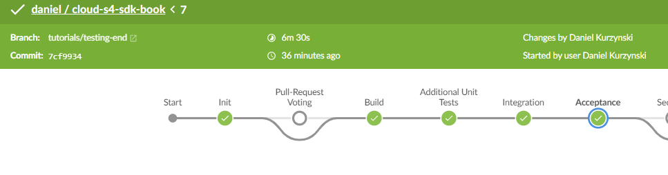

## Prerequisites
This tutorial assumes you already completed the tutorial [End-to-End Tests for SAP Cloud SDK Projects](cloudsdk-e2e-test) and understood the concepts explained in the tutorial [Secure your application](s4sdk-secure-cloudfoundry).


## Details
### You will learn
- How to extend the [End to End Test for SAP Cloud SDK projects](cloudsdk-e2e-test) to deal with authentication
- How to run these end-to-end tests locally
- How to configure the pipeline to inject credentials into the tests

---

[ACCORDION-BEGIN [Step 1: ](Add authentication to end-to-end tests)]

As preparation please secure your application from the tutorial [End-to-End Tests for SAP Cloud SDK Projects](cloudsdk-e2e-test) as explained in [Secure your application](s4sdk-secure-cloudfoundry).

The first page you see accessing the application is the app-router showing a login form. The basic idea is that the first part of the test is to log in into the application as a user. You adapt the tests in a way that they first visit the login page, enter the credentials and then press the login button.

First, you create the following page object in `e2e-tests/page_objects/login.js`. This page object reads the credentials from the configuration and enters them into the input fields. The selectors of these fields are specified in the elements section. These selectors are working for the standard app-router. For other forms, e.g. on Cloud Platform Neo, or customized forms these selectors need to be updated.

```JavaScript
"use strict";

const loginCommands = {
  loginWithForm: function () {
    const user = this.api.globals.user;
    const pass = this.api.globals.pass;
    delete this.api.globals.user;
    delete this.api.globals.pass;
    this.waitForElementVisible("@usernameField").setValue(
      "@usernameField",
      user
    );
    this.waitForElementVisible("@passwordField").setValue(
      "@passwordField",
      pass
    );
    this.waitForElementVisible("@submitButton").click("@submitButton");

    this.expect.element("@usernameField").to.not.be.present;
    return this;
  },
};

module.exports = {
  url: function () {
    return this.api.launchUrl;
  },
  elements: {
    usernameField: "input[name=username]",
    passwordField: "input[name=password]",
    submitButton: "input[type=submit]",
  },
  commands: [loginCommands],
};
```

As a next step, you have to trigger the login before the test execution. This can be configured in the file `e2e-tests/cucumber.conf.js` which you created in the tutorial [End-to-End Tests for SAP Cloud SDK Projects](cloudsdk-e2e-test). The updated content of the `BeforeAll` method looks as follows:

```JavaScript
BeforeAll(async () => {
  const options = {
    configFile: __dirname + "/nightwatch.conf.js",
    env: argv.NIGHTWATCH_ENV || "firefox",
  };
  await startWebDriver(options);
  await createSession(options);
  const loginPage = client.page.login();
  await loginPage.navigate().loginWithForm(false);
});
```
>There are two new lines in the `BeforeAll` block to log into the application.

Furthermore, you have to specify the `username` and `password`. In our case they come from environment variables.
The updated file `e2e-tests/nightwatch.conf.js` from [e2e-test](cloudsdk-e2e-test) looks as follows:

```JavaScript
const chromedriver = require('chromedriver');
const geckodriver = require('geckodriver');
const argv = require("yargs").argv;

module.exports = {
  //...
  test_settings: {
    default: {
      //...
      globals: {
        //...
        user: "${e2e_username}",
        pass: "${e2e_password}"
      },
      //...
    },
  },  
};
```

>In global, you define user and pass. `${e2e_username}` means that the value is taken from the environment variable `e2e_username`.

[DONE]
[ACCORDION-END]

[ACCORDION-BEGIN [Step 2: ](Run end-to-end tests locally)]

To run the tests locally you can use the same command as used in [End-to-End Tests for SAP Cloud SDK Projects](cloudsdk-e2e-test). However, in SAP Cloud Platform Cloud Foundry the application URL `launchUrl` should point to the `app-router`. In the Neo environment, it should point to the `application` because the user is redirected to the login form automatically.

Furthermore, the `username` and `password` environment variables have to be set. On Windows you can use the command set to do that. The final command looks as follows:

```Shell
set e2e_username=myUser
set e2e_password=myPassword
npm install
npm run ci-e2e -- --launchUrl=https://path/to/your/running/app-router
```

>Your password is stored in the history of your terminal. We recommend using a technical user for the E2E tests.

[DONE]
[ACCORDION-END]

[ACCORDION-BEGIN [Step 3: ](Run E2E tests in the pipeline)]

!

To run the tests in our pipeline you have to adapt the `.pipeline/config.yml`. In [Set Up Continuous Integration and Delivery for SAP Cloud SDK](cloudsdk-ci-cd) you learned that this file configures the behavior of the pipeline.
In the tutorial [End-to-End Tests for SAP Cloud SDK Projects](cloudsdk-e2e-test) we already have setup the stage `Acceptance`. To inject the credentials for the login, please make sure that the credentials referenced by `e2e-test-user-cf` contain the username and password required during the login.

```
stages:  
  Acceptance:
    appUrls:
      - url: 'https://approuter-USERNAME.cfapps.eu10.hana.ondemand.com'
        credentialId: e2e-test-user-cf

    cfTargets:
      - space: 'MySpaceName'
        manifest: 'manifest-test.yml'
        org: 'MyOrg'
        appName: 'firstapp'
        credentialsId: 'deployment-cf'
```

[VALIDATE_1]
[ACCORDION-END]

[ACCORDION-BEGIN [Step 4: ](Questions and troubleshooting)]

Are you facing a development question? Then check out Stack Overflow for SAP Cloud SDK related questions. If you do not find an answer, feel free to post your question and make sure to attach the tag `sap-cloud-sdk`. Our team, as well as the whole Stack Overflow community, are at your service and will quickly react to your question.

For an overview of SAP Cloud SDK related questions, go to <https://stackoverflow.com/questions/tagged/sap-cloud-sdk>.

You think that you found a bug in one of our Continuous Delivery artifacts? Feel free to open an issue in our GitHub repository on <https://github.com/SAP/jenkins-library/issues>.


[DONE]
[ACCORDION-END]

---
