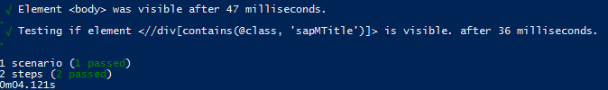

## Prerequisites
This tutorial assumes you are already familiar with the basics of the SAP Cloud SDK and project "Piper", e.g. because you already completed the mission [Create a Cloud Foundry App Using SAP Cloud SDK](mission.cloudsdk-cf-app) and the tutorial [Set Up Continuous Integration and Delivery for SAP Cloud SDK](cloudsdk-ci-cd).
To follow this tutorial please download and extract an [example project](https://github.com/SAP/cloud-s4-sdk-book/archive/tutorials/testing-start.zip) based on the SAP Cloud SDK archetype.

## Details
### You will learn
  - How to write end-to-end tests for your application
  - How to configure Nightwatch-api
  - How to configure Cucumber
  - How to run these end-to-end test in the pipeline

---

[ACCORDION-BEGIN [Step 1: ](End-to-end tests)]
For the end-to-end tests we use [Cucumber](https://github.com/cucumber/cucumber-js) and [Nightwatch-api](https://nightwatch-api.netlify.com/). It runs your tests using the chrome driver in the browser against a running version of your application. The version can run locally or on SAP Cloud Platform.

The example application you downloaded as prerequisite contains a frontend application which can list and create business partners. You can find it in `application/src/main/webapp/address-manager`.

Our first test is to load the page and check that it was loaded successfully. Tests can be defined in the Cucumber format:

```
Feature: Address Manager App
Scenario: Address Manager App opens
	Given I open the Address Manager home page
	Then a list of business partners is shown
	And the business partner name John Doe exists
```

We place that file in `e2e-tests/features/address-manager-app.feature`.

Steps are placed into the folder `e2e-tests/steps`. They define what exactly happens in each line of the feature file. A step basically implements the single lines in the feature file above. The file `e2e-tests/steps/steps.js` looks like as follows:


```JavaScript
const { client } = require("nightwatch-api");
const { Given, Then } = require("cucumber");

Given(/^I open the Address Manager home page$/, async () => {
  const businesspartner = client.page.businesspartner();
  console.info(businesspartner.url());
  await businesspartner.navigate().waitForElementVisible("@body");
});

Then(/^a list of business partners is shown$/, async () => {
  const businesspartner = client.page.businesspartner();
  await businesspartner.waitForElementVisible("@businessPartnerList");
  await businesspartner.assert.visible("@businessPartnerList");
});

Then(/^the business partner name John Doe exists$/, async () => {
  const businesspartner = client.page.businesspartner();
  await businesspartner.navigate().waitForElementVisible("@businessPartnerDoe");
});
```

If we check multiple times for the same element, we can use page objects to have the retrieving strategy for this element in a central place.

`@businessPartnerList` is defined in the page object `e2e-tests/page_objects/businesspartner.js` and should make navigation easier:

```JavaScript
module.exports = {
  url: function () {
    return this.api.launchUrl;
  },
  elements: {
    body: "body",
    businessPartnerDoe: {
      selector:
        "//li[contains(@class, 'sapMObjLItem')]//*[contains(text(), 'John Doe')]",
      locateStrategy: "xpath",
    },
    businessPartnerList: {
      selector:
        "(//div[contains(@class, 'sapMList') and contains(@class, 'sapMListBGSolid')])",
      locateStrategy: "xpath",
    },
  },
};
```

[VALIDATE_1]

[ACCORDION-END]

[ACCORDION-BEGIN [Step 2: ](Configure Nightwatch)]

To configure Nightwatch we create the following file in `e2e-tests/nightwatch.conf.js`:

```JavaScript
const chromedriver = require("chromedriver");
const geckodriver = require("geckodriver");
const argv = require("yargs").argv;

module.exports = {
  output_folder: "s4hana_pipeline/reports/e2e",
  page_objects_path: __dirname + "/page_objects",
  silent: !process.env.NIGHTWATCH_VERBOSE,
  test_settings: {
    default: {
      launch_url: argv.launchUrl,
      webdriver: {
        start_process: true,
        port: 4444,
      },
      globals: {
        abortOnAssertionFailure: true,
        retryAssertionTimeout: 10000,
        waitForConditionTimeout: 10000,
        asyncHookTimeout: 10000,
      },
      screenshots: {
        enabled: true,
        path: "s4hana_pipeline/reports/e2e/screenshots",
      },
    },
    chromeHeadless: {
      webdriver: {
        server_path: chromedriver.path,
        cli_args: ["--port=4444"],
      },
      desiredCapabilities: {
        browserName: "chrome",
        javascriptEnabled: true,
        acceptSslCerts: true,
        chromeOptions: {
          args: [
            "headless",
            "window-size=1280,800",
            "disable-gpu",
            "no-sandbox",
          ],
        },
      },
    },
    chrome: {
      webdriver: {
        server_path: chromedriver.path,
        cli_args: ["--port=4444"],
      },
      desiredCapabilities: {
        browserName: "chrome",
        javascriptEnabled: true,
        acceptSslCerts: true,
        chromeOptions: {
          args: ["window-size=1280,900", "disable-gpu", "no-sandbox"],
        },
      },
    },
    firefox: {
      webdriver: {
        server_path: geckodriver.path,
        cli_args: ["--port", "4444", "--log", "debug"],
      },
      desiredCapabilities: {
        browserName: "firefox",
        javascriptEnabled: true,
        acceptSslCerts: true,
        marionette: true,
      },
    },
  },
};
```

This configuration file defines some constants and places where the reports are located. Please note, that we use the folder `s4hana_pipeline/reports` to store all reports. This path is later required by our pipeline. In `launch_url` you can see that, the URL tested against and can be defined as command line argument.

[DONE]

[ACCORDION-END]

[ACCORDION-BEGIN [Step 3: ](Configure Cucumber)]

Furthermore, we also have to configure Cucumber to start and configure `chromedriver` as well as Nightwatch. Therefore, we create the file `e2e-tests/cucumber.conf.js` with the following content:

```JavaScript
const fs = require("fs");
const path = require("path");
const { setDefaultTimeout, AfterAll, BeforeAll } = require("cucumber");
const {
  createSession,
  closeSession,
  startWebDriver,
  stopWebDriver,
  client,
} = require("nightwatch-api");
const reporter = require("cucumber-html-reporter");
const argv = require("yargs").argv;

setDefaultTimeout(60000);

const reportsDirectory = path.resolve(
  __dirname,
  "../s4hana_pipeline/reports/e2e"
);
if (!fs.existsSync(reportsDirectory)) {
  fs.mkdirSync(reportsDirectory, { recursive: true });
}

BeforeAll(async () => {
  const options = {
    configFile: __dirname + "/nightwatch.conf.js",
    env: argv.NIGHTWATCH_ENV || "firefox",
  };
  await startWebDriver(options);
  await createSession(options);
});

AfterAll(async () => {
  await closeSession();
  await stopWebDriver();

  setTimeout(() => {
    reporter.generate({
      theme: "bootstrap",
      jsonFile: reportsDirectory + "/cucumber_report.json",
      output: reportsDirectory + "/cucumber_report.html",
      reportSuiteAsScenarios: true,
      launchReport: false,
    });
  }, 0);
});
```

We also have to update the package.json to add an additional start script and additional dependencies:

```JSON
{
    "name": "businesspartner-manager-cf",
    "version": "1.0.0",
    "description": "Frontend Tests",
    "scripts": {
        "ci-e2e": "cucumber-js e2e-tests/features --require e2e-tests/cucumber.conf.js --require e2e-tests/steps --format json:s4hana_pipeline/reports/e2e/cucumber_report.json",
        "ci-frontend-unit-test": "karma start frontend-unit-tests/karma.conf.js --watch=false --single-run=true"
    },
    "author": "SAP",
    "private": true,
    "devDependencies": {
        "chromedriver": "2.45.0",
        "cucumber": "6.0.5",
        "cucumber-html-reporter": "5.2.0",
        "cucumber-junit": "1.7.1",
        "geckodriver": "1.16.2",
        "https-proxy-agent": "2.1.1",
        "jasmine": "^2.99.0",
        "karma": "^3.1.4",
        "karma-chrome-launcher": "^2.1.1",
        "karma-coverage": "^1.1.1",
        "karma-jasmine": "^1.1.2",
        "karma-junit-reporter": "^1.2.0",
        "karma-openui5": "^0.2.3",
        "nightwatch": "1.3.1",
        "nightwatch-api": "s3.0.1",
        "yargs": "^13.2.1"
    }
}
```

The final folder structure looks as follows:


[DONE]

[ACCORDION-END]

[ACCORDION-BEGIN [Step 4: ](Execute test)]

Now you can run the following commands to execute your tests. Note that the launch URL must be unprotected as we have not yet implemented a login step. [End-to-end tests against secured applications](cloudsdk-e2e-test-secure-applications) explains how you can also target apps that require authentication.

```Shell
npm install
npm run ci-e2e -- --launchUrl=https://path/to/your/running/application
```

You should see the following result:



[DONE]

[ACCORDION-END]

[ACCORDION-BEGIN [Step 5: ](Run E2E tests in the pipeline)]

!

Please setup a continuous delivery pipeline for this project as learned in  [Set Up Continuous Integration and Delivery for SAP Cloud SDK](cloudsdk-ci-cd).

To run the end-to-end tests in the pipeline you have to adapt the `.pipeline/config.yml`. In [Set up CI/CD](cloudsdk-ci-cd) you learned that this file configures the behavior of the pipeline.
The end-to-end tests are run as part of the `Acceptance` stage.

The final configuration is shown below.

```
#Stage Specific Configurations
stages:  
  Acceptance:
    appUrls:
      - url: 'https://approuter-USERNAME.cfapps.eu10.hana.ondemand.com'
        credentialId: e2e-test-user-cf

    cfTargets:
      - space: 'MySpaceName'
        manifest: 'manifest-test.yml'
        org: 'MyOrg'
        appName: 'firstapp'
        credentialsId: 'deployment-cf'
```

The section `Acceptance` consists of two sections. Before you can run the end-to-end tests, you first have to deploy our application to the SAP Cloud Platform. As for the productive deployment, you define a section called `cfTargets` or `neoTargets` to configure the deployment. Afterwards in `appUrls` you define a list of URL and credential ids specifying the launch URL for the tests and the credentials used as username and password environment variables.

>`credentialId: e2e-test-user-cf` only required if you have implemented [End-to-End tests against secured](cloudsdk-e2e-test-secure-applications)

The tests are executed once per entry in the list. For each entry the URL is passed as `launchUrl` to the test. The `credentialsId` is used to read the corresponding credentials from the credentials store in Jenkins. Thus, you have to create these credentials, as explained in the tutorial [Set Up Continuous Integration and Delivery for SAP Cloud SDK](cloudsdk-ci-cd). The `username` and `password` is read from the credentials store and passed as environment variable to the test.

[DONE]
[ACCORDION-END]


[ACCORDION-BEGIN [Step 6: ](Troubleshoot and questions)]

Are you facing a development question? Then check out Stack Overflow for SAP Cloud SDK related questions. If you do not find an answer, feel free to post your question and make sure to attach the tag `sap-cloud-sdk`. Our team, as well as the whole Stack Overflow community, are at your service and will quickly react to your question.

For an overview of SAP Cloud SDK related questions, go to <https://stackoverflow.com/questions/tagged/sap-cloud-sdk>.

You think that you found a bug in one of our Continuous Delivery artifacts? Feel free to open an issue in our GitHub repository on <https://github.com/SAP/jenkins-library/issues>.

[DONE]

[ACCORDION-END]

---
