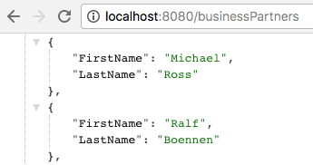
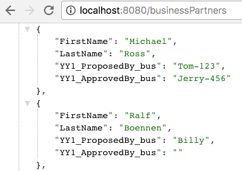
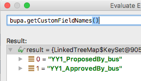
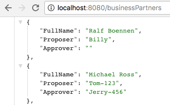
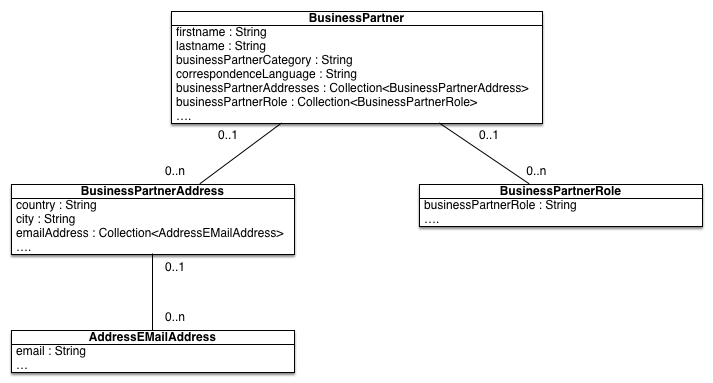
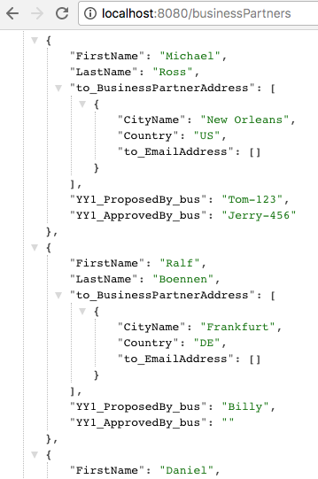

## Prerequisites
 - [Introduce Resilience to Your Application](s4sdk-resilience)
 - [Connect to OData Service on Cloud Foundry Using SAP Cloud SDK](s4sdk-odata-service-cloud-foundry)

## Details

Use advanced features of the [Virtual Data Model for OData](https://sap.github.io/cloud-sdk/docs/java/features/odata/overview).

### You will learn
  - How to use custom field extensions from S/4HANA in the virtual data model for OData
  - How to join connected entities from the virtual data model in eager fashion
  - How to leverage dependency injection to decouple your client code better from the SDK-provided classes
---

[ACCORDION-BEGIN [Step 1: ](Get ready)]

To successfully go through this tutorial, you will use the following `GetBusinessPartnerCommand` for all three features to the business partner API. The call itself requests the first and last name from all business partners who are customers.

This file needs to be put under your `<projectroot>/application/src/main/java/com/sap/cloud/sdk/tutorial` directory.

```Java
package com.sap.cloud.sdk.tutorial;

import com.sap.cloud.sdk.cloudplatform.connectivity.HttpDestination;
import com.sap.cloud.sdk.cloudplatform.resilience.ResilienceConfiguration;
import com.sap.cloud.sdk.cloudplatform.resilience.ResilienceDecorator;
import com.sap.cloud.sdk.cloudplatform.resilience.ResilienceRuntimeException;
import com.sap.cloud.sdk.datamodel.odata.client.exception.ODataException;
import com.sap.cloud.sdk.s4hana.datamodel.odata.namespaces.businesspartner.BusinessPartner;
import com.sap.cloud.sdk.s4hana.datamodel.odata.namespaces.businesspartner.field.BusinessPartnerField;
import com.sap.cloud.sdk.s4hana.datamodel.odata.services.BusinessPartnerService;
import com.sap.cloud.sdk.s4hana.datamodel.odata.services.DefaultBusinessPartnerService;

import java.util.List;

public class GetBusinessPartnersCommand {

    private final BusinessPartnerService businessPartnerService;
    private final HttpDestination httpDestination;

    public GetBusinessPartnersCommand(HttpDestination destination) {
        this(destination, new DefaultBusinessPartnerService());
    }

    public GetBusinessPartnersCommand(HttpDestination httpDestination, BusinessPartnerService businessPartnerService) {
        this.businessPartnerService = businessPartnerService;
        this.httpDestination = httpDestination;
    }

    public List<BusinessPartner> execute() {
        return ResilienceDecorator.executeSupplier(this::run, ResilienceConfiguration.of(GetBusinessPartnersCommand.class));
    }

    private List<BusinessPartner> run() {
        try {
            return businessPartnerService.getAllBusinessPartner()
                    .filter(BusinessPartner.CUSTOMER.ne(""))
                    .select(BusinessPartner.FIRST_NAME,
                            BusinessPartner.LAST_NAME)
                     .executeRequest(httpDestination));

        } catch (ODataException e) {
            throw new ResilienceRuntimeException(e);
        }
    }
}
```

You will be also using the following simple Servlet that consumes our `GetBusinessPartnerCommand`.

This file needs to be put under your `<projectroot>/application/src/main/java/com/sap/cloud/sdk/tutorial` directory:

```Java
package com.sap.cloud.sdk.tutorial;

import com.google.gson.Gson;
import com.sap.cloud.sdk.cloudplatform.connectivity.DestinationAccessor;
import com.sap.cloud.sdk.s4hana.connectivity.DefaultErpHttpDestination;
import com.sap.cloud.sdk.s4hana.connectivity.ErpHttpDestination;
import com.sap.cloud.sdk.s4hana.datamodel.odata.namespaces.businesspartner.BusinessPartner;
import org.slf4j.Logger;
import org.slf4j.LoggerFactory;
import javax.servlet.ServletException;
import javax.servlet.annotation.WebServlet;
import javax.servlet.http.HttpServlet;
import javax.servlet.http.HttpServletRequest;
import javax.servlet.http.HttpServletResponse;
import java.io.IOException;
import java.util.List;

@WebServlet("/businessPartners")
public class BusinessPartnerServlet extends HttpServlet {

    private static final Logger logger = LoggerFactory.getLogger(BusinessPartnerServlet.class);
    private static final String DESTINATION_NAME = "MyErpSystem";

    @Override
    protected void doGet(final HttpServletRequest request, final HttpServletResponse response)
            throws ServletException, IOException {
        try {
            final ErpHttpDestination destination = DestinationAccessor.getDestination(DESTINATION_NAME)
                    .asHttp().decorate(DefaultErpHttpDestination::new);

            final List<BusinessPartner> businessPartners =
                    new GetBusinessPartnersCommand(destination).execute();
            response.setContentType("application/json");
            response.getWriter().write(new Gson().toJson(businessPartners));
        } catch (final Exception e) {
            logger.error(e.getMessage(), e);
            response.setStatus(HttpServletResponse.SC_INTERNAL_SERVER_ERROR);
            response.getWriter().write(e.getMessage());
            e.printStackTrace(response.getWriter());
        }
    }
}

```
When you call this servlet on the server, you can see a result like this:

!

If you have a similar result, you are ready to proceed with this tutorial.


[DONE]
[ACCORDION-END]

[ACCORDION-BEGIN [Step 2: ](Custom field extensibility)]

#### What is custom field extensibility?
Oftentimes, businesses require to enhance the standard data model of the SAP S/4HANA system. Using tools of the so-called In-App Extensibility concept, key users are able to introduce additional fields to certain data structures. As an application provider, this mechanism can be also used to introduce new data fields which are relevant to your application extension.

Either way, you want to be able to consume and work with such custom fields in our application code.

#### How-to
In the example, the business partner data model has been enhanced with two custom fields to record by whom the business partner was originally proposed (field: `YY1_ProposedBy_bus`) and if the business partner was approved after proposal (field: `YY1_ApprovedBy_bus`). This modification is done by the so-called In-App extensibility capability of `SAP S/4HANA` which you can use based on your Fiori Launchpad with an authorized user.

Based on this extension you can check which business partners have to be approved and if they are, you consider them as valid business partners.

Based on these two extended fields, you can now use these two additional fields as part of our projection criteria. As you are only interested in extension fields from the business partner, the API only accepts extension fields typed under `BusinessPartnerField`.

This file needs to be put under your `<projectroot>/application/src/main/java/com/sap/cloud/sdk/tutorial` directory:

```Java
package com.sap.cloud.sdk.tutorial;

import com.sap.cloud.sdk.cloudplatform.connectivity.HttpDestination;
import com.sap.cloud.sdk.cloudplatform.resilience.ResilienceConfiguration;
import com.sap.cloud.sdk.cloudplatform.resilience.ResilienceDecorator;
import com.sap.cloud.sdk.cloudplatform.resilience.ResilienceRuntimeException;
import com.sap.cloud.sdk.datamodel.odata.client.exception.ODataException;
import com.sap.cloud.sdk.s4hana.datamodel.odata.namespaces.businesspartner.BusinessPartner;
import com.sap.cloud.sdk.s4hana.datamodel.odata.namespaces.businesspartner.field.BusinessPartnerField;
import com.sap.cloud.sdk.s4hana.datamodel.odata.services.BusinessPartnerService;
import com.sap.cloud.sdk.s4hana.datamodel.odata.services.DefaultBusinessPartnerService;

import java.util.List;

public class GetBusinessPartnersCommand {

    private final BusinessPartnerService businessPartnerService;
    private final HttpDestination httpDestination;

    public GetBusinessPartnersCommand(HttpDestination destination) {
        this(destination, new DefaultBusinessPartnerService());
    }

    public GetBusinessPartnersCommand(HttpDestination httpDestination, BusinessPartnerService businessPartnerService) {
        this.businessPartnerService = businessPartnerService;
        this.httpDestination = httpDestination;
    }

    public List<BusinessPartner> execute() {
        return ResilienceDecorator.executeSupplier(this::run, ResilienceConfiguration.of(GetBusinessPartnersCommand.class));
    }

    private List<BusinessPartner> run() {
        try {
            return businessPartnerService.getAllBusinessPartner()
                    .filter(BusinessPartner.CUSTOMER.ne(""))
                    .select(BusinessPartner.FIRST_NAME,
                            BusinessPartner.LAST_NAME,
                            new BusinessPartnerField<String>("YY1_ApprovedBy_bus"),
                            new BusinessPartnerField<String>("YY1_ProposedBy_bus"))
                     .executeRequest(httpDestination);

        } catch (ODataException e) {
            throw new ResilienceRuntimeException(e);
        }
    }
}
```

The only two lines added to the initial example are:

- `new BusinessPartnerField<String>("YY1_ApprovedBy_bus")`
- `new BusinessPartnerField<String>("YY1_ProposedBy_bus"))`

After deploying this again, you can now see that custom fields are correctly served:

!

#### Working programmatically with extension fields
Of course, extension fields cannot only be provided as part of GET requests to the API, but you can work programmatically with them. For example, on each object instance you can access which custom fields are defined and get their names leveraging the following methods:

- `entity.getCustomFieldNames();`
- `entity.getCustomFields();`
- `entity.setCustomField();`

##### Example:

!

In order to expose the clients of the application in a nicer representation, you write your own business partner entity called `MyBusinessPartner` that inherits from the provided `BusinessPartner` entity.

Here you map only some fields of the business partner entity into better readable names.

This file needs to be put under your `<projectroot>/application/src/main/java/com/sap/cloud/sdk/tutorial` directory:

```Java
package com.sap.cloud.sdk.tutorial;
import com.google.gson.annotations.SerializedName;
import com.sap.cloud.sdk.s4hana.datamodel.odata.namespaces.businesspartner.BusinessPartner;

public class MyBusinessPartner extends BusinessPartner {

    @SerializedName("FullName")
    private String fullName;

    @SerializedName("Proposer")
    private String proposedBy;

    @SerializedName("Approver")
    private String approvedBy;

    public MyBusinessPartner(final BusinessPartner businessPartner) {
        this.fullName = businessPartner.getFirstName()+" "+businessPartner.getLastName();
        this.proposedBy = businessPartner.getCustomField("YY1_ProposedBy_bus");
        this.approvedBy = businessPartner.getCustomField("YY1_ApprovedBy_bus");
    }
}

```
In our servlet, you need to adapt the logic a bit to wrap and unwrap the original business partner into our own business partner entity.

The file needs to be put under your `<projectroot>/application/src/main/java/com/sap/cloud/sdk/tutorial` directory:

```Java
package com.sap.cloud.sdk.tutorial;

import com.google.gson.Gson;
import com.sap.cloud.sdk.cloudplatform.connectivity.DestinationAccessor;
import com.sap.cloud.sdk.s4hana.connectivity.DefaultErpHttpDestination;
import com.sap.cloud.sdk.s4hana.connectivity.ErpHttpDestination;
import com.sap.cloud.sdk.s4hana.datamodel.odata.namespaces.businesspartner.BusinessPartner;
import org.slf4j.Logger;
import org.slf4j.LoggerFactory;
import javax.servlet.ServletException;
import javax.servlet.annotation.WebServlet;
import javax.servlet.http.HttpServlet;
import javax.servlet.http.HttpServletRequest;
import javax.servlet.http.HttpServletResponse;
import java.io.IOException;
import java.util.List;

@WebServlet("/businessPartners")
public class BusinessPartnerServlet extends HttpServlet {

    private static final Logger logger = LoggerFactory.getLogger(BusinessPartnerServlet.class);
    private static final String DESTINATION_NAME = "MyErpSystem";

    @Override
    protected void doGet(final HttpServletRequest request, final HttpServletResponse response)
            throws ServletException, IOException {
        try {
            final ErpHttpDestination destination = DestinationAccessor.getDestination(DESTINATION_NAME)
                    .asHttp().decorate(DefaultErpHttpDestination::new);

            final List<BusinessPartner> myBusinessPartners =
                    new GetBusinessPartnersCommand(destination).execute();
            response.setContentType("application/json");
            response.getWriter().write(new Gson().toJson(myBusinessPartners));
        } catch (final Exception e) {
            logger.error(e.getMessage(), e);
            response.setStatus(HttpServletResponse.SC_INTERNAL_SERVER_ERROR);
            response.getWriter().write(e.getMessage());
            e.printStackTrace(response.getWriter());
        }
    }
}

```

As a result, you can now expose our new `MyBusinessPartner` entity via our initial servlet which should lead to the following result:

!

[DONE]
[ACCORDION-END]

[ACCORDION-BEGIN [Step 3: ](Type-safe and eager expand)]

#### What is type-safe and eager expand?
So far, you have been working with the `BusinessPartner` entity only. However, this is merely the root entity of a more complex data model. For example, each `BusinessPartner` can be associated with zero-to-many `BusinessPartnerAddresses` which again can be associated with zero-to-many `BusinessPartnerEMailAddresses`. Another popular association in an ERP context are header-item relationships such as an invoice header and invoice line items.

!

One possibility is to consider a lazy fetch of connected entities only using the `fetchXY()` methods that every instance exposes. In the case of your business partner, you could fetch the associated addresses with the following line of code:

```Java
List<BusinessPartnerAddress> addresses = businessPartner.fetchBusinessPartnerAddress();
```

This can be a beneficial approach in cases where the entities contain large data volumes and the interaction with the data allows for a step-by-step resolution of the model (e.g., lazily loading entities for the UI).

However, if you want to get addresses of many business partners, this approach leads to significant performance issues as each method call corresponds to one remote function call to the S/4HANA APIs. Furthermore, the lazy fetch also gets all fields from the connected entity per default, however, sometimes you may want to select only certain fields.

In such cases, you rather prefer to resolve the association already eagerly upon the first API call. In `OData` language, this is called an expand on navigational properties, in SQL speak this refers to a left outer join between parent and child tables.

#### How-to
In the example below, you present an example that expands for every business partner its corresponding list of addressed, followed by a partial projection on the `City` and `Country` properties of the associated `BusinessPartnerAddress` entity, followed by another expand to the `AddressEMailAddress` entity where you project on the `EMail_Address` property only.

The file needs to be put under your `<projectroot>/application/src/main/java/com/sap/cloud/sdk/tutorial` directory:

```Java
package com.sap.cloud.sdk.tutorial;

import com.sap.cloud.sdk.cloudplatform.connectivity.HttpDestination;
import com.sap.cloud.sdk.cloudplatform.resilience.ResilienceConfiguration;
import com.sap.cloud.sdk.cloudplatform.resilience.ResilienceDecorator;
import com.sap.cloud.sdk.cloudplatform.resilience.ResilienceRuntimeException;
import com.sap.cloud.sdk.datamodel.odata.client.exception.ODataException;
import com.sap.cloud.sdk.s4hana.datamodel.odata.namespaces.businesspartner.BusinessPartner;
import com.sap.cloud.sdk.s4hana.datamodel.odata.namespaces.businesspartner.field.BusinessPartnerField;
import com.sap.cloud.sdk.s4hana.datamodel.odata.services.BusinessPartnerService;
import com.sap.cloud.sdk.s4hana.datamodel.odata.services.DefaultBusinessPartnerService;

import java.util.List;

public class GetBusinessPartnersCommand {

    private final BusinessPartnerService businessPartnerService;
    private final HttpDestination httpDestination;

    public GetBusinessPartnersCommand(HttpDestination destination) {
        this(destination, new DefaultBusinessPartnerService());
    }

    public GetBusinessPartnersCommand(HttpDestination httpDestination, BusinessPartnerService businessPartnerService) {
        this.businessPartnerService = businessPartnerService;
        this.httpDestination = httpDestination;
    }

    public List<BusinessPartner> execute() {
        return ResilienceDecorator.executeSupplier(this::run, ResilienceConfiguration.of(GetBusinessPartnersCommand.class));
    }

    private List<BusinessPartner> run() {
        try {
            return businessPartnerService.getAllBusinessPartner()
                    .filter(BusinessPartner.CUSTOMER.ne(""))
                    .select(BusinessPartner.FIRST_NAME,
                            BusinessPartner.LAST_NAME,
                            new BusinessPartnerField<String>("YY1_ApprovedBy_bus"),
                            new BusinessPartnerField<String>("YY1_ProposedBy_bus"))
                            BusinessPartner.TO_BUSINESS_PARTNER_ADDRESS
                                        .select(
                                                BusinessPartnerAddress.CITY_NAME,
                                                BusinessPartnerAddress.COUNTRY,
                                                BusinessPartnerAddress.TO_EMAIL_ADDRESS
                                                    .select(
                                                            AddressEmailAddress.EMAIL_ADDRESS
                                                    )
                                                )
                        )
                     .executeRequest(httpDestination);
        } catch (ODataException e) {
            throw new ResilienceRuntimeException(e);
        }
    }
}
```

Without further modifications, this will immediately yield the following serialization result to our client (hint: again assume to use the original `BusinessPartner` entity being serialized to the client, not the `MyBusinessPartner` entity)

!

Readers who are familiar with the `OData` query language might wonder about the missing expand() syntax. In the `OData` query language, expand and select are two independent keywords.

In the `OData` VDM for Java, we have decided to combine both methods with each other to keep up the type-safety principle. Unfortunately, the type-system of Java is not powerful enough to preserve the type information from an explicit expand() statement to an underlying select() statement. The proposed solution of using a fluent select API over connected entities is better suited for a clean and safe Java API.

#### Working with expanded entities
After you did a successful API call, you may want to work with the associated entity collections. For this purpose, the VDM provides two important methods on each entity instance that can be used for retrieval:

First, the `getOrFetch() method:`

```Java
 List<BusinessPartnerAddress> businessPartnerAddresses = businessPartner.getBusinessPartnerAddressOrFetch();
 ```

 This method either returns the list of connected entities, if previously eagerly fetched or will lazily fetch the entities, if not. Therefore, this method guarantees to not return any null values but might break due to a thrown `ODataException`, in case a lazy fetch is initiated due to missing authorizations, timeouts or system unavailability.

Secondly, a `getOrNull()` method

```Java
Optional<List<BusinessPartnerAddress>> businessPartnerAddresses =
                businessPartner.getBusinessPartnerAddressOrNull();
```

This method returns an Optional of the return type signifying that the connected entity might be null as no lazy fetch is initiated. Therefore, this method guarantees to do no lazy fetch but cannot guarantee to return a value. As a consequence, this method also does not throw any `ODataException`.

[DONE]
[ACCORDION-END]


[ACCORDION-BEGIN [Step 4: ](Dependency injection)]

#### What is dependency injection?
With SAP Cloud SDK version 3.11.0, it has also introduced the possibility to use dependency injection with the virtual data model for OData and BAPI. In a nutshell, dependency injection is a major object-oriented inversion of control principle that allows to decouple the call direction from the initialization direction. This leads to less coupled dependencies which are easier to maintain, for example, if a dependency changes, the client does not need to be touched.

Sounds complicated? Nope, it is really a 25-dollar term for a 5-cent concept, however, it makes your code cleaner and less dependent on the actual implementation.

#### How-to
So far, you have initialized the business partner service directly from our servlet like this
```Java
BusinessPartnerService businessPartnerService = new DefaultBusinessPartnerService();
```

This unnecessarily exposes implementation details to the client code. Instead, in our client code we just want to declare which kind of interface we would like to consume and get the corresponding implementation "injected" from the outside during runtime to achieve a higher degree of decoupling.

To do this, you can rewrite our initial servlet with the `@Inject` annotation like this

The file needs to be put under your `<projectroot>/application/src/main/java/com/sap/cloud/sdk/tutorial` directory:

```Java
package com.sap.cloud.sdk.tutorial;

import com.google.gson.Gson;
import com.sap.cloud.sdk.cloudplatform.connectivity.DestinationAccessor;
import com.sap.cloud.sdk.s4hana.connectivity.DefaultErpHttpDestination;
import com.sap.cloud.sdk.s4hana.connectivity.ErpHttpDestination;
import com.sap.cloud.sdk.s4hana.datamodel.odata.namespaces.businesspartner.BusinessPartner;
import com.sap.cloud.sdk.s4hana.datamodel.odata.services.BusinessPartnerService;
import org.jboss.arquillian.core.api.annotation.Inject;
import org.slf4j.Logger;
import org.slf4j.LoggerFactory;

import javax.servlet.ServletException;
import javax.servlet.annotation.WebServlet;
import javax.servlet.http.HttpServlet;
import javax.servlet.http.HttpServletRequest;
import javax.servlet.http.HttpServletResponse;
import java.io.IOException;
import java.util.List;

@WebServlet("/businessPartners")
public class BusinessPartnerServlet extends HttpServlet {

    private static final Logger logger = LoggerFactory.getLogger(BusinessPartnerServlet.class);
    private static final String DESTINATION_NAME = "MyErpSystem";

    @Inject
    private BusinessPartnerService businessPartnerService;

    protected void doGet(final HttpServletRequest request, final HttpServletResponse response)
            throws ServletException, IOException {
        try {
            final ErpHttpDestination destination = DestinationAccessor.getDestination(DESTINATION_NAME)
                    .asHttp().decorate(DefaultErpHttpDestination::new);

            final List<BusinessPartner> businessPartnerList =
                    new GetBusinessPartnersCommand(destination).execute();
            response.setContentType("application/json");
            response.getWriter().write(new Gson().toJson(businessPartnerList));
        } catch (final Exception e) {
            logger.error(e.getMessage(), e);
            response.setStatus(HttpServletResponse.SC_INTERNAL_SERVER_ERROR);
            response.getWriter().write(e.getMessage());
            e.printStackTrace(response.getWriter());
        }
    }
}

```
That's it. The only thing you really did is get rid of the `new DefaultBusinessPartnerService()` term. Therefore, in the future whenever the implementing service changes (its name, its package, its module, etc.) your client code will not be affected and is therefore less prone to changes.

> **HINT:** When writing integration tests as learned in previous tutorials and you require dependency injection from your application code, please make sure that the implementing class is part of the minimal assembly. In other words, don't forget to add the class to the `TestUtil` deployment creator.

[DONE]
[ACCORDION-END]

[ACCORDION-BEGIN [Step 5: ](Test yourself)]

In this tutorial, you learned how to leverage the latest capabilities of the Virtual Data Model for `OData` using the `SAP Cloud SDK`. This includes using custom fields from `SAP S/4HANA` within your logic, leveraging type-safe expand for GET requests and relying on dependency injection to supply the service implementations. This gives you even greater capabilities and lets you integrate with `SAP S/4HANA` even faster and easier.

[VALIDATE_1]

[ACCORDION-END]


---
