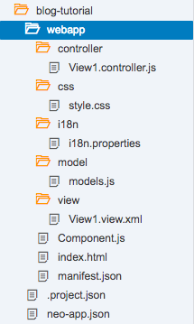
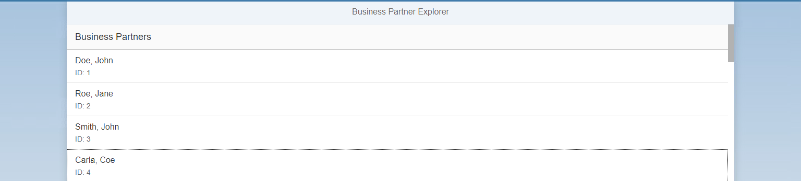
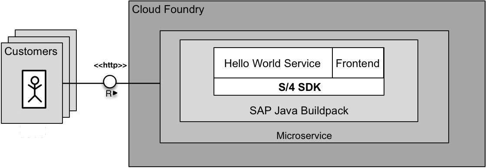
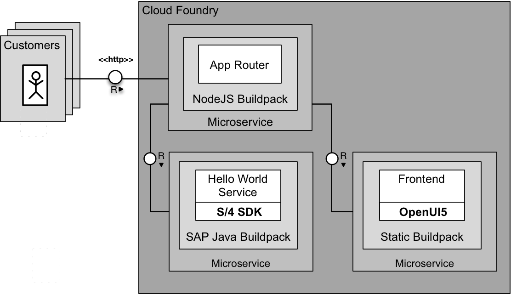
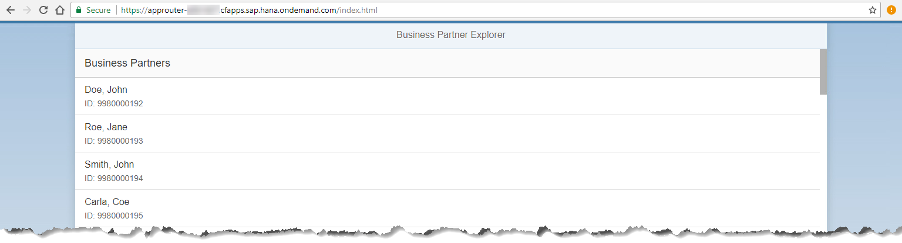

## Prerequisites
 - [Connect to OData Service on Cloud Foundry Using SAP Cloud SDK](https://developers.sap.com/tutorials/s4sdk-odata-service-cloud-foundry.html)
 - [Connect to OData Service on Neo using SAP Cloud SDK](https://developers.sap.com/tutorials/s4sdk-odata-service-neo.html).


## Details
### You will learn
  - How to create a new SAPUI5 project using the template
  - How to use SAPUI5 controls to create the
  - How to consume the REST service
  - How to deploy the application to Cloud Foundry
    - Using a monolithic approach
    - Using a micro service approach

The resulting application will show a list of business partners from the ERP that is connected to the backend.

---

[ACCORDION-BEGIN [Step 1: ](Create a new SAPUI5 Project Using the Template)]
The easiest way to start developing a SAPUI5 application is to utilize the project templates of the `WebIDE` (https://www.sap.com/developer/topics/sap-webide.html). To access it, you need to create an account on SAP Cloud Platform as described in **Tutorial** [Create a Sample Application on SCP Neo Using SAP Cloud SDK](https://developers.sap.com/tutorials/s4sdk-scp-neo-sample-application.html). After creating an account, you can activate and go to the `WebIDE` from the services tab. To create a new template-based project, select `File` > `New` > `Project from Template` and select SAPUI5 Application and create a new project using the wizard. For the purposes of the tutorial, all the default settings are fine. In the following code snippets, we will assume that the project was named sdk-tutorial-frontend. If you copy the code and have used a different project name, make sure to replace `sdk-tutorial-frontend` with the project name you have chosen during the wizard.

The project will automatically have the following structure:




The `webapp` folder contains the actual application which follows the **Model View Controller** pattern and therefore is split into the `View1.view.xml`, `models.js`, and `View1.controller.js`. Also, there is a separate style.css file, which can be used to customize the look of your app (by default all controls will be Fiori compliant). Finally, there is the i18n.properties file. I18n stands for internationalization and the file itself will serve as a base for translation of your app. For the sake of simplicity, we will not use i18n to define the UI texts in this tutorial. You can read more about it in the [SAPUI5 documentation](https://sapui5.hana.ondemand.com/#/topic/df86bfbeab0645e5b764ffa488ed57dc).

The other files contain configuration or are responsible for loading and initializing SAPUI5. Before touching the actual app, it is recommended to update the index.html to fetch the SAPUI5 sources from the official CDN. To do that, you need to change it in the script tag in line 11 as follows:

```
<script id="sap-ui-bootstrap"
	src="https://sapui5.hana.ondemand.com/resources/sap-ui-core.js"
	data-sap-ui-libs="sap.m"
	data-sap-ui-theme="sap_belize"
	data-sap-ui-compatVersion="edge"
	data-sap-ui-resourceroots='{"sdk-tutorial-frontend": ""}'>
</script>
```

You can use this link to the latest stable version of SAPUI5 for the tutorial or for testing purposes, but avoid it for productive use. In an actual app, you always should specify an SAPUI5 version explicitly.


[DONE]
[ACCORDION-END]

[ACCORDION-BEGIN [Step 2: ](How to use SAPUI5 Controls to Create the View)]
When opening the view, the `WebIDE` gives 2 options, the layout editor, and the code editor. The code editor is the more powerful tool which gives you the ability to change your code directly, while the layout editor shows you a visual editor, providing an approximated preview of your changes, and uses drag and drop of a control catalog to edit your view. You can use either editor to follow this tutorial, but we will show the actual code as you would see in the code editor since it is easier to compare and avoid mistakes this way.

To get an overview of what controls SAPUI5 provides, you can use the [SAPUI5 Explored](https://sapui5.hana.ondemand.com/explored.html) website to see a searchable list with interactive examples.

For our app, we want to display a list of business partners, so a quick search in Explored suggests that we should use sap.m.List control. Controls are organized in libraries and in the beginning, you will mostly use controls from `sap.m` and `sap.ui.core`. These controls are by default responsive and will adjust to fit the device that displays the website.

When you open the View1.view.xml, it will already contain the basic structure needed for a SAPUI5 application. In the following code, you only need to copy the List tag and the `StandardListItem` and put it between the content tag in your own `View1.view.xml`.

This will already create the list we want to display, but of course, there is no data loaded yet. This will be explained in the next part.

```
<mvc:View controllerName="sdk-tutorial-frontend.controller.View1"
          xmlns:html="http://www.w3.org/1999/xhtml" xmlns:mvc="sap.ui.core.mvc"
          displayBlock="true" xmlns="sap.m">
    <App>
        <pages>
            <Page title="Business Partner Explorer">
                <content>
                    <!-- Add this between the content tags -->
                    <List headerText="Business Partners"
                          items="{businessPartner>/}">
                        <StandardListItem
                                title="{businessPartner>LastName}, {businessPartner>FirstName}"
                                description="ID: {businessPartner>BusinessPartner}"/>
                    </List>
                </content>
            </Page>
        </pages>
    </App>
</mvc:View>
```


[DONE]
[ACCORDION-END]


[ACCORDION-BEGIN [Step 3: ](Consuming the REST Service)]
In the previous steps of this tutorial series, we already created a REST Service that requests and returns a list of business partners from SAP S/4HANA. To call this service and connect its data to our list, we use jQuery and SAPUI5's `JSONModel`.

This business logic will be implemented as part of the controller. As with the view, the template already provides some basic structure.

To add the functionality, we need to use `jQuery.get()` to retrieve the data. Because of the asynchronous nature of the call, we need to use the done callback to put the data in a `JSONModel` and connect it with the view. Additionally, we need to include the `JSONModel` by adding it as the first parameter of the `sap.ui.define()` function. You can also add jQuery there, but SAPUI5 already guarantees that jQuery is included everywhere. Adapt the controller `View1.controller.js` as follows.

```
sap.ui.define([
    "sap/ui/core/mvc/Controller",
    "sap/ui/model/json/JSONModel"
], function(Controller, JSONModel) {
    "use strict";
    return Controller.extend("sdk-tutorial-frontend.controller.View1", {
        onInit: function () {
            var view = this.getView();

            jQuery.get("/businesspartners")
                .done(function (data) {
                    var model = new JSONModel(data);
                    view.setModel(model, "businessPartner");
                });
        }
    });
});
```

Now, this simple app is already completed. To try it out, we can use the `WebIDE`s deployment or follow the rest of the tutorial to deploy the app on Cloud Foundry. To use the `WebIDE` deployment, just right-click the project folder on the left and select `Run` > `Run As` > `Web Application`. If we use this method, it will not be connected to our REST Service as they are in different environments that can not communicate. Instead of looking at an empty list, we can replace the .`done()` callback with the code below which uses dummy data so you can verify the functionality of the app without a backend. Just make sure to revert this change once you deploy on Cloud Foundry.

```
sap.ui.define([
    "sap/ui/core/mvc/Controller",
    "sap/ui/model/json/JSONModel"
], function(Controller, JSONModel) {
    "use strict";
    return Controller.extend("sdk-tutorial-frontend.controller.View1", {
        onInit: function () {
            var view = this.getView();

            jQuery.get("/businesspartners")
                .always(function () {
                    var data = [{
                        "BusinessPartner": "1",
                        "FirstName": "John",
                        "LastName": "Doe"
                    }, {
                        "BusinessPartner": "2",
                        "FirstName": "Jane",
                        "LastName": "Roe"
                    }, {
                        "BusinessPartner": "3",
                        "FirstName": "John",
                        "LastName": "Smith"
                    }, {
                        "BusinessPartner": "4",
                        "FirstName": "Carla",
                        "LastName": "Coe"
                    }];
                    var model = new JSONModel(data);
                    view.setModel(model, "businessPartner");
                });
        }
    });
});
```

After you implemented these steps, the application should look like this:



Make sure to replace the .`always()` callback with .`done()`  from the previous snippet once you deploy on Cloud Foundry. Afterwards, download the project files by right-clicking the project and selecting `Export`. It will download a .zip archive, that can be easily extracted.


[DONE]
[ACCORDION-END]

[ACCORDION-BEGIN [Step 4: ](Deploy the Application to Cloud Foundry)]
In the following, we want to explore how to deploy a full web application that uses data provided by our service. We will show both the **Monolithic** approach as well as a more **Micro Service** oriented architecture.

Using the SAP Cloud Platform Cloud Foundry for your deployment gives several benefits. One of these benefits is the flexibility to structure the project as a monolith or split it into several micro services. In previous blog posts, we already showed how to develop and deploy an API service to Cloud Foundry as well as Neo.

[OPTION BEGIN [Monolith]]
### Deploy the Application to Cloud Foundry Using a Simple Monolith Approach

Deploying the whole application including `backend` and `frontend` in a monolithic approach can be very easy. In order to have a better understanding of our final goal look at the picture:



We utilize the same server to serve both the service URL´s as well as the `frontend` files. To do this we extract the downloaded archive and copy theses files to the `webapps` folder of the `backend`.

```
cd <PATH_TO_DOWNLOADED_ZIP>
unzip ui5-webapp.zip
cp -a ui5-webapp/webapp/* /path/to/java/application/application/src/main/webapp/
```

To deploy the application to Cloud Foundry , a proper manifest.yml is needed, as well as other configuration outlined in [Connect to OData Service on Cloud Foundry Using SAP Cloud SDK](https://developers.sap.com/tutorials/s4sdk-odata-service-cloud-foundry.html).

Finally, we build the application and deploy to Cloud Foundry:

```
mvn clean install
cf push
```

If your deployment was successful, the Cloud Foundry CLI will show you information about the deployment, that looks like the following snippet.

```
requested state: started
instances: 1/1
usage: 512M x 1 instances
urls: firstapp-USERNAME.cfapps.sap.hana.ondemand.com
last uploaded: Fri Jul 28 12:00:36 UTC 2017
stack: cflinuxfs2
buildpack: sap_java_buildpack
```

To verify that the deployment was successful, you can enter the URL in your browser and see the application showing the list of business partners.

This approach allows for a quick initial deployment and a simple deployment process. For small applications like this business partner explorer, this approach will be preferable, but as the application grows and needs to scale it will get progressively harder and more expensive. `Frontend` and `backend` cannot be decoupled and scaled individually, also to make changes to either you need to deploy both which will result in more downtime unless you use blue green deployments.

[OPTION END]

[OPTION BEGIN [Micro Service]]
### Deploy the Application to Cloud Foundry Micro Service Approach
**Prerequisites**
  - **Tutorial:** [Secure Your Application on SAP Cloud Platform Cloud Foundry](https://developers.sap.com/tutorials/s4sdk-secure-cloudfoundry.html)

We assume that you know what the Approuter is for and know the basics of how to configure it.

The micro service approach decouples the separate components and allows scaling them individually. To do this separation, we need to run the `frontend` in its own container.  We deploy the `frontend` application completely separate in its own container. For that, we use the `staticfile_buildpack` which is provided by default in Cloud Foundry. In the following, we will show how this can be done.

As in the monolithic approach, here is a picture of our final setup:



As the `frontend` will be its own service now, it should be in a separate folder from the backend (instead of being part of the `backend` as with the monolithic approach). Once you moved the code to a separate folder, you need to add a `manifest.yml` as it will need a different Cloud Foundry configuration than the `backend` now.

Like in the monolithic step we start with unpacking the downloaded zip.

```
cd <PATH_TO_DOWNLOADED_ZIP>
unzip ui5-webapp.zip
cd ~
mkdir firstapp-frontend

cd firstapp-frontend
cp -a <PATH_TO_DOWNLOADED_ZIP>ui5-webapp/webapp/* .
```

Now create here a new manifest.yml with the following content:

```
---
applications:
- name: firstapp-frontend
  memory: 64M
  host: firstapp-frontend-USERNAME
  buildpack: staticfile_buildpack
```

Push the `frontend`  to Cloud Foundry:

```
cf push
```

When you point your browser to **`firstapp-frontend-USERNAME.cfapps.sap.hana.ondemand.com`** you should see the application running but without data. To connect the `frontend` to our previous deployed `backend` we need a proper configured approuter.

Install the AppRouter like in **Tutorial:** [Secure Your Application on SAP Cloud Platform Cloud Foundry](https://developers.sap.com/tutorials/s4sdk-secure-cloudfoundry.html) or just reuse your existing installation.

As for all application that you want to deploy on Cloud Foundry, we need a `manifest` file. You also need to add two routes to the AppRouter. The achieve this, adjust the `manifest.yml` and `xs-app.json` of the AppRouter. Make sure that the destination names and URLs match your own deployment. The name for the destinations is arbitrary. You can choose them on your own. We will use them in the next step to point our wished URL to the actual one.

```
---
applications:
- name: approuter
  host: approuter-p1942765239trial
  memory: 128M
  path: approuter
  buildpack: nodejs_buildpack
  env:
    TENANT_HOST_PATTERN: 'approuter-(.*).cfapps.sap.hana.ondemand.com'
    destinations: '[
        {
          "name":"business-partner-api",
          "url" :"https://firstapp-USERNAME.cfapps.sap.hana.ondemand.com/",
          "forwardAuthToken": true
        }, {
          "name":"business-partner-frontend",
          "url" :"https://firstapp-frontend-USERNAME.cfapps.sap.hana.ondemand.com/"
        }
      ]'
  services:
  - my-xsuaa
```

Within the `xs-app.json` we configure which URL path shall be handled and resolves to what destination. For instance: url.to.router/**`businesspartners`** resolves to `url.in.CF/businesspartners`. If you want to know more on that go back to **Tutorial:** [Secure Your Application on SAP Cloud Platform Cloud Foundry](https://developers.sap.com/tutorials/s4sdk-secure-cloudfoundry.html) and read there.

```
{
  "welcomeFile": "index.html",
  "routes": [{
    "source": "^/businesspartners",
    "destination": "business-partner-api"
  },
  {
    "source": "/",
    "destination": "business-partner-frontend"
  }]
}
```

Finally, just run the Cloud Foundry CLI to deploy the AppRouter, the `backend`, and the `frontend`.

```
cd approuter/
cf push
cd ../firstapp-frontend
cf push
```

After you deployed all 3 components, the application should be available just like before.

Since we did not touch the deployed `backend` from the monolithic step it should run right away. You can safely remove the `frontend` code from the `webapps` folder in the backend and redeploy.

To summarize, the micro service approach allows you to independently develop, deploy and scale the applications but also introduced operational complexity. A monolithic approach has lower operational complexity and is faster to setup initially but can run into scaling issues later. To choose the right way for you, you will have to evaluate the size and scope of your project and how the different approaches will help you achieve your goal.



[OPTION END]

[DONE]
[ACCORDION-END]

[ACCORDION-BEGIN [Appendix: ](Test yourself)]

[VALIDATE_1]

[ACCORDION-END]

---
