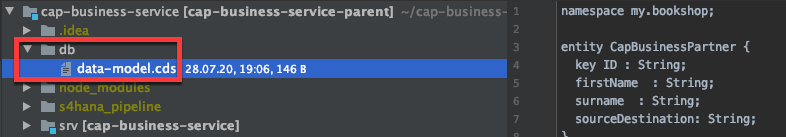
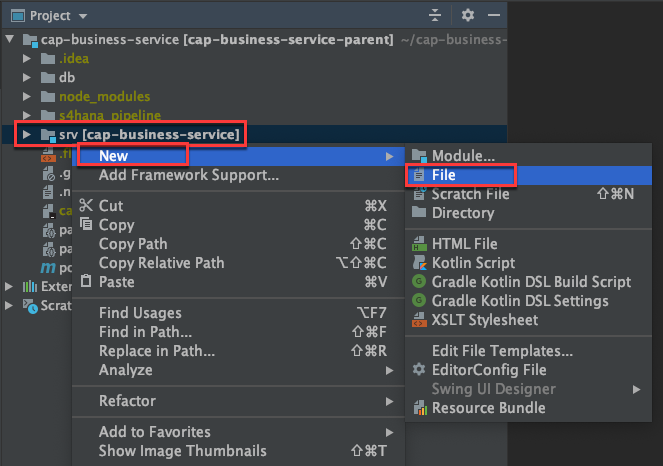
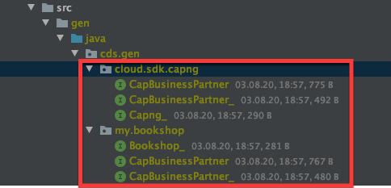
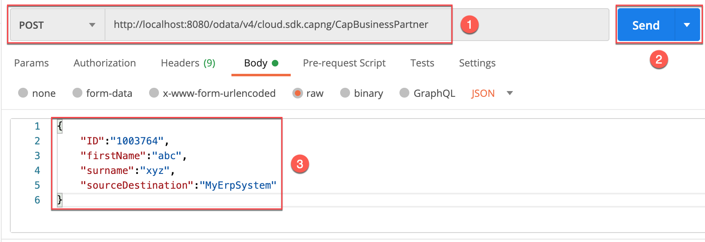
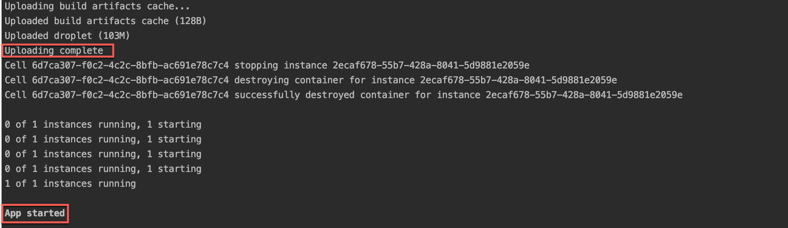
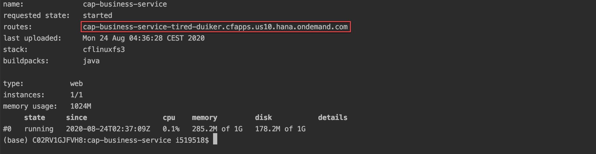

## Prerequisites
 - SAP Cloud Application Programming Model
 - Basic knowledge of Spring Boot and Java (optional)
 - An account on [Cloud Foundry](group.scp-1-get-ready)

## Details
### You will learn
  - How to integrate the  SAP Cloud SDK into the SAP Cloud Application Programming Model
  - How to write a custom event handler for CAP Java
  - How to deploy an application to SAP Cloud Platform Cloud Foundry
  - How to create service that reads/writes business partners from S/4HANA and exposes them as SAP Cloud Application Programming Model

[SAP Cloud Application Programming Model](https://cap.cloud.sap/docs/) enables you to quickly create business applications by allowing you to focus on your business domain. It offers a consistent end-to-end programming model for full-stack development on SAP Cloud Platform.

However, this raises the question how this interacts and integrates with other SAP frameworks that SAP has introduced over the past year such as the [SAP Cloud SDK](https://sap.github.io/cloud-sdk/).

In particular, you will learn how to integrate the SAP Cloud SDK into the SAP Cloud Application Programming Model. And how the SAP Cloud SDK allows you to develop, extend and communicate with other SAP solutions.

> Also check out the full documentation on [how the Cloud SDK integrates with CAP](https://sap.github.io/cloud-sdk/docs/java/guides/cap-sdk-integration).

---

[ACCORDION-BEGIN [Step 1: ](Create SAP Cloud Application Programming Model project)]

For local development, you need to do the following:

1. Install Node.js from <https://nodejs.org> (use the latest LTS release).

2. Install the `cds` development kit globally:

    ```Shell
    npm i -g @sap/cds-dk
    ```

3. Now, run:

    ```Shell/Bash
    mvn archetype:generate -DarchetypeArtifactId=cds-services-archetype -DarchetypeGroupId=com.sap.cds -DarchetypeVersion=RELEASE \
    -DartifactId=cap-business-service -DgroupId=org.your.org.cap.test
    ```    

    This will initialise the application using the [maven archetype](http://maven.apache.org/guides/introduction/introduction-to-archetypes.html) `cds-services-archetype` and create your project as follows:

    - The project is named `cap-business-service`.
    - The `db` folder stores database-related artifacts.
    - The `srv` folder stores your Java application.

      !

Find more information about the SAP Cloud Application Programming Model in its [documentation](https://cap.cloud.sap/docs/get-started/).

[DONE]
[ACCORDION-END]

[ACCORDION-BEGIN [Step 2: ](Define a data model)]

CAP applications use [Core Data Services](https://cap.cloud.sap/docs/cds/) (CDS) to describe:

- Data structures by using [entity definitions](https://cap.cloud.sap/docs/cds/cdl#entity-and-type-definitions)
- How data structures are consumed by using [service definitions](https://cap.cloud.sap/docs/cds/cdl#services)

In this step, you'll define a data model, which defines the entity.

1. Right-click on the `db` folder and choose **New File**.

    !

2. Call it `datamodel.cds` and click **OK** to create the file.

3. Add the following service definition to the file.

    ```CDS
    namespace my.bookshop;

    entity CapBusinessPartner {
      key ID : String;
      firstName  : String;
      surname  : String;
      sourceDestination: String;
    }
    ```

[DONE]
[ACCORDION-END]


[ACCORDION-BEGIN [Step 3: ](Define a service)]

In this step, you'll define a simple service, which exposes a projection on the entity defined in the data model.

1. Right-click the `srv` folder and choose **New File**.

    !

2. Call the file `cat-service.cds` and click **OK**.

3. Add the following service definition to the `cat-service.cds`:

    ```CDS
    using my.bookshop as my from '../db/datamodel';

    service cloud.sdk.capng {
         entity CapBusinessPartner as projection on my.CapBusinessPartner;
    }
    ```

4. Run the following command in the terminal to trigger the maven build process:

    ```Shell
    mvn clean install
    ```

In your project directory, the data model has auto-generated the classes.

!

[DONE]
[ACCORDION-END]


[ACCORDION-BEGIN [Step 4: ](Integrate SAP Cloud SDK)]

For integrating the SAP Cloud SDK in SAP Cloud Application Programming Model, you need to add the following dependency in your parent POM, which you find in the root directory of your project:

```XML
<dependencyManagement>
    <dependencies>
        <dependency>
            <groupId>com.sap.cloud.sdk</groupId>
            <artifactId>sdk-bom</artifactId>
            <version>use-latest-version-here</version>
            <type>pom</type>
            <scope>import</scope>
        </dependency>
    </dependencies>        
</dependencyManagement>
```

>Please make sure to always use the latest version available on Maven Central. Check out the [release notes](https://sap.github.io/cloud-sdk/docs/java/release-notes-sap-cloud-sdk-for-java/).

Since your application is running on SAP Cloud Platform Cloud Foundry, include the following dependencies to your `pom.xml` in the `srv` directory:

```XML
<dependency>
    <groupId>com.sap.cloud.sdk.cloudplatform</groupId>
    <artifactId>scp-cf</artifactId>
</dependency>

<dependency>
    <groupId>com.sap.cloud.sdk.s4hana</groupId>
    <artifactId>s4hana-all</artifactId>
</dependency>

<dependency>
  <groupId>com.sap.cds</groupId>
  <artifactId>cds-integration-cloud-sdk</artifactId>
</dependency>
```

For more information, visit the documentation of the [SAP Cloud SDK](https://sap.github.io/cloud-sdk/docs/java/getting-started/#integrate-the-cloud-sdk-for-java-into-your-project).

[DONE]
[ACCORDION-END]


[ACCORDION-BEGIN [Step 5: ](Create Java class for event handler)]

1. Create a new Java class `BusinessPartnerReadListener` with the following content:

```Java[7-21,23-31]
@Component
@ServiceName("cloud.sdk.capng")
public class BusinessPartnerReadListener implements EventHandler {

    private final HttpDestination httpDestination = DestinationAccessor.getDestination("MyErpSystem").asHttp();

    @On(event = CdsService.EVENT_READ, entity = "cloud.sdk.capng.CapBusinessPartner")
    public void onRead(CdsReadEventContext context) throws ODataException {

        final Map<Object, Map<String, Object>> result = new HashMap<>();
        final List<BusinessPartner> businessPartners =
                new DefaultBusinessPartnerService().getAllBusinessPartner().top(10).execute(httpDestination);

        final List<CapBusinessPartner> capBusinessPartners =
                convertS4BusinessPartnersToCapBusinessPartners(businessPartners, "MyErpSystem");
        capBusinessPartners.forEach(capBusinessPartner -> {
            result.put(capBusinessPartner.getId(), capBusinessPartner);
        });

        context.setResult(result.values());
    }

    @On(event = CdsService.EVENT_CREATE, entity = "cloud.sdk.capng.CapBusinessPartner")
    public void onCreate(CdsCreateEventContext context) throws ODataException {
        final BusinessPartnerService service = new DefaultBusinessPartnerService();

        Map<String, Object> m = context.getCqn().entries().get(0);
        BusinessPartner bp = BusinessPartner.builder().firstName(m.get("firstName").toString()).lastName(m.get("surname").toString()).businessPartner(m.get("ID").toString()).build();

        service.createBusinessPartner(bp).execute(httpDestination);
    }

    private List<CapBusinessPartner> convertS4BusinessPartnersToCapBusinessPartners(
            final List<BusinessPartner> s4BusinessPartners,
            final String destinationName) {
        final List<CapBusinessPartner> capBusinessPartners = new ArrayList<>();

        for (final BusinessPartner s4BusinessPartner : s4BusinessPartners) {
            final CapBusinessPartner capBusinessPartner = com.sap.cds.Struct.create(CapBusinessPartner.class);

            capBusinessPartner.setFirstName(s4BusinessPartner.getFirstName());
            capBusinessPartner.setSurname(s4BusinessPartner.getLastName());
            capBusinessPartner.setId(s4BusinessPartner.getBusinessPartner());
            capBusinessPartner.setSourceDestination(destinationName);

            capBusinessPartners.add(capBusinessPartner);
        }

        return capBusinessPartners;
    }
}
```

[CDS Query Notation](https://cap.cloud.sap/docs/cds/cqn) (CQN) is the common language in CAP to run queries against services. It can be used to talk to the services defined by your model, but also remote services, such as the database.

The event handler uses the following APIs, which are available for service providers in CAP Java:

* [Event handler classes](https://cap.cloud.sap/docs/java/srv-impl#event-handler-classes) have to implement the marker interface `EventHandler` and register themselves as Spring Beans (`@Component`). The marker interface is important, because it enables the CAP Java runtime to identify these classes among all Spring Beans.
* [Event handler methods](https://cap.cloud.sap/docs/java/srv-impl#event-handler-methods) are registered with `@On`, `@Before`, or `@After` annotations. Every event, such as an entity creation, runs through these three [phases](https://cap.cloud.sap/docs/java/srv-impl#event-phases). Each phase has a slightly different semantic.
* The annotation `@ServiceName` specifies the default service name all event handler methods apply to. Here this is `cloud.sdk.capng`, as this was also the name when defining the service in the CDS model.

[DONE]
[ACCORDION-END]

[ACCORDION-BEGIN [Step 6: ](Understanding the read and write methods)]

The above class handles the READ and CREATE events (highlighted above).

- The READ operation just returns the business partners from the remote OData service.

    Here you are using the OData VDM from SAP Cloud SDK to fetch business partners from the target system. You can call this service `getAllBusinessPartner()` function to retrieve a list of all the business partners from the system. In this tutorial the destination is called `MyErpSystem` and you will learn a little later where it is set up.

    Later you will transform `BusinessPartner` to `CapBusinessPartner`.


- The CREATE event extracts the payload from the CQN representation and saves into `businessPartner` object.

    Here you initialize the `BusinessPartnerService` instance and then prepare the query and call the `execute` function which creates the new `businessPartner`.

[DONE]
[ACCORDION-END]

[ACCORDION-BEGIN [Step 7: ](Run the mock server)]

In order to make a call to an OData service, there needs to be a service to call. You can set up a local mock server that mimics the business partner and a custom service by following the instructions at [Extending SAP S/4HANA](https://sap.github.io/cloud-s4-sdk-book/pages/mock-odata.html). This mock server does not support all the features of the actual OData services, but it suffices to try it out locally.

Once it is up and running, you should see the list of services at <http://localhost:3000/>.

[OPTION BEGIN [Windows]]

You can run the project on a local mock server. Here, you need to supply the destinations as an environment variable on your local machine.

```Shell
set destinations=[{name: "MyErpSystem", url: "https://URL", username: "USER", password: "PASSWORD"}]
```

Please change the URL accordingly. You may use any name you like. If you do decide to change it though, remember to also adapt it in the code above. Make sure the variable has been properly set:

```Shell
set destinations
```

Be aware that the variable is only available in your current terminal session.

[OPTION END]

[OPTION BEGIN [Mac OS]]

You can run the project on a local mock server. Here, you need to supply the destinations as an environment variable on your local machine.

```Bash
export destinations='[{name: "MyErpSystem", url: "https://URL", username: "USER", password: "PASSWORD"}]'
```

Please change the values URL, USER and PASSWORD accordingly. You may use any name you like. If you do decide to change it though, remember to also adapt it in the code above. Make sure the variable has been properly set:

```Bash
echo $destinations
```

Be aware that the variable is only available in your current terminal session.

[OPTION END]

[DONE]
[ACCORDION-END]


[ACCORDION-BEGIN [Step 8: ](Run the application)]


1. Go to the root of your project by running the following command in the terminal:

    ```Shell/Bash
    cd ~/projects/cap-business-service
    ```

2. Start the application:

    ```Shell/Bash
    mvn clean spring-boot:run
    ```
    A notification message saying "A service is listening to port 8080" will appear in the bottom right.

3. Go to <http://localhost:8080>.

4. Choose **`$metadata`** from the welcome page to inspect the OData metadata that is automatically served by the CAP Java runtime.

  !

[DONE]
[ACCORDION-END]

[ACCORDION-BEGIN [Step 9: ](Create/read data through Postman)]

Do the **GET** request on <http://localhost:8080/odata/v4/cloud.sdk.capng/CapBusinessPartner> from Postman. It fetches the `businessPartner` data from the mock server.

Try to insert some data into the running application. For example, use Postman to do the following post request on same link.

!

The **POST** request causes an [OData Insert](https://www.odata.org/getting-started/basic-tutorial/#create) on the entity `CAPBusinessPartner`.

The response will be the created record and should look similar to this output:

```JSON
{
  "@context": "$metadata#CapBusinessPartner/$entity",
  "ID": "1003764",
  "firstName": "abc",
  "surname": "xyz",
  "sourceDestination": "MyErpSystem"
}
```

You can read the data by doing the **GET** request on same URL .

[DONE]
[ACCORDION-END]


[ACCORDION-BEGIN [Step 10: ](Deploy and configure mock server on cloud foundry)]

You can configure a mock server instance to Cloud Foundry by going inside the mock server directory and pushing the instance to cloud. Do this by running:

```Shell/Bash
cf push
```

Now configure the mock server destination in Cloud Foundry.

1. Navigate to the Cloud Foundry subaccount.

2. In the menu on the left, go to **Connectivity > Destinations**.

3. Click **New Destination** and enter the following values into the input fields:

    - **Name:** `MyErpSystem`
    - **URL:** URL to your `mock server`
    - **Authentication:** choose `BasicAuthentication`
    - Provide credentials of your technical user in the **User** and **Password** fields.
    - Leave the other fields unchanged.

4. Click **Save**.

You can get mock server URL by running:

```Shell/Bash
cf app odata-mock-server
```
 You need to bind destination service to your application in order to use it.

 Use the Cloud Foundry CLI to create the destination service instance:

```Shell/Bash
cf create-service destination lite MyErpSystem
```

[DONE]
[ACCORDION-END]

[ACCORDION-BEGIN [Step 11: ](Deploy application to Cloud Foundry)]

1. Go to the `~/projects/cap-business-service` folder and **create a new file** called `manifest.yml`.

    Save the file.

2. Add the following code to the newly created file:

    ```YAML
      ---
      applications:
        - name: cap-business-service
          path: srv/target/cds-services-archetype-exec.jar
          random-route: true
      services:
        - MyErpSystem
    ```

    The manifest describes the name of the application and the path where the application archive can be found. Spring Boot applications can be deployed from a single JAR archive, which is what you are making use of here.

3. Open the `pom.xml` file in the `srv` directory.

4. Add the following dependency under the `dependencies` tag:

    ```XML
      <dependency>
        <groupId>com.sap.cds</groupId>
        <artifactId>cds-feature-cloudfoundry</artifactId>
      </dependency>
      <dependency>
        <groupId>com.sap.cds</groupId>
        <artifactId>cds-feature-hana</artifactId>
      </dependency>
    ```

5. Add the following annotation to your `Application` class:

    ```Java
    @EnableAutoConfiguration(exclude = DataSourceAutoConfiguration.class)
    ```

    This will allow you to deploy to Cloud Foundry without any database service binding.

6. Build your application once by running:

    ```Shell/Bash
    mvn clean
    install
    ```
7. Push the application to the cloud by running:

    ```Shell/Bash
    cf push
    ```
     The manifest will be automatically picked up.

    >Provide the credentials you usually log in to SAP Cloud Platform if you are asked to log in.

    You can see the following, if the application was successfully deployed.

    !

8. To retrieve the application URL run the following command:

    ```Shell/Bash
    cf app cap-business-service
    ```

    You can find URL, next to routes.

    !

Now you can do the **GET** / **POST** request in the same way as described in step 9.

[DONE]
[ACCORDION-END]
---
