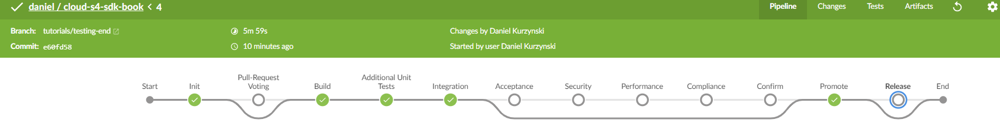

## Prerequisites
This tutorial assumes you are already familiar with the basics of the SAP Cloud SDK and project "Piper", e.g. because you already completed the mission [Create a Cloud Foundry App Using SAP Cloud SDK](mission.cloudsdk-cf-app) and the tutorial [Set Up Continuous Integration and Delivery for SAP Cloud SDK](cloudsdk-ci-cd). To follow this tutorial please download and extract an [example project](https://github.com/SAP/cloud-s4-sdk-book/archive/tutorials/testing-start.zip) based on the SAP Cloud SDK archetype.

## Details
### You will learn
  - How to write backend unit tests with JUnit
  - How to write integration tests with Arquillian or SpringRunner
  - How to write frontend unit tests with Jasmine and Karma
  - How to run these tests in an automated build pipeline

---
[ACCORDION-BEGIN [Step 1: ](Test Pyramid)]
In general, there are multiple kinds of tests differentiating mainly in the granularity of testing. They all have their advantages and disadvantages. A common visualization is the testing pyramid. Based on the costs of the tests it visualizes that you should have much more unit tests than integration tests than E2E (End-To-End) tests. The costs for creating, running and maintaining increase while you move the pyramid up.


Integration tests have a reduced complexity. They skip the user interface and work directly on the defined backend APIs. They test the integration between software modules or systems. In our example, we mainly use them to test the integration between backend services and the integration to SAP S/4HANA systems.
Although they have a reduced complexity, they still have medium costs. They still have an overhead, e.g., for network communications or spawning a small server to make the backend APIs available. You should use them to verify that your backend services can communicate with your SAP S4HANA system and to test that the services behave as the user interface expects it.

Unit tests have the smallest granularity. They can be defined directly on the programming level, e.g., calling methods of your java classes. Dependencies to other modules or systems may be mocked to ensure that they run very quickly and only test the portion under consideration. These tests are usually very cheap. You should use them to verify that your software modules, such as classes, behave as expected.

[DONE]
[ACCORDION-END]

[ACCORDION-BEGIN [Step 2: ](Unit-tests backend)]
For the modules of your backend services we suggest writing [JUnit](https://github.com/junit-team/junit4/wiki/Getting-started) tests. Please place your unit tests inside `application/src/test`. Unit tests should be very light weight. They should test the modules, e.g. a class, in a isolated manner. Other depended modules or even calls to external destinations, such as an ERP system, may be mocked. For mocking, the SAP Cloud SDK provides mocking facilities with the class `MockUtil`. Furthermore, we recommend using mocking frameworks, such as Mockito or PowerMock.

Take a look at [Mock S/4HANA calls] (cloudsdk-mocking-capabilities) to learn more about how the SAP Cloud SDK makes it easy to mock even calls to SAP S/4HANA systems.


[DONE]
[ACCORDION-END]

[ACCORDION-BEGIN [Step 3: ](Integration tests backend)]

In the integration tests you can tests your backend services without the `frontend` application. In the **Tutorials** [Create a Sample Application on Cloud Foundry Using SAP Cloud SDK](s4sdk-cloud-foundry-sample-application) and [Connect to OData Service on Cloud Foundry Using SAP Cloud SDK](s4sdk-odata-service-cloud-foundry), we already introduced the integration tests and showed how to set them up. In general, we recommend to use `Arquillian` to spawn a small server containing only the resources for the specific backend services you want to test. This is faster compared to deploying it to the SAP Cloud Platform first and then testing against the deployed version. Furthermore, you still have the possibility to influence the test execution, e.g. with mocking or to collect test coverage data. For spring, we recommend to use the `SpringRunner`. For both, there is an example test already included in the corresponding archetype.

[DONE]
[ACCORDION-END]

[ACCORDION-BEGIN [Step 4: ](Mocking basics)]
In this tutorial, we want to focus on the mocking facilities provided by the SAP Cloud SDK. When you execute the integration tests locally, they run in a different environment than later on in the SAP Cloud Platform. Therefore, many services, such as the destination service, are not available, as the SAP Cloud Platform provides a much richer environment in terms of services and runtime libraries than the local test environment.

This target environment has to be, partially, replicated in the local environment where the mocking facilities allow to test your business application without relying on the provided services locally. Since the SAP Cloud SDK already comes with abstractions for these services, it also offers to mock them in a local environment.

As example, we take the `BusinessPartnerServletTest`. You can find this integration test also in the sources you downloaded as preparation for this tutorial.

```Java
package com.sap.cloud.s4hana.examples.addressmgr;

import io.restassured.RestAssured;
import io.restassured.http.ContentType;
import com.sap.cloud.sdk.cloudplatform.connectivity.ProxyConfiguration;
import org.jboss.arquillian.container.test.api.Deployment;
import org.jboss.arquillian.junit.Arquillian;
import org.jboss.arquillian.test.api.ArquillianResource;
import org.jboss.shrinkwrap.api.spec.WebArchive;
import org.junit.Before;
import org.junit.BeforeClass;
import org.junit.Test;
import org.junit.runner.RunWith;
import java.net.URL;

import com.sap.cloud.sdk.testutil.MockUtil;

import static io.restassured.RestAssured.when;
import static org.hamcrest.Matchers.*;

@RunWith( Arquillian.class )
public class BusinessPartnerServletTest
{
    private static final MockUtil mockUtil = new MockUtil();
    public static final String BUPA_ID = "1003764";

    @ArquillianResource
    private URL baseUrl;

    @Deployment
    public static WebArchive createDeployment()
    {
        return TestUtil.createDeployment(BusinessPartnerServlet.class);
    }

    @BeforeClass
    public static void beforeClass()
    {
        mockUtil.mockDefaults();
        mockUtil.mockErpDestination();
    }

    @Before
    public void before()
    {
        RestAssured.baseURI = baseUrl.toExternalForm();
    }

    @Test
    public void testGetAll()
    {
        when()
                .get("/api/business-partners")
        .then()
                .statusCode(200)
                .contentType(ContentType.JSON)
                .body("$", hasSize(greaterThan(1)))
                .body("[0].BusinessPartner", not(isEmptyOrNullString()));
    }

    @Test
    public void testGetSingle() {
        when()
                .get("/api/business-partners?id={id}", BUPA_ID)
        .then()
                .statusCode(200)
                .contentType(ContentType.JSON)
                .body("BusinessPartner", allOf(not(isEmptyOrNullString()),equalTo(BUPA_ID)))
                .body("to_BusinessPartnerAddress", hasSize(greaterThan(0)));
    }
}
```

Everything around mocking is located in the class `MockUtil` in the SAP Cloud SDK. Information about the interface and the available methods can be found in the [Javadoc](https://help.sap.com/doc/fe7d14ff3c3043aca2920cb72d725492/1.0/en-US/index.html?com/sap/cloud/sdk/testutil/MockUtil.html).

In this example, we use the class `MockUtil` in the `beforeClass` method to mock common resources using `mockUtil.mockDefaults()` and to mock the connection to the S/4HANA system. The `mockDefaults` method calls several methods from the `MockUtil` to mock:

| :------------- | :-------------
| `resetCloudPlatformFacade()` | `Mocks the SAP Cloud Platform environment, i.e. the application name. The Default application name is testapp.`
| `mockCurrentLocales()` | `Mocks the current locale to en-US`
| `mockCurrentTenant()` | `Mocks the tenant id to 00000000-0000-0000-0000-000000000000`
| `mockCurrentUser()` | `Mocks the user name to MockedUser`
| `resetAuditLogFacade()` | `Makes the audit logger locally available not to cause run-time problems. The default behavior is to forward the logs to the standard logger.`

As result, you can get platform specific information such as tenant or user information although you are not in a SAP Cloud Platform environment. Furthermore, this is the basis to mock destination such as the connection to an ERP system or other external services.

The SAP Cloud Platform has a destination concept. A destination has a name and a configuration. It specifies an URI and authentication parameters, such as basic authentication with username and password. `MockUtil` provides a way to mock a destination configuration together with a name. Thus, your application code can be the same in the tests and in the productive environment. Destinations can be mocked using the following ways:

```Java
//Mock system without authentication
String name = "myDestinationName";
URI uri = new URI("http://path/to/destination/");
mockUtil.mockDestination(name, uri);

//Authentication with be taken from credentials configuration for this alias
String alias = "myAlias";
TestSystem<GenericSystem> testSystem = new GenericSystem(alias, uri, null);
mockUtil.mockDestination(name, testSystem);

//System configuration and authentication configuration for this alias
//from command line or file.
mockUtil.mockDestination(name, alias);
```

To configure the credentials you can either create a local file or pass the credentials over command line. A valid file is named `credentials.yml` and is located in `integration-tests/src/test/resources`. The file contains a list of credentials referencing an alias. Possible formats are `json` and `yaml` format:

```YAML
credentials:
  - alias: 'myAlias'
    username: 'username'
    password: 'password'
```

To pass the credentials over the command line you can use the command line parameter `-Dtest.credentials`. The value of should be a `json` string in the same format as in the file. Please be aware that, if you pass the credentials over the command line, the credentials might be persisted in the history and others might see it. If you decide for a file, you do not have to enter it again for every test. However, be aware, that you should restrict the access and add the file to your `gitignore`.

In the third case, we mock the destination only by referencing an alias. In this case, you also have to configure the system in the file `integration-tests/src/test/resources/systems.yml`:

```YAML
systems:
  - alias: "myAlias"
    uri: "http://path/to/destination/"
```

[DONE]
[ACCORDION-END]

[ACCORDION-BEGIN [Step 5: ](Mock ERP destination)]
Mocking an ERP system uses the same mechanism. However, in addition you also have to provide a `systemId` and a `clientId` in addition to providing the systems as above. You can use either `SapClient.EMPTY` if the default client of a host is fine, or you use the convenience method ErpSystem.builder() that does not require a `clientId`.

```Java
//Authentication with be taken from credentials configuration for this alias
String alias = "myAlias";
String systemId = "AAB";
SapClient sapClient = new SapClient("SAPCLIENT-NUMBER");
ErpSystem erpSystem = new ErpSystem(alias, uri, systemId, sapClient);
mockUtil.mockErpDestination(name, erpSystem);

//System configuration and authentication configuration
//for alias from command line or file.
mockUtil.mockErpDestination(name, alias);
```

In accordance to this, the `system.yml` with ERP systems looks as follows. In cloud system do not need to specify `systemId` and `sapClient`.

```YAML
erp:
  default: "myAlias"
  systems:
    - alias: "myAlias"
      systemId: "AAB"
      uri: "http://path/to/destination/"
      sapClient: "SAPCLINET-NUMBER"
```

[DONE]
[ACCORDION-END]

[ACCORDION-BEGIN [Step 6: ](Unit-tests frontend)]
In this tutorial, we will use [Jasmine](https://jasmine.github.io/) and [Karma](https://karma-runner.github.io/1.0/index.html) to implement the unit tests of the JavaScript frontend code written in SAP UI5.

The example you downloaded as a prerequisite of this tutorial contains a service class which loads the business partners from from the backend. It is located at `webapp/service/businesspartners.js`:

```JavaScript
sap.ui.define([], function () {
    "use strict";

    ...

    getBusinessPartner: function (businessPartnerId) {
        return jQuery.get(this.getBusinessPartnerUrl(businessPartnerId));
    },

    ...
});
```

The code uses jQuery to send a GET request to a backend service of your application. It returns a promise for the list of business partners.

A test for this service class looks as follows:

```JavaScript
"use strict";
sap.ui.define(["sdk-tutorial-frontend/service/businessPartner"], function (
  BusinessPartnersService
) {
  //Create test data used for mocking and in the assertion
  var testBusinessPartners = [
    {
      BusinessPartner: "1",
      LastName: "Doe",
    },
  ];

  function getBusinessPartnersPromise() {
    var jQueryPromise = new $.Deferred();
    return jQueryPromise.resolve(testBusinessPartners);
  }

  describe("Business Partner Service", function () {
    it("gets a business partner", function (done) {
      spyOn(jQuery, "get").and.returnValue(getBusinessPartnersPromise());
      BusinessPartnersService.getBusinessPartner('1').then(function (
        businessPartners
      ) {
        expect(businessPartners).toEqual(testBusinessPartners);
        expect(jQuery.get).toHaveBeenCalled();
        done();
      });
    });
  });
});
```

In Jasmine each test is wrapped into an it block. In this case it is an asynchronous test. First we mock the call to the backend in the `spyOn` method by overwriting the method `jQuery.ajax`. Then we call the `BusinessPartnerService` implemented in the file before. In the callback we evaluate the assertions and mark the asynchronous test execution is completed. We place the test in `frontend-unit-tests/tests/service/businesspartners.jasmine.js`.

In order to execute this test you can either create a new html page which executes the tests or you can use [Karma](https://karma-runner.github.io/latest/index.html). We will use Karma to be able to run the test from the command line. To run Karma you have to install Node.js and create a `package.json` in the root of your project.

The `package.json` could look like:

```JSON
{
    "name": "businesspartner-manager-cf",
    "version": "1.0.0",
    "description": "Frontend Tests",
    "scripts": {
        "ci-frontend-unit-test": "karma start frontend-unit-tests/karma.conf.js --watch=false --single-run=true"
    },
    "author": "SAP",
    "private": true,
    "devDependencies": {
        "yargs": "^6.6.0",
        "jasmine": "^2.99.0",
        "karma": "^3.1.4",
        "karma-chrome-launcher": "^2.1.1",
        "karma-coverage": "^1.1.1",
        "karma-jasmine": "^1.1.2",
        "karma-junit-reporter": "^1.2.0",
        "karma-openui5": "^0.2.3"
    }
}
```

In the scripts section you define the command `ci-frontend-unit-test` which is used to run the unit tests with Karma. In the section `devDependencies` you specify the dependencies needed to execute the tests. You install them with running `npm install` in a terminal window.

The only piece missing is the configuration of Karma. To configure Karma you create a file called `karma.conf.js` in the folder `frontend-unit-tests`. This file looks as follows:

```JavaScript
const argv = require("yargs").argv;

module.exports = function (config) {
  config.set({
    basePath: "../",

    frameworks: ["openui5", "jasmine"],

    openui5: {
      path:
        "https://sapui5.hana.ondemand.com/1.42.9/resources/sap-ui-cachebuster/sap-ui-core.js",
      useMockServer: false,
    },

    client: {
      openui5: {
        config: {
          theme: "sap_bluecrystal",
          resourceroots: {
            "sdk-tutorial-frontend":
              "./base/application/src/main/webapp/address-manager/",
          },
        },
      },
    },

    files: [
      {
        pattern: "./application/src/main/webapp/address-manager/**",
        served: true,
        included: false,
      },
      "./frontend-unit-tests/tests/**/*.jasmine.js",
    ],

    browsers: [argv.headless ? "ChromeHeadless" : "Chrome"],

    reporters: ["junit", "progress", "coverage"],

    preprocessors: {
      "webapp/**/*.js": ["coverage"],
    },

    junitReporter: {
      outputDir: "s4hana_pipeline/reports/frontend-unit", // results will be saved as $outputDir/$browserName.xml
      outputFile: "Test.frontend.unit.xml", // if included, results will be saved as $outputDir/$browserName/$outputFile
      suite: "", // suite will become the package name attribute in xml testsuite element
      useBrowserName: true, // add browser name to report and classes names
      nameFormatter: undefined, // function (browser, result) to customize the name attribute in xml testcase element
      classNameFormatter: undefined, // function (browser, result) to customize the classname attribute in xml testcase element
    },

    coverageReporter: {
      // specify a common output directory
      dir: "s4hana_pipeline/reports/frontend-unit/coverage",

      includeAllSources: true,

      reporters: [
        {
          type: "html",
          subdir: "report-html/ut",
        },
        {
          type: "lcov",
          subdir: "report-lcov/ut",
        },
        {
          type: "cobertura",
          subdir: ".",
          file: "cobertura.frontend.unit.xml",
        },
      ],
      instrumenterOptions: {
        istanbul: {
          noCompact: true,
        },
      },
    },
  });
};
```

First, we define the base path, which is in our case the project root folder. In the `openUi5` block, we can define where the resources for SAP UI5 are located and can be downloaded from. In the client block you can define the resource roots for your application components, as you also do it in your `index.html` of your SAP UI5 application.
>The path has to have `./base/` in front and then points to the folder where your `frontend` code is located. It is not in the actual path on the file system. In the files section you specify the location of the files that you need for testing. By default all files are loaded to execute the tests. Thus, we specify for the application code that it is not included but served when required in a test.

In the reporters section, we specify that we also want the results to be stored in the `junit` format and that we also want the code coverage data to be stored. These reporters are defined in the remaining sections. In preprocessors we define that all `js` files should be preprocessed to allow computing the code coverage. The format and the location of the `junit` and the code coverage reporters are specified in the sections `coverageReporter` and `junitReporter`.

The final folder structure should look as follows:


Now you can run the following commands in the root folder of the project to execute your tests. It will start a chrome instance and execute the tests.

```Shell
npm install
npm run ci-frontend-unit-test
```

It should run the tests and shows the results in the terminal:


In an delivery pipeline everything is usually executed without a user interface. Thus, opening a normal browser would not work. However, most browsers also offer a headless mode. The browser is started without a user interface.
>You can run the script also with a headless browser: `npm run ci-frontend-unit-test -- --headless`.

[VALIDATE_1]

[ACCORDION-END]


[ACCORDION-BEGIN [Step 7: ](Run tests in the General Purpose Pipeline of project "Piper")]

Please setup a continuous delivery pipeline for this project as learned in  [Set Up Continuous Integration and Delivery for SAP Cloud SDK](cloudsdk-ci-cd).

This pipeline will automatically run the backend unit and integration tests and frontend unit tests implemented as part of this tutorial.

As the integration tests depend on a connection to an SAP S/4HANA or a corresponding mock system, this connection needs to be configured. We discussed this option in [Connect to OData Service on Cloud Foundry Using SAP Cloud SDK](s4sdk-odata-service-cloud-foundry). First make sure that the system you configured in the file `integration-tests/src/test/resources/systems.yml` is accessible from your Cx-server instance. For example:

```YAML
erp:
  default: "MOCK_SYSTEM"
  systems:
#    - alias: "ERP_SYSTEM"
#      uri: "https://myXXXXXX.s4hana.ondemand.com"
#      proxy: "http://proxy:8080"
    - alias: "MOCK_SYSTEM"
      uri: "http://my-mock-server.corp:3000"

```

You also need an additional file containing the credentials to access the system you configured above. As you would usually not commit this file, you can instruct the pipeline to create it for you. In the section `stages` you can configure the stage `Integration` to create a credential file for a system with the specific alias you also used before in the file `systems.yml`. The credentials with the corresponding ID have to be configured as described in the tutorial [Set Up Continuous Integration and Delivery for SAP Cloud SDK](cloudsdk-ci-cd).

```YAML
stages:
  Integration:
    credentials:
      - alias: 'MOCK_SYSTEM'
        credentialId: 'MY-MOCK-ERP'
```

For the frontend unit tests you have to configure the location of the test report location as configured in the `karma.conf.js`. As the npm script `ci-frontend-unit-test` should be invoked instead of the automatic discovery of the karma file, the step `karmaExecuteTests` has to be disabled.

```YAML
stages:
  "Additional Unit Tests":
    karmaExecuteTests: false
    junit:
      active: true
      allowEmptyResults: true
      pattern: 's4hana_pipeline/reports/frontend-unit/**/Test*.xml'
```

The resulting pipeline should look like as shown in the following screenshot.



[DONE]
[ACCORDION-END]


[ACCORDION-BEGIN [Step 8: ](Troubleshoot and questions)]

Are you facing a development question? Then check out Stack Overflow for SAP Cloud SDK related questions. If you do not find an answer, feel free to post your question and make sure to attach the tag `sap-cloud-sdk`. Our team, as well as the whole Stack Overflow community, are at your service and will quickly react to your question.

For an overview of SAP Cloud SDK related questions, go to <https://stackoverflow.com/questions/tagged/sap-cloud-sdk>.

You think that you found a bug in one of our Continuous Delivery artifacts? Feel free to open an issue in our GitHub repository on <https://github.com/SAP/jenkins-library/issues>.

[DONE]

[ACCORDION-END]

---
