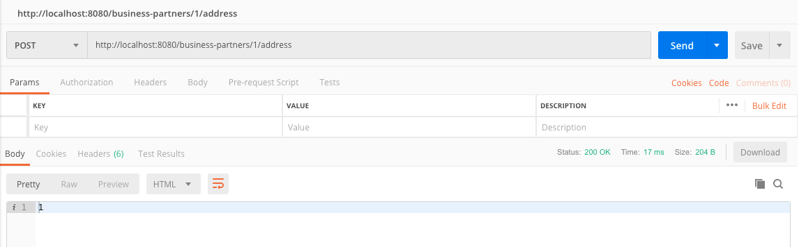

## Prerequisites
 - Have `Node.js` and `npm` [installed on your machine](s4sdkjs-prerequisites).
 - Have access to an SAP S/4HANA Cloud system or the [SAP API Business Hub Sandbox](https://api.sap.com/getting-started), or use the [Business Partner Mock Service](https://sap.github.io/cloud-s4-sdk-book/pages/mock-odata.html).
 - Basic knowledge of OData is recommended, but not required.

## Details
### You will learn
  - How to use the Virtual Data Model to create a new entity
  - How to trigger a create request from an API endpoint exposed by your application

The goal of this tutorial group is to show you how to implement a JavaScript application that allows you to manage the addresses of business partners. This application will be using `NestJS` and the SAP Cloud SDK for JavaScript. In this tutorial, we use the SAP Cloud SDK's OData Virtual Data Model to create a new address and make this functionality available via an API endpoint.

---

[ACCORDION-BEGIN [Step 1: ](Add an API endpoint)]

In a [previous tutorial](cloudsdk-js-vdm-getall) we explained the basics of `controller`, `service` and `module` in `NestJS` applications. Note: If you already have controller and service classes from the previous tutorials you can of course keep the existing files and just extend the classes by the new methods. Create a file called `business-partner.controller.ts` in the `src` folder of your application. Then, copy the following code into it:

```JavaScript / TypeScript
import { Controller, Post, Body, Param } from '@nestjs/common';

@Controller('business-partners')
export class BusinessPartnerController {

  @Post('/:businessPartnerId/address')
  @HttpCode(201)
  getBusinessPartnerByID(@Body() requestBody, @Param('businessPartnerId') businessPartnerId): string {
    return `This is my id: ${businessPartnerId} and body for address creation: ${JSON.stringify(requestBody)}`;
  }
}
```

Prepare a service file called `business-partner.service.ts` and add this initial implementation:

```JavaScript / TypeScript
import { Injectable } from '@nestjs/common';
import { BusinessPartnerAddress } from '@sap/cloud-sdk-vdm-business-partner-service';

@Injectable()
export class BusinessPartnerService {
  createAddress(address: BusinessPartnerAddress): Promise<BusinessPartnerAddress> {
    return;
  }
}
```

Finally, register the `controller` and `service` in the root application module `app.module.ts`:

```JavaScript / TypeScript
import { Module } from '@nestjs/common';
import { AppController } from './app.controller';
import { AppService } from './app.service';
import { BusinessPartnerController } from './business-partner.controller';
import { BusinessPartnerService } from './business-partner.service';

@Module({
  imports: [],
  controllers: [AppController, BusinessPartnerController],
  providers: [AppService, BusinessPartnerService]
})
export class AppModule {}
```

Following the best practices for RESTful APIs, we used the `POST` method to create a new entity. So we need to send a `POST` request. We recommend [Postman](https://www.getpostman.com/) for testing APIs, but you can also use similar tools or `curl`.



Start your server using
```Shell
npm start
```
And create a  `POST` request to `http://localhost:3000/business-partners/testID/address` with a JSON body: `{"key":"Some test body."}`. Don't forget to change the body type to JSON in the dropdown menu. The server should respond with the ID and body from the request. In our case you should get `This is my id: testID and body for address creation: {"key":"Some test body."}`

[DONE]
[ACCORDION-END]

[ACCORDION-BEGIN [Step 2: ](Create a business partner address)]

Next, we use the VDM to create a new business partner address. Open `business-partner.service.ts` and implement the `createAddress()` method:

```JavaScript / TypeScript
import { Injectable } from '@nestjs/common';
import { BusinessPartnerAddress } from '@sap/cloud-sdk-vdm-business-partner-service';

@Injectable()
export class BusinessPartnerService {
  createAddress(address: BusinessPartnerAddress): Promise<BusinessPartnerAddress> {
    return BusinessPartnerAddress.requestBuilder()
      .create(address)
      .execute({
        url: 'https://my.s4hana.ondemand.com/'
      });
  }
}

```

The `create` function takes the entity that should be created as parameter. When creating a new entity, the service will automatically generate things like key fields, the creation date, etc. and return it. The VDM makes this available to you by returning a `Promise<BusinessPartnerAddress>`.

[DONE]
[ACCORDION-END]

[ACCORDION-BEGIN [Step 3: ](Build a business partner address from the request)]

So far, there is an API endpoint and a function that takes an address and creates it in SAP S/4HANA Cloud. To connect the two, we need a function that constructs a `BusinessPartnerAddress` object. Add the following method to your service class:

```JavaScript / TypeScript
buildAddress(requestBody: any, businessPartnerId: string): BusinessPartnerAddress {
  const address = BusinessPartnerAddress.builder().fromJson(requestBody);
  address.businessPartner = businessPartnerId;
  return address;
}
}
```

This function takes a request body and a business partner ID. First, using the `BusinessPartnerAddress.builder().fromJson(body)`, you can create a new address from the given body. Note, that this requires the keys of the object passed to the `fromJson` function to match the respective keys of the business partner address object. We will present a working example later. Second, since we want the address to be related to a given business partner, we need to set the business partner ID on the entity.

[DONE]
[ACCORDION-END]

[ACCORDION-BEGIN [Step 4: ](Wire everything up)]

With all the building blocks in place, you can connect everything in the `business-partner.controller.ts`. Your final code should look like this:

```JavaScript / TypeScript
import { Controller, Post, Body, Param } from '@nestjs/common';
import { BusinessPartnerService } from './business-partner.service';
import { BusinessPartnerAddress } from '@sap/cloud-sdk-vdm-business-partner-service';

@Controller('business-partners')
export class BusinessPartnerController {
  constructor(private readonly businessPartnerService: BusinessPartnerService) {}

  @Post('/:businessPartnerId/address')
  @HttpCode(201)  
  getBusinessPartnerByID(@Body() requestBody, @Param('businessPartnerId') businessPartnerId): Promise<BusinessPartnerAddress> {
    const address = this.businessPartnerService.buildAddress(requestBody, businessPartnerId);
    return this.businessPartnerService.createAddress(address);
  }
}
```

`buildAddress()` takes the body of the incoming request as well as the ID from the URL and passes it to the SDK builder methods to construct a `BusinessPartnerAddress` entity. This is then passed to `createAddress()` to send the create request to SAP S/4HANA Cloud.

Restart your server and send a `POST` request to `http://localhost:3000/business-partners/1003764/address` with the following body:

```JSON
{
	"country": "DE",
	"postalCode": "14469",
	"cityName": "Potsdam",
	"streetName": "Konrad-Zuse-Ring",
	"houseNumber": "10"
}
```

If there is a business partner with ID "1003764" in your destination system, this will create a new address. Alternatively, replace the ID in the URL with the ID of an existing business partner in your system.

[DONE]
[ACCORDION-END]

[ACCORDION-BEGIN [Step 5: ](Optional: Deep create)]

The VDM also supports creating an entity together with related entities in a single request. In OData lingo, this is called "deep create". Consider the following example, where a business partner is created together with one related address:

```JavaScript / TypeScript
import { BusinessPartner, BusinessPartnerAddress } from '@sap/cloud-sdk-vdm-business-partner-service';

// build a business partner instance with one linked address
const businessPartner = BusinessPartner.builder()
  .firstName('John')
  .lastName('Doe')
  .businessPartnerCategory('1')
  .toBusinessPartnerAddress([
    BusinessPartnerAddress.builder()
      .country('DE')
      .postalCode('14469')
      .cityName('Potsdam')
      .streetName('Konrad-Zuse-Ring')
      .houseNumber('10')
      .build()
  ])
  .build();

// execute a create request
BusinessPartner.requestBuilder()
  .create(businessPartner)
  .execute({
    url: 'https://my.s4hana.ondemand.com/',
    username: 'USERNAME',
    password: 'PASSWORD'
  });
```

[DONE]
[ACCORDION-END]

[ACCORDION-BEGIN [Appendix: ](Test yourself)]

[VALIDATE_1]

[ACCORDION-END]
---
