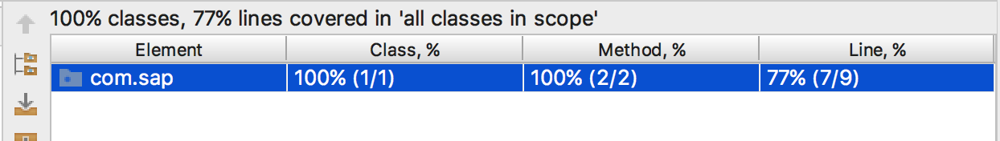

## Prerequisites
 - [Connect to OData Service on Cloud Foundry Using SAP Cloud SDK](s4sdk-odata-service-cloud-foundry)
 - [Introduce resilience to your application](s4sdk-resilience)


## Details≤
### You will learn
  - What is mocking
  - Why mocking is useful
  - How to mock the access to SAP S/4HANA systems


---

[ACCORDION-BEGIN [Step 1: ](Check if Bill of Material is updated)]
Complete mocking of S/4HANA APIs only works stable as of SAP Cloud SDK version 3.9.0. Therefore, please make sure, your SDK [Bill of Material](https://maven.apache.org/guides/introduction/introduction-to-dependency-mechanism.html#Importing_Dependencies) is updated accordingly like shown below:

```XMl
<dependencyManagement>
    <dependencies>
        <dependency>
            <groupId>com.sap.cloud.sdk</groupId>
            <artifactId>sdk-bom</artifactId>
            <version>3.9.0</version>
            <type>pom</type>
            <scope>import</scope>
        </dependency>
    </dependencies>
    <!-- possibly further managed dependencies ... -->
</dependencyManagement>
```

[DONE]
[ACCORDION-END]

[ACCORDION-BEGIN [Step 2: ](Mock the Business Partner API)]
You will learn three basic mocking principles that should empower you with all the tools and requirements you need. You will go over the following important aspects:

- Mocking the happy path generically: Return successfully all business partners without an S/4HANA system.
- Mocking specific S/4HANA API calls: Return successfully specific business partners that match certain criteria.
- Mocking the failure path: Return an error thrown by the business partner API without an S/4HANA system.

### Mocking the happy path
Let´s start with a very simple example of a `GetBusinessPartnersCommand` which retrieves all business partner´s first and last names that are customers. If you did all the tutorials at least until [Introduce Resilience to your Application](s4sdk-resilience), the code should be very familiar to you.

The file needs to be put under your `<projectroot>/application/src/main/java/com/sap/cloud/sdk/tutorial` directory.

```Java
package com.sap.cloud.sdk.tutorial;

import java.util.List;

import com.sap.cloud.sdk.cloudplatform.connectivity.HttpDestination;
import com.sap.cloud.sdk.cloudplatform.resilience.ResilienceConfiguration;
import com.sap.cloud.sdk.cloudplatform.resilience.ResilienceDecorator;
import com.sap.cloud.sdk.cloudplatform.resilience.ResilienceRuntimeException;
import com.sap.cloud.sdk.datamodel.odata.client.exception.ODataException;

import com.sap.cloud.sdk.s4hana.datamodel.odata.namespaces.businesspartner.BusinessPartner;
import com.sap.cloud.sdk.s4hana.datamodel.odata.services.BusinessPartnerService;
import com.sap.cloud.sdk.s4hana.datamodel.odata.services.DefaultBusinessPartnerService;

public class GetBusinessPartnersCommand {

    private final BusinessPartnerService businessPartnerService;
    private final HttpDestination httpDestination;

    public GetBusinessPartnersCommand(HttpDestination destination) {
        this(destination, new DefaultBusinessPartnerService());
    }

    public GetBusinessPartnersCommand(HttpDestination httpDestination, BusinessPartnerService businessPartnerService) {
        this.businessPartnerService = businessPartnerService;
        this.httpDestination = httpDestination;
    }

    public List<BusinessPartner> execute() {
        return ResilienceDecorator.executeSupplier(this::run, ResilienceConfiguration.of(GetBusinessPartnersCommand.class));
    }

    private List<BusinessPartner> run() {

        try {

            return businessPartnerService.getAllBusinessPartner()
                    .filter(BusinessPartner.CUSTOMER.ne(""))
                    .select(BusinessPartner.FIRST_NAME,
                            BusinessPartner.LAST_NAME)
                    .executeRequest(httpDestination);

        } catch (ODataException e) {
            throw new ResilienceRuntimeException(e);
        }
    }
}
```

> ### What does the code do?
> The code above defines a new class called **`GetBusinessPartnersCommand`**  is resilient to network failures and latency issues to S/4HANA.
>
> The actual logic is executed within the **`run()`** method where you are doing a type-safe OData call to the `BusinessPartner` API of SAP S/4HANA, filtering on the `CUSTOMER` property of the business partner and doing a partial projection on the `firstname` and `lastname` properties.

Unlike previous tutorials, you do not want to test this now against a real S/4HANA system but just by a locally running test.

For this, you put the following test file called `GetBusinessPartnerMockedTest` under `<projectroot>/unit-tests/src/test/java/com/sap/cloud/sdk/tutorial`.

```Java
import com.sap.cloud.sdk.datamodel.odata.client.exception.ODataException;
import com.google.common.collect.Lists;
import org.mockito.junit.MockitoJUnitRunner;

import static org.junit.Assert.*;
import static org.mockito.Mockito.*;

public class GetBusinessPartnerMockedTest {
    private static BusinessPartner alice;
    private static BusinessPartner bob;

    @BeforeClass
    public static void beforeClass() throws Exception {

        alice = new BusinessPartner();
        alice.setFirstName("Alice");

        bob = new BusinessPartner();
        bob.setFirstName("Bob");
    }

    @Test
    public void testGetAnyBusinessPartner() throws Exception {
        final BusinessPartnerService service = Mockito.mock(BusinessPartnerService.class, RETURNS_DEEP_STUBS);
        final HttpDestination httpDestination = Mockito.mock(HttpDestination.class);

        when(service.getAllBusinessPartner()
                .filter(any())
                .select(any())
                .executeRequest(any()))
                .thenReturn(Lists.newArrayList(alice, bob));

        final List<BusinessPartner> businessPartnerList = new GetBusinessPartnersCommand(httpDestination, service).execute();

        assertEquals(2, businessPartnerList.size());
        assertEquals("Alice", businessPartnerList.get(0).getFirstName());
        assertEquals("Bob", businessPartnerList.get(1).getFirstName());
    }
}
```

> ### What does the code do?
The code above creates a new test class called `GetBusinessPartnerMockedTest`. The code is structured in three main parts:

>- First, the declaration of two test business partners, Alice and Bob.
>
>- Second, an initialization method `beforeClass()` which is annotated with `@BeforeClass` meaning that this method is called exactly once before the execution of all other test methods. Finally, this method initializes two test business partners with their intended `firstnames`.
>
>- <p> Third, our first actual testing method `testGetAnyBusinessPartner()`:<p>
<ol>
> <li> Here, you first of all create two mocks (i.e., a proxy object) of the business partner service interface and `HttpDestination` that replaces the actual SDK implementation with mocked methods. As you want to mock the entire fluent API including all its delegating classes and not just the interface itself, you also need to provide the `RETURNS_DEEP_STUBS` option.</li>
> <li> Then, you do the actually mocking by defining under which condition (when-part), what should happen (then-part). Here, you simply define that when the business partner APIs is called, upon any filter condition, upon any selection criteria, upon any execution context, it shall return Alice and Bob as business partners.</li>
> <li> Afterwards, you initialize our `GetBusinessPartnersCommand` and pass the mocked business partner service into our production code command. Then, you simply call the command as you do in our production code to get the list of business partners who match our criteria.</li>

You can try it out by right-clicking on your test class and select `Run As Unit Test` or execute `mvn clean` test on your root project.

If you use an IDE you should see the test passing in very quick time.

!

Also, in any IDE you can look at the code coverage that this test provides. So far, the test accounts for 77% of all lines of code (you will achieve 100% in this tutorial).

!

### Mocking more specific S/4HANA calls
In the example above, you simply mocked out any selection and projection criteria using any(). Hence, our mock is not very specific to the actual production code where you filter only for business partners who are customers.

Suppose Alice is a customer and Bob is a supplier. So the question is whether you can mock more specifically to match the actual API semantics.

For this purpose, you write another test method called `testGetSpecificBusinessPartner`:

```Java
@Test
public void testGetSpecificBusinessPartner() throws Exception {
    final BusinessPartnerService service = Mockito.mock(BusinessPartnerService.class, RETURNS_DEEP_STUBS);
    final HttpDestination httpDestination = Mockito.mock(HttpDestination.class);
    when(service.getAllBusinessPartner()
            .filter(BusinessPartner.CUSTOMER.ne(""))
            .select(any(BusinessPartnerSelectable.class))
            .executeRequest(any(HttpDestination.class)))
            .thenReturn(Lists.newArrayList(alice));

    final List<BusinessPartner> businessPartnerList = new GetBusinessPartnersCommand(httpDestination, service).execute();

    assertEquals(1, businessPartnerList.size());
    assertEquals("Alice", businessPartnerList.get(0).getFirstName());
}
```

Here, you have now replaced the line `.filter(any())` with  `.filter(BusinessPartner.CUSTOMER.ne(""))` that matches our production code of `GetBusinessPartnersCommand`. Furthermore, you only return Alice in this case and adapted the test assertions accordingly.

>**`Homework`**: While this tests runs successfully, you can play around with your production or test code now. For example, if you change your application code and change the filter condition to something else, your test suite is now able to spot the potential bug of changed semantics, even though there is no S/4HANA system connected to prove this new semantics.

### Mocking the failure case
Mocking can also test hard-to-reach code such as certain failure cases.

In the example, you can run into situations where the OData call to the business partner API may fail during runtime (due to failing network, wrong authorizations, etc.). This is unfortunate and you cannot do anything about failing OData calls at design-time, but you must test whether our code behaves correctly in such failure situations and leaves the application in an expected, consistent state.

Fortunately, you can also mock such failure cases by throwing a dummy `ODataException` and expect a **`ResilienceRuntimeException`** as the test result.

```Java
@Test(expected = ResilienceRuntimeException.class)
public void testGetBusinessPartnerFailure() throws Exception {
    final BusinessPartnerService service = Mockito.mock(BusinessPartnerService.class, RETURNS_DEEP_STUBS);
    final HttpDestination httpDestination = Mockito.mock(HttpDestination.class);

    when(service.getAllBusinessPartner()
            .filter(any())
            .select(any())
            .executeRequest(any()))
            .thenThrow(new ODataException(null, "Something went wrong", null));

    new GetBusinessPartnersCommand(httpDestination, service).execute();
}
```

When you run all our three test cases together, you finally end up with a 100% tested codebase, although you do not have used any real S/4HANA system.


[DONE]
[ACCORDION-END]


[ACCORDION-BEGIN [Step 3: ](Recommendation and hints)]
The mocking facilities of the SAP Cloud SDK are based on the open source framework [`Mockito`](http://javadoc.io/page/org.mockito/mockito-core/latest/org/mockito/Mockito.html). Therefore, studying the official documentation for more options and capabilities is recommended.

One of the additional possibilities is to use the **`@Mock`** annotations for providing the mocks in the tests which lead to less code and more readable tests. For example, you can mock the business partner service as well as our two business partner, Alice and Bob and can leave out the mocking per test method. Please note that the **`JUnit`** test has to be annotated with **`@RunWith(MockitoJUnitRunner.Silent.class)`**.The full running code for this is here:

```Java
package com.sap.cloud.sdk.tutorial;

import com.sap.cloud.sdk.cloudplatform.connectivity.HttpDestination;
import com.sap.cloud.sdk.cloudplatform.resilience.ResilienceRuntimeException;
import com.sap.cloud.sdk.datamodel.odata.client.exception.ODataException;

import com.google.common.collect.Lists;

import org.junit.BeforeClass;
import org.junit.Test;
import org.junit.runner.RunWith;
import org.mockito.Mockito;
import org.mockito.junit.MockitoJUnitRunner;

import java.util.List;

import com.sap.cloud.sdk.s4hana.datamodel.odata.namespaces.businesspartner.BusinessPartner;
import com.sap.cloud.sdk.s4hana.datamodel.odata.namespaces.businesspartner.selectable.BusinessPartnerSelectable;
import com.sap.cloud.sdk.s4hana.datamodel.odata.services.BusinessPartnerService;

import static org.junit.Assert.*;
import static org.mockito.Mockito.*;

@RunWith(MockitoJUnitRunner.Silent.class)
public class GetBusinessPartnerMockedTest {
    private static BusinessPartner alice;
    private static BusinessPartner bob;

    @BeforeClass
    public static void beforeClass() throws Exception {
        alice = new BusinessPartner();
        alice.setFirstName("Alice");

        bob = new BusinessPartner();
        bob.setFirstName("Bob");
    }

    @Test
    public void testGetAnyBusinessPartner() throws Exception {
        final BusinessPartnerService service = Mockito.mock(BusinessPartnerService.class, RETURNS_DEEP_STUBS);
        final HttpDestination httpDestination = Mockito.mock(HttpDestination.class);

        when(service.getAllBusinessPartner()
                .filter(any())
                .select(any())
                .executeRequest(any()))
                .thenReturn(Lists.newArrayList(alice, bob));

        final List<BusinessPartner> businessPartnerList = new GetBusinessPartnersCommand(httpDestination, service).execute();

        assertEquals(2, businessPartnerList.size());
        assertEquals("Alice", businessPartnerList.get(0).getFirstName());
        assertEquals("Bob", businessPartnerList.get(1).getFirstName());
    }

    @Test
    public void testGetSpecificBusinessPartner() throws Exception {
        final BusinessPartnerService service = Mockito.mock(BusinessPartnerService.class, RETURNS_DEEP_STUBS);
        final HttpDestination httpDestination = Mockito.mock(HttpDestination.class);
        when(service.getAllBusinessPartner()
                .filter(BusinessPartner.CUSTOMER.ne(""))
                .select(any(BusinessPartnerSelectable.class))
                .executeRequest(any(HttpDestination.class)))
                .thenReturn(Lists.newArrayList(alice));

        final List<BusinessPartner> businessPartnerList = new GetBusinessPartnersCommand(httpDestination, service).execute();

        assertEquals(1, businessPartnerList.size());
        assertEquals("Alice", businessPartnerList.get(0).getFirstName());
    }

    @Test(expected = ResilienceRuntimeException.class)
    public void testGetBusinessPartnerFailure() throws Exception {
        final BusinessPartnerService service = Mockito.mock(BusinessPartnerService.class, RETURNS_DEEP_STUBS);
        final HttpDestination httpDestination = Mockito.mock(HttpDestination.class);

        when(service.getAllBusinessPartner()
                .filter(any())
                .select(any())
                .executeRequest(any()))
                .thenThrow(new ODataException(null, "Something went wrong", null));

        new GetBusinessPartnersCommand(httpDestination, service).execute();
    }
}
```

- The test itself can be still refactored to avoid duplicate code. For example, certain mock conditions, e.g., any business partner API call could be externalized into a separate method for better reuse and readability.

- The mocking facility also works greatly with the SAP Cloud SDK Continuous Delivery Pipeline as introduced in Step 14 with SAP Cloud SDK: Continuous integration and delivery. This helps to achieve higher code coverage and higher qualities which are checked by the pipeline.

Unit tests are not the ultimate answer to everything. They do not replace integration or system tests which test the emergent behavior of the entire system. This raises the question when to provide a unit and when to provide an integration test.

As explained above, you should give favor to unit tests whenever possible to ensure that your test suite executes fast. However, integration tests are a nice way to test the overall business semantics of your application, in particular, when multiple, complex interactions should be tested under `more real` conditions (`more real` means that no matter how much effort you put into testing, you will never get as real as the productive system, in particular, in highly distributed cloud applications).

In addition, for mocking the S/4HANA APIs as explained above, you have to have a certain understanding of how the APIs behave, otherwise it would be hard to assert their behaviors. When you do not have any S/4HANA system yet, using the [API Business Hub Sandbox](https://api.sap.com/shell/discover/contentpackage/SAPS4HANACloud) is recommended to understand the behavior to make better mocking assumptions.

[DONE]
[ACCORDION-END]

[ACCORDION-BEGIN [Appendix: ](Test yourself)]
You learned how to leverage the SAP Cloud SDK to mock S/4HANA calls during development to create fast running unit tests which require a data dependency to SAP S/4HANA.

This way, you can start building and testing your S/4HANA extension on SCP already without having an SAP S/4HANA system. When you utilize an S/4HANA system for integration tests, you can make sure that you have much more unit tests than integration tests to maintain a fast, non-brittle test suite.

[VALIDATE_1]

[ACCORDION-END]

[ACCORDION-BEGIN [Appendix: ](Test yourself)]

[VALIDATE_2]

[ACCORDION-END]

---
