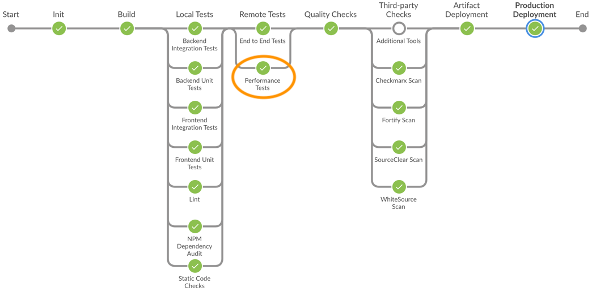
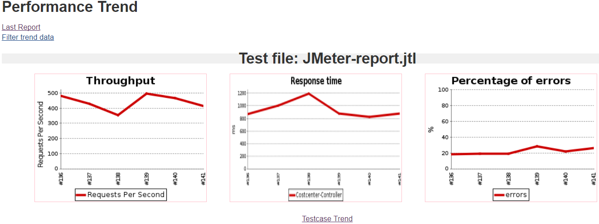
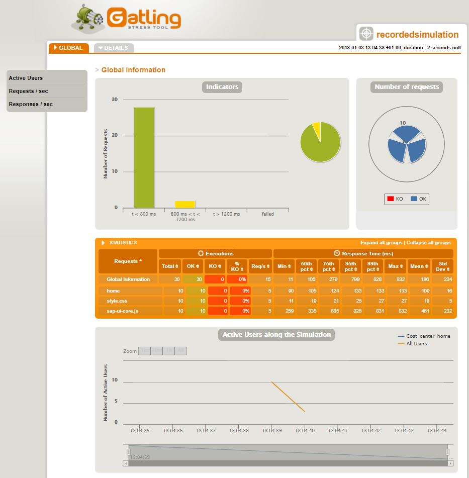

## Prerequisites
 - [Set up CI/CD](https://developers.sap.com/tutorials/cloudsdk-ci-cd.html)

## Details
### You will learn
  - How to set up performance test stage in CI/CD
  - How to do performance testing using JMeter
  - How to do performance testing using Gatling

Performance tests are the tests to determine the behavior of the software system and change in responsiveness under simulated load conditions. SAP Cloud SDK Pipeline has integrated support for performance tests using [JMeter](https://jmeter.apache.org/) and [Gatling](https://gatling.io/).

---

[ACCORDION-BEGIN [Step 1: ](Performance tests stage in CI-CD)]

SAP Cloud SDK Pipeline executes performance tests as part of remote tests in parallel to End to End tests of the system. In order to keep the isolation of performance tests from E2E tests, it is necessary to have dedicated deployments for each.

!

The deployments where the performance tests are carried out need to be configured in a manifest which can be then used in a stage configuration of `.pipeline/config.yml`. In a performance tests stage, the application is deployed to respective targets that are configured in the manifest before executing tests. An example configuration in `.pipeline/config.yml` is shown below.

```
#Stage Specific Configurations
stages:
  performanceTests:
    cfTargets:
      - space: 'Perf'
        manifest: 'manifest-perf.yml'
```

The following steps will elaborate the configuration of the performance tests with JMeter and Gatling in detail in an SAP Cloud SDK Pipeline context.

[DONE]
[ACCORDION-END]

[ACCORDION-BEGIN [Step 2: ](Performance tests by JMeter)]

[Apache JMeter](https://jmeter.apache.org/) is an open source performance tests tool which is developed primarily to work with JAVA based applications. One can prepare test plan either [manually](https://jmeter.apache.org/usermanual/build-web-test-plan.html) or by recording it with the help of a [recorder](https://jmeter.apache.org/usermanual/jmeter_proxy_step_by_step.html). SAP Cloud SDK Pipeline uses a docker image with preinstalled JMeter to execute the tests.

Once the test plans are ready, they can be copied to project directory. If only JMeter is used as a performance tests tool then test plans can be placed in a default location, which is `project_root/performance-tests` directory. However, if JMeter is used along with Gatling, then JMeter test plans should be kept in a subdirectory under a directory `performance-tests` for example `./performance-tests/JMeter/`.

After placing the test plans in an appropriate directory, JMeter tests can be enabled in the pipeline by placing below configuration in `.pipeline/config.yml`. Where default threshold for failure is set at 80 and unstable is set to 70. Whenever an error rate is beyond these thresholds, the pipeline would result in a failure status.

```
#Steps Specific Configuration
steps:
   checkJMeter:
    options: ''
    testPlan: './performance-tests/JMeter/*' # mandatory parameter if both JMeter and gatling are enabled
    dockerImage: 'famiko/jmeter-base'
    failThreshold : 80
    unstableThreshold: 70
```

By default, JMeter is executed in non-GUI mode (-n) and both logs and the dashboard are created as part of the execution. If the performance tests are being executed behind a proxy, the user has the flexibility to configure the proxy by passing them as an option as shown in below configuration except.

```
#Steps Specific Configuration
steps:
   checkJMeter:
    options: '-H my.proxy.server -P 8000 -u username -a password -N localhost'
    testPlan: './performance-tests/JMeter/*' # mandatory parameter if both JMeter and gatling are enabled
    dockerImage: 'famiko/jmeter-base'
    failThreshold : 80
    unstableThreshold: 70
```

If the test results exceed the thresholds, the status of the pipeline will be set to unstable or failure based on the threshold. You can find log entry similar to the below example in either case. Log files can be accessed in artifact section with a file name `JMeter-report.jtl`.

```
10:57:01 [Performance Tests] Performance: Recording JMeterCsv reports 'JMeter-report.jtl'
10:57:01 [Performance Tests] Performance: Parsing JMeter report file '/var/jenkins_home/jobs/example-project/branches/test-performane-test.luld4o/builds/3/performance-reports/JMeterCSV/JMeter-report.jtl'.
10:57:01 [Performance Tests] Performance: Percentage of errors greater or equal than 10% sets the build as unstable
10:57:01 [Performance Tests] Performance: Percentage of errors greater or equal than 14% sets the build as failure
10:57:01 [Performance Tests] Performance: File JMeter-report.jtl reported 17.4% of errors [FAILURE]. Build status is: FAILURE
```

If the test results are within the threshold, pipeline status will be set to success and performance tests reports are published in Jenkins along with log files. Log files can be accessed in artifact section whereas reports will be available on the dashboard. A sample JMeter performance tests report is shown below.

!

As the time of writing this tutorial, SAP Cloud SDK Pipeline does not support [Remote Testing](https://jmeter.apache.org/usermanual/remote-test.html).

[DONE]
[ACCORDION-END]


[ACCORDION-BEGIN [Step 3: ](Performance tests by Gatling)]

[Gatling](https://gatling.io/) is yet another powerful and open source performance testing tool for web applications. Gatling performance tests are executed as maven targets, generally as part of the test phase.

```
<dependencies>     
  <dependency>
           <groupId>io.gatling.highcharts</groupId>
           <artifactId>gatling-charts-highcharts</artifactId>
           <version>${gatling.version}</version>
           <scope>test</scope>
   </dependency>
   <dependency>
           <groupId>io.gatling</groupId>
           <artifactId>gatling-app</artifactId>
           <version>${gatling.version}</version>
           <scope>test</scope>
   </dependency>
</dependencies>
```

One needs to add Scala and Gatling plugins to the maven dependency since Gatling tests plans are written in Scala.

```
<build>
    <plugins>
      <plugin>
        <groupId>net.alchim31.maven</groupId>
        <artifactId>scala-maven-plugin</artifactId>
        <version>${scala-maven-plugin.version}</version>
      </plugin>
      <plugin>
        <groupId>io.gatling</groupId>
        <artifactId>gatling-maven-plugin</artifactId>
        <version>${gatling-plugin.version}</version>
      </plugin>
    </plugins>
</build>
```

Gatling tests can be launched with a maven command `mvn test -Dgatling.simulationClass=yoursimulationname`. Where a simulation class is a Scala class with a test plan. Like in JMeter, in Gatling too one can either use a [recorder](https://gatling.io/docs/2.3/http/recorder/) or a [manual](https://gatling.io/docs/2.3/advanced_tutorial/) test plan creation. You can find an example test plan below.

```
package com.sap.cloud.sdk.tutorial;
import scala.concurrent.duration._

import io.gatling.core.Predef._
import io.gatling.http.Predef._
import io.gatling.jdbc.Predef._

class RecordedSimulation extends Simulation {

	val httpProtocol = http
		.baseURL(<URL>)
		.proxy(Proxy("proxy_host", 8080).httpsPort(8080))
		.inferHtmlResources(WhiteList(), BlackList())

	val headers_0 = Map(
		"Accept" -> "text/html,application/xhtml+xml,application/xml;q=0.9,image/webp,image/apng,*/*;q=0.8",
		"Accept-Encoding" -> "gzip, deflate, br",
		"Accept-Language" -> "en-US,en;q=0.8",
		"Cache-Control" -> "no-cache",
		"Connection" -> "keep-alive",
		"Pragma" -> "no-cache",
		"Upgrade-Insecure-Requests" -> "1",
		"User-Agent" -> "Mozilla/5.0 (Windows NT 10.0; Win64; x64) AppleWebKit/537.36 (KHTML, like Gecko) Chrome/61.0.3163.100 Safari/537.36")


	val scn = scenario("scenario1")
		.exec(http("home")
			.get("/")
			.headers(headers_0)
			.check(status.not(404), status.not(500))
		)
	setUp(scn.inject(
    atOnceUsers(10), // 2
   ).protocols(httpProtocol)
  )
}
```

Once the test plans are created, they need to be placed under the `performance-test` directory of the project along with the `pom.xml`. Enabling Gatling test in SAP SDK Pipeline is as simple as enabling a toggle in `.pipeline/config.yml` file.

```
#Steps Specific Configuration
steps:
  checkGatling:
    enabled: True
```

Below is an example log which you will find in the pipeline log when Gatling performance tests are executed.

```
12:04:39 [Performance Tests] Simulation com.sap.cloud.sdk.tutorial.RecordedSimulation started...
12:04:40 [Performance Tests]
12:04:40 [Performance Tests] Simulation com.sap.cloud.sdk.tutorial.RecordedSimulation completed in 1 seconds
12:04:40 [Performance Tests] Parsing log file(s)...
12:04:40 [Performance Tests] Parsing log file(s) done
12:04:40 [Performance Tests] Generating reports...
12:04:41 [Performance Tests]
12:04:41 [Performance Tests] ================================================================================
12:04:41 [Performance Tests] ---- Global Information --------------------------------------------------------
12:04:41 [Performance Tests] > request count                                         30 (OK=30     KO=0     )
12:04:41 [Performance Tests] > min response time                                     11 (OK=11     KO=-     )
12:04:41 [Performance Tests] > max response time                                    832 (OK=832    KO=-     )
12:04:41 [Performance Tests] > mean response time                                   196 (OK=196    KO=-     )
12:04:41 [Performance Tests] > std deviation                                        234 (OK=234    KO=-     )
12:04:41 [Performance Tests] > response time 50th percentile                        105 (OK=105    KO=-     )
12:04:41 [Performance Tests] > response time 75th percentile                        279 (OK=279    KO=-     )
12:04:41 [Performance Tests] > response time 95th percentile                        799 (OK=799    KO=-     )
12:04:41 [Performance Tests] > response time 99th percentile                        828 (OK=828    KO=-     )
12:04:41 [Performance Tests] > mean requests/sec                                     15 (OK=15     KO=-     )
12:04:41 [Performance Tests] ---- Response Time Distribution ------------------------------------------------
12:04:41 [Performance Tests] > t < 800 ms                                            28 ( 93%)
12:04:41 [Performance Tests] > 800 ms < t < 1200 ms                                   2 (  7%)
12:04:41 [Performance Tests] > t > 1200 ms                                            0 (  0%)
12:04:41 [Performance Tests] > failed                                                 0 (  0%)
12:04:41 [Performance Tests] ================================================================================
12:04:41 [Performance Tests]
12:04:41 [Performance Tests] Reports generated in 0s.
12:04:41 [Performance Tests] Please open the following file: /var/jenkins_home/workspace/example-project_master-ULMBE43XNJDSWXSCQGCLMWOODKUSREOD5GZIRHSKEQIUSYYAVOEA@4/performance-tests/target/gatling/results/recordedsimulation-1514981078228/index.html
```

Once the performance tests have been executed the reports can be accessed with the help of a Gatling menu. Which provides detailed insight of results of tests execution including the graphical representation of them. Below images show the performance tests results of an example project.

!


[DONE]
[ACCORDION-END]

[ACCORDION-BEGIN [Step 4: ](Conclusion)]

Performance tests will help you to understand the behavior of the application under simulated load. Thereby helping to understand the implication of new changes on the application before it actually released to production. Integration of Performance tests stage in an SAP Cloud SDK Pipeline is a step towards ensuring better quality production system. The requirement of minimal configuration requirements makes it an easy to use feature.

[VALIDATE_1]
[ACCORDION-END]

[ACCORDION-BEGIN [Step 5: ](More Information)]

[Gatling Documentation](https://gatling.io/docs/2.3/general/)

[JMeter Getting Started](https://jmeter.apache.org/usermanual/get-started.html)

[DONE]
[ACCORDION-END]


---
