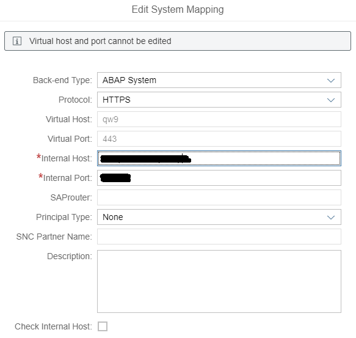
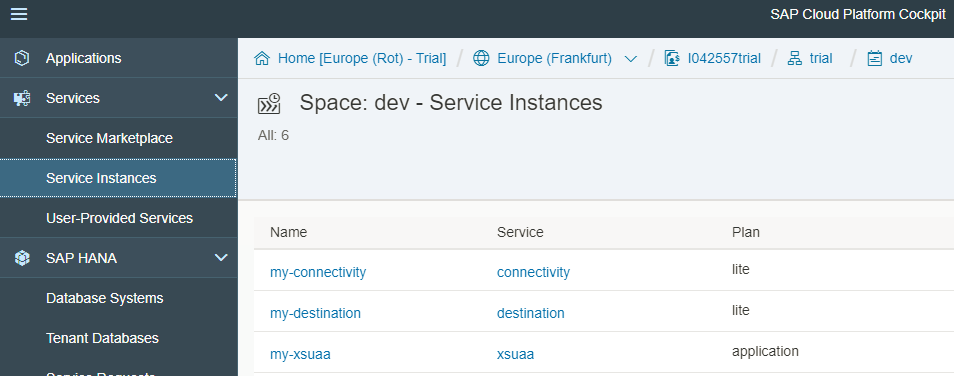
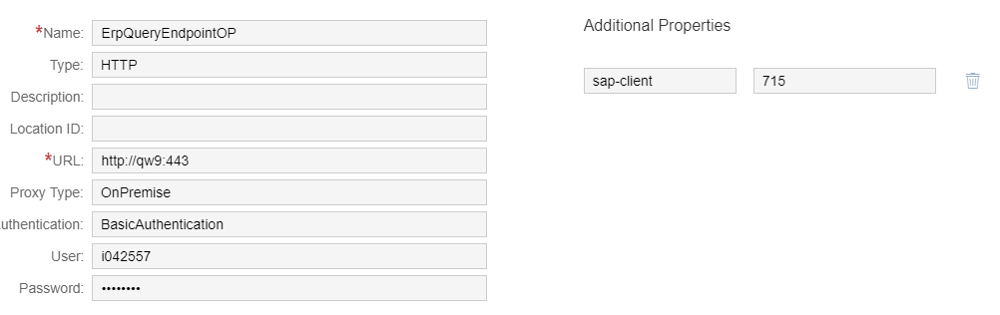
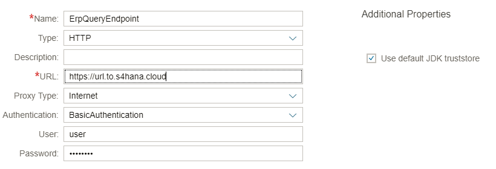
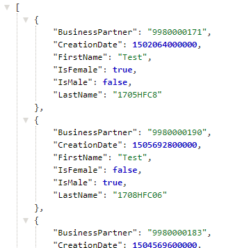

## Prerequisites
 - To demonstrate the connectivity, we will retrieve data from S/4HANA using OData services. Therefore, it is recommended to work through the following tutorial steps of our series to be able to experiment with S/4HANA On-Premise connectivity, as described in the sections below.
 - As On-Premise connectivity from SAP Cloud Platform, Cloud Foundry is supported starting from the SDK version 1.7.1, please, make sure that you use this or later version, when executing these steps.
 - **Group:** [Create a Cloud Foundry App Using SAP Cloud SDK](https://developers.sap.com/group.s4sdk-cloud-foundry.html).
 - **Tutorial:** [Secure Your Application on SAP Cloud Platform Cloud Foundry](https://developers.sap.com/tutorials/s4sdk-secure-cloudfoundry.html) (execute till the part **`Use OAuth scope to authorize users`**).
 - Make sure that you have access to On-Premise SAP S/4HANA. You may also check that business partner service is activated in your system using the transaction code SICF.
 - Beware that the destination service is currently Beta in SAP Cloud Platform, Cloud Foundry. Therefore, it is available only in a Trial landscape.

## Details
### You will learn
  - How to set up a connection to SAP S/4HANA from your cloud application running on SAP Cloud Platform, Cloud Foundry
  - Why this technology is helpful
  - You will see how the SDK abstracts SAP S/4HANA Editions and enables the communication with various S/4HANA editions using the same lines of code.

---

[ACCORDION-BEGIN [Step 1: ](Quick Look at the S/4HANA Query with the SDK Virtual Data Model)]
Now, let us consider business partner query in `BusinessPartnerServlet` that we have created in the first application and that is explained in details in the tutorial [Secure Your Application on SAP Cloud Platform Cloud Foundry](https://developers.sap.com/tutorials/s4sdk-secure-cloudfoundry.html):

```Java
final List<BusinessPartner> businessPartners =
    new DefaultBusinessPartnerService()
        .getAllBusinessPartner()
        .select(BusinessPartner.BUSINESS_PARTNER,
            BusinessPartner.LAST_NAME,
            BusinessPartner.FIRST_NAME,
            BusinessPartner.IS_MALE,
            BusinessPartner.IS_FEMALE,
            BusinessPartner.CREATION_DATE)
        .filter(BusinessPartner.BUSINESS_PARTNER_CATEGORY.eq(CATEGORY_PERSON))
        .orderBy(BusinessPartner.LAST_NAME, Order.ASC)
        .execute();
```
The execute() method is exactly the method that hides details related to connectivity to SAP S/4HANA from the application developer.

It is does not matter whether you are talking to S/4HANA Cloud or S/4HANA On-Premise edition. You can still use exactly the same query and the SDK will handle all the connectivity magic for you behind the scenes.

This enables separation of concerns: developers write source code and cloud platform account administrators take care of the customizing of corresponding S/4HANA instances.

[DONE]
[ACCORDION-END]

[ACCORDION-BEGIN [Step 2: ](Running Business Partner Calls Against S/4HANA On-Premise)]
Now, let us see, what customizing is required to run the application against SAP S/4HANA On-Premise.

## Set up Connectivity in Cloud Platform Account and Cloud Connector
1. Setting up Cloud Connector

    The blog post [Part 1: How to use SAP Cloud Platform Connectivity and Cloud Connector in the Cloud Foundry environment](https://blogs.sap.com/2017/07/09/how-to-use-the-sap-cloud-platform-connectivity-and-the-cloud-connector-in-the-cloud-foundry-environment-part-1/) gives a step by step guidance for setting up of Cloud Connector, including the required prerequisites. In a nutshell:

    - You will create a connection from your cloud connector instance to your Cloud Foundry account, where you deploy business partner application. Here is the example of my configuration:

    

    - You will enable cloud to on-premise access for the given account to your on-premise system. Here is the example of my configuration:

    

    Beware that the virtual host that you configure in the Cloud Connector will be referenced in the destination configuration, as shown below.

2. Create service instances in Cloud Foundry Account

    To be able to connect SAP S/4HANA On-Premise edition, you need to create an instance of the connectivity service that we will later bind to our business partner java application.

    To create your instance of the connectivity service, you can use Cloud Foundry CLI and execute the command:

    ```Shell
    cf create-service connectivity lite my-connectivity
    ```
    If you have executed the tutorial steps, mentioned in the prerequisites to this deep dive, you have already created the following service instances:

    - Instance my-xsuaa of the service Authorization & Trust Management

    - Instance my-destination of the destination service

    You can check your service instances in your Cloud Foundry cockpit, as shown in the screenshot below:

    

3. Configure S/4HANA destination

    Destinations can be configured via Cloud Foundry cockpit. Configuration of destinations can be done in a subaccount level, when you select the menu Connectivity -> Destinations (Beta).

    In the Business Partner query in our application, we use the method execute(), which runs the query against the destination with the default name `ERPQueryEndpoint`.

    The image below demonstrates my configuration that corresponds to the previously described configuration of the Cloud Connector and default destination name. Please note that to connect to SAP S/4HANA On-Premise, you need to set the Proxy Type to `OnPremise`:

    

    This default destination name is defined by the SDK. You can use another name, however, as it is demonstrated in our GitHub example S4-Connectivity. It can be useful in case you have several destinations. You can then explicitly reference the destination by name when creating `ErpConfigContext`, as follows (for example, for the endpoint with the name `S4HANA`):

    ```JavaScript
    execute(new ErpConfigContext("S4HANA"))
    ```

## Bind Cloud Platform Services in manifest.yml of Your Business Partner Application

After the service instances are created and customized, we will need to bind them to our application.

Modify already existing manifest.yml file in your business partner application by adding a binding to the new connectivity service instance. manifest.yml looks as follows in my case:

```
applications:

- name: firstapp
  memory: 768M
  host: firstapp-i042557trial
  path: application/target/firstapp-application.war
  buildpack: sap_java_buildpack
  env:
    TARGET_RUNTIME: tomee
    JBP_CONFIG_SAPJVM_MEMORY_SIZES: 'metaspace:96m..'
    SAP_JWT_TRUST_ACL: '[{"clientid" : "*", "identityzone" : "*"}]'
  services:
  - my-destination
  - my-xsuaa
  - my-connectivity
```

## Deploy and Test
Now, you can redeploy your business partner application in SAP Cloud Platform, Cloud Foundry and call the endpoint `/businesspartners` of your approuter to get a response from your On-Premise SAP S/4HANA system, as depicted below.


Let us take a look at the concepts of the inner working of the On-Premise connectivity and the SDK role in this scenario.

[DONE]
[ACCORDION-END]


[ACCORDION-BEGIN [Step 3: ](S/4HANA On-Premise Connectivity with the SDK: Under the Hood)]
What is actually going on behind the scenes, when you call the execute() method of the business partner query? Actually, several steps are executed that you even do not have to be aware of, as the SDK takes care of them for you.

The detailed explanation of the inner working of the On-Premise connectivity from SAP Cloud Platform, Cloud Foundry with basic authentication is provided in this blog post: [Part 2: How to use SAP Cloud Platform Connectivity and Cloud Connector in the Cloud Foundry environment](https://blogs.sap.com/2017/07/13/part-2-how-to-use-the-sap-cloud-platform-connectivity-and-the-cloud-connector-in-the-cloud-foundry-environment/?preview_id=515985)

When using the SDK, the steps, such as retrieving a [`Json Web Tocken (JWT)`](https://jwt.io/) to connect to the destination service, retrieving a configuration of the destination, obtaining a JWT for accessing the connectivity service, sending a request to the connectivity instance are handled by the SDK.

Looking at the high level architecture depicted in the referenced blog post, the steps 4a, 4b, 5, and 6 are performed when you are calling the execute() method of your business partner query.

[DONE]
[ACCORDION-END]

[ACCORDION-BEGIN [Step 4: ](Abstracting SAP S/4HANA Edition with the SDK: S/4HANA Cloud Connectivity)]
So far, we have looked at what needs to be done to set up SAP S/4HANA On-Premise connectivity from your application running in SAP Cloud Platform, Cloud Foundry.

One of the nice features of the SAP Cloud SDK is the abstraction of S/4HANA editions. What does it mean from the development perspective? You can write your code for S/4HANA On-Premise and you can be sure that you will be able to run your application against S/4HANA Cloud edition without any changes in code. You just need to adapt the configuration of the S/4HANA endpoint.

Let us see that in action.

## Set up Cloud Platform
All you need to do to read data from SAP S/4HANA Cloud is to adapt the default destination, changing it to the corresponding S/4HANA Cloud instance. This is how the destination for the Cloud system would look like:



>For S/4HANA Cloud communication, you can remove the binding of your application to the instance of the connectivity service in manifest.yml. It is only required in case of On-Premise connectivity.

## Deploy and Test
Now, you can redeploy your business partner application in SAP Cloud Platform, Cloud Foundry and call the endpoint `/businesspartners` of approuter to get a response from SAP S/4HANA Cloud system, as depicted below.



We have just switched the S/4HANA edition that our application is talking to without changing a single line of code. As a developer, I like that! 🙂

[DONE]
[ACCORDION-END]

[ACCORDION-BEGIN [Step 5: ](Further Information and Related Reading)]
First of all, I recommend you to check out [S4-Connectivity example on GitHub](https://github.com/SAP/cloud-s4-sdk-examples/tree/master/S4-Connectivity) that demonstrates the usage of the same code line for various S/4HANA editions. Beware that you will need to configure two destinations in your account to run this example: `ErpQueryEndpointCloud` (S/4HANA Cloud endpoint) and `ErpQueryEndpointOP` (S/4HANA On-Premise). Also, do not forget to [Secure Your Application on SAP Cloud Platform Cloud Foundry](https://developers.sap.com/tutorials/s4sdk-secure-cloudfoundry.html) with an approuter before testing it.

As written in sections above, we highly recommend to check out the blog post, provided by SAP Cloud Platform colleagues: [Part 2: How to use SAP Cloud Platform Connectivity and Cloud Connector in the Cloud Foundry environment](https://blogs.sap.com/2017/07/13/part-2-how-to-use-the-sap-cloud-platform-connectivity-and-the-cloud-connector-in-the-cloud-foundry-environment/?preview_id=515985). You do not need to implement these steps when building an app with the SDK, but it is always helpful to get an insight on an inner working.

In addition to that, here are some link to the related official SAP documentation, in case you are interested to research on this topic more and to get insight on the corresponding Cloud Foundry services:

- [Consuming the Connectivity Service (Cloud Foundry Environment)](https://help.sap.com/viewer/cca91383641e40ffbe03bdc78f00f681/Cloud/en-US/313b215066a8400db461b311e01bd99b.html)

- [Consuming the Destination Service (Cloud Foundry Environment, Beta)](https://help.sap.com/viewer/cca91383641e40ffbe03bdc78f00f681/Cloud/en-US/7e306250e08340f89d6c103e28840f30.html)

- [Configuring the Cloud Connector for HTTP](https://help.sap.com/viewer/cca91383641e40ffbe03bdc78f00f681/Cloud/en-US/de297ca9f7d04a8b83fea261f3fc3806.html)

[DONE]
[ACCORDION-END]

[ACCORDION-BEGIN [Appendix: ](Test yourself)]

[VALIDATE_1]

[ACCORDION-END]

---
