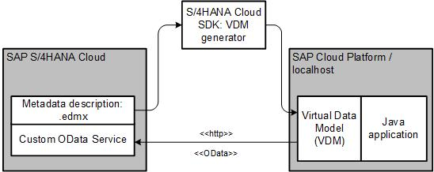
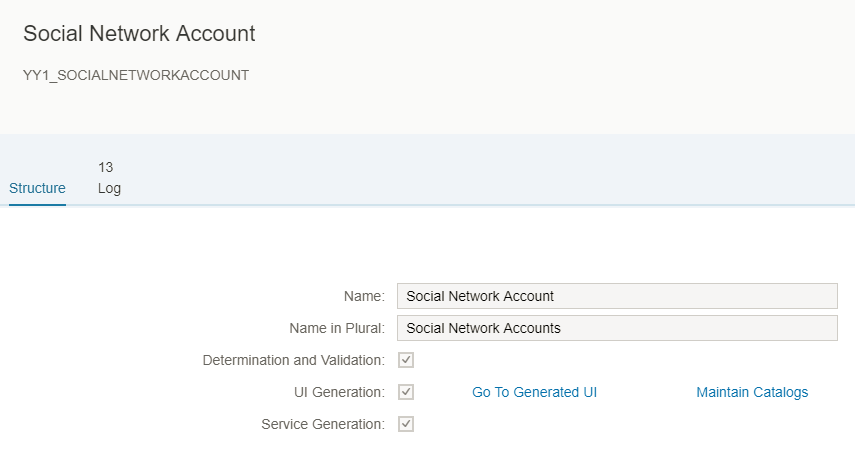
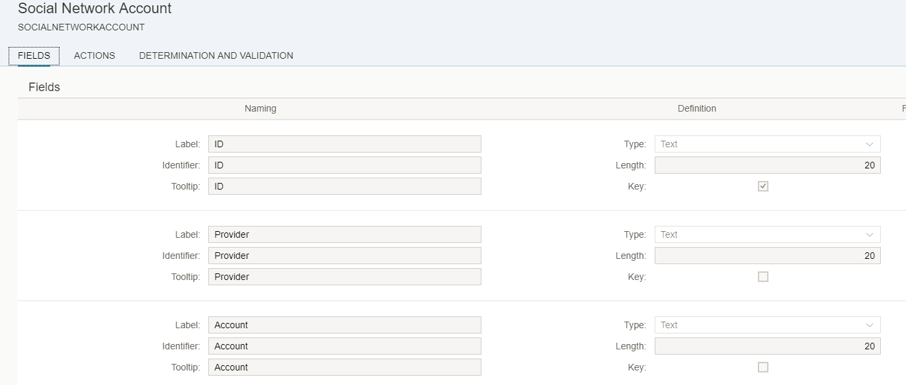
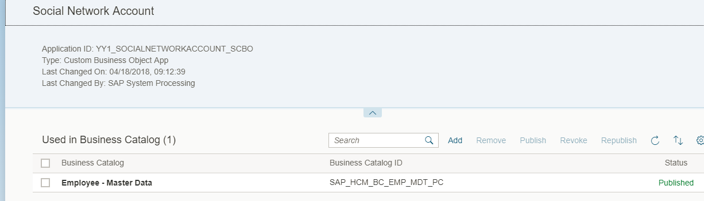
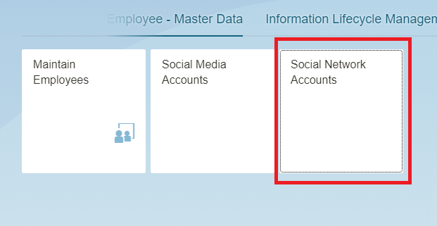
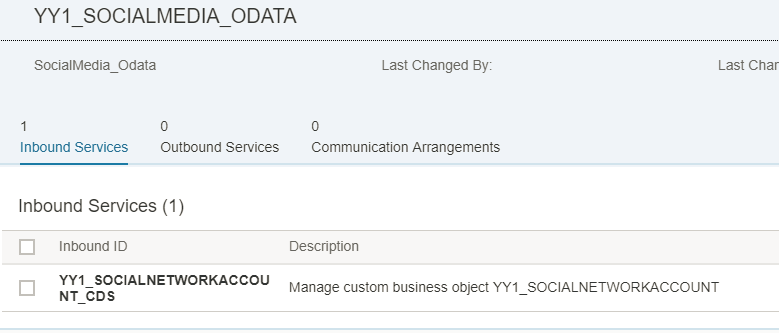
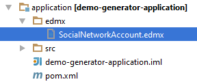
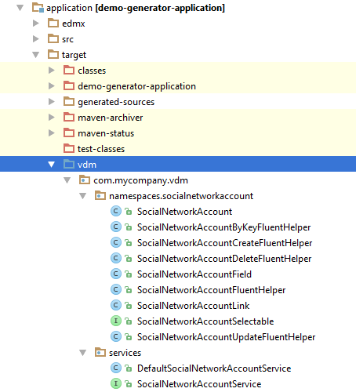
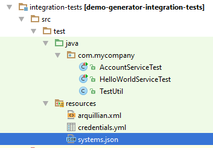
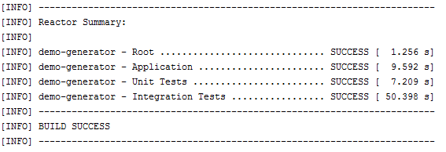

## Prerequisites
 - Access to SAP S/4HANA and the necessary roles assignments to perform in-app extensibility with key-user tools
 - Be familiar with the main concepts and principles of the in-app extensibility.

## Details
### You will learn
  - How to integrating the VDM for a custom OData service in your Java project

We cover aspects, such as creation of an in-app extension (custom business object) using the key user tools, exposing a custom OData service in S/4HANA Cloud, generating the VDM for the created custom OData service, and using the generated VDM in a Java project.

In addition to the generator itself, we also cover some SAP S/4HANA in-app extensibility steps in order to create a custom OData service. However, as the focus of this blog post is the VDM generator, we will not explain the SAP S/HANA in-app extensibility options in many details.

---

[ACCORDION-BEGIN [Step 1: ](Recap on OData VDM)]
Since the first versions of the SAP Cloud SDK, it has been providing the VDM for white-listed SAP S/4HANA OData services that can be found in [SAP API hub](https://api.sap.com/shell/discover/contentpackage/SAPS4HANACloud). In VDM, each service is represented as a Java interface and a corresponding implementation that calls OData service in S/4HANA. Take a look at the following source code demonstrating the execution of the query against the white-listed business partner API:

```Java
final List<BusinessPartner> businessPartners =
        new DefaultBusinessPartnerService()
                .getAllBusinessPartner()
                .select(BusinessPartner.BUSINESS_PARTNER,
                        BusinessPartner.LAST_NAME,
                        BusinessPartner.FIRST_NAME,
                        BusinessPartner.IS_MALE,
                        BusinessPartner.IS_FEMALE,
                        BusinessPartner.CREATION_DATE)
                .execute();
```

Why do we recommend to use the VDM when connecting to OData services from your Java code?

The good explanation is provided in the Tutorial [Connect to OData Service on Cloud Foundry Using SAP Cloud SDK](https://developers.sap.com/tutorials/s4sdk-odata-service-cloud-foundry.html) or [Connect to OData service on Neo using SAP Cloud SDK](https://developers.sap.com/tutorials/s4sdk-odata-service-neo.html).

In short, with VDM, you work with classes and methods instead of strings while building the OData queries, so you cannot make a typo, which is not possible to `catch` during the compilation of your source code. The VDM provides the Java data types for entities and ensures type safety for OData methods, such as `filter`, `select`, and `orderBy`.

Comparing the OData and SQL worlds, the OData VDM does the same job for OData as [Query DSL, such as JOOQ](https://en.wikipedia.org/wiki/Java_Object_Oriented_Querying) for SQL, providing a domain-specific language to construct queries from classes generated from metadata.


[DONE]
[ACCORDION-END]

[ACCORDION-BEGIN [Step 2: ](VDM Generator)]
In many cases, SAP S/4HANA extension is a combination of in-app and side-by-side approaches. In this case, custom objects, such as business objects or CDS view and custom OData services can be created in S/4HANA and consumed by applications running in SAP Cloud Platform. New custom OData services are not represented in SAP API Hub and therefore they do not have corresponding VDM objects in the SAP Cloud SDK.

To allow the developers to enjoy the same type-safe fluent Java API for accessing custom OData services, we have released the VDM generator. In the [SDK version 1.10.0](https://blogs.sap.com/2018/04/12/sap-s4hana-cloud-sdk-version-1.10.0-is-available/#), we have announced the productive release of this component.

As announced in the release blog, you can use one of the following options to run the generator:

Option 1, Standalone Jar file via command line: Just download the latest version from [Maven Central](https://search.maven.org/) (search for odata-generator-cli) and follow the instructions provided in the corresponding section of the [release blog](https://blogs.sap.com/2018/04/12/sap-s4hana-cloud-sdk-version-1.10.0-is-available/#)

Option 2, Java dependency: Include the odata-generator artifact as a dependency in your pom and use `DataModelGenerator` class directly in your code to trigger the generation (you can also update the version of the generator based on the latest SDK release, which you can find in our [release notes](https://help.sap.com/http.svc/rc/6c02295dfa8f47cf9c08a19f2e172901/1.0/en-US/index.html)):

```
<dependency>
    <groupId>com.sap.cloud.s4hana.datamodel</groupId>
    <artifactId>odata-generator</artifactId>
    <version>2.9.1</version>
</dependency>
```

Option 3, Maven plugin: Add the odata-generator-maven-plugin to your maven configuration and generate sources from the metadata during the project build.

In this blog post, we have chosen to run the generator using the maven plugin option (Option 3) in the project. With this approach, we reduce the manual effort of separate generating of sources on every metadata change and ensure consistency of the generated VDM and the metadata file on each build of the project.

The picture below describes the main components involved in the setup described in this blog.



In the sections below, we explain these components one by one:

1. **Extend SAP S/4HANA Cloud with a custom OData service**: Create a custom business object (Social Network Account) and a corresponding OData service in SAP S/4HANA Cloud

2. **Generate the VDM**: Set up a project and generate the VDM for a custom service using the generator as maven plugin

3. **Consume the service via VDM**: Write a simple Java application and a corresponding integration test


[DONE]
[ACCORDION-END]


[ACCORDION-BEGIN [Step 3: ](Extend SAP S/4HANA Cloud with a Custom OData Service)]
Before moving to the OData VDM generator functionality, we prepare a custom OData service that will be used for the generation.

For this purpose, we use the key user extensibility tools in SAP S/4HANA Cloud system. Note that you can also create a custom OData service in SAP S/4HANA On-Premise in case you do not have access to the Cloud edition.

1. Create a custom business object and generate the corresponding OData service and UI

    For the purpose of the demo in this blog post, we create a simple business object: social network accounts. It allows to store the data regarding social network accounts for business partners and employees. To create this business object, we use the application `Custom Business Objects` that can be found in the Extensibility catalog.

    In the screenshot below, you see that we have activated UI and service generation for our custom business object. UI generation will automatically create the Fiori UI application that we will later use to create the data. The service generation option means that the OData service will be generated.

    

    The following fields are maintained for this business object: ID, provider, account, all the added fields are of type `text`:

    

    As we have chosen to generate the UI and the OData service, publishing the business object will create these related artifacts.

    To access the generated UI, we need to assign the business object to a catalog. After we have done this, the application will be immediately available for all users with the roles containing this catalog. In the next step, we will do this assignment to be able to access and to write the data via UI.

2. Add the business object to the catalog

    Assignment to a catalog can be done via the `Maintain Catalogs` option in the initial screen of the custom business object. We assign this object to the catalog `Employee – Master Data`.

    

    After publishing the object in the catalog, the newly created application is available in the Fiori Launchpad. In the next step, we will evaluate this application and create the data using the generated UI.

3. Add data via UI in SAP S/4HANA Cloud

    In the Fiori Launchpad, we can now see the newly created application:

    

    We add the following few records. This data will be later accessed in our Java application:

    

    We can now easily access the created data via the UI in Fiori Launchpad. We now need to enable access to the corresponding API from our Java application that we will build. For that purpose, we need a custom communication scenario and a corresponding communication arrangement.

4. Create custom communication scenario, user, system, and arrangement

    We create the communication scenario, assigning the generated social network service as an inbound service, as it will be called from external systems, such as the local machine (for integration testing) and SAP Cloud Platform applications.

    

    With the custom communication scenario in place, you can now create a communication arrangement based on the scenario. The creation of communication arrangement for custom OData API does not differ from the one for standard OData services.

    The blog [Deep Dive 1 with SAP Cloud SDK: An End-to-End Story on the Virtual Data Model using the Business Partner API](https://blogs.sap.com/2017/09/15/step-12-with-sap-s4hana-cloud-sdk-consuming-business-api-from-s4hana-via-odata/) provides a good practical introduction on how to create the communication system, user, and arrangement in order to enable access to APIs from the local machine, which is sufficient for the example given in this blog post.

    Also, please refer to this [blog post](https://blogs.sap.com/2017/09/15/what-is-what-your-quick-reference-to-communication-management-and-identity-access-management-artifacts-in-s4hana/) to get overview on the concept of SAP S/4HANA Cloud communication and integration artifacts.

5. Evaluate the generated OData service

    Now, when we have enabled the generated custom OData service, let us take a look at its metadata. The metadata of the OData service is represented by an `edmx` file that can be accessed by adding /$metadata to the OData service base path. We use the following URL:

    ```
    <S4_URL>/sap/opu/odata/sap/YY1_SOCIALNETWORKACCOUNT_CDS/$metadata?sap-language=EN
    ```

    ```
    <edmx:Edmx xmlns:edmx="http://schemas.microsoft.com/ado/2007/06/edmx" xmlns:m="http://schemas.microsoft.com/ado/2007/08/dataservices/metadata" xmlns:sap="http://www.sap.com/Protocols/SAPData" Version="1.0">
    <edmx:Reference xmlns:edmx="http://docs.oasis-open.org/odata/ns/edmx" Uri="https://my300098.s4hana.ondemand.com:443/sap/opu/odata/IWFND/CATALOGSERVICE;v=2/Vocabularies(TechnicalName='%2FIWBEP%2FVOC_COMMON',Version='0001',SAP__Origin='')/$value">
    <edmx:Include Namespace="com.sap.vocabularies.Common.v1" Alias="Common"/>
    </edmx:Reference>
    <edmx:Reference xmlns:edmx="http://docs.oasis-open.org/odata/ns/edmx" Uri="https://my300098.s4hana.ondemand.com:443/sap/opu/odata/IWFND/CATALOGSERVICE;v=2/Vocabularies(TechnicalName='%2FIWBEP%2FVOC_CAPABILITIES',Version='0001',SAP__Origin='')/$value">
    <edmx:Include Namespace="Org.OData.Capabilities.V1" Alias="Capabilities"/>
    </edmx:Reference>
    <edmx:DataServices m:DataServiceVersion="2.0">
    <Schema xmlns="http://schemas.microsoft.com/ado/2008/09/edm" Namespace="YY1_SOCIALNETWORKACCOUNT_CDS" xml:lang="en" sap:schema-version="1">
    <EntityType Name="YY1_SOCIALNETWORKACCOUNTType" sap:label="Social Network Account" sap:content-version="1">
    <Key>
    <PropertyRef Name="SAP_UUID"/>
    </Key>
    <Property Name="SAP_UUID" Type="Edm.Guid" Nullable="false" sap:label="UUID" sap:quickinfo="16 Byte UUID in 16 Bytes (Raw Format)"/>
    <Property Name="ID" Type="Edm.String" MaxLength="20" sap:label="ID"/>
    <Property Name="Provider" Type="Edm.String" MaxLength="20" sap:label="Provider"/>
    <Property Name="Account" Type="Edm.String" MaxLength="20" sap:label="Account"/>
    </EntityType>
    <EntityContainer Name="YY1_SOCIALNETWORKACCOUNT_CDS_Entities" m:IsDefaultEntityContainer="true" sap:supported-formats="atom json xlsx">
    <EntitySet Name="YY1_SOCIALNETWORKACCOUNT" EntityType="YY1_SOCIALNETWORKACCOUNT_CDS.YY1_SOCIALNETWORKACCOUNTType" sap:searchable="true" sap:content-version="1"/>
    </EntityContainer>
    <Annotations xmlns="http://docs.oasis-open.org/odata/ns/edm" Target="YY1_SOCIALNETWORKACCOUNT_CDS.YY1_SOCIALNETWORKACCOUNTType/ID">
    <Annotation Term="Common.FieldControl" EnumMember="Common.FieldControlType/Mandatory"/>
    <Annotations xmlns="http://docs.oasis-open.org/odata/ns/edm" Target="YY1_SOCIALNETWORKACCOUNT_CDS.YY1_SOCIALNETWORKACCOUNTType">
    <Annotation Term="Common.SemanticKey">
    <Collection>
    <PropertyPath>ID</PropertyPath>
    </Collection>
    </Annotation>
    </Annotations>
    <atom:link xmlns:atom="http://www.w3.org/2005/Atom" rel="self" href="https://my300098.s4hana.ondemand.com:443/sap/opu/odata/sap/YY1_SOCIALNETWORKACCOUNT_CDS/$metadata"/>
    <atom:link xmlns:atom="http://www.w3.org/2005/Atom" rel="latest-version" href="https://my300098.s4hana.ondemand.com:443/sap/opu/odata/sap/YY1_SOCIALNETWORKACCOUNT_CDS/$metadata"/>
    </Schema>
    </edmx:DataServices>
    </edmx:Edmx>
    ```

    [The wiki page](https://wiki.scn.sap.com/wiki/display/EmTech/SAP+Annotations+for+OData+Version+2.0) will helps to understand some important aspects of the metadata file. Let us note some of them:

    - This `edmx` file contains a description of a single entity with the name `YY1_SOCIALNETWORKACCOUNTType` and label Social Network Account.
    - The entity contains four properties, three of them were created by a user and are of type Edm.String (ID, Provider, Account) and one added by the system: `SAP_UUID` of type Edm.Guid. All of them contain Name and sap:label attributes.
    - Within the `EntityContainer` tag in the `EntitySet` tag level, the attributes such as sap:addressable, sap:creatable, sap:deletable, sap:updatable can be specified to change the default behavior of an OData service.
    - The tag <atom:link> is used to specify the base path to the OData service that is also considered during the VDM generation.


[DONE]
[ACCORDION-END]

[ACCORDION-BEGIN [Step 4: ](Generate VDM)]
After we have prepared the consumable service on the SAP S/4HANA Cloud side, we can now move forward with the generation of the VDM for this service. In this blog post we focus on the maven archetype option and connect the generation of sources with the maven lifecycle.

We generate the project from the SDK `archtype` scp-cf-tomee, as it is described in the blog Step 3 with SAP Cloud SDK: `HelloWorld` on `SCP CloudFoundry`. Note, however, that you can use any other project structure and you just need to add few dependencies to be able to integrate the generator.

After creating the project structure, we add the `edmx` folder and the corresponding Social Network Account service metadata file into the application folder, as shown in the screenshot below. We just copied the metadata file that we saw in the previous section into the project structure.



Now, we can adapt the pom file of our project application pom.xml to integrate and customize the VDM generator component. We recommend to use the latest version of the SDK VDM generator in the code snippet below – we give an example with the version 2.9.1. You can look up the latest available version in the SDK release notes.

So, go to the file <root project folder>/application/pom.xml and make the required changes described below.

We add the generator plugin into the pom under <build> <plugins> section, as follows. Please note that if you use the generator for services other then SAP S/4HANA services, you might need to add the parameter `defaultBasePath` to the configuration section, which should provide the base path to the exposed API (e.g `odata/v2/`). For example, see the tutorial on SAP Success Factors integration with the example of the base path for Success Factors services.

```
<plugin>
    <groupId>com.sap.cloud.s4hana.datamodel</groupId>
    <artifactId>odata-generator-maven-plugin</artifactId>
    <version>2.9.1</version>
    <executions>
        <execution>
            <id>generate-consumption</id>
            <phase>generate-sources</phase>
            <goals>
                <goal>generate</goal>
            </goals>
            <configuration>
                <inputDirectory>${project.basedir}/edmx</inputDirectory>
                <outputDirectory>${project.build.directory}/vdm</outputDirectory>
                <deleteOutputDirectory>true</deleteOutputDirectory>
                <packageName>com.mycompany.vdm</packageName>
            </configuration>
        </execution>
    </executions>
</plugin>
```

Note that the execution of the generator is bound the generate-sources phase, which is part of maven's build lifecycle. Therefore, the generation will be executed on each project build.


Here, we use the following parameters to configure the generator.

| Parameter Value	| Explanation
|  :------------- | :-------------
| `<inputDirectory>${project.basedir}/edmx</inputDirectory>` | `Location of the metadata .edmx file that is used as a source for the generation.`
| `<outputDirectory>${project.build.directory}/vdm</outputDirectory>`	| `Location of the output directory for generated sources.`
| `<deleteOutputDirectory>true</deleteOutputDirectory>`	| `Target directory is deleted before every execution of the generator.`
| `<packageName>com.mycompany.vdm</packageName>	| `Package name for the generated sources.`

In addition, we need to add the following plugin to specify that the VDM target folder should be considered as a source folder by maven:

```
<plugin>
    <groupId>org.codehaus.mojo</groupId>
    <artifactId>build-helper-maven-plugin</artifactId>
    <version>3.0.0</version>
    <executions>
        <execution>
            <phase>generate-sources</phase>
            <goals>
                <goal>add-source</goal>
            </goals>
            <configuration>
                <sources>
                    <source>${project.build.directory}/vdm</source>
                </sources>
            </configuration>
        </execution>
    </executions>
</plugin>
```

As `lombokVDM` and dependency injections are used by the generated VDM classes, we also add the following dependencies if they are not included into the project yet:

```
<dependency>
    <groupId>org.projectlombok</groupId>
    <artifactId>lombok</artifactId>
    <scope>provided</scope>
</dependency>
<dependency>
    <groupId>javax.inject</groupId>
    <artifactId>javax.inject</artifactId>
    <scope>provided</scope>
</dependency>
```

You can find the final pom file for our example project on [GitHub](https://github.com/SAP/cloud-s4-sdk-examples/blob/master/VDMGenerator/application/pom.xml).

Now, our pom file is ready and we can run the maven command to build the project, which will also trigger the VDM sources generation.

```
mvn clean install
```

After the generation and the build is through, you can find the target and the VDM folder in your project structure, as you have specified in the configuration of the generator maven plugin in <outputDirectory>..</outputDirectory>.

After the generation and the build is through, you can find the target and the VDM folder in your project structure, as you have specified in the configuration of the generator maven plugin in <outputDirectory>..</outputDirectory>.



In the VDM folder, you can now find two packages, containing the generated sources:

**`namespaces.socialnetworkaccount`** that includes classes corresponding to `OData` Entities (in our case, it is a single class `SocialNetworkAccount`) and corresponding fluent helpers that are used to build OData with the fluent Java APIs (refer to the Blog for more details).

**`services`** that contains the Java interface and implementation that calls custom OData service in S/4HANA.

[DONE]
[ACCORDION-END]

[ACCORDION-BEGIN [Step 5: ](Consume the Service via VDM)]
Now, we can integrate the generated VDM classes to build OData queries using fluent and type safe Java APIs. We create a simple servlet in order to test this. The servlet implements `doGet()` and retrieves the social network accounts from SAP S/4HANA Cloud and returns this data as a json list. See the final source code of the servlet in [GitHub](https://github.com/SAP/cloud-s4-sdk-examples/blob/master/VDMGenerator/application/src/main/java/com/mycompany/AccountServlet.java).

The code snippet below demonstrates the usage of the generated `VDM` for the custom `OData` service:

```Java
final List<SocialNetworkAccount> socialNetworkAccounts = new DefaultSocialNetworkAccountService()
                    .getAllSocialNetworkAccount()
                    .select(SocialNetworkAccount.PROVIDER, SocialNetworkAccount.ACCOUNT)
                    .execute();
```

To make sure that the servlet is working as expected and the connection and data retrieval using the VDM succeeds, we add an integration test for the /accounts. Note that this step will not work in case you do not have access to SAP S/4HANA and just used the provided template `edmx` file to generate sources.

As we have already added some social network accounts via business objects UI (see in I. Extend SAP S/4HANA Cloud with a Custom OData Service), we expect that the endpoint returns some data. To check that, we build a [simple integration test](https://github.com/SAP/cloud-s4-sdk-examples/blob/master/VDMGenerator/integration-tests/src/test/java/com/mycompany/AccountServiceTest.java):

```Java
@Test
public void testService()
{
    when().
            get("/accounts").
            then().
            statusCode(200).
            contentType(ContentType.JSON).
            body("$", hasSize(greaterThan(0))).
            body("[0].Provider", not(isEmptyOrNullString()));
}
```

Please, note that you will need `systems.json` and `credentials.yml` files in the resources folder in your integration tests to mock `ErpDestination` in tests. Please, refer to the blog [Step 13 with SAP Cloud SDK: Automated Testing](https://blogs.sap.com/2017/09/19/step-12-with-sap-s4hana-cloud-sdk-automated-testing/) section Mock ERP Destination for more details on this topic.



By running this test, we ensure that building and executing the `OData` query using the generated VDM succeeds:



[DONE]
[ACCORDION-END]

[ACCORDION-BEGIN [Appendix: ](Test yourself)]

[VALIDATE_1]

[ACCORDION-END]

[ACCORDION-BEGIN [Appendix: ](Test yourself)]

[VALIDATE_2]

[ACCORDION-END]

---
