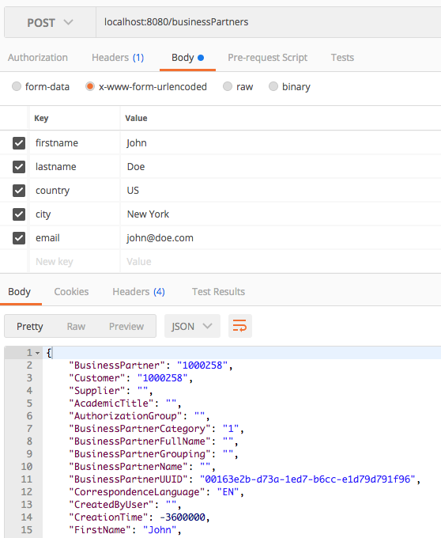
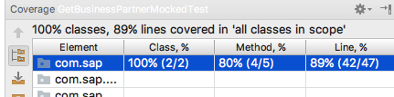

## Prerequisites
 - [Introduce Resilience to Your Application](s4sdk-resilience)
 - [Connect to OData Service on Cloud Foundry Using SAP Cloud SDK](s4sdk-odata-service-cloud-foundry)
 - [Develop an S/4HANA Extension Without an S/4HANA System](cloudsdk-mocking-capabilities)

## Details

Use advanced features of the [Virtual Data Model for OData](https://sap.github.io/cloud-sdk/docs/java/features/odata/overview).

### You will learn
  - How to build up a complex data structure using the virtual data model
  - How to write deeply nested data to SAP S/4HANA in a single call
  - How to write unit and integration tests for deep insertion


---

[ACCORDION-BEGIN [Step 1: ](Motivation)]
Deep Insert is already part of the [OData specification, version2](https://www.odata.org/documentation/odata-version-2-0/operations/) without this explicit name. Although not supported yet, the [OData specification, version4](http://docs.oasis-open.org/odata/odata/v4.0/os/part1-protocol/odata-v4.0-os-part1-protocol.html#_Toc372793718) is much more explicit on the semantics.

Citing from the spec, Deep Insert is defined as:

- A request to create an entity that includes related entities, represented using the appropriate inline representation, is referred to as a deep insert.

- On success, the service **MUST** create all entities and relate them.

- On failure, the service **MUST NOT** create any of the entities.

This means deep insert is an atomic operation that is either successful or fails for all entities. Furthermore, it is for insert-only operations, that is, the OData spec does not foresee any deep update operation yet. To be fair, it is part of the [4.01 working draft spec](https://issues.oasis-open.org/browse/ODATA-666), but the tutorials haven't covered any provider implementations yet, in particular as S/4HANA APIs are based on OData V2.

[DONE]
[ACCORDION-END]

[ACCORDION-BEGIN [Step 2: ](Write the application code)]

To get started, you first of all create a new class called `StoreBusinessPartnerCommand`. It will serve as a single place to build the commands we want to execute. If you did our previous tutorials the following code might look familiar.

The file needs to be put under your `<projectroot>/application/src/main/java/com/sap/cloud/sdk/tutorial` directory.

```Java
package com.sap.cloud.sdk.tutorial;

import com.sap.cloud.sdk.cloudplatform.connectivity.HttpDestination;
import com.sap.cloud.sdk.cloudplatform.resilience.ResilienceConfiguration;
import com.sap.cloud.sdk.cloudplatform.resilience.ResilienceDecorator;
import com.sap.cloud.sdk.cloudplatform.resilience.ResilienceRuntimeException;
import com.sap.cloud.sdk.datamodel.odata.client.exception.ODataException;
import com.sap.cloud.sdk.s4hana.datamodel.odata.namespaces.businesspartner.BusinessPartner;
import com.sap.cloud.sdk.s4hana.datamodel.odata.services.BusinessPartnerService;

public class StoreBusinessPartnerCommand{

    private final BusinessPartnerService businessPartnerService;
    private final BusinessPartner businessPartner;
    private final HttpDestination httpDestination;

    public StoreBusinessPartnerCommand(HttpDestination httpDestination, BusinessPartnerService businessPartnerService, BusinessPartner businessPartner) {
        this.businessPartnerService = businessPartnerService;
        this.businessPartner = businessPartner;
        this.httpDestination = httpDestination;
    }

    public BusinessPartner execute() {
        return ResilienceDecorator.executeSupplier(this::run, ResilienceConfiguration.of(GetBusinessPartnersCommand.class));
    }

    private BusinessPartner run() {
        try {
            return businessPartnerService
                    .createBusinessPartner(businessPartner)
                    .executeRequest(httpDestination);
        } catch (final ODataException e) {
            throw new ResilienceRuntimeException(e);
        }
    }
}

```

> ### What does the code do?
> The code introduces a `StoreBusinessPartnerCommand` that uses a `BusinessPartnerService`, a `HttpDestination` and a `BusinessPartner` instance to execute a create command.
Within the run() method, i.e., whenever the command is executed, it calls the `businesspartner service`.
>
> The `StoreBusinessPartnerCommand` takes a `Businesspartner` instance as input. This is a potentially complex (containing nested entities) data type. Therefore, in the next step you need to create a nested data structure based on the `BusinessPartner` data model.
>
> The structure you are interested in is presented below. The root entity will be the business partner which is connected to zero-to-many `BusinessPartnerRoles` and `BusinessPartnerAddresses` which is again connected to zero-to-many `EMailAddresses`:

!

For this purpose, you are creating a new simple servlet that exposes a POST method to our clients.

```Java
package com.sap.cloud.sdk.tutorial;

import com.google.gson.Gson;
import com.sap.cloud.sdk.cloudplatform.connectivity.DestinationAccessor;
import com.sap.cloud.sdk.cloudplatform.connectivity.HttpDestination;
import com.sap.cloud.sdk.s4hana.connectivity.DefaultErpHttpDestination;
import com.sap.cloud.sdk.s4hana.connectivity.ErpHttpDestination;
import com.sap.cloud.sdk.s4hana.datamodel.odata.namespaces.businesspartner.AddressEmailAddress;
import com.sap.cloud.sdk.s4hana.datamodel.odata.namespaces.businesspartner.BusinessPartner;
import com.sap.cloud.sdk.s4hana.datamodel.odata.namespaces.businesspartner.BusinessPartnerAddress;
import com.sap.cloud.sdk.s4hana.datamodel.odata.namespaces.businesspartner.BusinessPartnerRole;
import com.sap.cloud.sdk.s4hana.datamodel.odata.services.DefaultBusinessPartnerService;
import org.slf4j.Logger;
import org.slf4j.LoggerFactory;

import javax.servlet.ServletException;
import javax.servlet.annotation.WebServlet;
import javax.servlet.http.HttpServlet;
import javax.servlet.http.HttpServletRequest;
import javax.servlet.http.HttpServletResponse;
import java.io.IOException;
import java.util.List;

@WebServlet("/businessPartners")
public class BusinessPartnerServlet extends HttpServlet {

    private static final Logger logger = LoggerFactory.getLogger(BusinessPartnerServlet.class);
    private static final String DESTINATION_NAME = "MyErpSystem";

    @Override
    protected void doGet(final HttpServletRequest request, final HttpServletResponse response)
        throws ServletException, IOException {

        try {
            final ErpHttpDestination destination = DestinationAccessor.getDestination(DESTINATION_NAME).asHttp().decorate(DefaultErpHttpDestination::new);
            final List<BusinessPartner> businessPartners = new GetBusinessPartnersCommand(destination).execute();

            response.setContentType("application/json");
            response.getWriter().write(new Gson().toJson(businessPartners));

        } catch (final Exception e) {
            logger.error(e.getMessage(), e);
            response.setStatus(HttpServletResponse.SC_INTERNAL_SERVER_ERROR);
            response.getWriter().write(e.getMessage());
            e.printStackTrace(response.getWriter());
        }
    }

    protected void doPost(HttpServletRequest request, HttpServletResponse response) throws ServletException, IOException {

        final String firstname = request.getParameter("firstname");
        final String lastname = request.getParameter("lastname");
        final String country = request.getParameter("country");
        final String city = request.getParameter("city");
        final String email = request.getParameter("email");

        //do consistency checks here...

        final AddressEmailAddress emailAddress = AddressEmailAddress.builder()
                .emailAddress(email)
                .build();

        final BusinessPartnerAddress businessPartnerAddress = BusinessPartnerAddress.builder()
                .country(country)
                .cityName(city)
                .emailAddress(emailAddress)
                .build();

        final BusinessPartnerRole businessPartnerRole = BusinessPartnerRole.builder()
                .businessPartnerRole("FLCU01")
                .build();

        final BusinessPartner businessPartner = BusinessPartner.builder()
                .firstName(firstname)
                .lastName(lastname)
                .businessPartnerCategory("1")
                .correspondenceLanguage("EN")
                .businessPartnerAddress(businessPartnerAddress)
                .businessPartnerRole(businessPartnerRole)
                .build();

        String responseBody;

        try {
            final HttpDestination httpDestination = DestinationAccessor.getDestination(DESTINATION_NAME).asHttp();
            final BusinessPartner storedBusinessPartner = new StoreBusinessPartnerCommand(httpDestination, new DefaultBusinessPartnerService(), businessPartner).execute();

            responseBody = new Gson().toJson(storedBusinessPartner);
            response.setStatus(HttpServletResponse.SC_CREATED);

        } catch (final Exception e) {
            logger.error(e.getMessage(), e);
            response.setStatus(HttpServletResponse.SC_INTERNAL_SERVER_ERROR);
            responseBody = e.getMessage();
        }

        response.setContentType("application/json");
        response.getOutputStream().print(responseBody);
    }
}
```
> ### What does the code do?
> The code implements a new Servlet exposed under the `businessPartner` URL path. It expects five parameters to be set: `firstname`, `lastname`, `country`, `city` and `e-mail`. For readability reasons, you omit details for checking that these parameters are actually set and throw corresponding error messages to the client, which is an aspect you should definitively do in any productive code.
>
> Based on the five input parameters, you are creating the various entities.
>
>- First, an entity to store the E-Mail Address using the exposed builder pattern method.
>
>- Second, you create one `BusinessPartnerAddress` based on the city and country parameter as well as the e-mail address entity from the first step.
>
>- Third, you create a business partner role using the FLCU01 role (which actually stands for a customer).
>
>- Fourth, the final business partner entity which consumes the remaining parameters and the entity from the steps before.
>
>- Finally, you use the `StoreBusinessPartnerCommand` to store the created business partner entity. As a result you will get the stored entity which will be enriched by an ID inserted by the S/4HANA system.
>
> In case of an exception, you simply return the error message, ignoring any pretty printing or JSON formatting here for simplicity reasons.

You can deploy the above created code to SAP Cloud Platform or to a local instance (please consider previous tutorials such as [Create a Sample Application on Cloud Foundry Using SAP Cloud SDK](s4sdk-cloud-foundry-sample-application)).

To run it on a localhost, run the following:

```Bash
 mvn clean install
 mvn tomee:run -pl application
```

Then you can use a tool like Postman or Curl to check whether the code works. As you can see in this example, the business partner has been successfully posted and contains a `BusinessPartner` ID and UUID, which was enriched by S/4HANA.

!

[DONE]
[ACCORDION-END]

[ACCORDION-BEGIN [Step 3: ](Write a unit test)]
As learned in [Develop an S/4HANA Extension Without a S/4HANA System](cloudsdk-mocking-capabilities) you can utilize mocking to test the functionality without an S/4HANA system to achieve code coverage, fast running tests and better testable code.

For this purpose, you are creating the following test class, which checks the basic assumptions of our API as well as the failure case.

The file needs to be put under your `<projectroot>/unit-tests/src/test/java/com/sap/cloud/sdk/tutorial` directory.

```Java
package com.sap.cloud.sdk.tutorial;

import com.google.common.collect.Lists;
import com.sap.cloud.sdk.cloudplatform.connectivity.HttpDestination;
import com.sap.cloud.sdk.cloudplatform.resilience.ResilienceRuntimeException;
import com.sap.cloud.sdk.datamodel.odata.client.exception.ODataException;
import com.sap.cloud.sdk.s4hana.datamodel.odata.namespaces.businesspartner.BusinessPartner;
import com.sap.cloud.sdk.s4hana.datamodel.odata.services.BusinessPartnerService;
import org.junit.BeforeClass;
import org.junit.Test;
import org.junit.runner.RunWith;
import org.mockito.Mockito;
import org.mockito.junit.MockitoJUnitRunner;

import java.util.List;

import static org.junit.Assert.assertEquals;
import static org.mockito.Mockito.*;

@RunWith(MockitoJUnitRunner.Silent.class)
public class GetBusinessPartnerMockedTest {
    private static BusinessPartner alice;
    private static BusinessPartner bob;

    @BeforeClass
    public static void beforeClass() throws Exception {
        alice = new BusinessPartner();
        alice.setFirstName("Alice");

        bob = new BusinessPartner();
        bob.setFirstName("Bob");
    }

    @Test
    public void testGetAnyBusinessPartner() throws Exception {
        final BusinessPartnerService service = Mockito.mock(BusinessPartnerService.class, RETURNS_DEEP_STUBS);
        final HttpDestination httpDestination = Mockito.mock(HttpDestination.class);

        when(service.getAllBusinessPartner()
                .select(any())
                .filter(any())
                .orderBy(any(),any())
                .top(any())
                .executeRequest(any()))
                .thenReturn(Lists.newArrayList(alice, bob));

        final List<BusinessPartner> businessPartnerList = new GetBusinessPartnersCommand(httpDestination, service).execute();

        assertEquals(2, businessPartnerList.size());
        assertEquals("Alice", businessPartnerList.get(0).getFirstName());
        assertEquals("Bob", businessPartnerList.get(1).getFirstName());
    }

    @Test
    public void testGetSpecificBusinessPartner() throws Exception {
        final BusinessPartnerService service = Mockito.mock(BusinessPartnerService.class, RETURNS_DEEP_STUBS);
        final HttpDestination httpDestination = Mockito.mock(HttpDestination.class);
        when(service.getAllBusinessPartner()
                .select(any())
                .filter(any())
                .orderBy(any(),any())
                .top(any())
                .executeRequest(any()))
                .thenReturn(Lists.newArrayList(alice));

        final List<BusinessPartner> businessPartnerList = new GetBusinessPartnersCommand(httpDestination, service).execute();

        assertEquals(1, businessPartnerList.size());
        assertEquals("Alice", businessPartnerList.get(0).getFirstName());
    }

    @Test(expected = ResilienceRuntimeException.class)
    public void testGetBusinessPartnerFailure() throws Exception {
        final BusinessPartnerService service = Mockito.mock(BusinessPartnerService.class, RETURNS_DEEP_STUBS);
        final HttpDestination httpDestination = Mockito.mock(HttpDestination.class);

        when(service.getAllBusinessPartner()
                .select(any())
                .filter(any())
                .orderBy(any(),any())
                .top(any())
                .executeRequest(any()))
                .thenThrow(new ODataException(null, "Something went wrong", null));

        new GetBusinessPartnersCommand(httpDestination, service).execute();
    }
}
```

[DONE]
[ACCORDION-END]

[ACCORDION-BEGIN [Step 4: ](Write an integration test)]
Just the unit test might not be sufficient when you want to test the real integration with S/4HANA. Therefore, you would also like to leverage an integration test as used in previous tutorials.

The file needs to be put under your `<projectroot>/integration-tests/src/test/java/com/sap/cloud/sdk/tutorial` directory.

```Java
package com.sap.cloud.sdk.tutorial;

import com.sap.cloud.sdk.s4hana.datamodel.odata.namespaces.businesspartner.BusinessPartner;
import com.sap.cloud.sdk.s4hana.datamodel.odata.services.DefaultBusinessPartnerService;
import com.sap.cloud.sdk.testutil.MockUtil;
import io.restassured.RestAssured;
import org.jboss.arquillian.container.test.api.Deployment;
import org.jboss.arquillian.junit.Arquillian;
import org.jboss.arquillian.test.api.ArquillianResource;
import org.jboss.shrinkwrap.api.spec.WebArchive;
import org.junit.Before;
import org.junit.BeforeClass;
import org.junit.Test;
import org.junit.runner.RunWith;

import java.net.URISyntaxException;
import java.net.URL;

import static io.restassured.RestAssured.given;
import static org.hamcrest.Matchers.isEmptyString;
import static org.hamcrest.Matchers.not;

@RunWith(Arquillian.class)
public class BusinessPartnerDeepInsertTest {
    private static final MockUtil mockUtil = new MockUtil();

    @ArquillianResource
    private URL baseUrl;

    @Deployment
    public static WebArchive createDeployment() {
        return TestUtil.createDeployment(BusinessPartnerServlet.class,
                BusinessPartner.class,
                StoreBusinessPartnerCommand.class,
                DefaultBusinessPartnerService.class);
    }

    @BeforeClass
    public static void beforeClass() throws URISyntaxException {
        mockUtil.mockDefaults();
        mockUtil.mockErpDestination("MyErpSystem", "ERP_001");
    }

    @Before
    public void before() {
        RestAssured.baseURI = baseUrl.toExternalForm();
    }

    @Test
    public void testStoreAndGetCustomers() {

        given()
                .params("firstname", "John", "lastname", "Doe", "country", "US", "city", "Tuxedo", "email", "john@doe.com")
                .when()
                .post("/businessPartners")
                .then()
                .log().all()
                .statusCode(201)
                .and()
                .body("BusinessPartner", not(isEmptyString()))
                .and()
                .body("BusinessPartnerUUID", not(isEmptyString()));
    }
}

```
In addition, you are using a system alias which is stored inside the `<projectroot>/integration-tests/src/test/resources/systems.yml` (the basics of the credentials.yml / systems.yml approach was introduced in [Introduce resilience to your application](s4sdk-resilience)).

Both tests together give us a code coverage of 91%:

!

[DONE]
[ACCORDION-END]

[ACCORDION-BEGIN [Step 5: ](Test yourself)]
In this tutorial you learned how to leverage the deep insert functionality of the S/4HANA Cloud SDK to easily insert deeply nested data to SAP S/4HANA in a single call. Besides the pure functionality, you also learned how to implement unit and integration tests for this functionality.

[VALIDATE_1]
[ACCORDION-END]
