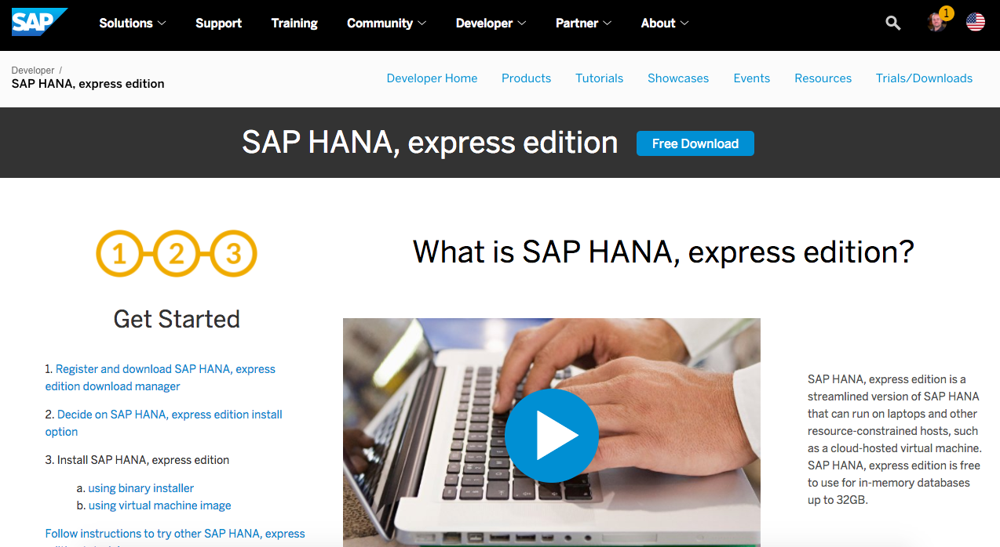
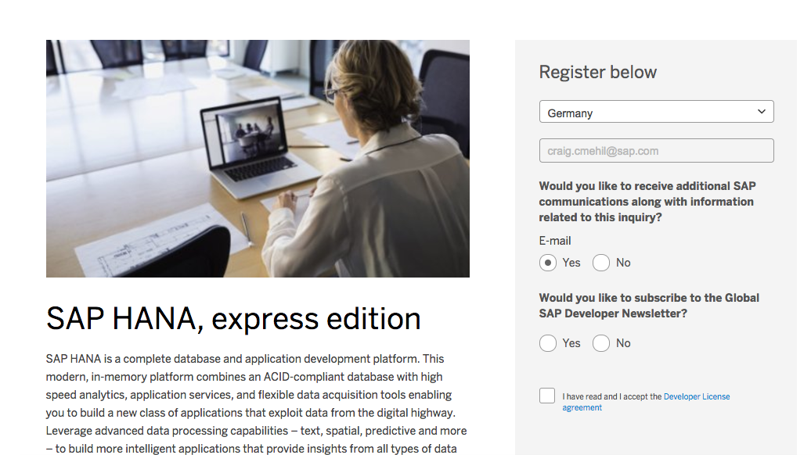
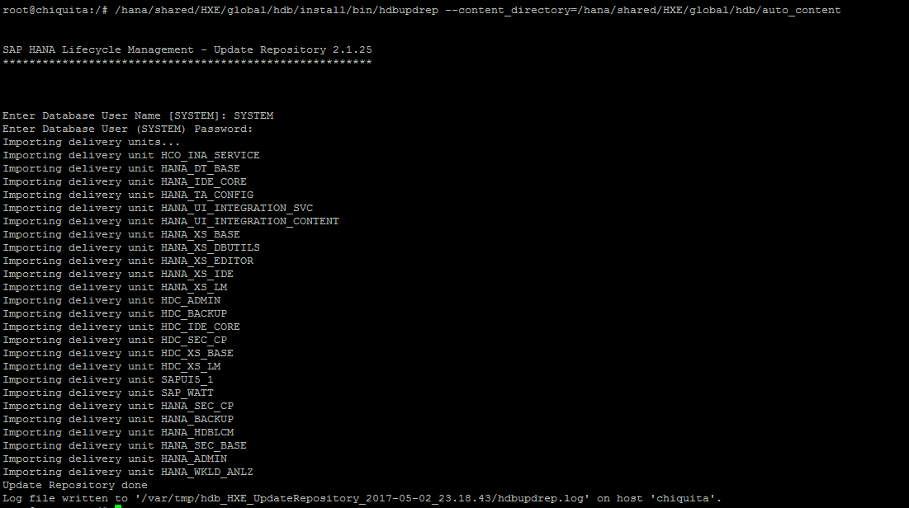
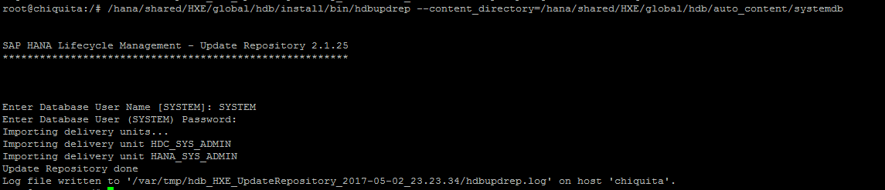
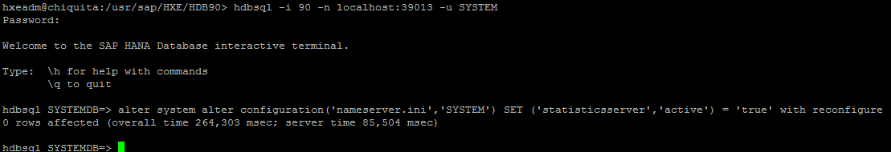
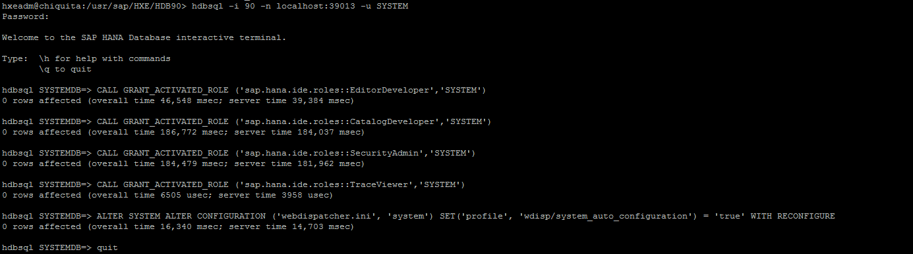

## Prerequisites  
 - **Systems used:** SAP HANA 1.00 SPS12, SAP HANA 2.00 SPS00, SAP HANA 2.00 SPS01, SAP HANA 2 SPS02 - SAP HANA, express edition

## Next Steps
 - [View all How-Tos](http://www.sap.com/developer/tutorial-navigator.how-to.html)


## How-To Details
The following will document links, tips and tricks and more related to the SAP CodeJam Getting Started with SAP HANA, express edition event.


### Time to Complete
**5 to 6 Hours**.

---

[ACCORDION-BEGIN [Step 1: ](First steps after registering to attend the event)]

Now that you have registered for the [SAP CodeJam](https://www.sap.com/developer/events.html) event you will need to follow a few steps here to prepare yourself for the event.

The first step is of course to sign up and register for [SAP.com](http://developers.sap.com) this will enable your user and make future steps much easier.


Now proceed to [SAP HANA, express edition](https://www.sap.com/developer/topics/sap-hana-express.html) product page where you will see the steps listed as well as more information on what exactly SAP HANA, express edition is.



> Remember you will need a laptop or machine with at least **8 GB** of RAM for server-only or **16GB** of RAM for XS Advanced applications. You can also choose a cloud provider but please note those require a credit card to sign up even if they offer free initial credits.

[ACCORDION-END]

[ACCORDION-BEGIN [Step 2:](Get your version of HXE)]

Depending on your choice and your available resources, you can install SAP HANA, express edition, as a Virtual Machine on your computer or on a cloud provider.

**You will move into other tutorials and always back to this one**. It is advisable that you keep this open in one tab.

_Google Cloud Platform Launcher_
If you are looking for the server-only version and would like to use Google Cloud Platform, there is a `one-click` setup option that is [explained in this guide](https://www.sap.com/developer/tutorials/hxe-gcp-getting-started-launcher.html).

_Virtual Machine or Binary manual Installation_
In order to get your copy of the download, either the virtual machine or the binaries to install on your own Linux installation you will need to [register](https://www.sap.com/cmp/ft/crm-xu16-dat-hddedft/index.html).



Once you have registered, proceed to setup you SAP HANA, express edition, using the right tutorial series depending on your choice:
- Virtual Machine method: https://www.sap.com/developer/groups/hxe-install-vm.html
- Binary Installer method: https://www.sap.com/developer/groups/hxe-install-binary.html

_Manual binary installations with alternative free operating systems_
- Only for SPS01 and earlier - Google Cloud platform and Ubuntu: https://blogs.sap.com/2017/02/07/hana-express-edition-on-google-cloud-platform-and-ubuntu/
- `openSUSE` on MS Azure: https://blogs.sap.com/2017/05/22/setting-up-your-free-sap-hana-express-edition-on-ms-azure-on-opensuse/

[ACCORDION-END]


[ACCORDION-BEGIN [------------------------------OPTIONS-------------------------------](Choose between OPTION A: HANA Studio, OPTION B: Server-only and external access or OPTION C: XS Advanced Development )]

You are now presented with three paths. None is a dependency of the other and you can follow the three of them, however, if you have installed XS Advanced, it makes sense to go only for that option.

**Option A, HANA Studio with XS Classic**, requires one additional installation step with versions SPS12, SPS00 and SPS01. **It is not available with SPS02.**

**Option B, server-only and external tools**, does not require the additional XS Classic installation and uses other tools available in the market.  

**Option C, XS Advanced development** does not require any additional setup and is only available if you have XS Advanced installed.

[ACCORDION-END]

[ACCORDION-BEGIN [OPTION A:](Install XS Classic)]

SAP HANA XS stands for `Extended Application Services`. These components are necessary to execute steps from option **A**.

From the an operating system console, switch to the root user with command:

```
sudo su -
```
As root, execute the following commands, replacing `HXE_SID` with the System ID that you chose during setup. This is, most likely, **HXE**.

```
/hana/shared/<<HXE_SID>>/global/hdb/install/bin/hdbupdrep --content_directory=/hana/shared/<<HXE_SID>>/global/hdb/auto_content
/hana/shared/<<HXE_SID>>/global/hdb/install/bin/hdbupdrep --content_directory=/hana/shared/<<HXE_SID>>/global/hdb/auto_content/systemdb
```

For each command, the installer will ask for user SYSTEM and its password, which needs to update the installation. In this example, the system ID was set to `HXE` during setup:



Second command:



Finally, log in to the database using command `hdbsql` to enable the statistics server. Replace **XX** with the instance number below:

```
sudo su - hxeadm
hdbsql -i XX -n localhost:3XX13 -u SYSTEM -p <SYSTEM user password> "alter system alter configuration('nameserver.ini','SYSTEM') SET ('statisticsserver','active') = 'true' with reconfigure"

```

If you are having trouble with the password, you can also log in first and execute the command later:



Then cast the last set of commands:

```
CALL GRANT_ACTIVATED_ROLE ('sap.hana.ide.roles::EditorDeveloper','SYSTEM');
CALL GRANT_ACTIVATED_ROLE ('sap.hana.ide.roles::CatalogDeveloper','SYSTEM');
CALL GRANT_ACTIVATED_ROLE ('sap.hana.ide.roles::SecurityAdmin','SYSTEM');
CALL GRANT_ACTIVATED_ROLE ('sap.hana.ide.roles::TraceViewer','SYSTEM');
ALTER SYSTEM ALTER CONFIGURATION ('webdispatcher.ini', 'system') SET('profile', 'wdisp/system_auto_configuration') = 'true' WITH RECONFIGURE;

```



Type `quit` to exit the SQL console.

You can check the installation by opening URL `http://<<hostname>>:80XX/sap/hana/ide/` and logging in with user SYSTEM:


[ACCORDION-END]

[ACCORDION-BEGIN [**A: Step `A.1`: ]( Coding with SAP HANA Studio)]

You will need to download a copy of the Eclipse software which will allow you to add the appropriate plugins to connect to your new SAP HANA, express edition, server.

We recommend [Eclipse Neon](http://www.eclipse.org/downloads/packages/), the Java EE version in case you later want to explore the SAP Cloud Platform.

Now that Eclipse has been installed you will need to add the appropriate plugins. The following guide will take your though [those steps](https://www.sap.com/developer/how-tos/2016/09/hxe-howto-eclipse.html).

Finally you are connected to your SAP HANA, express edition, system.

Now that you are connected and have your new users created it is time to actually do a little coding. The following tutorials will walk you through your first project with the Eclipse software and your HXE server.

- [SAP HANA Studio, Setup a new project](https://www.sap.com/developer/tutorials/studio-new-project.html)
- [SAP HANA Studio, Deploy Project](https://www.sap.com/developer/tutorials/studio-deploy-project.html)
- [SAP HANA Studio, Import Data](https://www.sap.com/developer/tutorials/studio-import-data.html)
- [SAP HANA Studio, Display your Application](https://www.sap.com/developer/tutorials/studio-display-project.html)


[ACCORDION-END]

[ACCORDION-BEGIN [**A: Step `A.2`:](Advanced System Settings)]

If you are so inclined you can also enhance your current server installation and add in the browser based tooling to forgo the using of Eclipse for working with the server as well.

This [blog post](https://blogs.sap.com/2016/10/28/enhancing-hxe-server-image/) walks you through the whole process of installing the browser based tools.

[ACCORDION-END]

[ACCORDION-BEGIN [**A: Step `A.3`:](Coding from the browser)]

If you choose to install the browser based tools in Step `A.2` then you can move on to the following tutorials for creating your first project via that environment.

- [Develop your first SAP HANA XSC Application](https://www.sap.com/developer/tutorials/hana-web-development-workbench.html)
- [Access your first data in a SAP HANA XSC Application](https://www.sap.com/developer/tutorials/hana-data-access-authorizations.html)
- [Enable XSODATA in your SAP HANA XSC Application](https://www.sap.com/developer/tutorials/hana-xsodata.html)
- [Consume XSODATA in your SAP HANA XSC Application](https://www.sap.com/developer/tutorials/hana-consume-xsodata.html)

[ACCORDION-END]

[ACCORDION-BEGIN [**A: Step `A.4`:](Personalize HXE)]

The following tutorials and blogs are just some optional items to help you understand your SAP HANA, express edition install and personalize it a bit to suit you.

- [Custom Login Screen](https://blogs.sap.com/2016/10/31/customize-my-hxe/)
- [`Changing the Default landing page`](https://blogs.sap.com/2016/11/22/hxe-customizing-the-landing-page/)
- [`Enhance the new landing page`](https://blogs.sap.com/2016/11/22/hxe-enhancing-your-custom-landing-page/)

[ACCORDION-END]

[ACCORDION-BEGIN [**A: Step `A.5`:](Advanced Topics)]

The following items are meant for further exploration of the SAP HANA, express edition server and things that are possible with it.

- [Raspberry Pi](https://blogs.sap.com/2017/01/26/tbt-sap-hana-and-raspberry-pi/)
- [Fuzzy Search](https://blogs.sap.com/2016/10/26/hxe-fuzzy-search/)
- [Creating and accessing a Calculation View from MS Excel using MDX](https://www.sap.com/developer/tutorials/studio-view-data-calculation-mdx.html) or [using anonymous OData services](https://blogs.sap.com/2017/05/02/sap-hana-on-a-whim-a-bing-map-in-my-ms-excel-from-an-anonymous-odata-service/)
- [Setting up the Google App Engine](https://www.sap.com/developer/tutorials/gae-setup.html) and [Installing `HDB` library for Node.js](https://www.sap.com/developer/tutorials/gae-nodehdb.html)
- [Fuzzy search on the Google App Engine with `Node.js`](https://blogs.sap.com/2017/03/08/google-app-engine-meets-sap-hana-express-edition/)

[ACCORDION-END]


[ACCORDION-BEGIN [OPTION B:](Install DBeaver and Connect)]

The following tutorial explains how to install a SQL client, in this case, `DBeaver`, and connect to SAP HANA, express edition, using the JDBC driver.

Access the tutorial to [Install `DBeaver`](https://www.sap.com/developer/tutorials/hxe-cj1-download-sql-client.html)

[ACCORDION-END]

[ACCORDION-BEGIN [**B: Step `B.1`:](Create a Schema and Add Data into your tables)]

The following tutorial explains how to create a table and insert data manually or using the **Import** SQL command to upload from a CSV file in the database server.

Continue to [Upload and Import](https://www.sap.com/developer/tutorials/hxe-cj1-create-table-upload-data.html) data.

[ACCORDION-END]

[ACCORDION-BEGIN [**B: Step `B.2`:](Connect using node.js)]

The following tutorial explains how to setup your local environment to use Node.js to connect to HXE.

[Setup Node.js](https://www.sap.com/developer/tutorials/hxe-nodejs-setup.html)

[ACCORDION-END]


[ACCORDION-BEGIN [**B: Step `B.3`:](Access the database using node.js)]

The following tutorial shows how to use Node.js to get data from HXE.

[Connect using Node.js](https://www.sap.com/developer/tutorials/hxe-nodejs-connect.html)

[ACCORDION-END]

[ACCORDION-BEGIN [**B: Step `B.4`:](Coming soon - Parse your table data and display it)]

[ACCORDION-END]

[ACCORDION-BEGIN [OPTION C:](Development with XS Advanced)]

You can start exploring the XS Advanced Cockpit here:

https://www.sap.com/developer/tutorials/xsa-explore-basics.html

You can get started with XS Advanced development following this tutorial series:

https://www.sap.com/developer/groups/hana-xsa-get-started.html

And here is how to integrate data from a database schema into your application:

https://www.sap.com/developer/tutorials/xsa-create-user-provided-anonymous-service.html


[ACCORDION-END]

## Next Steps
 - [View all How-Tos](http://www.sap.com/developer/tutorial-navigator.how-to.html)
