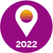
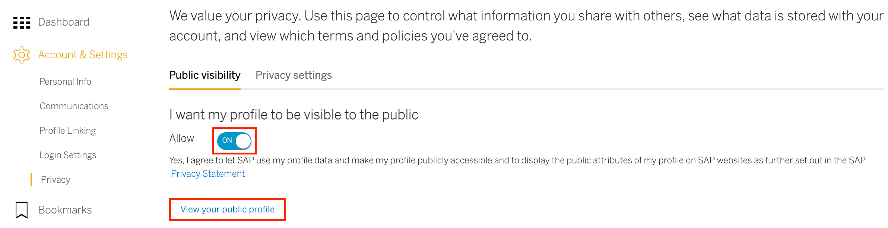
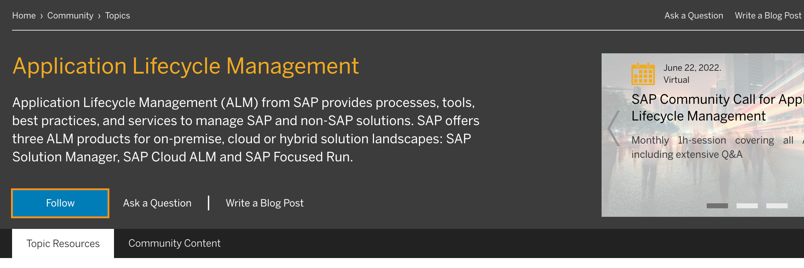
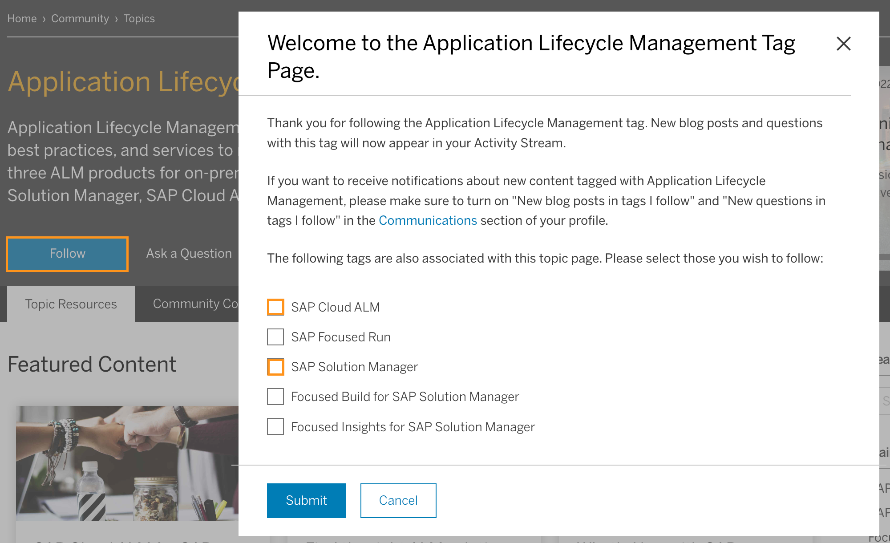
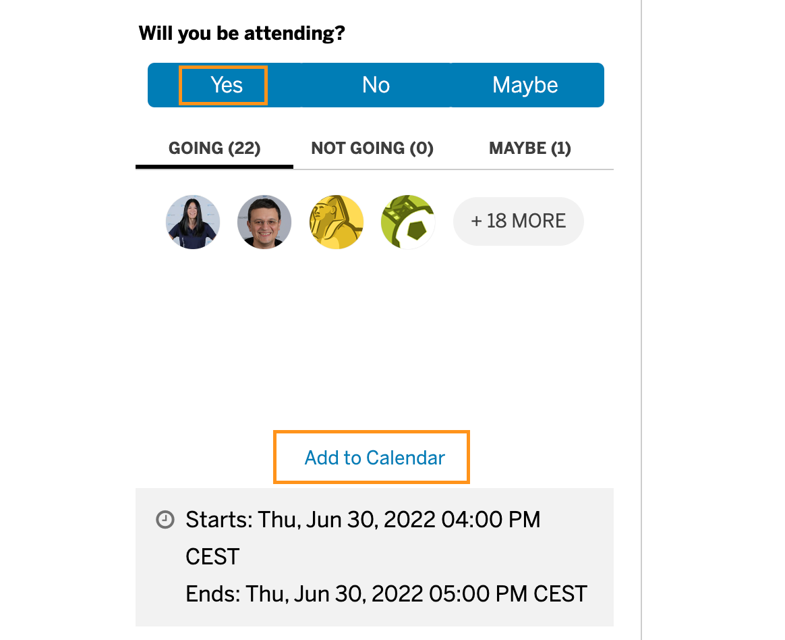

## Prerequisites
 - Please ensure that you have an SAP user account and profile. (If you don't, [register for an account](https://accounts.sap.com/ui/public/showRegisterForm?spName=https%3A%2F%2Fhana.ondemand.com%2Fskywalker)).
 - Go to [SAP Community](https://community.sap.com) and log in before starting this tutorial.

## Details
### You will learn
  - how to get started and navigate through the SAP Community  
  - how to follow content, tags, and people
  - how to engage with your fellow SAP Community members
  - **what's new in 2022**

Some of you have already completed the previous version of the Tour the SAP Community tutorial. This new version for 2022 will help you to refresh your knowledge about various SAP Community features and will teach you about new areas and offerings. With the completion of this tutorial, you will receive the Tour the SAP Community 2022 badge!

Welcome to SAP Community:

<iframe width="560" height="315" src="https://www.youtube.com/embed/do_UT5NqAO0" frameborder="0" allow="accelerometer; autoplay; encrypted-media; gyroscope; picture-in-picture" allowfullscreen></iframe>

---

[ACCORDION-BEGIN [Step 1: ](SAP Community Homepage)]

Within this first step, you will be guided through the entry point of [SAP Community](https://community.sap.com), our homepage and will find out what it has to offer. SAP Community is a place for members to engage and build influence, make meaningful connections, share insights and knowledge, and develop a personal reputation in an inclusive and supportive way.

In the following, you will get an overview of the SAP Community homepage.

<iframe width="560" height="315" src="https://www.youtube.com/embed/EatnEDXjwpw" frameborder="0" allow="accelerometer; autoplay; encrypted-media; gyroscope; picture-in-picture" allowfullscreen></iframe>

[VALIDATE_1]
[ACCORDION-END]

[ACCORDION-BEGIN [Step 2: ](Your Profile)]

We want you to be an integrated part of our community, so that you can contribute and connect with other members. In order to participate fully, you need to set your profile public (via your account privacy settings). If you don't, you will still be able to read SAP Community content, but you will miss out on engaging with others and on publishing content. Learn more under [Privacy - FAQ](https://community.sap.com/resources/privacy).

1. Go to your SAP.com profile **Dashboard** (accessible by clicking your avatar in the upper right and using the **My Account** feature)

2. Select **Privacy** (found under **Account & Settings** on the left-hand side)

3. Make sure that **I want my profile to be visible to the public** is switched to **Allow**.

4. Click **View your public profile**. (A little hint: remember that step, as you will be asked later to share your public profile link with us)

  

To get full insights on your profile, watch this video.

<iframe width="560" height="315" src="https://www.youtube.com/embed/RrbQKJvbZ_s" frameborder="0" allow="accelerometer; autoplay; encrypted-media; gyroscope; picture-in-picture" allowfullscreen></iframe>

>By the way, if you want to get more familiar with setting up your profile and its available features, there is a dedicated tutorial for you: [Update and Maintain Your SAP Profile at people.sap.com](community-profile).

**Follow Activity:** **`Follow person`**

When you follow a person, you can see that person's activities in your [Activity Stream](https://activities.sap.com/) and you have the possibility to exchange direct messages.

1. Click on a linked name in the community to go to that person's public profile page.

2. Click the blue **Follow** button in the top right-hand corner of the person's profile page.

[VALIDATE_2]
[ACCORDION-END]

[ACCORDION-BEGIN [Step 3: ](Topics)]

Our topic pages provide access to key information about SAP products, industries, services, or social/other initiatives. We have a wide range of [topic pages](https://community.sap.com/topics) available in SAP Community.

To gain a better understanding of topic pages, watch this video.

<iframe width="560" height="315" src="https://www.youtube.com/embed/60gN_YRV2o0" frameborder="0" allow="accelerometer; autoplay; encrypted-media; gyroscope; picture-in-picture" allowfullscreen></iframe>

**Follow Activity:** **`Follow a tag`** 

As just mentioned, you can follow a tag from the topic page to get notified (via e-mail and/or SAP Community inbox) about new content (blog posts, questions and answers) posted with that tag. You will also view this content in your [Activity Stream](https://activities.sap.com/),

1. Click the blue **Follow** button on the topic page.

    

2. Some topic pages have multiple tags mapped (there can be up to 7 tags). In such a case you can choose which tags you would like to follow:

    

3. You can also follow a tag via the main [Answers page](https://answers.sap.com/index.html) or the main [Blogs page](https://blogs.sap.com).

4. Find **Popular Tags** on the right-hand side (expanding the list if necessary) and click **View All**.

5. Click a tag that interests you on the [**All Tags**](https://answers.sap.com/tags.html) page to go to that tag's page.

**what's new in 2022**

Be one of our **Featured Contributors**! On a regular basis, the SAP Community team adds community members who are highly active in specific tag areas / topics to the respective topic pages. We want to show your engagement and quality contributions to the community.

[DONE]
[ACCORDION-END]

[ACCORDION-BEGIN [Step 4: ](Groups)]

**what's new in 2022**

We are excited to introduce [Groups](https://groups.community.sap.com/t5/groups/ct-p/groups) to SAP Community. Groups offer a place for connecting, sharing, and engaging with others on a particular topic or interest. It is an environment for one-on-one conversations and direct exchanges where you can participate in discussions, share your experience, get guidance and advice from fellow SAP Community members and much more.

To get full insights on the features in Groups, watch this video.

<iframe width="560" height="315" src="https://www.youtube.com/embed/HtvehwHwpc4" frameborder="0" allow="accelerometer; autoplay; encrypted-media; gyroscope; picture-in-picture" allowfullscreen></iframe>

We are currently in a beta phase in which you will need to create your own profile for Groups. Group members may participate in discussions and events, publish content, comment on existing posts, and connect with community members interested in similar topics or interests. Learn more [detailed information](https://groups.community.sap.com/t5/help/faqpage/title/howregister_email_verify_not_required).

Our [Welcome Corner](https://groups.community.sap.com/t5/welcome-corner/gh-p/welcome-corner) is for everyone to get to know each other. Say Hi 👋🏽 to your fellow community members and reply to [this thread](https://groups.community.sap.com/t5/welcome-corner-discussions/sap-community-where-are-you-from/m-p/5433) where you are from.

[VALIDATE_4]
[ACCORDION-END]

[ACCORDION-BEGIN [Step 5: ](Questions & Answers)]

### Q&A

The [Q&A area](https://answers.sap.com/index.html) includes all the questions asked in the community on a daily basis. If you have a question, you can ask the community for help or you can see if someone asked something similar before, as the solution may already be available. If you are an expert who wants to share your knowledge and help others, you can see what kind of questions members ask. Multiple filter options can allow you to focus on your area(s) of interest.

To get full insights into the features of Q&A, watch this video.

<iframe width="560" height="315" src="https://www.youtube.com/embed/kWLel59IK70" frameborder="0" allow="accelerometer; autoplay; encrypted-media; gyroscope; picture-in-picture" allowfullscreen></iframe>

>By the way, if you want to get more familiar with how to ask questions, there is a dedicated tutorial for you: [Ask and Answer Questions on SAP Community](community-qa).

**Follow Activity:** **`Follow a question`**

1.	Open a question.

2.	Click the green **Follow** button (on the left-hand side).  

When you follow a question, activities related to the question, such as comments and/or answers will appear in your [Activity Stream](https://activities.sap.com/). Depending on your [Communication settings](https://people.sap.com/#communications), you will also get notified via e-mail and/or your SAP Community inbox.

> Keep in mind: To ensure harmonious interactions amongst each other, it is important to understand the SAP Community [Rules of Engagement](https://community.sap.com/resources/rules-of-engagement) that will allow you to be active in the community without encountering issues or negative feedback when you post a question, answer, or blog post.

[DONE]
[ACCORDION-END]

[ACCORDION-BEGIN [Step 6: ](Blogging)]

The [Blogging area](https://blogs.sap.com/) gives you the opportunity to share your professional and personal experiences, views, and insights. These may include but are not limited to how-to's, theories, and opinions organized into categories that relate to SAP subjects. Everyone's own views and learning journeys are valued. SAP Community encourages sharing knowledge and learning from each other. It brings together people from all around the world, and by learning how to write relevant content for them, you will draw a larger audience and increase readership for your blog post.

To get full insights into the features of Blogging, watch this video.

<iframe width="560" height="315" src="https://www.youtube.com/embed/LyW8BPVUWXw" frameborder="0" allow="accelerometer; autoplay; encrypted-media; gyroscope; picture-in-picture" allowfullscreen></iframe>

>By the way, if you want to get more familiar and detailed information on how to blog successfully in SAP Community, there is a dedicated tutorial for you: [Write and Publish Blog Posts on SAP Community](community-blogging).

**Follow Activity:** **`Follow a blog post`**

1.	Open a blog post.

2.	Click the green **Follow** button (underneath the author's photo on a blog post).

When you follow a blog post, activities related to the blog post (such as comments) will appear in your **Activity Stream**.  Depending on your [Communication settings](https://people.sap.com/#communications), you will also get notified via e-mail and/or your SAP Community inbox.

There is one prerequisite before you can start blogging: In order for your blogging permissions to change from **Subscriber** to **Contributor** ([learn more](https://community.sap.com/resources/blogging)), you need to receive the **Hello World** badge. You will be awarded the **Hello World** badge by performing at least one of the **`follow activities`** mentioned during the previous steps (follow person, follow tag, follow question, follow blog post). Find out more under [Missions & Badges](https://community.sap.com/resources/missions-badges). Simply log out and log back into your SAP user account from the [Blogging area](https://blogs.sap.com/) to see the changes in your blogging permissions. Go to the [Write a Blog Post](https://blogs.sap.com/wp-admin/post-new.php) page to confirm your permissions.

If your blogging permissions haven't changed or you have other questions related to this tutorial, please contact <a href="mailto:community@sap.com">community@sap.com</a>.

> Keep in mind: To ensure harmonious interactions amongst each other, it is important to understand the SAP Community [Rules of Engagement](https://community.sap.com/resources/rules-of-engagement) that will allow you to be active in the community without encountering issues or negative feedback when you post a question, answer, or blog post.

[DONE]
[ACCORDION-END]

[ACCORDION-BEGIN [Step 7: ](Events)]

SAP Community [Events](https://groups.community.sap.com/t5/events/ct-p/events) are get-togethers with and for community members that can take place online, in hybrid settings, and in person.

To learn more about community Events, watch this video.

<iframe width="560" height="315" src="https://www.youtube.com/embed/gdanUdEsPGM" frameborder="0" allow="accelerometer; autoplay; encrypted-media; gyroscope; picture-in-picture" allowfullscreen></iframe>

**what's new in 2022**

The new event listings make it easy for you to save the event to your calendar. Let your fellow community members know when you will be attending an event and see who else is coming.

  

Explore a variety of different events, such as SAP Community Call, SAP CodeJam, and SAP Inside Track and indicate whether you will be attending the event.

Challenge for you: Go for our latest, most tricky event badge [SAP Community Event Explorer](https://blogs.sap.com/2022/01/18/sap-community-event-badges-whats-new-in-2022/) and be an SAP Community Event Explorer until the end of 2022!

Since the beginning of 2022, SAP Community Calls are streaming live on YouTube. For upcoming SAP Community Calls, subscribe to the [SAP Community YouTube channel](https://www.youtube.com/channel/UC3We5qK8jkxH8yBc0SugKEQ) and set yourself a reminder in your YouTube account to not miss out. Read this [blog post](https://blogs.sap.com/2022/01/31/sap-community-calls-are-now-live-on-youtube/) to find out more.

[DONE]
[ACCORDION-END]

[ACCORDION-BEGIN [Step 8: ](Your Reputation)]

SAP Community is a place for you to develop as a professional, build valuable connections with SAP Community members, and grow your reputation as an expert. The more active and engaged you are, the more your activities get reflected in your profile's [Reputation section](https://people.sap.com/#reputation). For various areas in SAP Community you will receive badges for participation. Learn more under [Missions & Badges](https://community.sap.com/resources/missions-badges).

To get full insights on the features of Reputation, watch this video.

<iframe width="560" height="315" src="https://www.youtube.com/embed/VjSyEiv404M" frameborder="0" allow="accelerometer; autoplay; encrypted-media; gyroscope; picture-in-picture" allowfullscreen></iframe>

**what's new in 2022**

Related to the previous step: For events that you are either organising, volunteering for, speaking at, or attending, we created different generic event badges for you (depending on the role you fulfilled). Take a closer look at [Missions & Badges](https://community.sap.com/resources/missions-badges) and filter for **Event Missions**.

[DONE]
[ACCORDION-END]

[ACCORDION-BEGIN [Step 9: ](Congratulations)]

Congratulations for receiving your new **Tour the SAP Community 2022** badge!

[DONE]
[ACCORDION-END]
