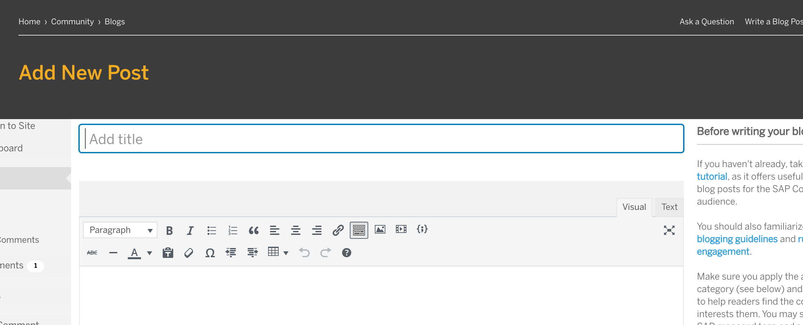
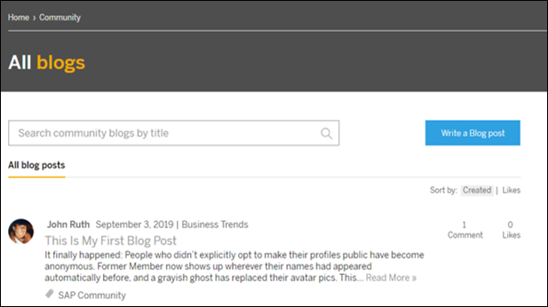
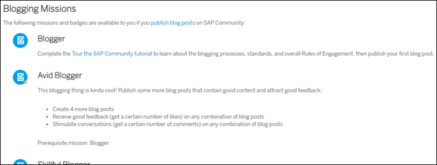

## Prerequisites
- Log into the [SAP Community](https://community.sap.com) before starting the tutorial.
- If you do not already have an SAP user account and profile, [register for an account](https://accounts.sap.com/ui/public/showRegisterForm?spName=https%3A%2F%2Fhana.ondemand.com%2Fskywalker).
- Achieve the _Contributor_ or _Author_ blogger level.
- If you don't have one of these blogger levels, please complete the [Tour the SAP Community](community-start) tutorial before beginning this one.

## Details
### You will learn
-	How to find and use the blogging tool
-	Best practices for writing blog posts
-	Ways to manage your blog content
-	How to connect with your audience
-	Which blogging missions you can complete

Awarded on a weekly basis, **Blogging Savvy** may not appear in the **Reputation** section of your profile immediately, so please expect a slight delay before you see the badge.

---

[ACCORDION-BEGIN [Step 1: ](Get to know the blogging tool)]

To open the blogging tool, you'll need to click **Write a Blog Post**, a link you'll find throughout the [SAP Community site](https://community.sap.com).

!

Once you click **Write a Blog Post** (and you have a _Contributor_ or _Author_ blogger level), you'll open the blogging tool.

!

Please familiarize yourself with the tool, then answer the following.

[VALIDATE_1]
[ACCORDION-END]

[ACCORDION-BEGIN [Step 2: ](Pick a blog category)]

You must select a blog category before publishing a blog post. Please read the **Using categories** section of the [Blogging](https://community.sap.com/resources/blogging) resources page, then answer the following.

[VALIDATE_2]
[ACCORDION-END]

[ACCORDION-BEGIN [Step 3: ](Use tags)]

As explained on the [Blogging](https://community.sap.com/resources/blogging) resources page, once you decide what to write about, you'll need to select tags that match the topics that your blog post covers. Please read the **Using tags** section of the [Blogging](https://community.sap.com/resources/blogging) resources page, then answer the following.

[VALIDATE_3]
[ACCORDION-END]

[ACCORDION-BEGIN [Step 4: ](Know your audience)]

SAP Community brings together people from all around the world, and by learning how to write relevant content for them, you'll draw a larger audience and increase readership for your blog post. Please watch this video, then answer the following.

<iframe width="560" height="315" src="https://www.youtube.com/embed/P8XpzYYDReY" frameborder="0" allowfullscreen></iframe>

[VALIDATE_4]
[ACCORDION-END]

[ACCORDION-BEGIN [Step 5: ](Write in your voice)]

When preparing a blog post, you should write in your voice -- so that you can establish yourself as an expert while growing your reputation and building your professional network. Please watch this video, then answer the following.

<iframe width="560" height="315" src="https://www.youtube.com/embed/7fU8ItNTrkY" frameborder="0" allowfullscreen></iframe>

[VALIDATE_5]
[ACCORDION-END]

[ACCORDION-BEGIN [Step 6: ](Understand structure)]

All blog posts should follow a three-act structure to ensure the best readability and highest engagement. Please watch this video then answer the following.

<iframe width="560" height="315" src="https://www.youtube.com/embed/uTHu4Lo2Xpg" frameborder="0" allowfullscreen></iframe>

[VALIDATE_6]
[ACCORDION-END]

[ACCORDION-BEGIN [Step 7: ](Find your blog posts by status)]

The [content section](https://people.sap.com/#content) of your profile provides a useful way for you to track and find your blog posts. In addition, you can find a blog post and its status via the blogging tool, where you can also interact with moderators.

Please watch this video to learn the various ways you can access your blog posts, understand the different status types, and see how blog moderators and you can receive and share feedback. Then answer the following.

<iframe width="560" height="315" src="https://www.youtube.com/embed/hhk-NEvhZgk" frameborder="0" allowfullscreen></iframe>

[VALIDATE_7]
[ACCORDION-END]

[ACCORDION-BEGIN [Step 8: ](Encourage engagement)]

Once you've published your blog post, you have the opportunity to promote it and interact with your audience.

Watch this video for tips on how to engage with readers.

<iframe width="560" height="315" src="https://www.youtube.com/embed/u5v4Pr0XESA" frameborder="0" allowfullscreen></iframe>

Next, please go to the [All blogs](https://blogs.sap.com) page, find a post with comments, then answer the following.

[VALIDATE_8]
[ACCORDION-END]

[ACCORDION-BEGIN [Step 9: ](Understand blogging missions and badges)]

As your blog posts draw readers, you can complete missions and earn badges. Please check out the **Blogging Missions** section on the [Currently Available Missions and Badges](https://community.sap.com/resources/missions-badges) page, then answer the following.

[VALIDATE_9]
[ACCORDION-END]

**Thank you for taking part in our Blogging Tutorial! Stay tuned to receive your Blogging Savvy badge!**
**Happy Blogging!**
---
