## Prerequisites
 - Complete the [Tour the SAP Community](community-start) tutorial.
 - Log into the [SAP Community](https://community.sap.com) before starting the tutorial.

## Details
### You will learn
  - How to personalize your profile and dashboard
  - About privacy settings
  - How to set up communications and work with your inbox
  - How to access and manage your bookmarks and connections
  - Ways to search, sort, and filter your content
  - How to review your activity log
  - About viewing and sharing your reputation
  - How to view your learning achievements
  - How to interact with other profiles

---

[ACCORDION-BEGIN [Step 1: ](Access your profile)]

Once you're logged in, the easiest way to check your profile is by clicking on your avatar and select **Manage My Account** in the dropdown. You can also access your profile at any time by going directly to [people.sap.com](https://people.sap.com/).

!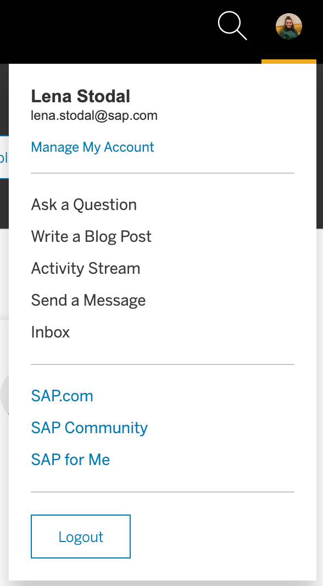

[DONE]
[ACCORDION-END]

[ACCORDION-BEGIN [Step 2: ](Upload a profile photo)]

Replacing your placeholder avatar image with a profile picture helps you connect better with other SAP Community members. If you choose to participate in the community, your photo will appear as an avatar on your posts, drawing readers to and into your content.

If you haven't already, upload a profile picture following the instructions in this video.

<iframe width="560" height="315" src="https://www.youtube.com/embed/46bt1juWUUM" frameborder="0" allow="accelerometer; autoplay; encrypted-media; gyroscope; picture-in-picture" allowfullscreen></iframe>

[VALIDATE_2]
[ACCORDION-END]

[ACCORDION-BEGIN [Step 3: ](Customize your dashboard)]

Once you're on your profile page, you'll be able to access several sections (and sub-sections) on the left, including **Dashboard**, **Account & Settings**, **Bookmarks**, **Content & Following**, **Connections**, **Reputation**, **Training**, and **Inbox**.

!

From the [Dashboard](https://people.sap.com/#dashboard), you can click the **Customize** button.

!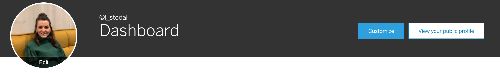

This feature allows you to customize your dashboard to display certain sections of your profile in the private view, giving you convenient access to the settings and information that you want to see or work on quickly. You can choose which sections to display, as well as drag and drop the sections to rearrange them as you wish.

[VALIDATE_3]
[ACCORDION-END]

[ACCORDION-BEGIN [Step 4: ](View your public profile)]

From the [Dashboard](https://people.sap.com/#dashboard), you can also click the **View your public profile** button.

>In fact, you'll always have the option to select **View your public profile** from any profile section when in the default private view.

!

The **View your public profile button** allows you to see your profile as other members will see it. This view can be very helpful as you determine which information to share and to position.  

!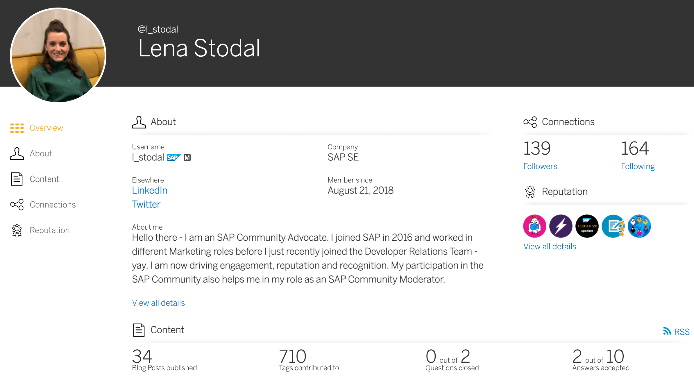

If you compare the public view to the default private view, you'll notice that the selections on the left change -- with more options and details available in the private profile.

Take a few moments to compare the public view of your profile to the private view, and compare the differences.

[VALIDATE_4]
[ACCORDION-END]

[ACCORDION-BEGIN [Step 5: ](Provide information about yourself)]

Your profile gives you several options for providing details about yourself -- so members can get to know you better.

To fill out your profile, select [Personal Info](https://people.sap.com/#personal_info) under **Account & Settings**, then select **Edit** next to **Personal data** to begin to update your information.

>Note that, depending on your membership or employment, you may not be able to update everything. A locked icon indicates which information you may not change.

!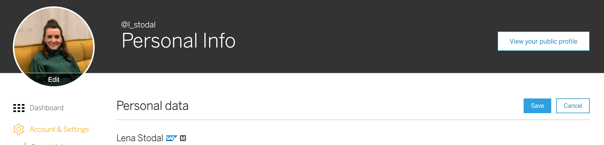

If you haven't already, take a few moments to enter a bio in the **About me** field found within the **Personal data** area. Flesh out the rest of your profile by selecting the languages you speak (from the **Languages** pulldown in the **Personal data** area), filling in the **Elsewhere** fields (providing links to your accounts on social media and LinkedIn, for example), and sharing your **Expertise**.

Make sure to save when you're finished.

>To learn more, read ["Get to Know Your Profile Options, Help Us Get to Know You, and Earn Badges in the Process"](https://blogs.sap.com/2020/03/09/get-to-know-your-profile-options-help-us-get-to-know-you-and-earn-badges-in-the-process/)

Take a look at the rest of the [Personal Info](https://people.sap.com/#personal_info) sub-section. In addition to **Personal data**, **Elsewhere**, and **Expertise**, familiarize yourself with the other **Personal Info** options that are available.

[DONE]
[ACCORDION-END]

[ACCORDION-BEGIN [Step 6: ](Get to know your privacy settings)]

As covered in Step 1 of the [Tour the SAP Community](community-start) tutorial, in order to participate fully in the SAP Community, you need to set your account [Privacy](https://people.sap.com/#privacy) settings -- found under **Account & Settings** -- to opt in to display your profile publicly.

!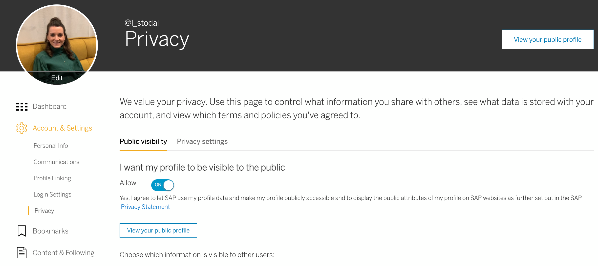

But you can do much more than that within the **Privacy** sub-section.

In the [Public visibility](https://people.sap.com/#privacy:public_visibility) tab, you can choose the personal details that people see when they view your profile. Through the [Privacy settings](https://people.sap.com/#privacy:privacy_settings) tab, you can view data associated with your account, request a download of the information that your profile stores, and request account deletion.

[DONE]
[ACCORDION-END]

[ACCORDION-BEGIN [Step 7: ](Set up your communications)]

By going to the [Communications](https://people.sap.com/#communications) sub-section, accessible under **Account & Settings**, you can personalize which information you receive from SAP. For SAP Community members, this sub-section gives you the ability to determine which notification types you receive and how -- either via email or directly in your profile **Inbox** or both.

>For more about your **Inbox**, see **Step 17**.

!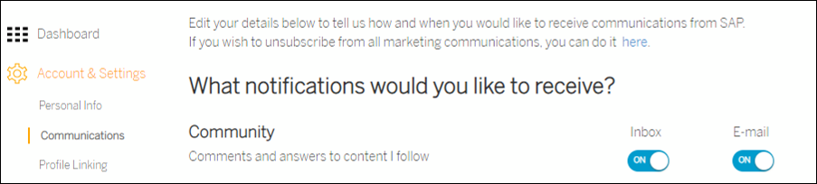

Notifications are a great way for you to keep track of -- and interact with -- the content that interests you most. For example, if you want to know about new posts and replies related to tags and content you follow, you can set up notifications that give you a heads-up whenever something new is published.

You can turn various notifications on and off as often as you wish, but for some notification types, **Inbox** notifications are locked by default for all members -- meaning you can't opt out of them. You can choose not to receive them via email, but you will always receive them in your inbox, with no way of turning them off. That's because these notifications contain important information -- such as updates from moderators -- that members need to see. In fact, you should consider setting up to receive them as email notifications as well, and make sure that you opt in to receive direct messages, so you never miss important communications!

Take a few moments to familiarize yourself with the notification options.

[VALIDATE_7]
[ACCORDION-END]

[ACCORDION-BEGIN [Step 8: ](Link to another profile)]

If you're an SAP Community (or SCN or SDN) veteran who recently got a new job or created a new account, you may want to link your older profile (or profiles) to the newer one. To do that, go to [Profile Linking](https://people.sap.com/#profile_linking) under **Account & Settings**, enter the User ID and Password for the profile you want to link to, and select **Link profile**. Follow this process for every profile you wish to link to your new one.

!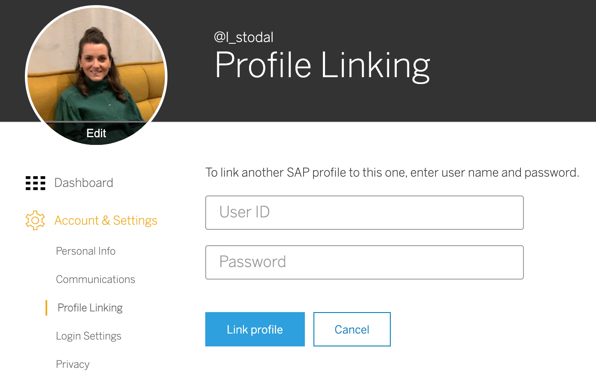

The [Profile Linking](https://people.sap.com/#profile_linking) sub-section includes information about what this linking does (and doesn't do). Please read that information.

[VALIDATE_8]
[ACCORDION-END]

[ACCORDION-BEGIN [Step 9: ](Access and change login settings)]

The [Login Settings](https://people.sap.com/#login_settings) sub-section under **Account & Settings** allows you to review your user name, associated account e-mail, and User-ID. Here you can also change your password. This sub-section also shows your linked social account(s).

>Note that, depending on your membership or employment, you may not be able to change your password here.

!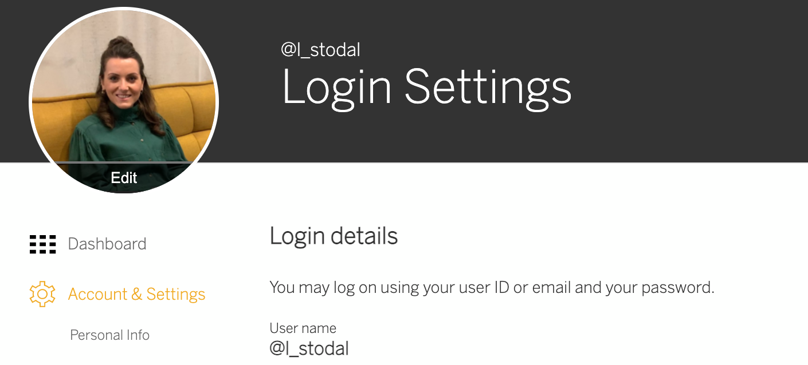

[DONE]
[ACCORDION-END]

[ACCORDION-BEGIN [Step 10: ](Access and manage bookmarks)]

Bookmarking allows you to maintain easy access to content that interests you most, such as blog posts, questions, and tags.

You can access your [Bookmarks](https://people.sap.com/#bookmarks) from your profile, where you'll be able to search them and also set up various filters.

Take a few moments to bookmark content -- and to get to know the [Bookmarks](https://people.sap.com/#bookmarks) section. Watch this video to learn more.

<iframe width="560" height="315" src="https://www.youtube.com/embed/FJioUFyT6Ig" frameborder="0" allow="accelerometer; autoplay; encrypted-media; gyroscope; picture-in-picture" allowfullscreen></iframe>

[VALIDATE_10]
[ACCORDION-END]

[ACCORDION-BEGIN [Step 11: ](Access content you've created)]

The [Content](https://people.sap.com/#content) sub-section, found under **Content & Following**, shows you all the content you've created -- including blog posts, questions, answers, Coffee Corner discussions, comments, and (for community veterans!) documents. Within this section, you have various options for filtering, sorting, and searching this content.

!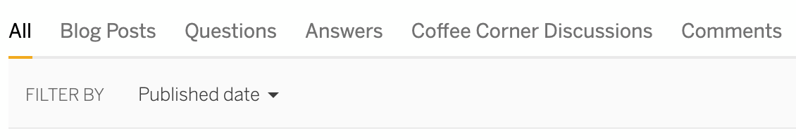

Even if you haven't created any content yet, you can still see the **FILTER BY** options. For example, select the **Status** dropdown and get to know those filter options.

!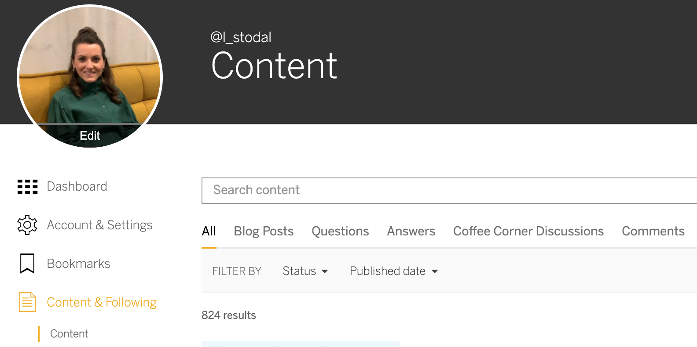

[VALIDATE_11]
[ACCORDION-END]

[ACCORDION-BEGIN [Step 12: ](Access content and tags you follow )]

The [Following](https://people.sap.com/#following) sub-section, found under **Content & Following**, provides two tabs. The [Tags](https://people.sap.com/#following:tags) tab gives you a list of the tags you follow, and the [Content](https://people.sap.com/#following:content) tab shows the individual content items you follow.

!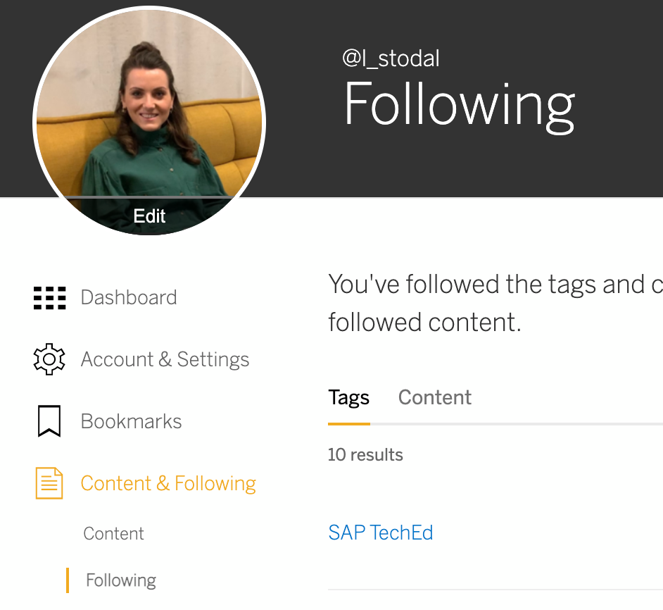

Take a few moments to familiarize yourself with the actions you can take within these tabs.

[VALIDATE_12]
[ACCORDION-END]

[ACCORDION-BEGIN [Step 13: ](Review your activity log)]

The [Activity Log](https://people.sap.com/#activity_log) sub-section of your profile, found under **Content & Following**, lists all of the actions that you've taken within SAP Community. It also gives you the ability to sort these actions by various object types (e.g., answers, blog posts) and tags you follow.

Get to know the various dropdowns within this section -- such as **Object type**, **Action type**, and **Followed tag**.

!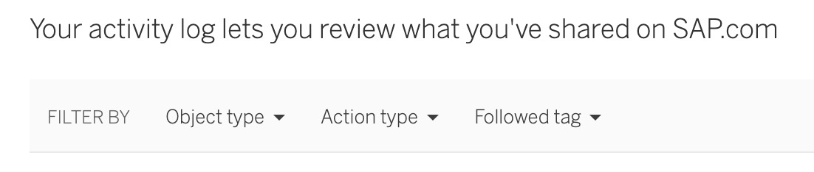

[DONE]
[ACCORDION-END]

[ACCORDION-BEGIN [Step 14: ](Manage your connections)]

The [Connections](https://people.sap.com/#connections) section allows you to see which members follow you -- and which members you follow. This section gives you the ability to search your connections and offers options for sorting your followers (and those following you).

Check out the **Sort by:** dropdowns in your [following](https://people.sap.com/#connections:following) tab. (If members follow you, you'll see a dropdown with the same options in the **followers** tab. If you have no followers yet, this tab will be grayed out.)

!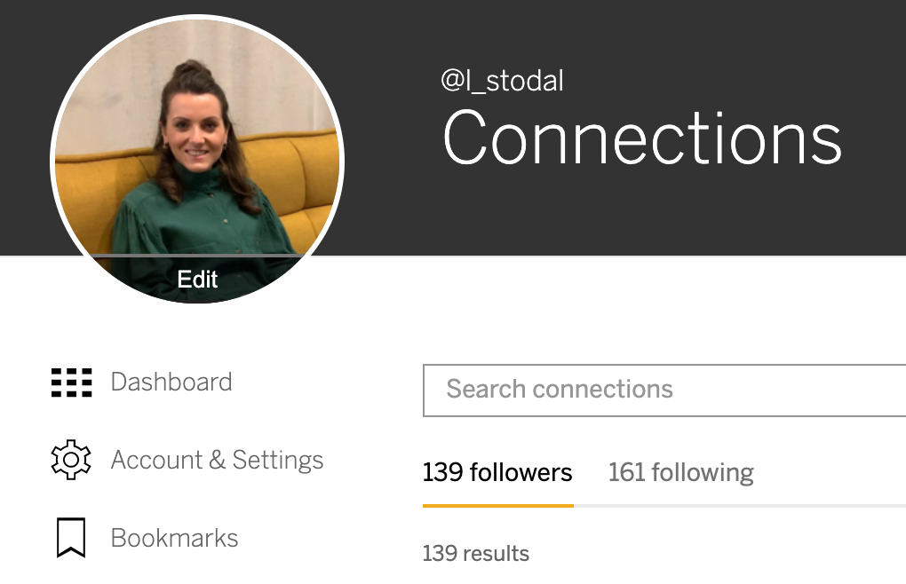

[DONE]
[ACCORDION-END]

[ACCORDION-BEGIN [Step 15: ](Review your reputation)]

The **Reputation** section of your profile consists of two sub-sections: [Snapshot](https://people.sap.com/#snapshot) and [Missions](https://people.sap.com/#missions). The **Missions** sub-section, in turn, is broken into two tabs: [Available Missions](https://people.sap.com/#missions:available) and [Earned Missions](https://people.sap.com/#missions:earned).

!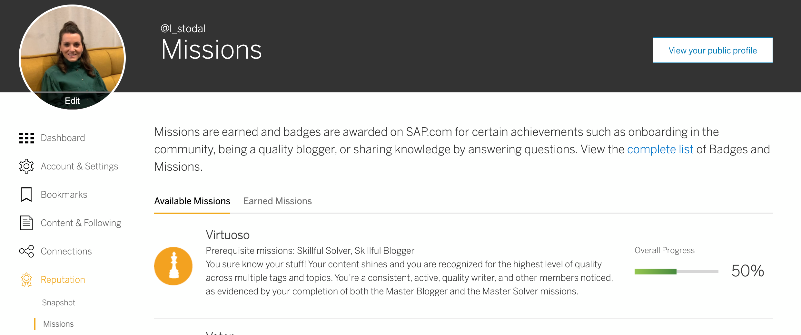

Familiarize yourself with the sub-sections and tabs within the **Reputation** section,

[VALIDATE_15]
[ACCORDION-END]

[ACCORDION-BEGIN [Step 16: ](View your training)]

The [Training](https://people.sap.com/#training) section of your profile shows your SAP Learning achievements. If you don't have any training achievements yet, the section will appear like this:

!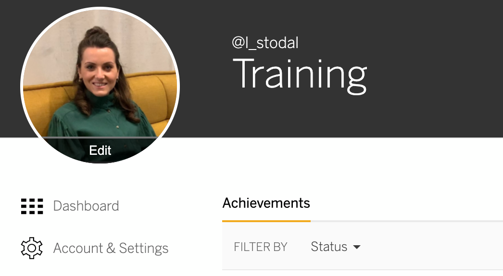

Regardless of achievements, all members can take actions in the [Training](https://people.sap.com/#training) section. Take a few moments to explore this section.

[VALIDATE_16]
[ACCORDION-END]

[ACCORDION-BEGIN [Step 17: ](Manage your inbox)]

As covered in **Step 7**, your **Communications** settings determine what will appear in your [Inbox](https://people.sap.com/#inbox) section.

Get to know your **Inbox**.

!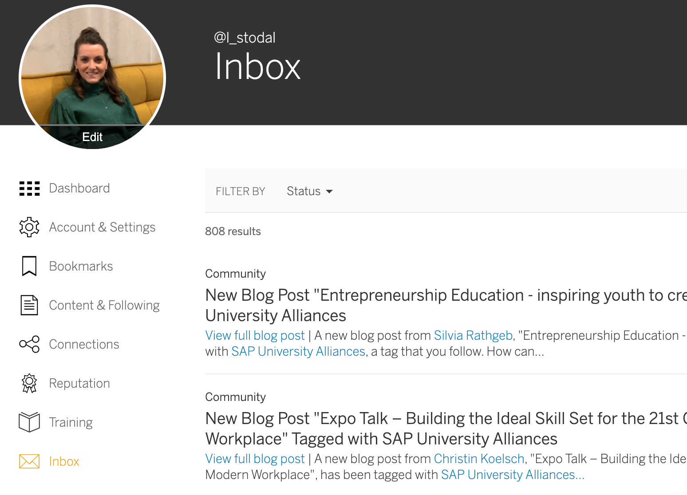

[VALIDATE_17]
[ACCORDION-END]

[ACCORDION-BEGIN [Step 18: ](Interact with other profiles)]

Take a moment to visit another member's profile.

>An easy way to do this: Go to your [Connections](https://people.sap.com/#connections) section and click on a name in your [following](https://people.sap.com/#connections:following) tab.

If you're following the person, and the person is also following you, you have the option to message him or her directly -- via the **Contact** button.

!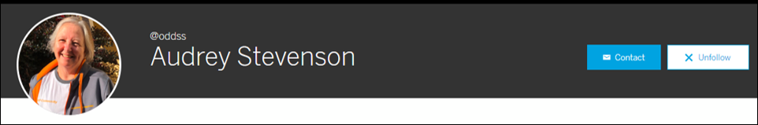

If it's someone you follow (who doesn't follow you), you won't have the **Contact** option (only members who follow each other can send direct messages to one another -- unless they're moderators, who can message anyone), but you'll see the **Unfollow** button. This option appears on the profile of every person you follow.

!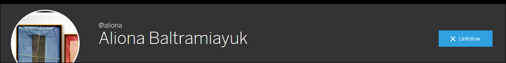

When viewing a profile for someone you don't follow, you'll have the option to click the **Follow** button.

!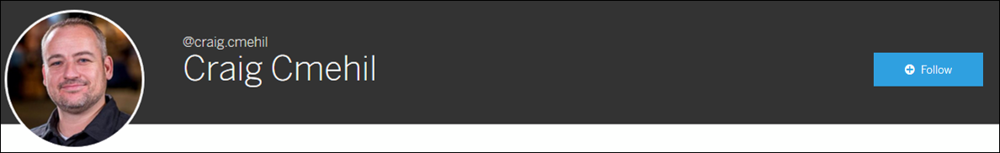

Take a few minutes to view other profiles. Follow some new members. Send a message to say hello to the members who follow you. Use the profile options to build your SAP Community network!

[DONE]
[ACCORDION-END]

---

Congratulations! You're now savvy about your SAP profile ([people.sap.com](https://people.sap.com/)).
