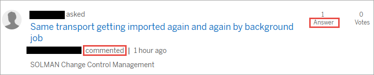

## Details
### You will learn
  - How to search for answers
  - Steps for asking questions
  - Ways to find and answer questions
  - How to build your reputation by answering questions

We recommend that you complete the [Tour the SAP Community tutorial](https://developers.sap.com/tutorials/community-start.html) before taking this one. Tour the SAP Community covers many Q&A basics, so it's the perfect introduction to this tutorial. You can also learn more about Q&A on the SAP Community [Questions and Answers](https://community.sap.com/resources/questions-and-answers) resources page and in the [Help us to help you – good questions beget good answers](https://blogs.sap.com/2019/11/25/help-us-to-help-you-good-questions-beget-good-answers/) blog post.

---

[ACCORDION-BEGIN [Step 1: ](Search for answers)]

SAP Community is a rich resource of information, containing years' worth of discussions. So before asking a question, you should search first -- as the answer to your question may already be available.

There are several ways to browse SAP Community. One way to search all questions, answers, and discussions directly is via the [Questions and Answers] (https://answers.sap.com/index.html) link in the top menu. You can also sort questions by several criteria, to give you even more options for finding the information you want.

[VALIDATE_1]
[ACCORDION-END]

[ACCORDION-BEGIN [Step 2: ](Ask a question)]

If searching doesn't yield the answer you need, then you'll want to ask a question yourself. The [Ask a Question](https://answers.sap.com/questions/ask.html) page includes several fields that you need to fill out before submitting, as well as some helpful advice for asking good questions.

[VALIDATE_2]
[ACCORDION-END]

[ACCORDION-BEGIN [Step 3: ](Select tags)]

Before you submit a question, you must select at least one SAP managed tag. Tags identify the main topic of your question. Selecting the right tag will help you get an answer to your question faster by helping other members with the right expertise in the topic area to more easily find your question. 

You may select up to seven SAP managed tags and seven user tags (which are tags that you can create). The first SAP managed tag you select will be the one that triggers notifications for members who follow that tag.

You can learn more on the [About Tags](https://community.sap.com/resources/using-tags) page, and you can find the full list of tags on the [Questions and Answers All Tags](https://answers.sap.com/tags.html) page.

[VALIDATE_3]
[ACCORDION-END]

[ACCORDION-BEGIN [Step 4: ](Respond to comments and answers to your questions)]

When responding to a question, members may leave comments or submit answers. As the person who posted the question, you have several options for interacting with them, such as providing additional details (when they request clarification) and indicating when someone has answered your question correctly.

Please watch the **Engage with Comments and Answers to Your Questions** video. (To get more tips, please visit the [Community Videos](https://community.sap.com/resources/tip-in-a-minute#Videos) page.)

(*90*)

<iframe width="560" height="315" src="https://www.youtube.com/embed/4BD9l4wu2Uc" frameborder="0" allowfullscreen></iframe>

[VALIDATE_4]
[ACCORDION-END]

[ACCORDION-BEGIN [Step 5: ](Take actions on a question page)]

In addition to commenting and answering, members can take several actions on a question page.

Find a question in [SAP Community](https://answers.sap.com/index.html) in the **All Questions** section with at least one comment and answer that hasn't been accepted yet, such as this example:

>Note that an accepted answer will appear highlighted in green in the **All Questions** section.

[VALIDATE_5]
[ACCORDION-END]

[ACCORDION-BEGIN [Step 6: ](Follow the Rules of Engagement when answering)]

Before answering a question, you should familiarize yourself with the [SAP Community Rules of Engagement](https://community.sap.com/resources/rules-of-engagement). The rules explain the etiquette that you should follow when interacting with other members. They also outline which content is considered unacceptable. You should take these rules into account before posting anything.

[VALIDATE_6]
[ACCORDION-END]

[ACCORDION-BEGIN [Step 7: ](Find and answer questions)]

If you're interested in answering questions about your area of specialty, you have several ways to find them. And once you find them, you can use Comments and Answers to assist the members looking for solutions.

Watch the **How to Get Started with Q&A to Answer Questions** video. (To get more tips, please visit the [Community Videos](https://community.sap.com/resources/tip-in-a-minute#Videos) page.)

<iframe width="560" height="315" src="https://www.youtube.com/embed/lE-pYOmhXNw" frameborder="0" allowfullscreen></iframe>

[VALIDATE_7]
[ACCORDION-END]

[ACCORDION-BEGIN [Step 8: ](Understand Q&A missions)]

Our reputation program allows members to complete missions and earn badges by making valuable contributions to SAP Community. If members upvote your answers or your answers are accepted, you can receive recognition via our Q&A missions.

Visit the [Missions and Badges](https://community.sap.com/resources/missions-badges) page.

[VALIDATE_8]
[ACCORDION-END]

---
