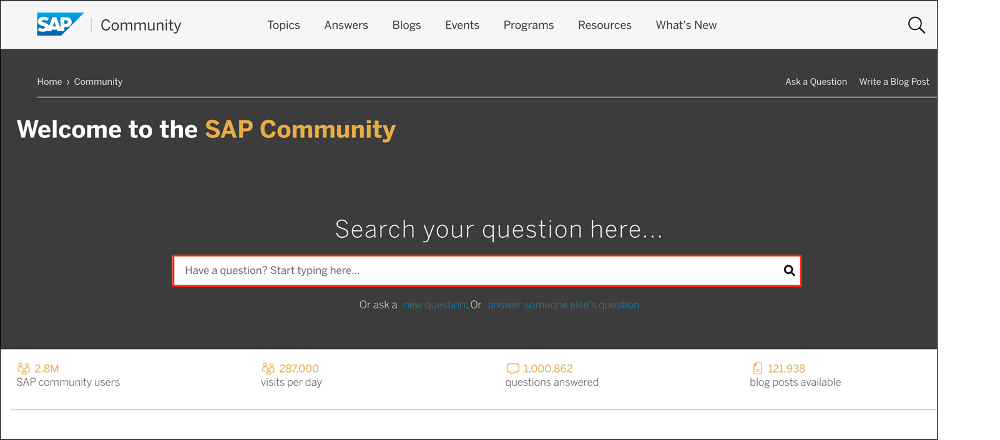
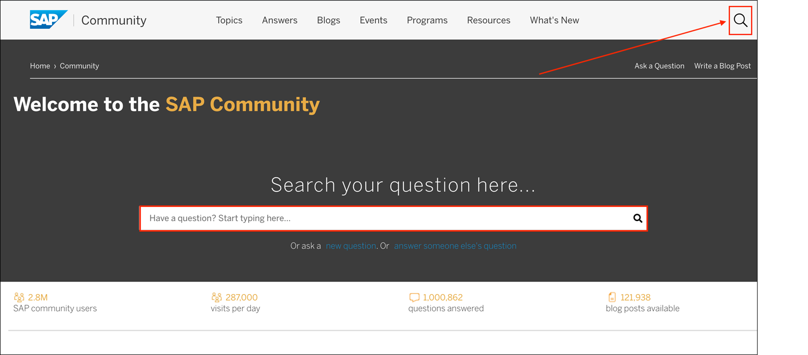
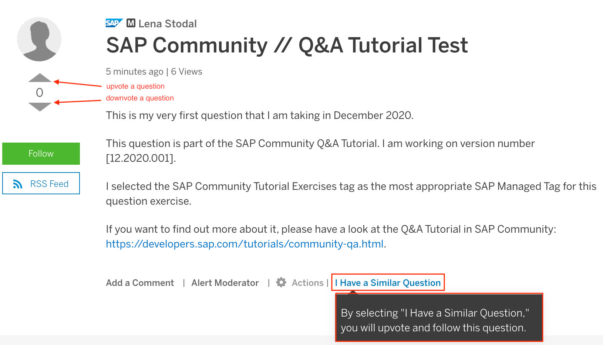
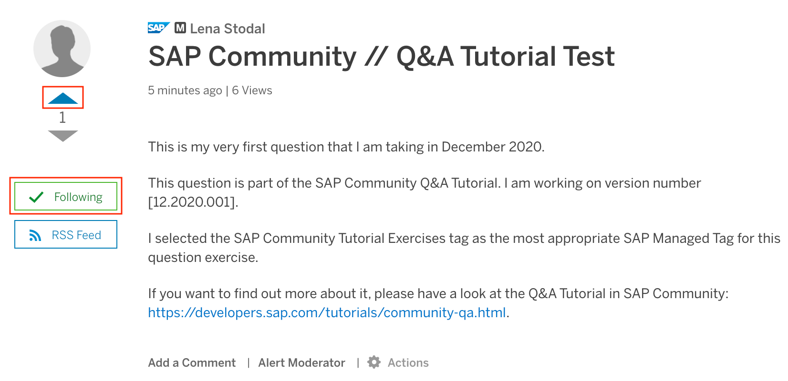
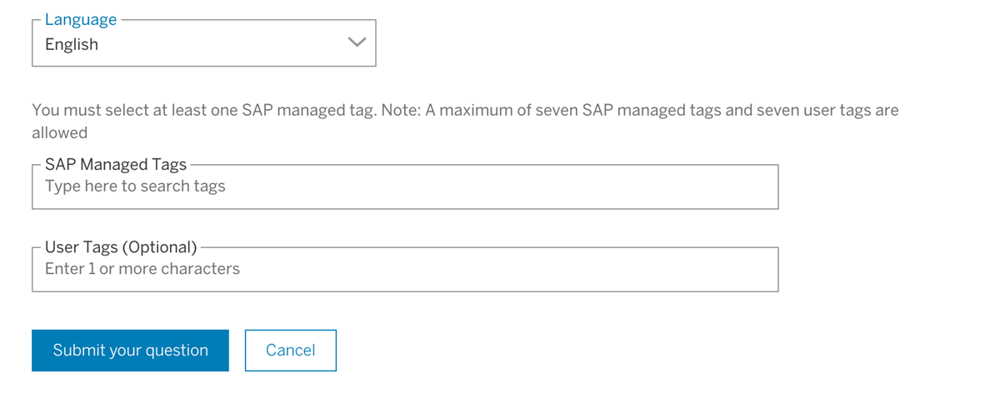
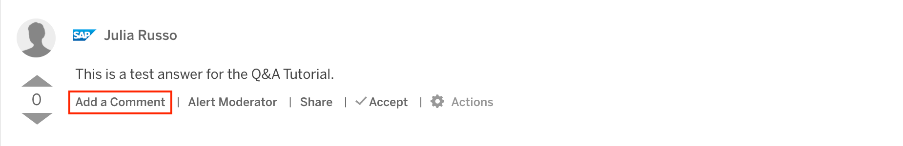
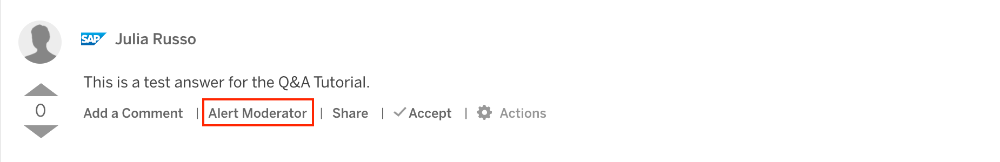
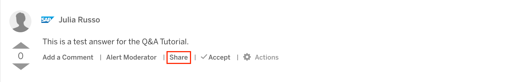
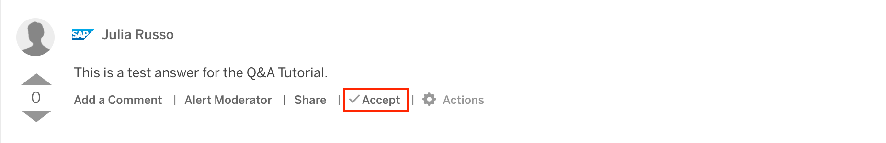
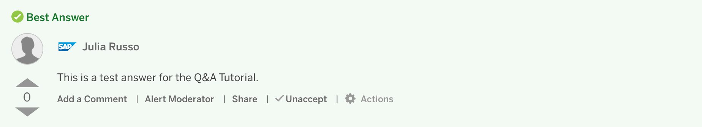

## Details
### You will learn
- How to prepare your question
- Tips and tricks for asking your question
- What to do after you asked your question
 ---

This tutorial is version number 07.2021.001

SAP Community wants to create a valuable store of knowledge and it is our goal to provide content to our members in the form of advice, support, and guidance. The creation of such a reliable place is amongst other factors heavily dependent on questions, how they are asked and answered -- and this is why you are here.

In this tutorial, you will get to know the Q&A section, processes and guidelines. Ultimately, it will help you to prepare questions that draw more precise and helpful responses from our members and teach you how to easily gain - and share - knowledge in SAP Community. You will also earn the Q&A Savvy badge!

## **Before asking your question**

[ACCORDION-BEGIN [Step 1: ](Browse for questions in the SAP Community)]

SAP Community is a rich resource of information, containing years' worth of discussions. So before asking a question, you should search first -- as the answer to your question may already be available.

1. Visit our SAP Community Homepage and click into the demonstrated red highlighted rectangle. This will pre-filter the category type "Q&A" for you and you reach a page with an overview of all questions.
    

2. Alternatively, you can use the magnifying glass at the top right corner, which will show you all content that is available in the community with the search you typed in. Furthermore, you can filter for "Content Type" at the right-hand side of the page or filter by the respective tag you are interested in.

    

[DONE]
[ACCORDION-END]

[ACCORDION-BEGIN [Step 2: ](What to do when finding the question you wanted)]

You have several options to react on questions that helped you in the community. You can upvote a question if you find it useful and helpful. Of course, you can also downvote it. In case you have a question that is very much alike one you found, use the **I Have a Similar Question** feature. It automatically upvotes the question and you follow it. (You can undo it by choosing to downvote and unfollow the question.)

!

We added this feature specifically to make it easier for you to be able to indicate you have a similar problem and to encourage the voting and follow feature.

!

You can also react to answers that were given by community members, for example leave a Like for a comment that was helpful for you. Of course, if you require clarification on the answer that was given, you can leave a comment to the answer asking for more information.

[VALIDATE_2]
[ACCORDION-END]

## **Asking your question**

If searching doesn't yield the answer you need, then you'll want to ask a question yourself. The [Ask a Question](https://answers.sap.com/questions/ask.html) page includes several fields that you need to fill out before submitting, as well as some helpful advice for asking good questions.

[ACCORDION-BEGIN [Step 3: ](Follow Rules of Engagement -- and be a good community citizen)]

Before asking a question, you should familiarize yourself with the SAP Community [Rules of Engagement](https://community.sap.com/resources/rules-of-engagement). The rules explain the etiquette that you should follow when interacting with other community members. They also outline which content is considered unacceptable.

You should take these rules into account before you post your question.

[VALIDATE_3]
[ACCORDION-END]

[ACCORDION-BEGIN [Step 4: ](Select a SAP Managed Tag)]

Before you submit a question, you must select a tag that is appropriate to your question.

SAP managed tags identify the main topic of your question. Those tags are created by SAP Community in relation to products and topics by SAP. Selecting the right tag will help you get an answer to your question faster by helping other members with the right expertise in the topic area to more easily find your question. You can further choose user tags which are optional, but a SAP managed tag is mandatory. Please note that the maximum of tags or user tags is limited to 7.

!

You can learn more on the [About Tags](https://community.sap.com/resources/using-tags) page, and you can find the full list of tags on the [Questions and Answers All Tags](https://answers.sap.com/tags.html) page.

[DONE]
[ACCORDION-END]

## **After asking your question**

[ACCORDION-BEGIN [Step 5:](Regularly check your question)]
There is an easy way to check on your question -- if you correctly adjusted your notifications on your profile, you will be automatically notified via e-mail and won't miss any reactions to your question.

It's all explained and outlined in our [Tour the Community Tutorial](community-start), that we recommend to take as a starting point to the SAP Community.

**Select the best answer to your question**

When responding to a question, members may leave comments or submit answers. As the person who posted the question, you have several options for interacting with SAP Community. It is essential that you pay attention to the following:

- If you need to reply to an answer, submit a comment. This also applies to cases where the answer does not fully explain your need or helps you to identify the issue. Please ask for more details and **Add a Comment**.   

    !

- If you detect spam or the answer violates our Rules of Engagement, **Alert Moderator**.

    !

- If you want to get the direct link to the answer/comment, use the **Share** feature.

    !

- If you asked a question and got the answer you need, simply **Accept**.

    !

    Note that an accepted answer will be highlighted in green in [SAP Community](https://answers.sap.com/index.html) in the **All Questions** section.

    !

- If you want to notify specific members, you can **@mention** them when typing.

- You can even edit your question after  publishing it to add further information that may clarify what you meant.

Check out what you have to do by watching the **Engage with Comments and Answers to Your Questions** video. (To get more tips, please visit the [Community Videos](https://community.sap.com/resources/tip-in-a-minute#Videos) page.)

<iframe width="560" height="315" src="https://www.youtube.com/embed/5VDqJBcXJtw" frameborder="0" allowfullscreen></iframe>

[VALIDATE_5]
[ACCORDION-END]

[ACCORDION-BEGIN [Step 6:](Understand Q&A missions)]
Our reputation program allows members to complete missions and earn badges by making valuable contributions to SAP Community. If members upvote your answers or your answers are accepted, you can receive recognition via our Q&A missions.

Visit the [Missions and Badges](https://community.sap.com/resources/missions-badges) page.

[DONE]
[ACCORDION-END]

[ACCORDION-BEGIN [Step 7:](Now it's your turn)]
We prepared an exercise for you to take and ask your very own first question in the SAP Community!

In order for you to receive the Q&A Savvy badge and finish the Q&A Tutorial, please use [this template] (https://answers.sap.com/questions/ask.html?primaryTagId=&topics=submityourquestionnow&question=This%20is%20my%20question%20exercise%20as%20part%20of%20the%20SAP%20Community%20Q%26A%20Tutorial%20%0A%0A&b=%0A%3Cp%3E%20This%20is%20my%20very%20first%20question%20that%20I%20am%20taking%20in%20%5BMONTH%2FYEAR%5D.%3C%2Fli%3E%0A%3C%2Fol%3E%0A%3Cp%3EThis%20question%20is%20part%20of%20the%20SAP%20Community%20Q%26A%20Tutorial.%20I%20am%20working%20on%20version%20number%20%5BXYZ%5D.%3C%2Fli%3E%0A%3C%2Fol%3E%0A%3Cp%3EI%20selected%20the%20SAP%20Community%20Tutorial%20Exercises%20tag%20as%20the%20most%20appropriate%20SAP%20Managed%20Tag%20for%20this%20question%20exercise.%20%3C%2Fli%3E%0A%3C%2Fol%3E%0A%3Cp%3EHave%20a%20look%20at%20the%20Q%26A%20Tutorial%20in%20SAP%20Community%3A%20https%3A%2F%2Fdevelopers.sap.com%2Ftutorials%2Fcommunity-qa.html.%20) and submit your question. Please choose "SAP Community Tutorial Exercises" as SAP managed tag when you submit your question. A SAP Community moderator will respond to your question with an answer and will ask you to accept this answer as "Best Answer".

After you accepted the answer, you will be given an individual code to enter into the field below. When you completed all the necessary steps of Step 7, you will get a notification that you earned this badge:

**What you have to do:**

1. Submit your question via [this template](https://answers.sap.com/questions/ask.html?primaryTagId=&topics=submityourquestionnow&question=This%20is%20my%20question%20exercise%20as%20part%20of%20the%20SAP%20Community%20Q%26A%20Tutorial%20%0A%0A&b=%0A%3Cp%3E%20This%20is%20my%20very%20first%20question%20that%20I%20am%20taking%20in%20%5BMONTH%2FYEAR%5D.%3C%2Fli%3E%0A%3C%2Fol%3E%0A%3Cp%3EThis%20question%20is%20part%20of%20the%20SAP%20Community%20Q%26A%20Tutorial.%20I%20am%20working%20on%20version%20number%20%5BXYZ%5D.%3C%2Fli%3E%0A%3C%2Fol%3E%0A%3Cp%3EI%20selected%20the%20SAP%20Community%20Tutorial%20Exercises%20tag%20as%20the%20most%20appropriate%20SAP%20Managed%20Tag%20for%20this%20question%20exercise.%20%3C%2Fli%3E%0A%3C%2Fol%3E%0A%3Cp%3EHave%20a%20look%20at%20the%20Q%26A%20Tutorial%20in%20SAP%20Community%3A%20https%3A%2F%2Fdevelopers.sap.com%2Ftutorials%2Fcommunity-qa.html.%20).

2. Watch your question and wait for the answer by the moderator.

3. Accept the given answer as best answer.

4. Enter the code (given by the moderator) in the question field below.

[VALIDATE_7]
[ACCORDION-END]

**Thank you for taking part in our Q&A Tutorial! Stay tuned to receive your Q&A Savvy badge!**

### More Information

You can also learn more about Q&A on the SAP Community [Questions and Answers](https://community.sap.com/resources/questions-and-answers) resources page and in the [Help us to help you – good questions beget good answers](https://blogs.sap.com/2019/11/25/help-us-to-help-you-good-questions-beget-good-answers/) blog post.

**Write and publish blog posts**

By taking [this tutorial](community-blogging), you'll discover how to prepare and manage your blog posts on SAP Community, get tips for better blogging, and learn how to interact with readers. You'll also earn the Blogging Savvy badge.

**Maintain your SAP profile at [people.sap.com](https://people.sap.com/)**

By taking [this tutorial](community-profile), you'll explore, set up, and manage the sections of your SAP profile ([people.sap.com](https://people.sap.com/)). You'll also earn the Profile Savvy badge.
