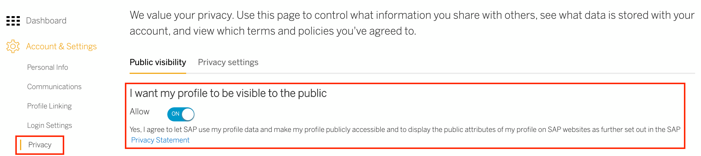
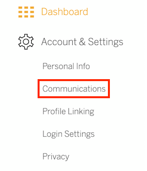
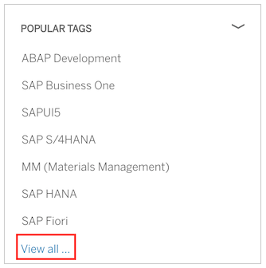

## Prerequisites
 - If you do not already have an SAP user account and profile, [register for an account](https://accounts.sap.com/ui/public/showRegisterForm?spName=https%3A%2F%2Fhana.ondemand.com%2Fskywalker).
 - Go to [SAP Community](https://community.sap.com) and log in before starting the tutorial.

## Details
### You will learn
  - About key settings in your SAP profile
  - How to follow tags, content, and people
  - About the Rules of Engagement
  - About questions and blog posts

---

[ACCORDION-BEGIN [Step 1: ](Set your profile to public)]

In order to participate fully in the SAP Community, you need to set your account privacy settings to opt in to display your profile publicly. If you don't, you will still be able to read SAP Community content, but you won't be able to ask questions, write blog posts, or engage in any other way in the community. To learn more, please see our [Privacy - FAQ](https://community.sap.com/resources/privacy) page.

1. Watch this SAP Community video [Changing Privacy Settings](https://www.youtube.com/watch?v=9BnkWDfjVlU&feature=youtu.be).

    <iframe width="560" height="315" src="https://www.youtube.com/embed/Pp007skcxFk"frameborder="0" allowfullscreen></iframe>

2. Go to your SAP.com profile **Dashboard** (accessible by clicking your avatar in the upper right and using the **My Profile** feature), select **Privacy** (found under **Account & Settings** on the left-hand side), and make sure that **I want my profile to be visible to public** is switched to **`Allow`**.

    !

3. Click **View Your Public Profile**.

[VALIDATE_1]
[ACCORDION-END]

[ACCORDION-BEGIN [Step 2: ](Upload a profile photo)]

Replacing your placeholder avatar image with a profile picture humanizes you and helps you connect better with other SAP Community members. If you choose to participate in the community, your photo will appear as an avatar on your posts, drawing readers to and into your content.

1. Go to the **Community Videos** page, accessible from the general [Community Resources](https://community.sap.com/resources) section.

2. Find the video on **Uploading a Profile Photo**.

3. Watch the video to learn how to upload a photo to your profile in SAP Community.

4. Follow the instructions and upload a profile photo.

[DONE]
[ACCORDION-END]

[ACCORDION-BEGIN [Step 3: ](Set your communications preferences)]

Email notifications can let you know when something happens related to your published questions or blog posts. They can also update you about content that interests you.

!

Go to your SAP.com profile **Dashboard** (accessible by clicking your avatar in the upper right), select **Communications** (found under **Account & Settings**), and choose which email notifications you would like to receive.

[VALIDATE_3]
[ACCORDION-END]

[ACCORDION-BEGIN [Step 4: ](Follow tags, content, and people)]

Once you have set your profile to public, you can follow a person or a tag, as well as a specific question or blog post.

  - When you follow a person, you can see that person's activities in your **Activity Stream** (accessible by clicking your avatar in the upper right).
  - When you follow a tag, you can also see new content (blog posts or questions and answers) posted with that tag in your **Activity Stream**.
  - When you follow content (i.e., questions and blog posts), activities related to that content (such as comments and answers) will appear in **Activity Stream**.

Take these steps to follow tags, content, and people.

In order for your blogging permissions to change from **Subscriber** to **Contributor**, you MUST perform ALL of the activities in this step before you click **Done**. Activities taken previously, or just clicking **Done** without doing the activities, will not enable the permission change. (If you wish to undo the activities afterwards, for example unfollow a piece of content you followed for this step, you may do so.)

### Follow a tag

1. Go to the main [Questions and Answers page](https://answers.sap.com/index.html) or the [main Blogs page](https://blogs.sap.com/).

2. Find **Popular Tags** on the right-hand side (expanding the list if necessary) and click **View All**.

    

3. Click a tag that interests you on the **All Tags** page to go to that tag's page.

4. Click the blue **Follow** button in the top left-hand corner of the tag page to follow that tag.

### Follow a person

1. Click on a linked name in the community to go to that person's profile page.

2. Click the **+Follow** button in the top right-hand corner of the person's profile page.

### Follow a blog post

1.	Open a blog post.

2.	Click the **Follow** button (underneath the author's photo on a blog post).

### Follow a question

1.	Open a question.

2.	Click the **Follow** button (on the left-hand side).

[DONE]
[ACCORDION-END]

[ACCORDION-BEGIN [Step 5: ](Review the Rules of Engagement - Part 1)]

Understanding the [SAP Community Rules of Engagement](https://community.sap.com/resources/rules-of-engagement) will allow you to be active in the community without encountering issues or negative feedback when you post a question, answer, or blog post. For example, when you try to publish a blog post, if you have not read the Rules of Engagement, the publishing process may be postponed because the blog post does not follow the Rules of Engagement.

There are two sections of the Rules of Engagement: **Participation Etiquette** and **Unacceptable Content**. This step covers **Participation Etiquette**.

1. Read the details of the **Participation Etiquette** section.

2. Answer the following question:

[VALIDATE_4]
[ACCORDION-END]

[ACCORDION-BEGIN [Step 6: ](Review the Rules of Engagement - Part 2)]

Understanding the [SAP Community Rules of Engagement](https://community.sap.com/resources/rules-of-engagement) will allow you to be active in the community without encountering issues or negative feedback when you post a question, answer, or  blog post. For example, when you try to publish a blog post, if you have not read the Rules of Engagement, the publishing process may be postponed because the blog post does not follow the Rules of Engagement.

There are two sections of the Rules of Engagement: **Participation Etiquette** and **Unacceptable Content**. This step covers **Unacceptable Content**.

1. Read the details of the **Unacceptable Content** section.

2. Answer the following question:

[VALIDATE_5]
[ACCORDION-END]

[ACCORDION-BEGIN [Step 7: ](Learn how to post a question)]

By learning how to post a question correctly, you ensure that other users can help you in a timely manner. For example, if you post a very brief question with no details other than the title and a partial sentence in the body, then users may not know how to help you.

1. Go to the [Questions and Answers](https://community.sap.com/resources/questions-and-answers) resource page.

2. Read and learn how to ask and post a question.

3. Answer the following question:

[VALIDATE_6]
[ACCORDION-END]

[ACCORDION-BEGIN [Step 8: ](Learn about language options)]

English is the official language of SAP Community, but it's possible to ask questions and publish blog posts in other languages. If you speak one of these languages, you may wish to post (or respond to) content in this language.

1. Go to the [Ask a Question](https://answers.sap.com/questions/ask.html) page.

2. Discover which languages you can select.

3. Answer the following question:

[VALIDATE_7]
[ACCORDION-END]

[ACCORDION-BEGIN [Step 9: ](Understand blogger levels)]

To become a blogger in the SAP Community, you must follow a process that will help familiarize you with our culture and rules -- and ensure quality content for our members.

1. Go to the main [Blogging](https://community.sap.com/resources/blogging) resource page.

2. Learn about the different blogger levels in the community, so you can better understand the process and start blogging.

3. Answer the following question:

[VALIDATE_8]
[ACCORDION-END]

[ACCORDION-BEGIN [Step 10: ](Learn how to publish a blog post)]

The more you know about writing a blog post in the community, the faster your first blog post will be processed.

>Note: After submitting a post, a Contributor may need to wait up to 72 business hours before moderator review occurs. Contributors should wait for their first post to be published before submitting a second.

1. Go to the main [Blogging](https://community.sap.com/resources/blogging) resource page.

2. Learn more about how to blog in the community (beyond the blogger levels), so that you can get your blog post published in a timely manner.

3. Answer the following question:

[VALIDATE_9]
[ACCORDION-END]

[ACCORDION-BEGIN [Step 11: ](Check blogging permissions)]

Completing this tutorial will grant you the ability to write blog posts (if you don't already have these permissions in SAP Community). Simply log out and log back into your SAP user account to see the changes in your blogging permissions.

1. Log out.

2. Log in.

3. Go to the [Write a Blog Post](https://blogs.sap.com/wp-admin/post-new.php) page to confirm your permissions.

If your blogging permissions haven't changed, please make sure that you completed all of the actions listed in Step 4 above -- you must perform all four actions during the step; clicking **Done** is not enough -- then complete Step 11 again. If you are still unable to write a blog post (after confirming that you have completed all of the actions in Step 4 at least once during your session, as well as Step 11 afterwards), please contact <a href="mailto:community@sap.com">community@sap.com</a>.

[DONE]
[ACCORDION-END]
---
