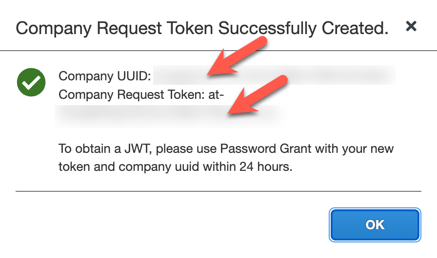
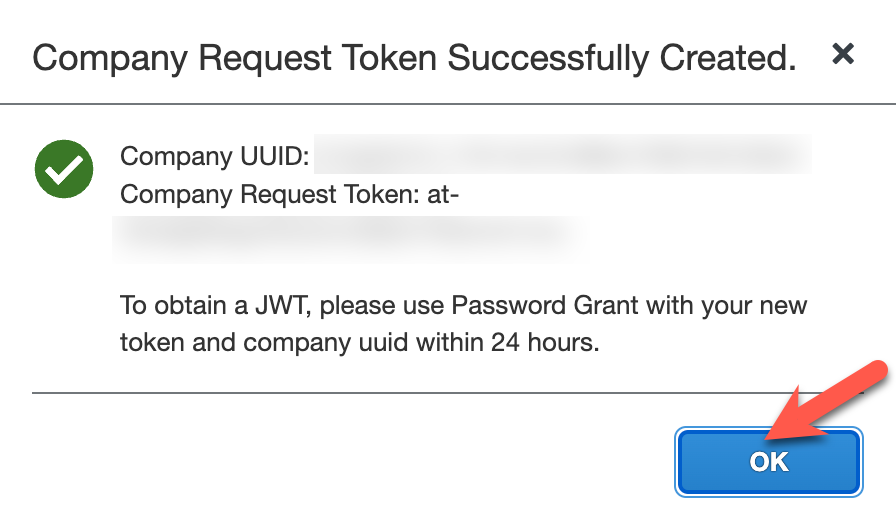
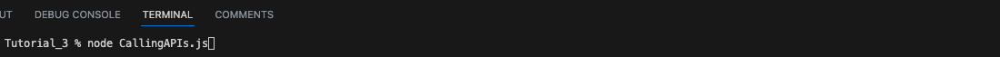
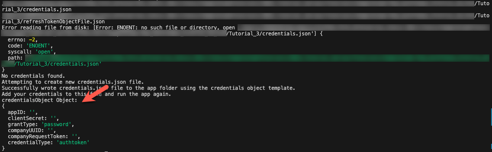
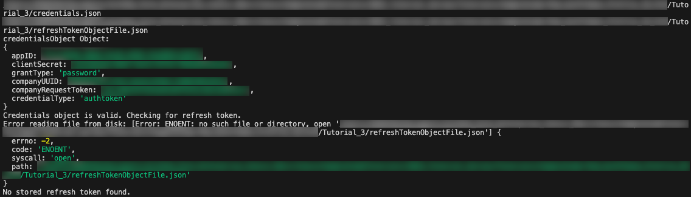
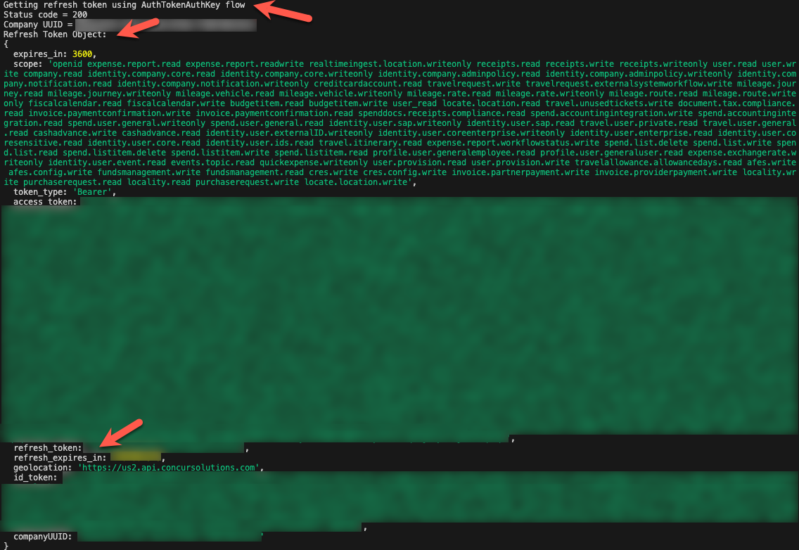
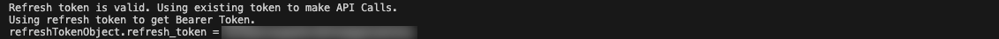
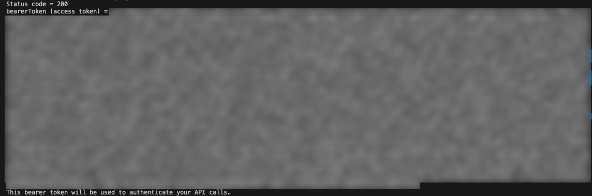
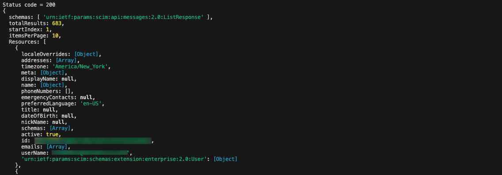

# Call Concur Apis Using A Multiple Use Bearer Token
<!-- description --> Use a refresh token to get a multiple use bearer token to call a Concur API.

## Prerequisites
 - You have created a Refresh Token from an API call and managed refresh token expiration using the previous [concur-refresh-token-management tutorial](https://developers.sap.com/tutorials/concur-refresh-token-management.html).
 - SAP Concur instance credentials
 - [Node.js](https://nodejs.org/)
 - [GitHub account](https://github.com/)
 - IDE or text editor

## You will learn
  - How to use a refresh token to get a multiple use bearer token to call a Concur API.

---

### Regenerate your company request token
1. Go to the [**Company Request Token**](https://www.concursolutions.com/nui/authadmin/companytokens) screen.
2. Enter your App ID in the required field and click Submit to regenerate your company request token.
3. Copy/paste the Company UUID and company request token fields to a text file.
        <!-- border -->
4. Click **OK** after you have saved this information to a text file.
        <!-- border -->

### Setup the NodeJs app
1. Get the [`NodeJs sample code`](https://github.com/SAP-samples/concur-api-samplecode).
2. Open ``SampleCode/Tutorial_3/CallingAPIs.js`` in your IDE or text editor.

### Regenerate your credentials file
1. Type ``node CallingAPIs.js`` in terminal to run the app to generate your ``credentials.json`` file. This generates messages in the terminal that show the credentials object.
        <!-- border -->
        <!-- border -->
2. Fill in the empty fields in this file with the information in the credential object. You can use all of the information from your ``credentials.json`` file in the previous [concur-refresh-token-management tutorial](https://developers.sap.com/tutorials/concur-refresh-token-management.html) except for the company request token.
        <!-- border -->

### Regenerate and store your refresh token in a json file
1. Run the app again. Since the app does not have a stored valid refresh token, the app will not find a valid refresh token in ``refreshTokenObjectFile.json``.
        <!-- border -->
        <!-- border -->
2. The app will call the Oauth2 /token endpoint using your credentials and regenerate your refresh token.
        <!-- border -->
3. If the API call is successful, the refresh token data is converted from JSON format into a refresh token object and stored in the file ``refreshTokenObjectFile.json``.
        <!-- border -->
        <!-- border -->

### Load your stored refresh token from a json file
1. Run the app again. Since the app now has a valid refresh token, the app will successfully load and check the validity of the file ``refreshTokenObjectFile.json``.
        <!-- border -->
2. Check for a successful validity check on the refresh token object loaded from ``refreshTokenObjectFile.json``. If the refresh token object validity check is successful, the refresh token object will be stored in the app to make API calls.
        <!-- border -->
        <!-- border -->

### Call a Concur API using a multiple use bearer token
1. The app will use the validated refresh token in the refresh token object to make an API call to get a bearer token.
        <!-- border -->
2. If the API call is successful, the bearer token data is converted from JSON format into a bearer token string.
        <!-- border -->
3. The bearer token string is used to make the API call to the Profile from ID v4 endpoint.
        <!-- border -->
4. If the API call is successful, the JSON response is displayed on the console.
        <!-- border -->

---
