## Prerequisites
- You have installed the [Postman](https://www.postman.com/downloads/) app.
- You have created a SAP Conversational AI chatbot, for example, as described in the tutorial [Build Your First Chatbot with SAP Conversational AI](mission.cai-get-started).

## Details
### You will learn
- How to retrieve an OAuth token for use with SAP Conversational AI API
- How to call SAP Conversational AI API with an OAuth token
- How to set up a Postman collection to call the APIs

This tutorial is a companion to the tutorial [Call SAP Conversational AI API Using OAuth](conversational-ai-api-oauth), which was a more sophisticated setup for calling SAP Conversational AI APIs using a Python server. Here, you will use Postman to more simply show how to retrieve an OAuth token and then call the API.

In Postman, you will set up 3 requests, and put them in a collection so they can be run together and pass arguments to each other:

- `start`: This request is a dummy request, but let's us at the start test whether we already have an OAuth token. If yes, we skip the request for getting a token.

- `get-oauth-credentials`: This request takes our chatbot credentials and calls the OAuth service to retrieve a new OAuth token.

- `request`: This request is the basic SAP Conversational AI Runtime API for sending an utterance to the NLP. (We could have also used the `dialog` Runtime API.)  

>This tutorial also shows off some of the functionality of Postman, from pre-request scripts, to tests, to setting and get environment data in order to pass between requests. It would have been simpler to use the built-in Postman OAuth authentication feature.

---

[ACCORDION-BEGIN [Step 1: ](Create Postman environment)]
We will need to create a Postman environment to store the various credentials for the OAuth and Runtime API credentials.

1. Open Postman.

2. In the top-left, click **New+**.

    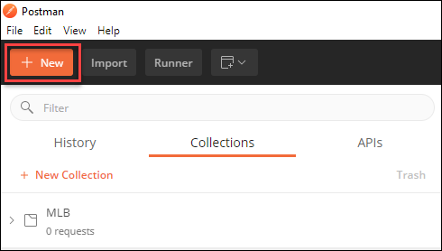

    Select **Environment**.

    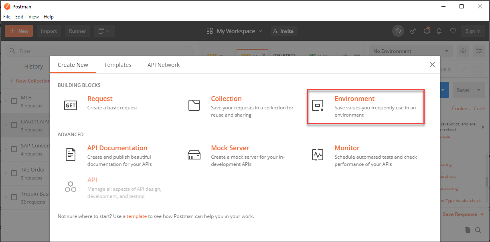

3. Call the environment **OAuth**, and create 3 variables:

    - `clientid`

    - `secret`

    - `requesttoken`

    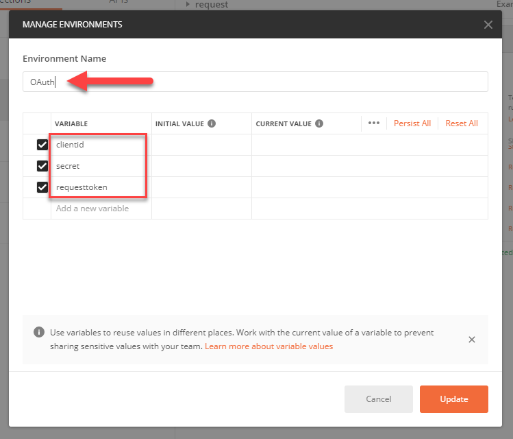

4. Click **Update**.

Keep the **Manage Environments** window open. In the next step we will get your credentials and store them in the environment.

>The URLs in this tutorial are for the community edition. We could have added the URLs in the environment so the entire setup would have also worked for the enterprise edition.

[DONE]
[ACCORDION-END]

[ACCORDION-BEGIN [Step 2: ](Get and store chatbot credentials)]

1. Go to your [SAP Conversational AI](https://cai.tools.sap/) account and open your chatbot.

    >This tutorial assumes your chatbot has the `greeting` skill.

2. Get the OAuth client ID and secret by going to your SAP Conversational AI chatbot to **Settings > Tokens**, and click **Generate** under **Runtime APIs**.

    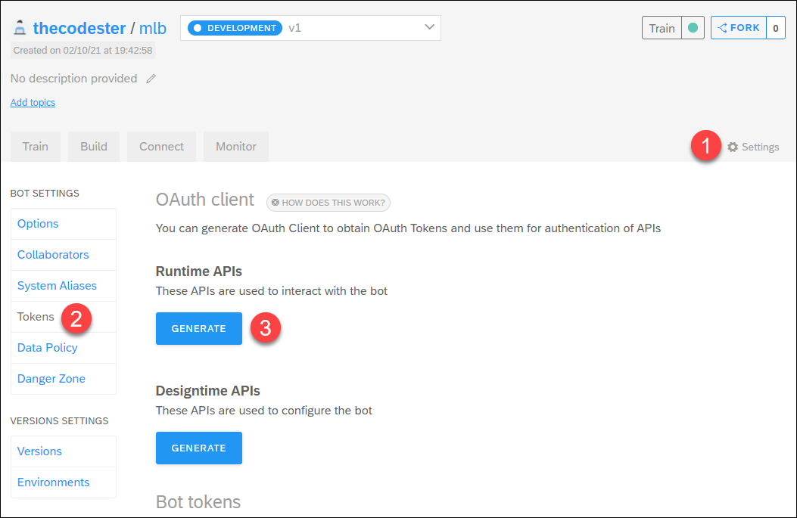

    Select **Client Credentials**, and click **Next**. After a few seconds, the credentials are created and you can click **Close** to close the dialog.

    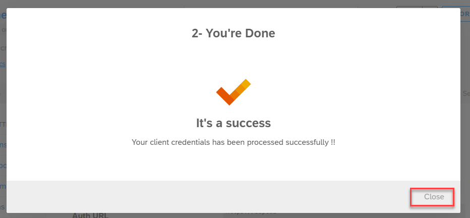

    Copy the client ID and secret, and put it in the corresponding fields in the Postman environment.

    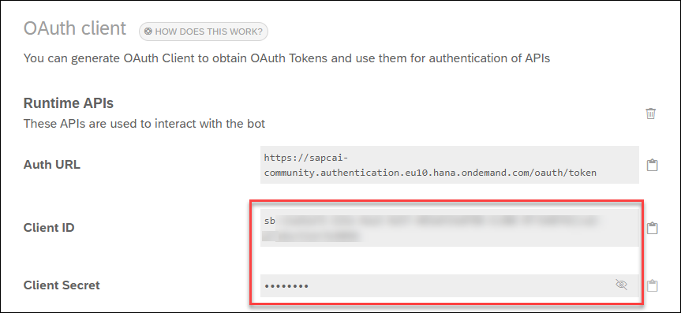

2. Get the request token by going to **Settings > Versions** and open the version of your chatbot that you want to call.

    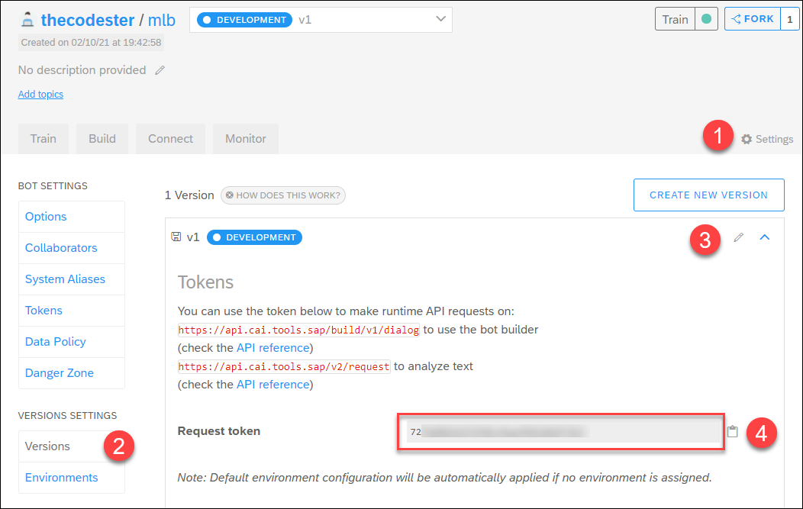

    Copy the request token, and put it in the corresponding field in the Postman environment.

3. Your environment should look something like this:

    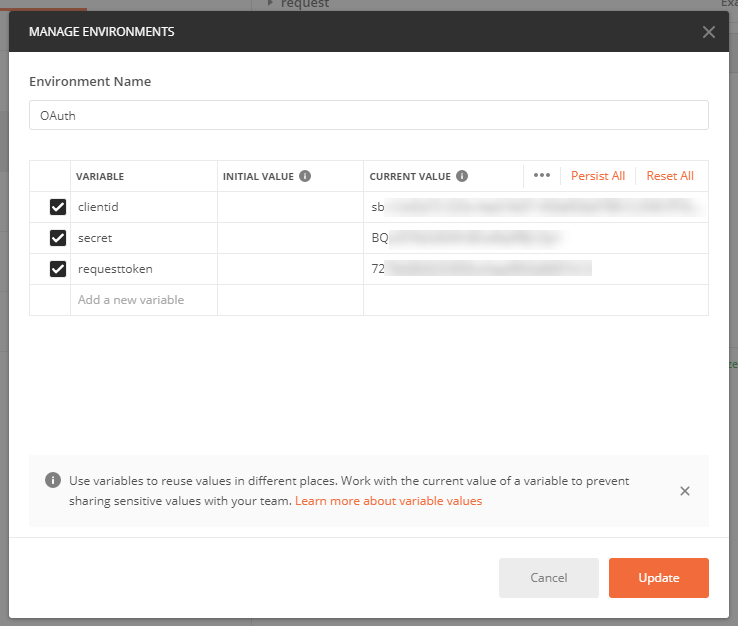

    Click **Update**, and then click the **X** to close the **Manage Environments** window.


[DONE]
[ACCORDION-END]


[ACCORDION-BEGIN [Step 3: ](Create request to start run)]

1. Create a new collection by again clicking **New+**, and this time selecting **Environment**.

    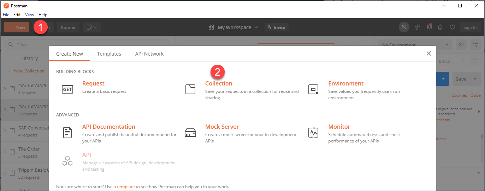

    Call the collection `OAuthCAIAPI`, and click **Create**.

2. Click **New+ > Request**.

    Enter `start` as the name, select the `OAuthCAIAPI` collection, and then click **`Save to OAuthCAIAPI`**.

    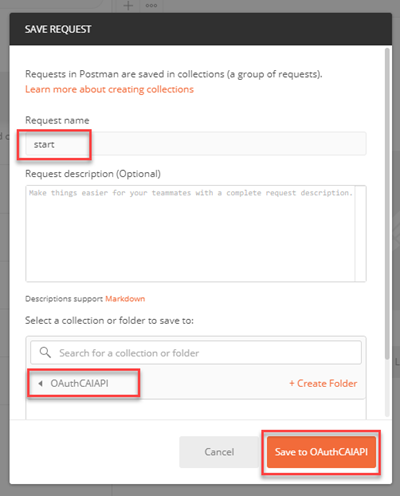

3. To the request, add the URL:

    ```URL
    https://postman-echo.com/get
    ```

    This is a dummy URL and let's us perform a script before calling any other APIs.

4. To the request, add the following to the **Pre-request Script**:

    ```JavaScript
    if (pm.environment.get("oauthtoken") != null) {
      postman.setNextRequest("request")
      pm.environment.set("retry", "true");
      console.log("HAVE TOKEN")
    }
    ```

    This script checks if there already exists an OAuth token. If a token exists, we skip the call to get a token and we create a flag that indicate that if the API call fails we want to try again (after we retrieve a new token, for example, because it has expired).

5. Click **Save**.


[DONE]
[ACCORDION-END]

[ACCORDION-BEGIN [Step 4: ](Create request to get OAuth token)]

1. Click **New+ > Request**.

    Enter `get-oauth-credentials` as the name, select the `OAuthCAIAPI` collection, and then click **`Save to OAuthCAIAPI`**.

2. To the request, add the URL:

    ```URL
    https://sapcai-community.authentication.eu10.hana.ondemand.com/oauth/token
    ```

3. To the request, under **Authorization**, set the type **Basic Auth**.

    Set the Username to `{{clientid}}`.

    Set the Password to `{{secret}}`.

    This will take the credentials from the environment variables.

    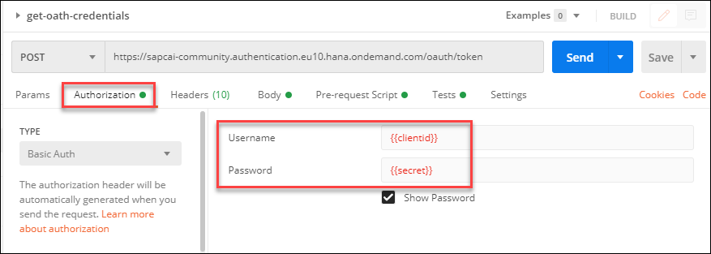

4. To the request, add a body.

    Set the type to `x-www-form-urlencoded`.

    Set the key to `grant_type` and the value to `client_credentials`.

    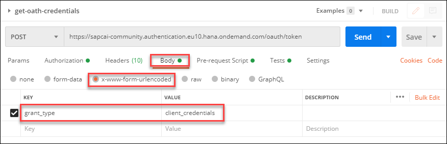

5. To the request, add the following to the **Pre-request Script**:

    ```JavaScript
    pm.environment.set("retry", "false");
    ```

    This indicates that we have retrieved a new OAuth token, and once we try the API call, we do not want to retry (with a newer OAuth token).

    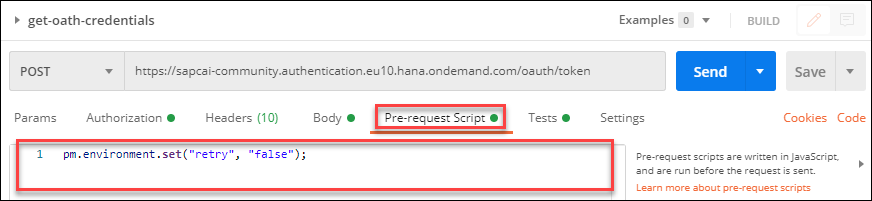

6. To the request, add the following to the **Tests**:

    ```JavaScript
    bodyData = JSON.parse(responseBody);
    token = bodyData.access_token;
    pm.environment.set("oauthtoken",token);
    console.log("GOT TOKEN");
    ```

    This retrieves the token and stores in the environment, for use with the API call.

    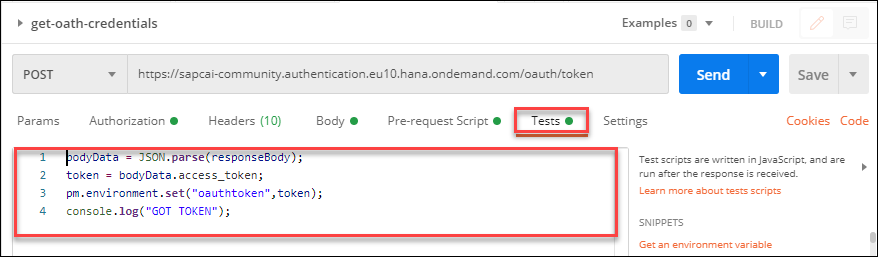

7. Click **Save**.


[DONE]
[ACCORDION-END]

[ACCORDION-BEGIN [Step 5: ](Create request to call chatbot API)]

1. Click **New+ > Request**.

    Enter `request` as the name, select the `OAuthCAIAPI` collection, and then click **`Save to OAuthCAIAPI`**.

2. To the request, add the URL:

    ```URL
    https://api.cai.tools.sap/train/v2/request
    ```

3. To the request, under **Authorization**, set the type **Bearer Token**.

    Set the Token to `{{oauthtoken}}`.

    This will take the token from the environment, where we stored it in the previous step.

4. To the request, add the following header:

    |  Header     | Value
    |  :------------- | :-------------
    |  X-Token           | `{{requesttoken}}`

    This will indicate to the API which chatbot to query.

5. To the request, add a body.

    Set the type to `raw`, and add the following body:

    ```JSON
    {   
          "text" : "Hi"
    }
    ```

    This is the utterance to send to the NLP, and should return the `greeting` intent.

6. To the request, add the following to the **Tests**:

    ```JavaScript
    if (pm.environment.get("retry")=="true" && pm.response.code ==401) {
        postman.setNextRequest("get-oath-credentials")
    }

    // Check if the request was successful (OAuth token was OK)
    pm.test("Request succeeded", function () {
        pm.response.to.have.status(200);
    });

    // Test if the correct intent was returned
    pm.test("Is intent correct", function () {
        var jsonData = pm.response.json();
        pm.expect(jsonData.results.intents[0].slug).to.eql("greetings");
    });
    ```

    This code starts by checking if we had an authentication error and whether we want to retry in such a case -- if so, we tell Postman to retrieve the OAuth token.

    After that, we add some standard tests, first that the call worked, and then whether the correct intent was returned. These are optional.

6. Click **Save**.

[DONE]
[ACCORDION-END]

[ACCORDION-BEGIN [Step 6: ](Run collection)]

1. In the top-left of Postman, click **Runner**.

    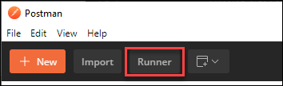

2. In the Collection Runner, set the following:

    - Select the `OAuthCAIAPI` collection.
    - Select the `OAuth` environment.
    - Check **Save Responses**.

    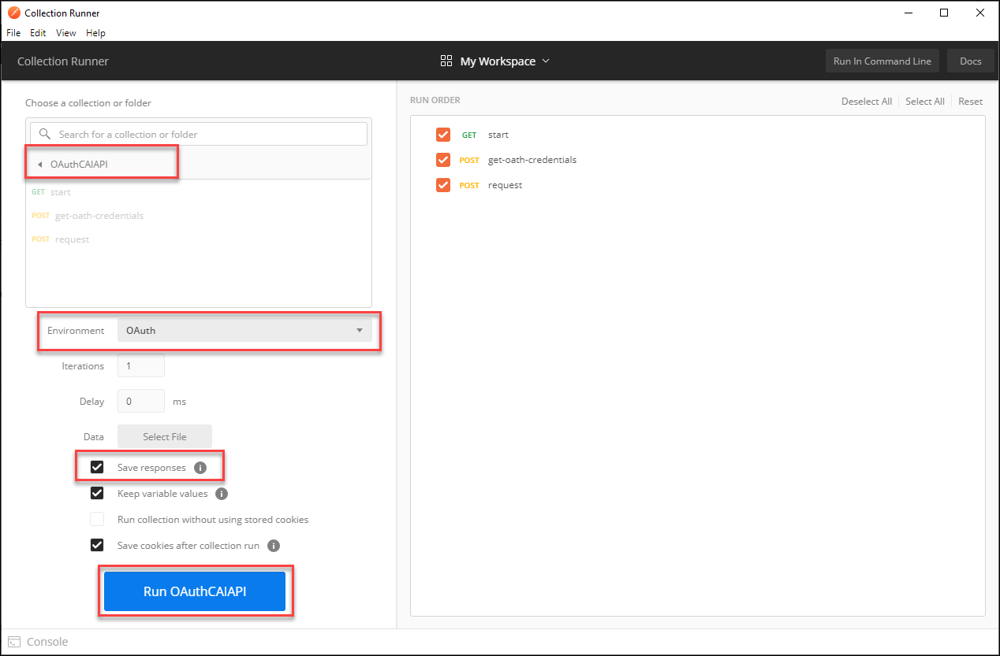

3. Click `Run OAuthCAIAPI`.

    The 3 requests should run, one after the other, and return 200 code. The OAuth request is run because you did not have an environment variable storing the token.

    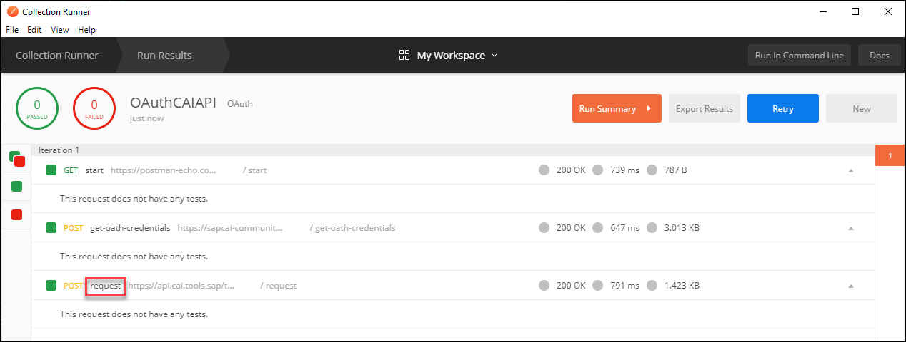

    Click on the word `request`, then on **Response Body** to see the response, which shows that the NLP recognized the `greeting` intent.

    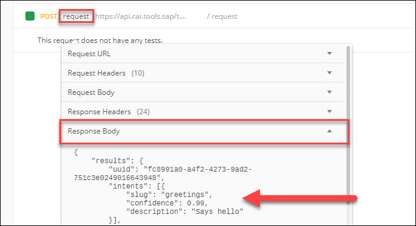

3. Run the collection again by clicking **Collection Runner** in the breadcrumb at top-left, then clicking `Run OAuthCAIAPI` again.

    This time the `oauth-get-token` request is not run because we already had a valid token stored in the environment.

    

4. Finally, let's simulate when the token expires by opening the `OAuth` environment and changing the stored token to `abc`.

    Go back to the main Postman screen, and open the environment by selecting `OAuth` and clicking the eye icon, on the top-right.

    Click **Edit**.

    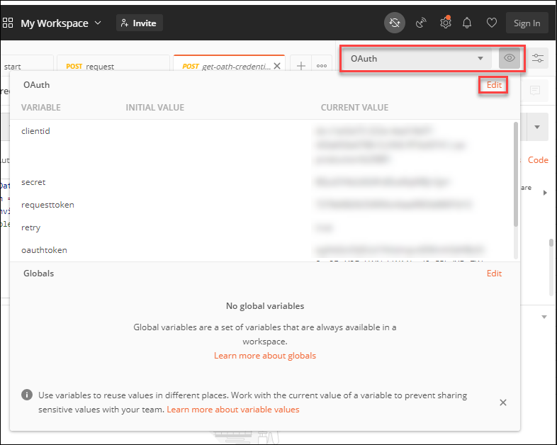

    Change the `oauthtoken` variable to `abc`, and click **Update**. Close the window.

    Now go back to the Collection Runner and run the collection again. This time you will make 4 requests. Running `request`, will fail, so the request to get an OAuth token will run, and then `request` will be retried, this time successfully.

    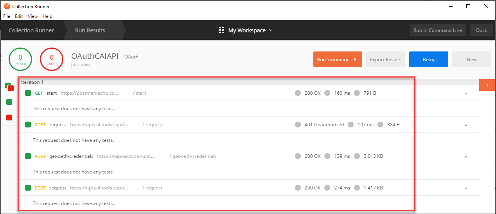


[DONE]
[ACCORDION-END]

[ACCORDION-BEGIN [Step 7: ](Test yourself)]


[VALIDATE_7]
[ACCORDION-END]


---
