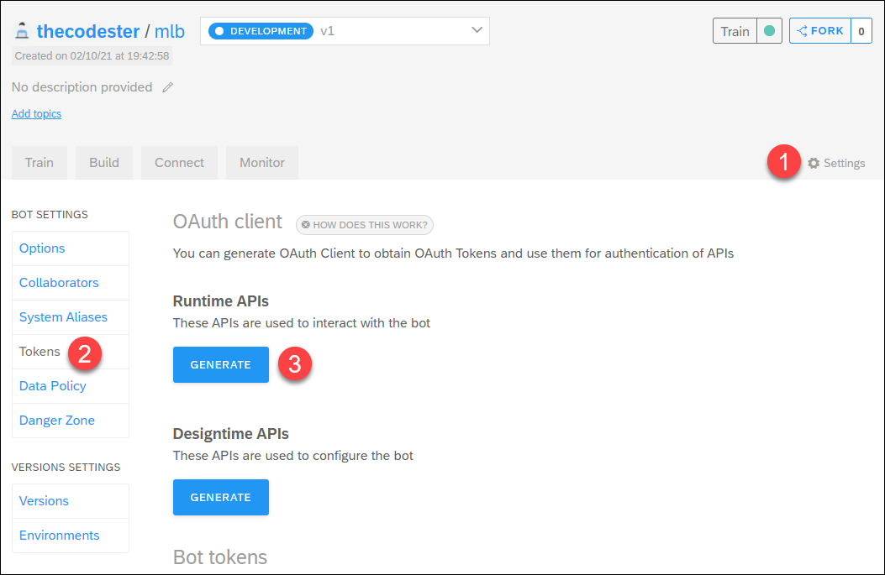
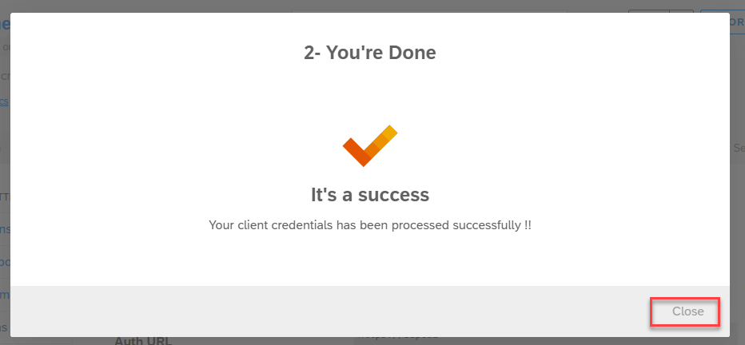
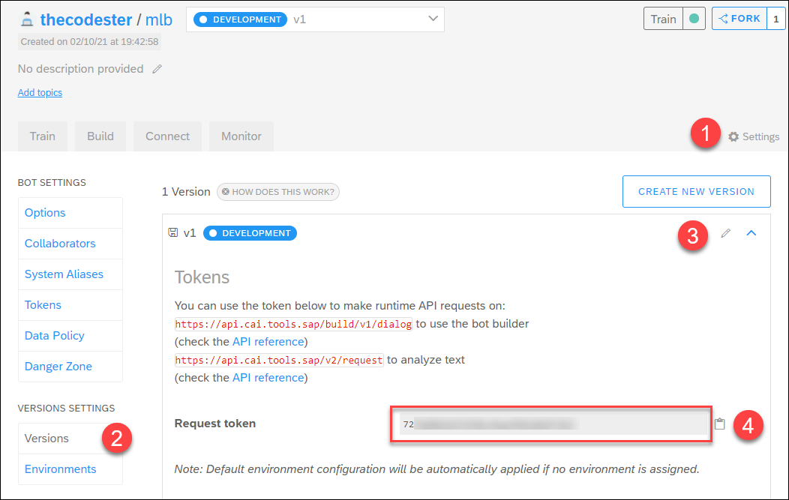
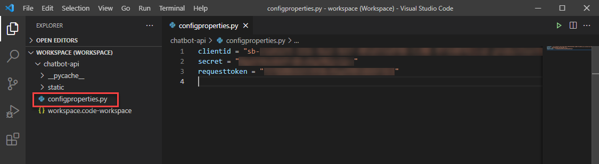
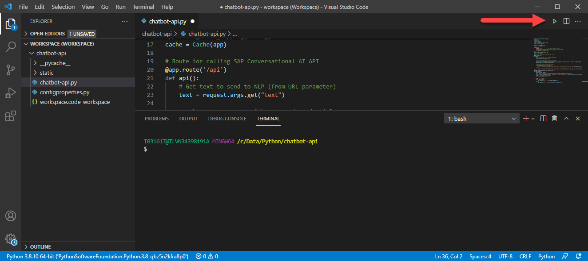
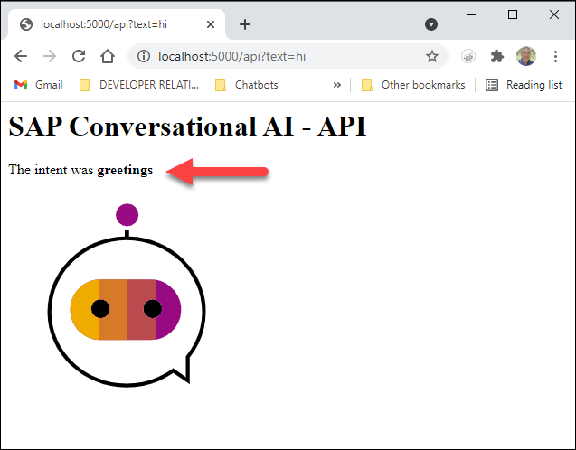
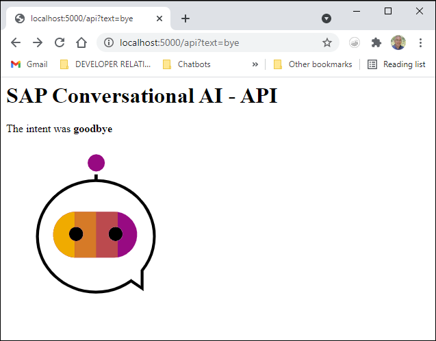
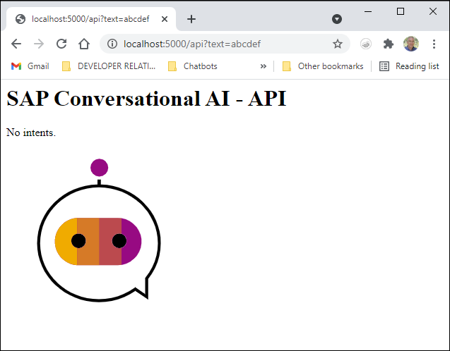
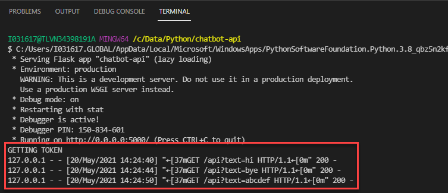

## Prerequisites
- You understand the basics of creating a chatbot, as described in the tutorial [Build Your First Chatbot with SAP Conversational AI](cai-bot-getting-started).
- [Python](https://www.python.org/downloads/)
- [VS Code](https://code.visualstudio.com/) with the [Python extension by Microsoft](https://code.visualstudio.com/docs/languages/python), though you can use any Python development environment. See [Getting Started with Python in VS Code](https://code.visualstudio.com/docs/python/python-tutorial).
- [Flask](https://flask.palletsprojects.com/) package for Python
- [Requests](https://pypi.org/project/requests/) package for Python
- [Flask-Caching](https://flask-caching.readthedocs.io) package for Python
- You have created a chatbot that you would like to call. If not, create a new chatbot with the **Greetings** skill.

## Details
### You will learn
  - How to retrieve an OAuth token for use with SAP Conversational AI API
  - How to call SAP Conversational AI API via OAuth

This tutorial is a companion to the tutorial [Call SAP Conversational AI API Using OAuth (Postman)](conversational-ai-api-oauth-postman), which lets you just test the APIs via a simple Postman collection. Here, you will make a more sophisticated simulation, including building a web server and using caching to store the OAuth token.

### What you will build

This tutorial demonstrates the basics for calling the SAP Conversational AI API using an OAuth token, which is the required way for all new chatbots. The `request` endpoint of the Runtime API is called, which sends an utterance only to the NLP for understanding, but the principles are the same if you used the `dialog` endpoint.

To make things more interesting, you will create a simple web server that:

- Takes an utterance via a URL parameter.
- Retrieves an OAuth token, using the chatbot's client ID and secret.
- Calls the NLP via the `request` endpoint, sending the OAuth token as authentication.

>Best practices call for only retrieving the OAuth once, and then caching it for all subsequent calls. We will use the `flash_caching` package to store the token.  

---

[ACCORDION-BEGIN [Step 1: ](Create Python project)]

1. In the file explorer, create a new folder for the project and call it `chatbot-api`.

2. Open VS Code.

    >Make sure you have installed the Microsoft extension for Python, as well as all the prerequisite packages.

3. Go to **File > Add Folder to Workspace**, and select the project folder.

4. Inside the folder, create a folder called `static`. Download the SAP Conversational AI [icon](https://www.sap.com/content/dam/application/imagelibrary/pictograms/283000/283370-pictogram-purple.svg) and place it in the folder.

Your project should look like this:


[DONE]
[ACCORDION-END]

[ACCORDION-BEGIN [Step 2: ](Create config file and store credentials)]

1. In your project, create a file called `configproperties.py`.

2. Add properties for the credentials you will need:

    ```Python
    clientid = "<your client ID>"
    secret = "<your secret>"
    requesttoken = "<your request token>"
    oauthURL = "<URL for getting OAuth token>"
    requestURL = "<URL for calling request API>"
    ```

3. Retrieve your credentials from your chatbot and place as values in the `configproperties.py` file.

    - For the client ID, secret and OAuth URL, go to **Settings > Tokens**, and click **Generate** under **Runtime APIs**.

        

        Select **Client Credentials**, and click **Next**. After a few seconds, the credentials are created and you can click **Close** to close the dialog.

        

        Copy the client ID and secret.

        

    - For the request token and request API URL, go to **Settings > Versions** and open the version of your chatbot that you want to call.

        

Now your `configproperties.py` file should have your credentials.



[DONE]
[ACCORDION-END]


[ACCORDION-BEGIN [Step 3: ](Create main Python file)]

1. In your project, create a file called `chatbot-api.py`.

2. In the file add the following skeleton code:

    ```Python
    from flask import Flask, request, jsonify
    import os
    import json
    import requests
    from flask_caching import Cache
    from datetime import datetime
    import configproperties

    app = Flask(__name__)
    cf_port = os.getenv("PORT")

    #Other code will go here

    if __name__ == '__main__':
    	if cf_port is None:
    		app.run(host='0.0.0.0', port=5000, debug=True)
    	else:
    		app.run(host='0.0.0.0', port=int(cf_port), debug=True)
    ```

The above is standard code, and will create the localhost server on port 5000. Also, `debug=True` will allow you make changes to the web server without having to manually restart the server.

>You will have to have installed the `Flask`, `flask_caching`, and `requests` packages.


[DONE]
[ACCORDION-END]

[ACCORDION-BEGIN [Step 4: ](Add configuration to enable caching of token)]

Add the following to enable the caching of the OAuth token:

```Python
config = {
    "DEBUG": True,          # some Flask specific configs
    "CACHE_TYPE": "SimpleCache",  # Flask-Caching related configs
    "CACHE_DEFAULT_TIMEOUT": 300
}
app.config.from_mapping(config)
cache = Cache(app)
```

For more information on configuring and using caching, see [Flask-Caching](https://flask-caching.readthedocs.io/).


[DONE]
[ACCORDION-END]


[ACCORDION-BEGIN [Step 5: ](Add function to get OAuth token)]

Add the following function to retrieve the OAuth token:

```Python
@cache.cached(timeout=43200, key_prefix='token')
def get_token():
    print("GETTING TOKEN")
    result = requests.post(configproperties.oauthURL, data={ 'grant_type':'client_credentials' }, auth=(configproperties.clientid, configproperties.secret))
    token = json.loads(result.content)
    return token["access_token"]
```

Notice the following:

- You set a `print` statement so you will be able to see whether this function is executed based on the cache (more on this later).

- In addition to sending the credentials as headers, you also send a the `grant_type` key-value pair as form-encoded data.

- In the `@cache` decorator for this function, you set the caching to be valid for 12 hours, which is the validity for the token. You also set the cache field name to `token`.

>Ideally, the caching timeout would not be hard-coded, but would be retrieved from within the JSON when you get the OAuth token, in the `expires_in` field.

[DONE]
[ACCORDION-END]

[ACCORDION-BEGIN [Step 6: ](Add function to call API)]
Add the following function to create an endpoint, and when called, to call the SAP Conversational AI API and return the intent that was detected.

```Python
# Route for calling SAP Conversational AI API
@app.route('/api')
def api():
    # Get text to send to NLP (from URL parameter)
    text = request.args.get("text")

    # Make Post request, with text and credentials
    result = requests.post(configproperties.requestURL, json={"text" : text}, headers={ "Authorization" : "Bearer " + get_token(), "X-Token" : "Token " + configproperties.requesttoken })
    resultsjson = json.loads(result.content)

    # Return web page, including the intent
    if resultsjson["results"]["intents"]:
        return f'<h1>SAP Conversational AI - API</h1><body>The intent was <b>{resultsjson["results"]["intents"][0]["slug"]}</b><br></body>'
    else:
        return f'<h1>SAP Conversational AI - API</h1><body>No intents.<br></body>'
```

Notice that you must send the OAuth token as bearer authorization token, and the `X-Token` header with your request token.

The format of the response for the Runtime `request` and `dialog` APIs are described under [Runtime API](https://reverseproxy.cai.tools.sap/docs/api-reference/#runtime-api).

[DONE]
[ACCORDION-END]

[ACCORDION-BEGIN [Step 7: ](Test the app)]

1. Start the server by clicking the **Run in Terminal** icon.

    

2. Call the server with the URL:

    ```URL
    http://localhost:5000/api?text=hi
    ```

    The web page shows the intent that was detected, `greetings`.

    

3. Call the server with the URL:

    ```URL
    http://localhost:5000/api?text=bye
    ```

    The web page shows the intent that was detected, now `goodbye`.

    

4. Call the server with the URL:

    ```URL
    http://localhost:5000/api?text=abcdef
    ```

    The web page now says that no intent was detected.

    

If you look at the terminal, you will see that we retrieved the token in the first call but then used the cached token in the next 2 calls.



[DONE]
[ACCORDION-END]

[ACCORDION-BEGIN [Step 8: ](Test yourself)]


[VALIDATE_1]
[ACCORDION-END]
---
