## Prerequisites
 - You have already built the bot described in [Create Chatbot for Customers of Shipping Company](group.cai-shipping-bot).

## Details
### You will learn
- How the chatbot chooses what skill to run
- How to use the Test panel
- How to use the Chat Preview, including its JSON and debug features

Once you design your bot and are putting it together (e.g., adding intents, expressions, and intents), you will want to test it as you go and keep making it better. The Test panel and Chat Preview lets you test your bot against different hypothetical utterances and conversations, to see what is happening under the hood -- and then make adjustments.

In previous tutorials we used the test panel and chat preview. Now that you have a little experience, we can take a deeper dive into the debugging tools and how to make the best use of them.

---

[ACCORDION-BEGIN [Step 1: ](How does chatbot work?)]

To truly understand how chatbots work, you need to peer under the hood a little and see the process. Yes, a little technical, sometimes philosophical, but it will help when you're struggling and debugging your chatbot.

There are 2 main things that happen each time someone enters text into the conversation:

1. **NLP (Natural Language Processing)**: The user "utters" something -- types something into the chat -- and the bot figures out to which intent the user meant and discerns any entities. For the most part, each utterance is independent of the next, from the point of view of the NLP.

2. **Skill Selection**: After the chatbot knows what the user said (in the form of intents and entities), the chatbot must decide what skill to run and what actions to take.

    >Actions can be sending a message, calling an API, or changing the conversation state (by activating a different skill, editing the memory, or resetting the conversation).

[VALIDATE_6]
[ACCORDION-END]

[ACCORDION-BEGIN [Step 2: ](NLP)]
NLP (Natural Language Processing) takes the intents and entities you define (and later the actual input from users) and trains itself to map the user's utterances to your intents and entities.

For each intent, the NLP decides how confident it is that this intent is what is meant by the user. At the same time, you assign each intent a matching strictness (default is 50%).

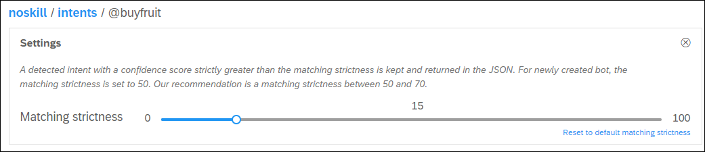

Finally, any intent where the confidence is over its strictness setting is selected.

>Generally, the chatbot automatically trains itself after every change in the bot. But for large bots you may want the bot to train itself. This setting is under **Settings > Versions** and is set for each version.

>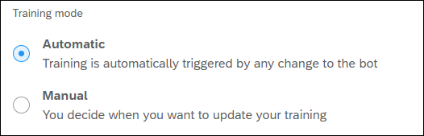
&nbsp;

>In manual mode, you can retrain the bot by clicking **Train**. The yellow dot indicates the bot is out of date and needs training.

>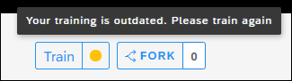
&nbsp;

>- **Yellow Dot:** Needs training
>- **Blue Dot:** Currently training
>- **Gray Dot:** Will start training soon
>- **Green Dot:** Bot is up to date

[DONE]
[ACCORDION-END]

[ACCORDION-BEGIN [Step 3: ](NLP – and Test panel)]

The Test panel allows you to test how the NLP is detecting individual user utterances.

1. Create a new bot.

2. Create an intent called `buyveggie` and add expressions **buy lettuce" and **buy vegetable**. Set the strictness to 15.

3. Create intent called `buyfruit` and add expressions **buy apple" and **buy fruit**. Set the strictness to 15.

    >Make sure the bot is trained. You may have to wait a minute.

4. Open the Test panel by clicking **TEST** on the right side of the screen.

    Enter **buy guava**.

    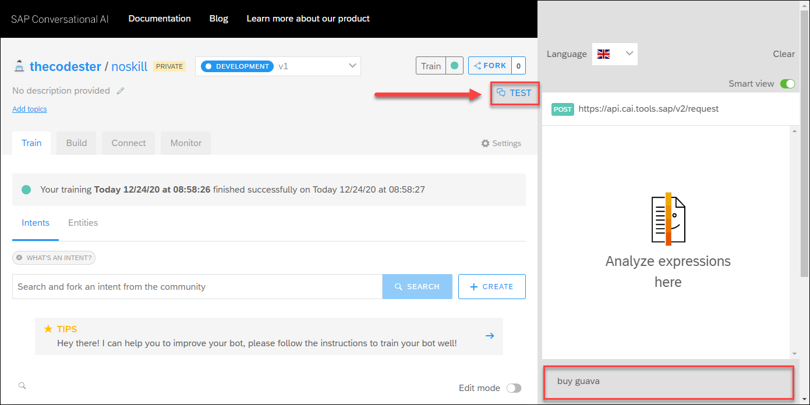

    After pressing **Enter**, the panel shows you what intents and entities were selected -- in this case, it selected `@buyfruit`.

    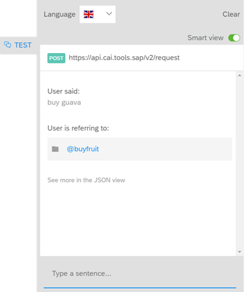

    Now click **See more in the JSON view**. You will see that the NLP actually selected 2 intents -- `@buyfruit` and `@buyfruit`, but that it had more confidence that guava was a fruit.

    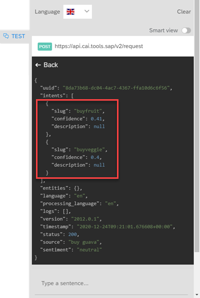

> ### How can there be 2 intents?
>
>Yes, that can be a problem.

>First, notice that the difference in confidence between the 2 intents is quite small, meaning that the chatbot doesn't really know which intent is meant by the user. You will need to differentiate between the 2 intents, or create a single intent and then with entities differentiate between fruits and vegetables.

>Also, if you have a skill for each intent, this will cause a disambiguation problem, because the chatbot does not know which skill to trigger. (If you have a [disambiguation skill](https://help.sap.com/viewer/a4522a393d2b4643812b7caadfe90c18/latest/en-US/e57e071f365c49a980801c93a6c51c02.html), the chatbot will run this skill, displaying the possible others skills that were selected, and the user would be able to select the one that best reflects his intent.)

[DONE]
[ACCORDION-END]

[ACCORDION-BEGIN [Step 4: ](Skill selection)]
Once the intents and entities are detected, the chatbot has a complex mechanism for selecting the skill to execute. Here's how it works:

1. **Is the user's utterance related to something they said just before?**

    Since we are dealing with a conversation -- a flow of utterances -- likely what someone says now is related to something they said earlier in the conversation.

    So the chatbot maintains a **_Stack_** of skills that were previously triggered but whose actions did not get executed because of missing requirements.

    So ... if the skill on the top of the stack is triggered by the utterance or contains a requirement, then that skill is selected. Only the top skill is checked.

2. **Otherwise ... what skill is triggered?**

    If the skill at the top of the stack is not relevant -- perhaps the user changed the subject -- the chatbot searches all the skills for the one triggered by the utterance, and selects it.

3. **How many skills are triggered?**

    - **If no skill is triggered**, then the chatbot goes to its fallback skill (if there is no fallback skill, no reply is given).

    - **If 1 skill is triggered**, we select it for execution.

    - **If more than 1 skill is triggered**, then the chatbot executes its disambiguation skill, which displays a list of the triggered skills and lets the user choose which one to execute (if there is no disambiguation skill, the fallback is executed).

Once a skill is selected, its requirements are checked. If they are fulfilled, the skill's actions are executed. If requirements are missing, no messages are sent via the actions.

>Of course, a missing requirement can send a message itself, asking the user to provide the requirement.

The following is a flowchart showing how things work:

!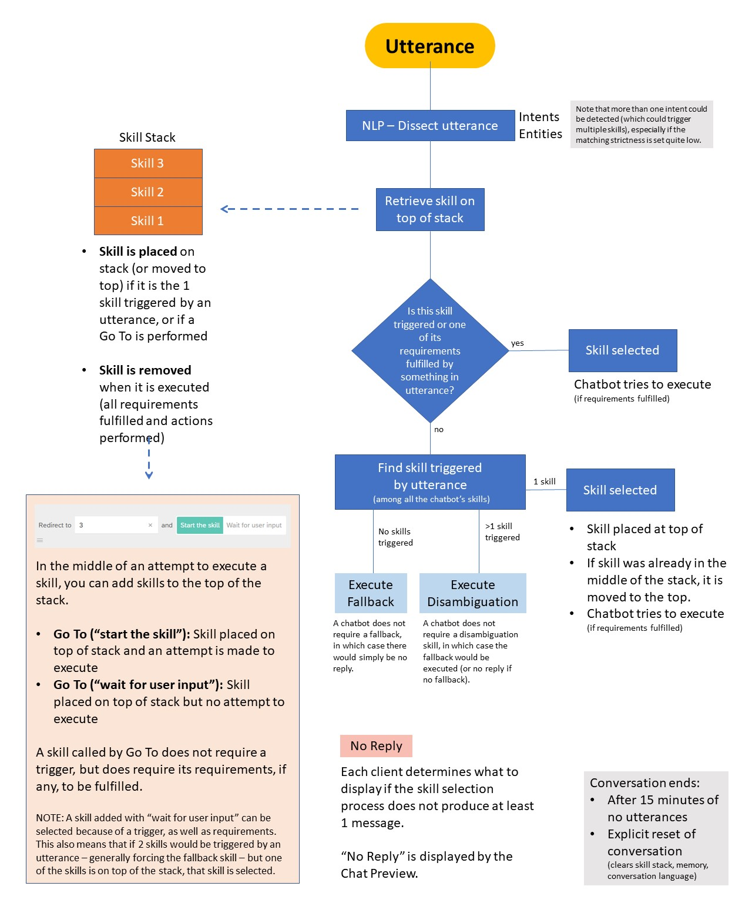

[VALIDATE_1]
[ACCORDION-END]

[ACCORDION-BEGIN [Step 5: ](Chat preview)]
The Chat Preview lets you test how your chatbot will handle user input -- essentially, testing the skill selection of the chatbot.

1. Open your shipping bot.

2. Open the Chat Preview.

    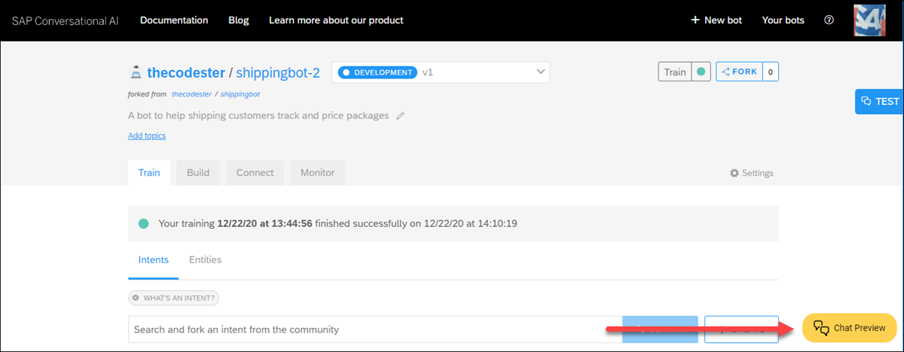

3. Enter **`track package`**.

    You will see how it reacts, and you experiment with different utterances at different points in the conversation.

    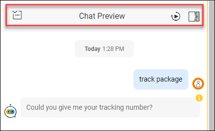

At the top of the screen, from left to right, you have the following tools:

- Close the Chat Preview (but keep the conversation as it is, hidden)
- Clear the window and the conversation memory
- Open the Debug panel

[DONE]
[ACCORDION-END]

[ACCORDION-BEGIN [Step 6: ](JSON conversation)]
You can access a representation of the conversation in JSON format by click the yellow **i** next to any response by the chatbot.

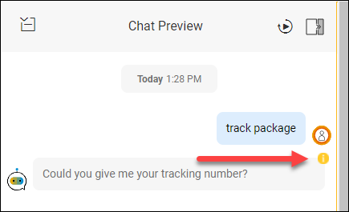

Some of the key information you can see with the JSON:

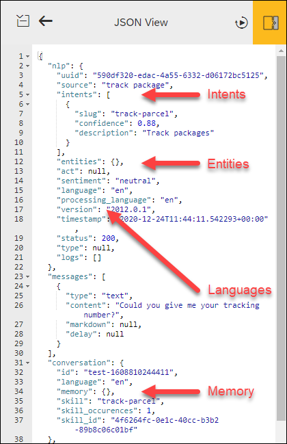

- **Intents and Entities:** The intents detected by the NLP (similar to Test panel).
- **Languages:** The detected language and the processing language for the conversation.
- **Memory:** The data stored in the conversation, either data a skill explicitly put in memory or a skill's requirement that was found in the conversation.

>At the top of the Chat Preview there is now an arrow to close the JSON window and view the conversation.

>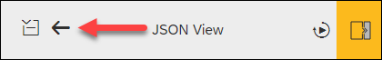
&nbsp;

[DONE]
[ACCORDION-END]

[ACCORDION-BEGIN [Step 7: ](Debug panel)]
The Debug panel gives you a better view of the skill selection -- what skills are being triggered, what messages are being sent, what APIs are being access.

1. Open the Chat Preview.

2. Clear it by pressing  and open the Debug panel by clicking .

    

3. Enter into the chat **`track 1Z12345E6205277936`**.

    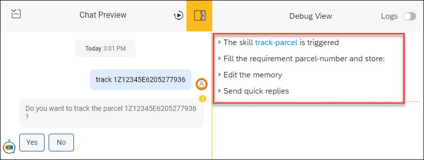

    The Debug panel tells you:

    - The `track-parcel` skill was selected.

    - The `parcel-number` requirement was fulfilled and stored in memory.

    - The memory was edited (when you built this chatbot you added a set memory action if the requirement was found).

    - Quick replies were sent (the **Yes** and **no** buttons).

4. Click the **Yes** quick reply.

    

    Now the Debug panel tells you:

    - Again the `track-parcel` skill was selected.

    - The `Yes` requirement was fulfilled and stored.

    - All the requirements were fulfilled and the skill's actions were executed.

    - The actions called an API.

    - The memory was edited (you manually reset the Yes/No memory).

> ### Common errors

>- If no skills are triggered:

>     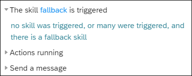

>- If more than 1 skill is triggered but you have no disambiguation skill:

>     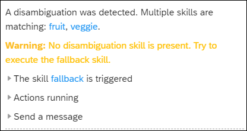

>- If a skill is triggered but it does not return any message:

>     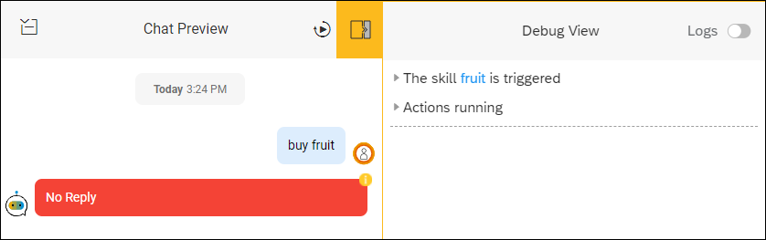

>     You do not get an error in the Debug panel, but a red **No Reply** in the conversation. The exact response you get when actions do not return any messages depends on the channel.

>- If an API call fails:

>     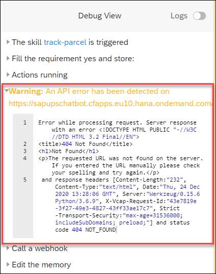

>     The exact response depends on the error that caused the failed API call.

[DONE]
[ACCORDION-END]

[ACCORDION-BEGIN [Step 8: ](Test yourself)]

[VALIDATE_7]
[ACCORDION-END]

---
