## Prerequisites
 - You have created a chatbot to deploy. This tutorial uses the bot created in the tutorial [Consume API Services and Call Webhooks from Your Chatbot](conversational-ai-webhook-api-call).

## Details
### You will learn
  - How to deploy a chatbot to Slack
  - How to add app to channel
  - How to talk directly with the app without a channel

---

[ACCORDION-BEGIN [Step 1: ](Connect with Slack)]

1. Go to the **Connect** tab.

    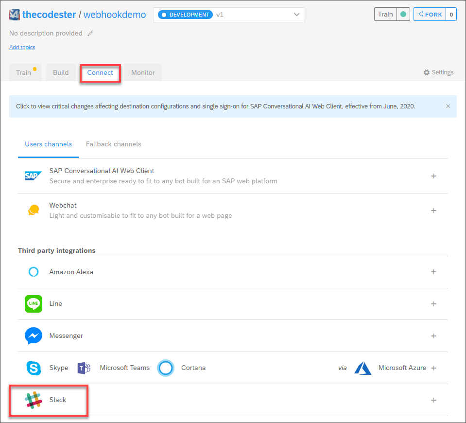

2. Under **Third party integrations**, click **Slack**.

    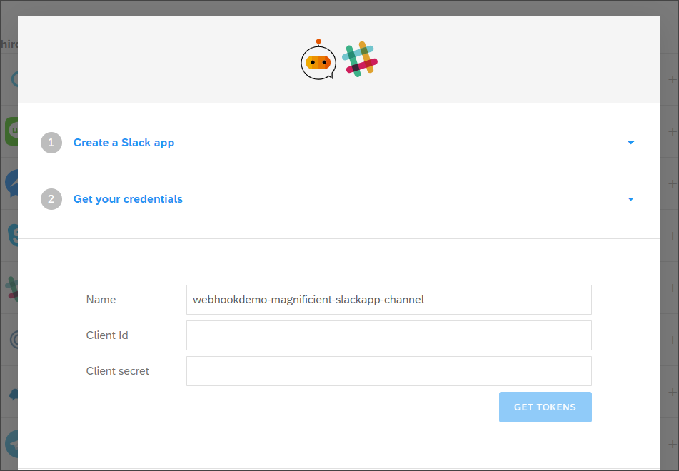

This will open a set of instructions for integrating with Slack, and a place to store tokens for connecting to Slack. But you can follow the instructions in this tutorial instead.

[DONE]
[ACCORDION-END]

[ACCORDION-BEGIN [Step 2: ](Create a Slack app)]

1. Go to <https://api.slack.com/apps>.

2. Click **Create App**.

    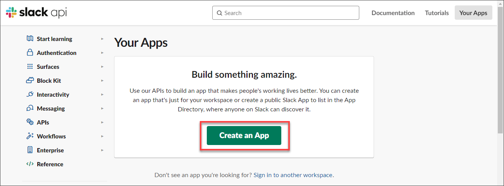

3. Enter the following:

    |  Field Name     | Value
    |  :------------- | :-------------
    |  App Name           | **`Animal Facts`**
    |  Development Slack Workspace           | Select your workspace

4. Click **Create App**.

    Your app is created.

    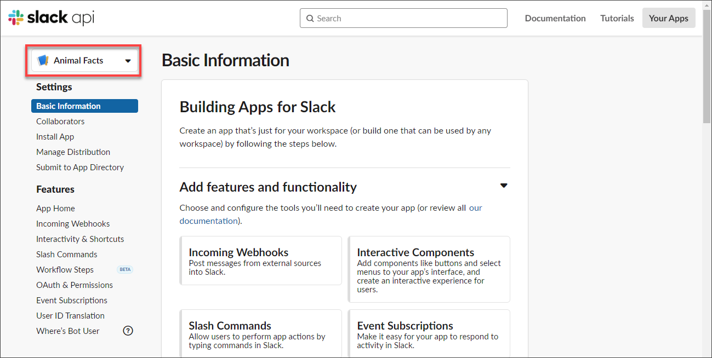

[DONE]
[ACCORDION-END]

[ACCORDION-BEGIN [Step 3: ](Get credentials)]

1. In the Slack app page, in the **Basic Information** tab, scroll down to the **App Credentials** section.

    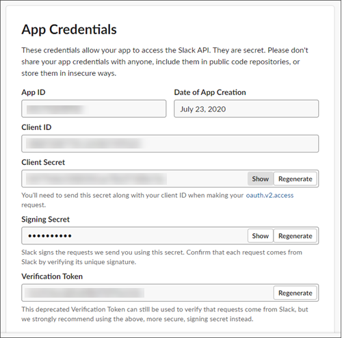

2. Copy the **Client ID** and **Client Secret** from the Slack app page to the Slack panel in the **Connect** tab in SAP Conversational AI:

    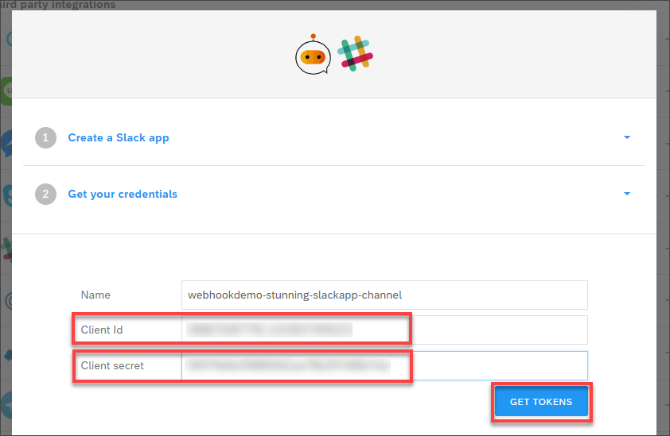

3. Click **Get Tokens**.

    This will create OAuth and Event URLs.

    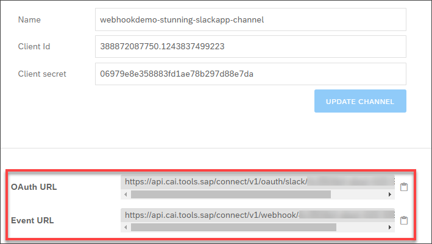

    Hold onto to these URLs because you will need to enter them within your app on Slack.

[DONE]
[ACCORDION-END]

[ACCORDION-BEGIN [Step 4: ](Set the OAuth redirect URL)]

1. In the Slack app page, go to **OAuth & Permissions**.

2. Click **Add New Redirect URL**.

    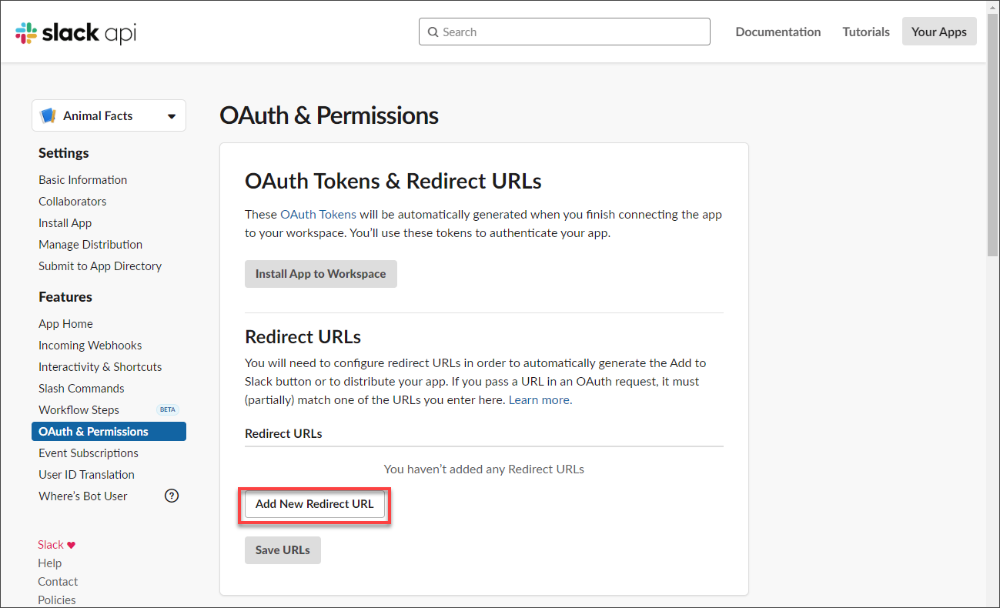

    Enter the OAuth URL from SAP Conversational AI, click **Add**, then click **Save URLs**.

[DONE]
[ACCORDION-END]

[ACCORDION-BEGIN [Step 5: ](Enable interactivity)]

1. In the Slack app page, go to **Interactivity & Shortcuts**.

    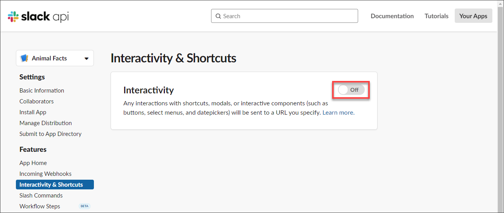

2. Turn interactivity **On**.

3. Enter the events URL from SAP Conversational AI into the **Request URL**.

    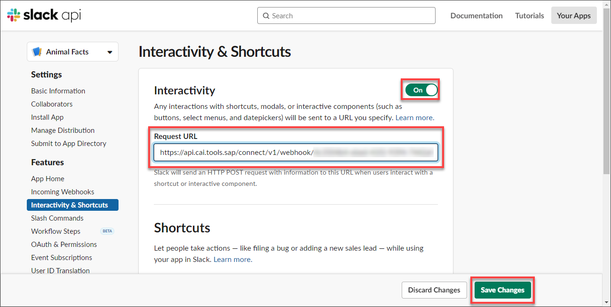

    Click **Save Changes**.

[DONE]
[ACCORDION-END]

[ACCORDION-BEGIN [Step 6: ](Add scopes)]

1. In the Slack app page, go to **OAuth & Permissions**, and scroll down to **Scopes**.

    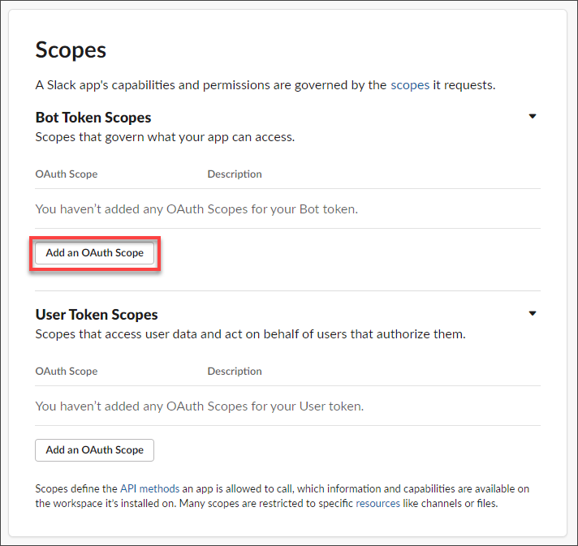

2. Click **Add an OAuth Scope** and add the following scopes:

    |  Scope     |
    |  :------------- |
    |  `app_mentions:read`           |
    |  `channels:history`           |
    |  `chat:write`    |
    |  `im:history`          |
    |  `users:read`  |

    These give the app permission, for example, to read mentions entered into Slack or to post messages.

3. Scroll to the top and click **Install App to Workspace**, and then click **Allow** to give your app the needed permissions.

[DONE]
[ACCORDION-END]

[ACCORDION-BEGIN [Step 7: ](Subscribe to events)]

1. In the Slack app page, go to **Event Subscriptions**.

    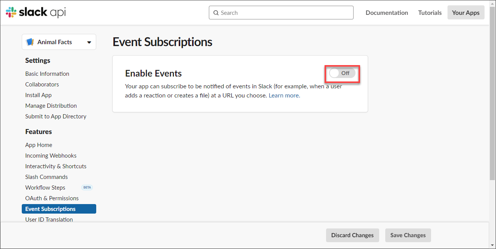

2. Turn events **On**.

3. Enter the events URL from SAP Conversational AI into **Request URL**.

4. Under **Subscribe to bot events**, and subscribe to events.

    Click **Add Bot User Event** and add the following events:

    |  Event     |
    |  :------------- |
    |  `app_mention`           |
    |  `message.im`           |
    |  `message.channels`    |

5. Click **Save Changes**.

[DONE]
[ACCORDION-END]

[ACCORDION-BEGIN [Step 8: ](Add bot to workspace)]

In the Slack panel in the **Connect** tab in SAP Conversational AI, go to step 8 (Add my bot to a slack channel).

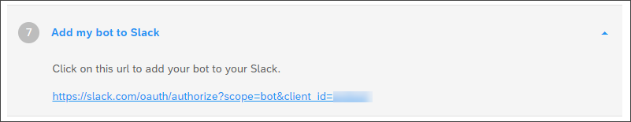

Click the link.

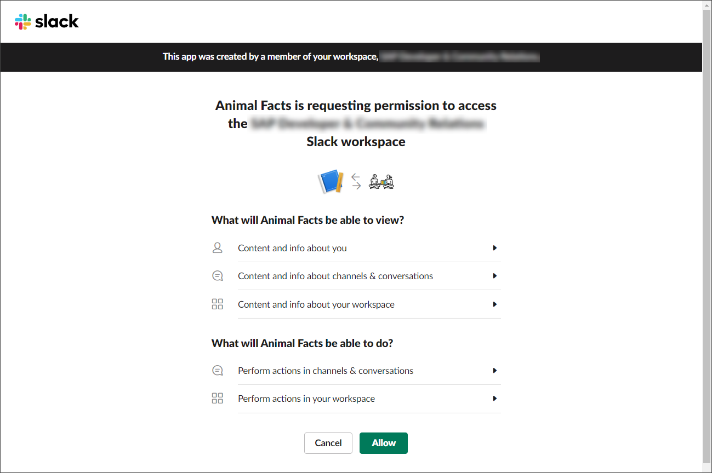

Allow the permissions for the app by clicking **Allow**. You should get a success message.

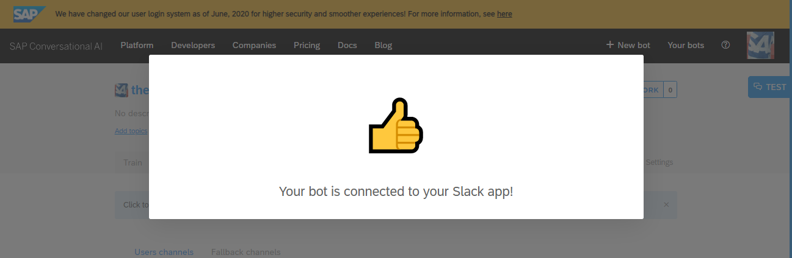

[DONE]
[ACCORDION-END]

[ACCORDION-BEGIN [Step 9: ](Talk to the app directly)]

1. In Slack, scroll down to **Apps**, click **+** and add the app to your Slack.

    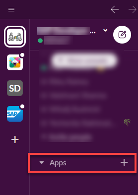

2. Search for `Animal Facts` and select the app.

    

    After selecting, the Animal Facts is added to your apps in the Slack navigation panel. It's message screen is also displayed.

    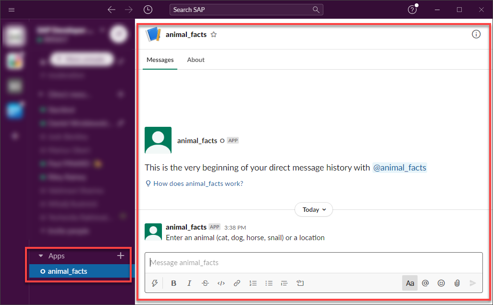

3. Enter the word `cat`, and the bot responds by making an API call to get a fact about cats, and displays in the **Messages** panel.

    

    >Cats can't produce fat!?

[DONE]
[ACCORDION-END]

[ACCORDION-BEGIN [Step 10: ](Talk to bot in channel)]

You can also add the app to a channel, so when someone specifically sends a message to the app, the bot processes the message and returns the appropriate response.

1. Go to the channel and open the **Details** panel on the right.

    >I created a private channel called **Test**.

2. Click **More > Add Apps**, find your app, and to the right click **Add**.

    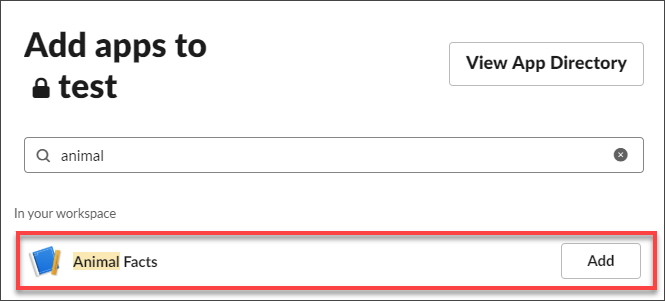

3. Now you can speak to the bot via direct message.

    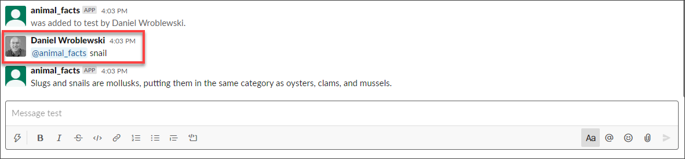

    >Did you know snails are closely related to oysters and clams?

[DONE]
[ACCORDION-END]

[ACCORDION-BEGIN [Step 11: ](Test yourself)]

[VALIDATE_1]
[ACCORDION-END]
