## Prerequisites
 - You have an [SAP Conversational AI](https://cai.tools.sap/signup) account.

## Details
### You will learn
  - How to create an FAQ chatbot
  - How to upload a question/answer file
  - About the proper format of the questions/answers file
  - How to see what users really asked and to add those questions to the bot

An FAQ chatbot lets a user ask questions and lets you guide them to the correct answer.

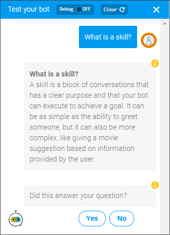
&nbsp;

The FAQ bot project gives you the following automatically:

  - The ability to create the bot by uploading a CSV file with the questions and answers. The intents and skills for understanding the questions and providing the answer are automatically generated behind the scenes so you don't need to manage them.

  - A set of additional skills designed for an FAQ bot, such as small talk and confirmations that the user got the answer they wanted.

For an overview of creating an FAQ chatbot, see this 3-minute video:

<iframe width="560" height="315" src="https://www.youtube.com/embed/YHmeh_yAYZg" frameborder="0" allow="accelerometer; autoplay; encrypted-media; gyroscope; picture-in-picture" allowfullscreen></iframe>

&nbsp;

---

[ACCORDION-BEGIN [Step 1: ](Understand format of questions CSV file)]

For this tutorial, use the CSV file we will provide you. But you can create your own using the following guidelines:

- The CSV file is in UTF-8 format and contains 2 columns, with headers **Question** and **Answer**.

- Make questions actual questions, not just phrases or keywords. You can create alternative questions -- for the same answers -- by writing a question-answer pair and then on the next row writing another question without an answer (this is an alternative question for the answer in the previous line).

- Limit answers to 640 characters. For long answers, provide a short answer and send users to an external site. Answers should rephrase question

Here's an example:

| Question  	| Answer
| ----------- | ----------
| What do you think of my first question?   	| I think this first question is absolutely wonderful.
| How much do you love this alternative phrasing of the first question?  	| &nbsp;
| Isn't the first question the most fantastic?  | &nbsp;
| How much do you hate this second question?   |	I think the second question is gross.  
| Isn't the second question just the worst?  	 | &nbsp;
| Wow, did you ever dislike something more than this second question?  	 | &nbsp;

More guidelines are in the [Help Documentation](https://help.sap.com/viewer/a4522a393d2b4643812b7caadfe90c18/latest/en-US/d6f4b0366e634c93bed4715d690a4de8.html).

>You can create your own in Microsoft Excel, and save it as a **`CSV UTF-8 (Comma-delimited) (.csv)`** file.

[DONE]
[ACCORDION-END]

[ACCORDION-BEGIN [Step 2: ](Download CSV with questions)]

Download our sample <a href="https://github.com/SAPDocuments/Tutorials/raw/master/tutorials/conversational-ai-faq-chatbot-beginner/HowToBuildAChatbot.csv" download>`HowToBuildAChatbot.csv`</a>, which has questions and answers related to learning how to create chatbots with SAP Conversational AI.

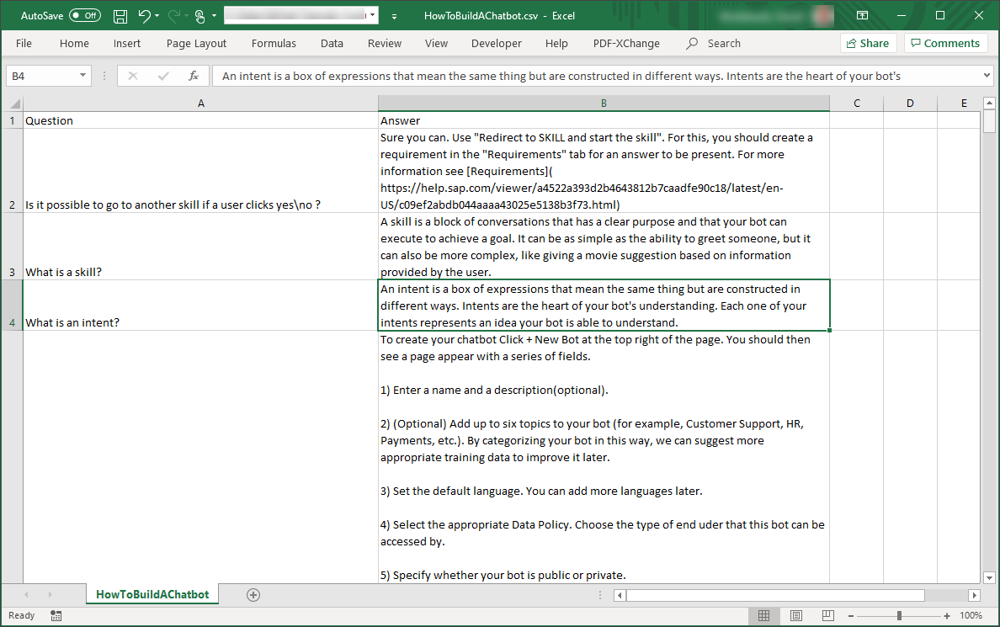

[DONE]
[ACCORDION-END]

[ACCORDION-BEGIN [Step 3: ](Create skeleton FAQ bot)]

1. Go to <https://cai.tools.sap/>, and sign in.

    >If you don't have an account, create one.

2. Click **+ New Bot**.

3. Select the following:

    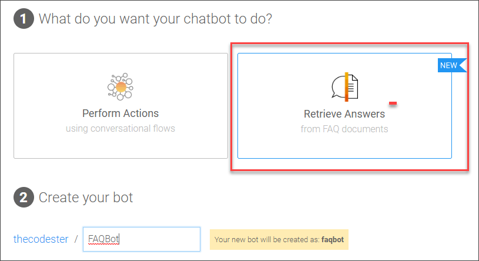

    |  Field Name     | Value
    |  :------------- | :-------------
    |  1. What do you want your chatbot to do?           | **Retrieve Answers**
    |  2. Create your bot     | <ul><li>Name: **`FAQBot`**</li><li>Description: **A bot to help users find answers**</li><li>Language: **English**</li></ul>
    |  4. Data Policy  | **Non-personal** and **Non-vulnerable**
    |  5. Bot Visibility | **Public**

3. Click **Create a Bot**.

[DONE]
[ACCORDION-END]

[ACCORDION-BEGIN [Step 4: ](Upload CSV file)]

1. On the **Train** tab, click **Upload**, and select the file you downloaded.

2. Click **Upload**, and when the upload finishes and you get a little green check, click **Close**.

    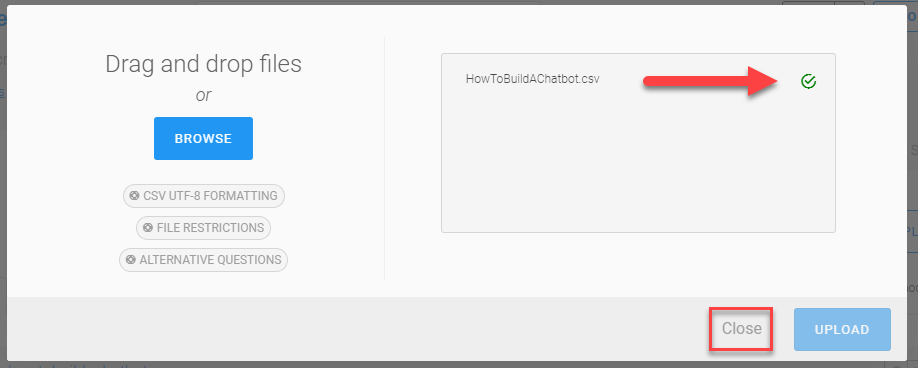

After the upload, you will have a file listed in your **Train** tab.

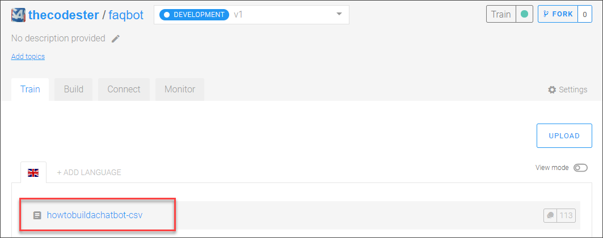

> ### Using multiple CSV files
> All your questions and answers can be in a single CSV file or in multiple files -- it is the same to the bot.

>But it may help your workflow to have them in multiple files, for example, if different people are working on different sets of questions. In addition, when the bot recognizes a question, it can determine in which file the question was defined and can provide a response specific to the file.

[DONE]
[ACCORDION-END]

[ACCORDION-BEGIN [Step 5: ](Explore the questions)]

Click `howtobuildachatbot-csv`.

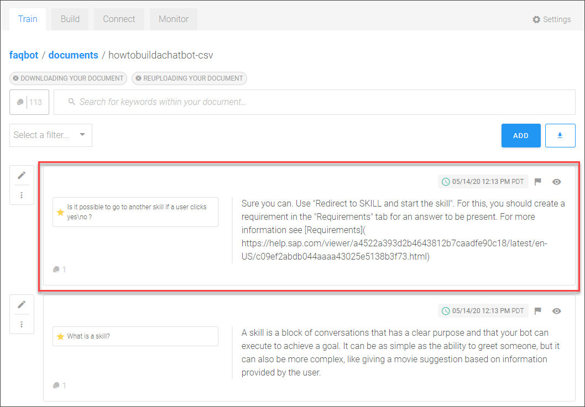

What you can see/do:

- You can see how many question-answer pairs you defined (113).

    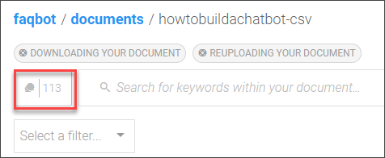

- For each question-answer pair you can:

    - Add or delete the entire question-answer pair
    - Disable the entire question-answer pair
    - Modify the questions by editing, adding questions, or deleting questions
    - Modify the answer

- Download all the question-answer pairs as a CSV file.

    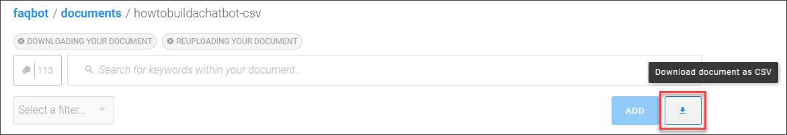

[DONE]
[ACCORDION-END]

[ACCORDION-BEGIN [Step 6: ](Explore the skills)]

Go to the **Build** tab.

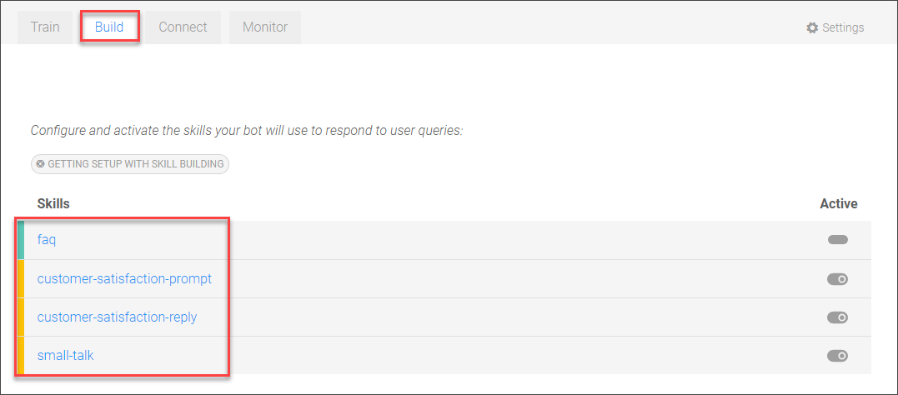

Every FAQ bot comes automatically with a set of helper skills for letting users ask questions. You can modify these for your use case.

- **`small-talk`:** Provides responses if the user says hello, goodbye, or thank you.

- **`customer-satisfaction-prompt`:** Provides responses to ask the user if the answer was helpful.

- **`customer-satisfaction-reply`:** Provides responses after asking the user if the answer was helpful.

- **`faq`:** Provides the appropriate answer based on the how sure the bot is that they understood what question the user was asking.

    - If the bot is sure (>=90%), the top-matched question-answer is returned.

    - If the bot is somewhat sure (between 90% and 5%), the top 3 possible questions are returned for the user to choose.

    - If the bot is completely flummoxed (<=5%), a message is returned saying the bot could not find the answer.

    >`{qna.faq.answers.0.question}` specifies the top-ranked question. You can access the top 10 ranked questions and answers, specified with numbers 0-9.

[DONE]
[ACCORDION-END]

[ACCORDION-BEGIN [Step 7: ](Test and monitor your bot)]

Click the fly-out tab **Test** on the right and enter **What is a skill?**.

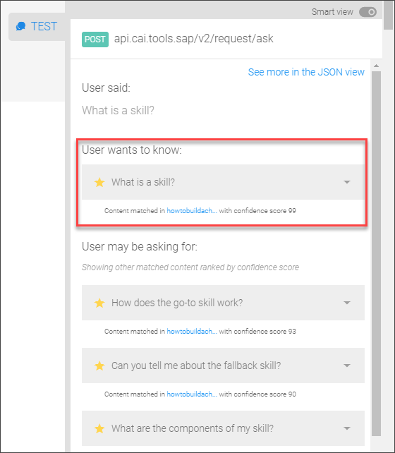

The bot indicates what it thinks is the question the user intended (highlighted above).

Below that are additional questions that the bot also considered as the intended question. If you open up the JSON view -- **JSON view** slider at top of test area -- you can see for each question how certain the bot was about whether the user was asking that question.

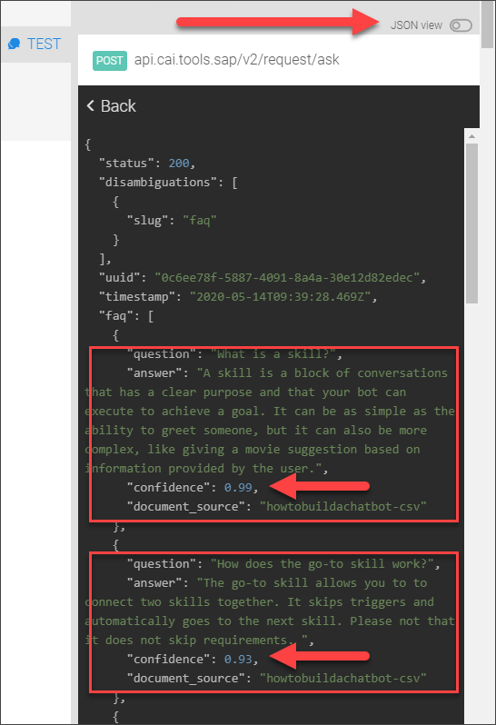

For the first question, the bot was 99% sure, so it showed this as the question the user was asking. The second question had 93% confidence, the next 90% and the next 88%.

[VALIDATE_1]
[ACCORDION-END]

[ACCORDION-BEGIN [Step 8: ](Monitor and improve the bot)]

After releasing the bot, you can monitor what questions people are asking and either:

- Add answers for these questions

- Add these questions to existing answers

---

1. Go to the **Monitor** tab.

2. Open the **Test** fly-out panel on the right.

3. In the chat, enter  **How do I use intents?** and press **Enter**.

4. On the **Monitor** tab, click **Refresh**.

    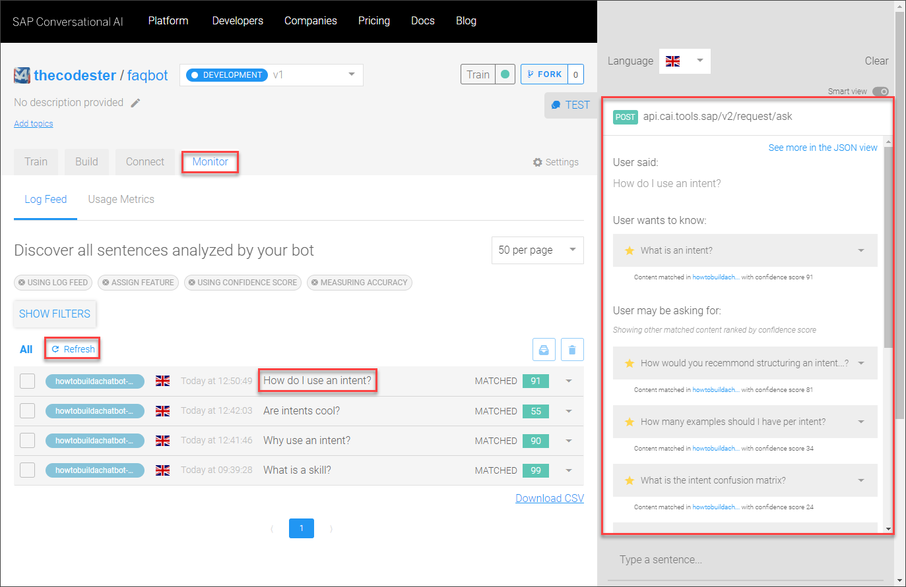

    You can see the latest conversation, the most recent what you just entered into the test.

5. Open the triangle on the right.

    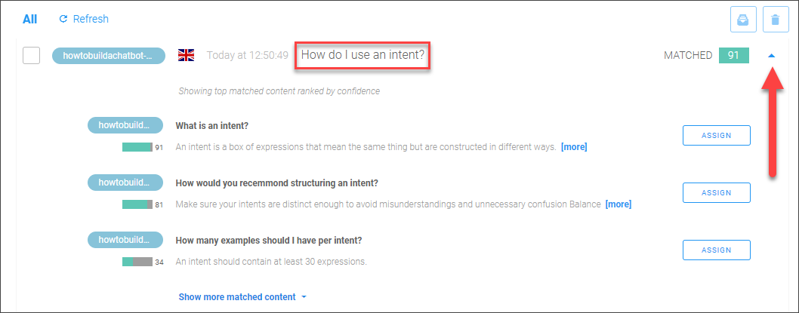

    You can see the top 3 best matches for what was entered (and you click to see the top 10 matches).

    But let's say that we didn't like how the bot assigned that question, we can assign it to another in the list.

6. Next to **How would you recommend structuring an intent?**, click **Assign**.

    In the dialog, click **Assign**, then click **Done**.

    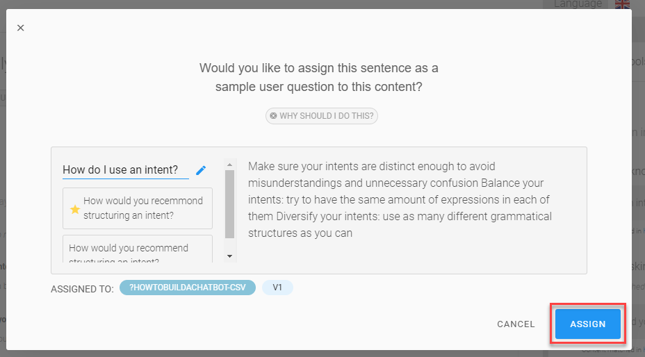

    Now enter again into the chat **How do I use intents?** This time it assigns it to a different question.

    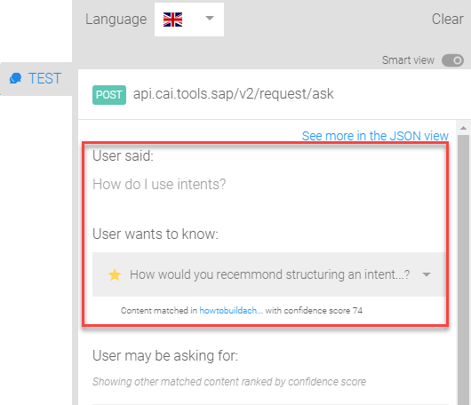

[DONE]
[ACCORDION-END]

---

### Additional Resources

To learn even more, see the documentation [Getting Started with FAQ Bot](https://help.sap.com/viewer/a4522a393d2b4643812b7caadfe90c18/latest/en-US/623f2a3692cf47b7a357573d9afdb76a.html).

---
