## Prerequisites
- You have already built the bot described in [Create Chatbot for Customers of Shipping Company](group.cai-shipping-bot).

## Details
### You will learn
- Why monitoring is crucial
- How to check the Log Feed, and then reassign utterances to the correct intent
- How to review Usage Metrics to see what intents, entities and skills are most and least used
- How to run tests with Training Analytics to see how well your chatbot discerns intents

The tools under the **Monitor** tab enable you to see how your users are using your bot and whether your chatbot both understands your users and can perform the tasks they want. With this information, you can improve your chatbot, for example, by adding intents, splitting intents, or updating the expressions of your intents.

> ### Data set
A chatbot is only as good as its intents, the many expressions used to train the intents, and the entity definitions. The set of intents, entities and expressions is also known as your chatbot's data set.

>It is this data set you are trying to improve by monitoring.

---

[ACCORDION-BEGIN [Step 1: ](The importance of monitoring)]

You want to monitor your chatbot to improve your data set -- in fact, when you deploy your chatbot, your work has only just begun.

There are 2 main types of information you can discern from the monitoring tools:

- **How well does your chatbot understand your users:** This relates to whether the chatbot can properly understand what the user says and map it to the right intent. In other words, is your chatbot properly designed to talk and respond to the way your users talk.

- **What additional services do your users want from your chatbot:**  This relates to whether your users want you to help them with tasks that you did not anticipate and did not design into your chatbot.

    The best chatbots should be able to understand every request from its users, and by monitoring the chatbot you can see what requests were not understood.

    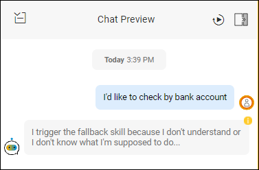

    Furthermore, the best chatbots should be able to automate at least 30-40% of user requests (ideally closer to 70%) -- that is, your chatbot should have the skills to perform most of the tasks a user wants (the rest you can direct them to additional resources). If a user cannot get help with the vast majority of tasks, the user will stop using the chatbot -- even for the tasks it could help with.

    So, in part, you want to constantly monitor the chatbot usage to see what additional use cases you could cover with the chatbot.

You can read more about how monitoring improves your chatbot in the blog [How to Build a Strong Dataset for Your Chatbot with Training Analytics](https://cai.tools.sap/blog/how-to-build-strong-dataset-chatbot-training-analytics/).

> ### Best use cases for a chatbot
From experience and research, the best tasks for a chatbot to automate are:

>- **High-frequency tasks:** Tasks that a user will need over and over again.

>- **High-volume tasks:** Tasks that the vast majority of users will need.

>From monitoring, you should try to find those that fit this sweet spot.

[DONE]
[ACCORDION-END]

[ACCORDION-BEGIN [Step 1: ](Open Monitor tab)]

1. Open your shipping bot.

2. Click the **Monitor** tab.

    You will see the sub-tabs for the main tools to help you monitor how user's are chatting with your bot.

    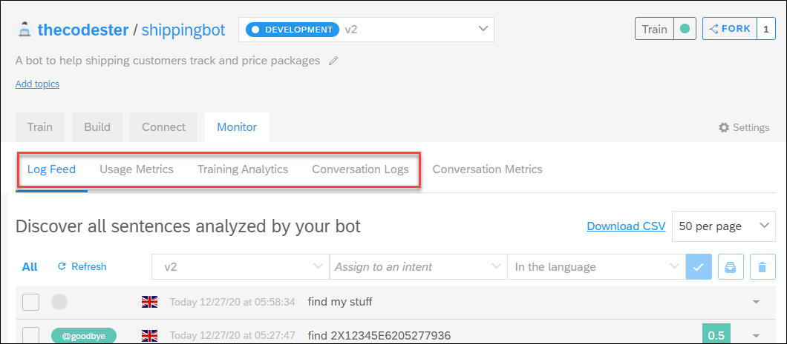

[DONE]
[ACCORDION-END]

[ACCORDION-BEGIN [Step 2: ](Reassign intents in Log Feed)]
The Log Feed lets you see all user utterances and the intents they were mapped to, so you can see if your chatbot properly understands your users. From the Log Feed you can also train your bot by telling it what intents should have been detected from each utterance.

For more information, see [Log Feed](https://help.sap.com/viewer/a4522a393d2b4643812b7caadfe90c18/latest/en-US/a31a132e87f54d159728b254dc062754.html).

1. Under the **Monitor** tab, open the **Log Feed**.

    The feed shows all utterances. For each utterance it shows:

    - The utterance and time it was made
    - Whether it was matched to any intent
    - To which intent it was matched to, if any
    - With what confidence the match was made, if matched
    - Any entities detected in the utterance (open the dropdown)

    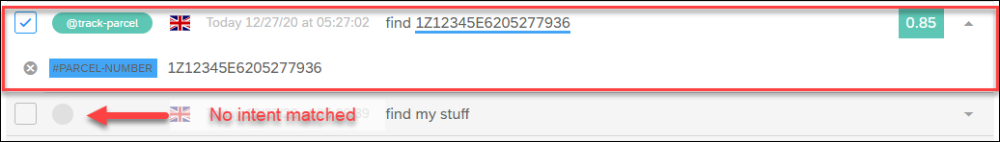

    >You can filter the list of utterances by:

    >- **Environment** (e.g., only see utterances in production)
    >- **Language**
    >- **Time range**
    >- **Intent that was detected** (e.g., to check for false matches)
    >- **Whether or not the utterance was matched to any intent** (e.g., to fix non-matched intents)
    >- **Confidence in the intent match** (e.g., to fix low-confidence matches)

2. In the Chat Preview, enter the following utterances:

    - `find what I sent`
    - `find my stuff`
    - `find 1Z12345E6205277936`
    - `find 1X12345E6205277936`
    - `find 2X12345E6205277936`
    - `Check my stuff`

    Feel free to enter others that you think might be misunderstood.

3. Look through the Log Feed. Here's the one for my inputs:

    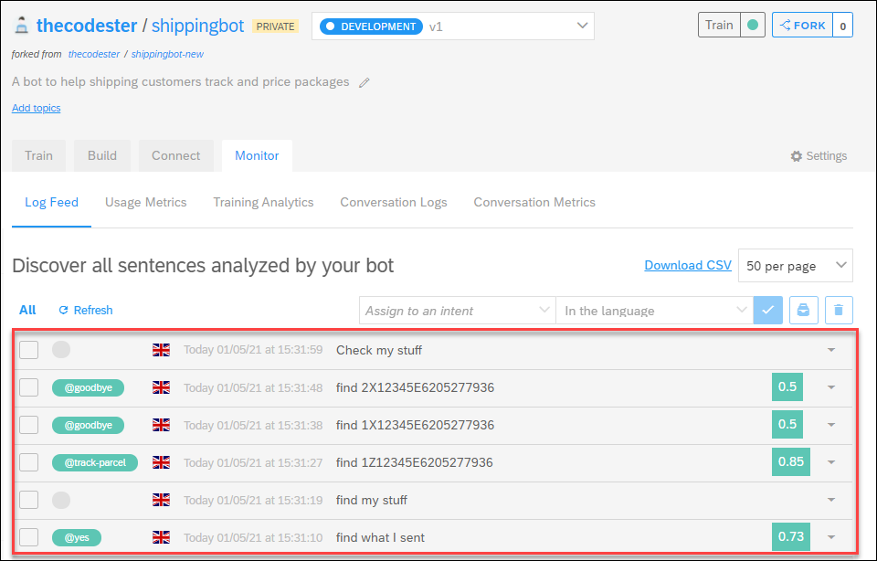

    You can see that **find my stuff** and **check my stuff** are not matched at all, **find 2X12345E6205277936** is matched to `@goodbye`, and **find what I sent** is matched to `@Yes`.

    In addition, if you open **find 2X12345E6205277936**, you will see that the tracking number got detected only as a number. This is correct because the Regex `#parcel-number` entity must start with `1Z`. If users are entering incorrect parcel numbers, you will have to determine whether the numbers are valid or whether they are incorrect and you want to respond to bad numbers. For this tutorial, you will not deal with that issue.

    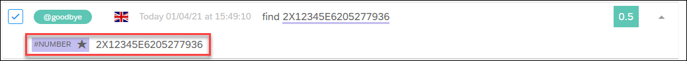

4. Let's fix the intent detection by mapping the utterances to the `@track-parcel` intent.

    Select all the utterances to be matched to `@track-parcel`, then at the top select the `@track-parcel` intent, and click the check mark.

    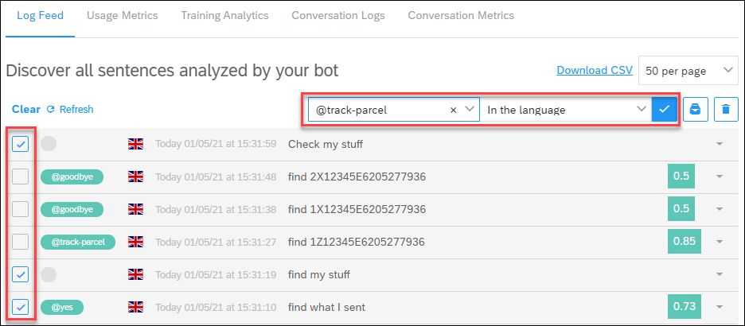

    The utterances will be removed from the Log Feed.

    >**IMPORTANT:** It may take a minute for the bot to train itself, based on you assigning the utterances to an intent. When the **Train** indicator turns green, you can proceed to the next step.

5. Now test **find my stuff** in the Chat Preview. It now understands that you are looking for a package, and no longer goes to the fallback skill.

    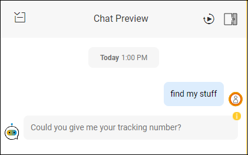

[DONE]
[ACCORDION-END]

[ACCORDION-BEGIN [Step 3: ](Check out Usage Metrics)]
In Usage Metrics, view which intents and entities are being detected the most, and which skills are being executed the most.

For more information, see [Usage Metrics](https://help.sap.com/viewer/a4522a393d2b4643812b7caadfe90c18/latest/en-US/ffd44659dd5c4120a4ca2b70a9c97b5d.html).

1. Under the **Monitor** tab, click **Usage Metrics**.

    The screen shows a variety of statistics about how users are chatting with your bot.

    >You can filter the data by:

    >- **Environment** (e.g., only see data for production)
    >- **Time range**

2. Review the statistics to get insights on your users.

    At the top there are buttons to navigate the different type of statistics.

    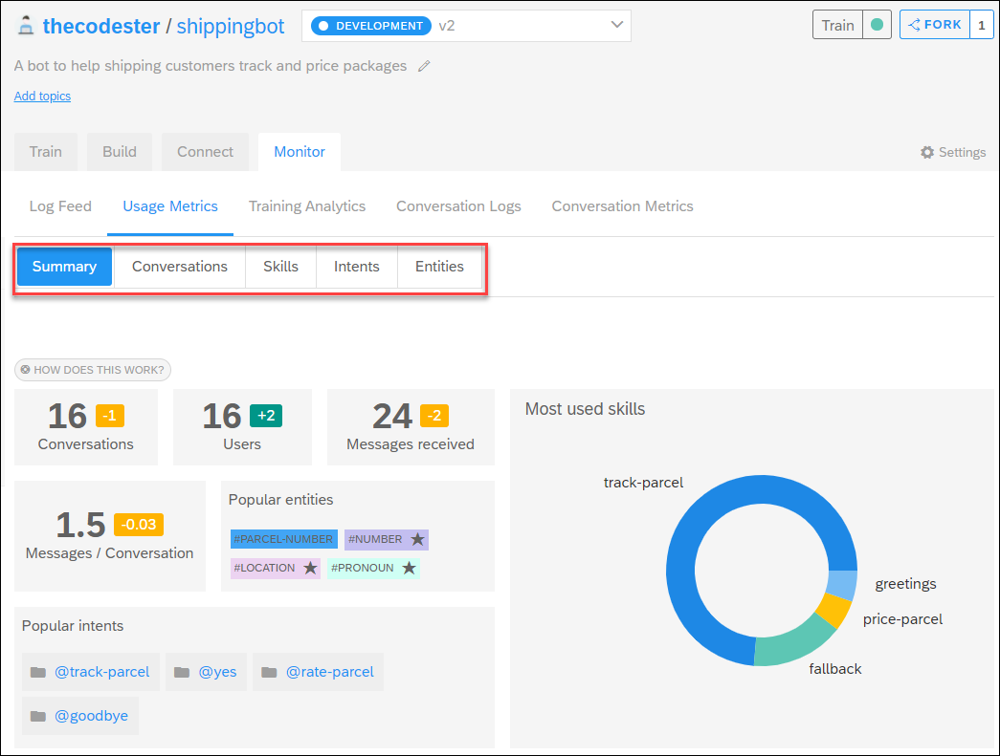

    - **Conversations:** Information on the number of conversations, conversations per day, number of users, number of messages per conversation.
    - **Skills:** How often each skill is run.
    - **Intents:** How often each intent was detected.
    - **Entities:** How often each entity was detected.

    >The yellow and green boxes next to the statistics indicate the change from the previous period. For example, above, there were 16 conversations, 1 less than the previous time period.

3. Think how you could use the statistics.

    - **Skills:**

        - If a skill is not used very much (here, `@price-parcel`), maybe this is not a very useful use case or users are not aware of it.

        - If the fallback skill is being called a lot, there is a need to better detect what people want and perhaps create new intents.

        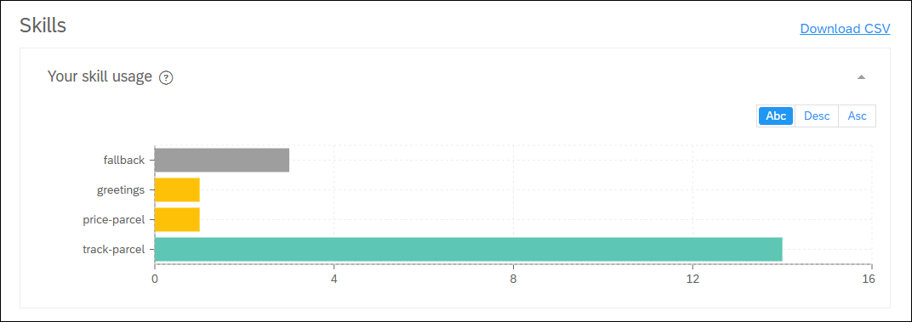

    - **Intents:**

        - If an intent is not often detected (e.g., `@rate-parcel`), maybe it is not an intent people have very often or the chatbot is having trouble detecting it.

        - If some intents are never used (e.g., `@greetings` and `no`), maybe these are not needed or maybe there is no need to add confirmation.        

        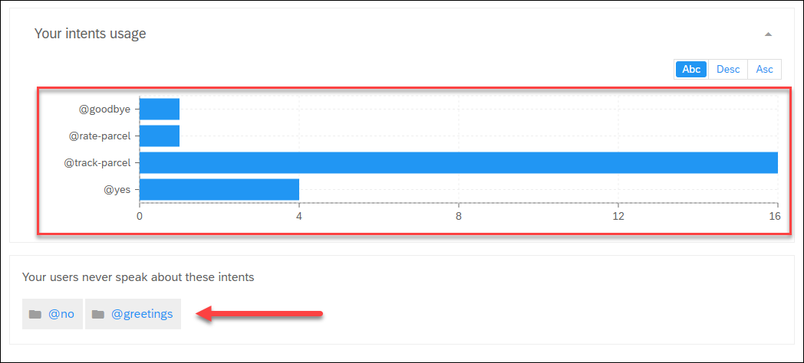

    - **Entities:**

        - If the chatbot is recognizing many entities, maybe it is having trouble detecting your entities, or users have different intents.

        - If no one ever enters a specific entity (e.g., `#parcel-size`), maybe your chatbot has trouble detecting it.

        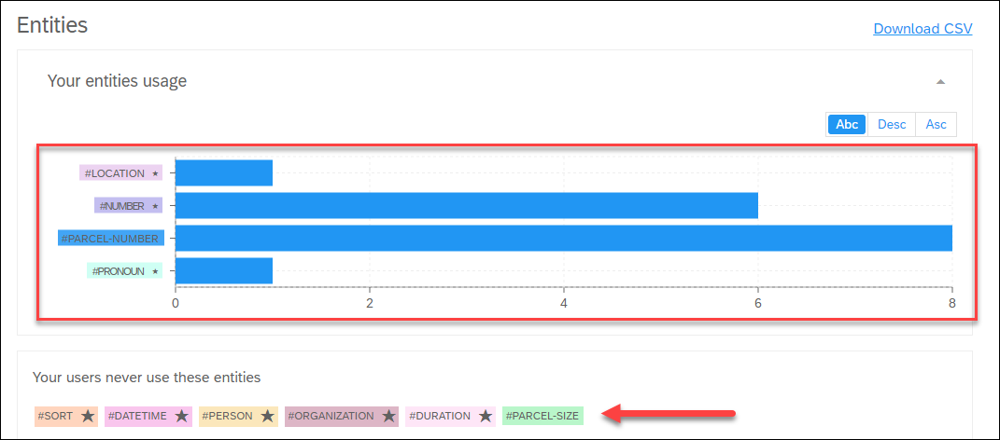

> ### Messages / Conversations -- why it's important?
>Ideally, the number of messages per conversation (counting both from the user and the chatbot) should be around 5 -- meaning the user may only provide 2 utterances and already get his task completed.

>This is true because the best scenarios for chatbots are ones where the conversation is simple and minimal, and users quickly get what they need.

[DONE]
[ACCORDION-END]

[ACCORDION-BEGIN [Step 4: ](Run benchmark test with Training Analytics)]
Training Analytics  helps you to build a great dataset -- that is, all the intents and entities that you create and train. Your bot must be well-trained (meaning your dataset is well-structured and incomplete) to be able to correctly understand messages from its users.

Training Analytics takes a deeper dive into checking:

- **Intents:** Are people's desires properly detected to the correct intent? Is there confusion between 2 or more intents?
- **Entities:** Is information in the conversation properly labeled to the correct entity?  

For more information, see [Training Analytics](https://help.sap.com/viewer/a4522a393d2b4643812b7caadfe90c18/latest/en-US/814005371d4b48fb8a8eaf297526e6f2.html).

1. Under the **Monitor** tab, click **Training Analytics**.

    Here you can run benchmark tests to see how your entire data set / training is working.

    

2. Click **Run Benchmark**.

    For a small bot like the shipping bot, this should take 30 seconds. For complex bots (e.g., 200+ intents, 20,000 expressions, 10+ custom entities), it could take several hours.

3. Review the results.

    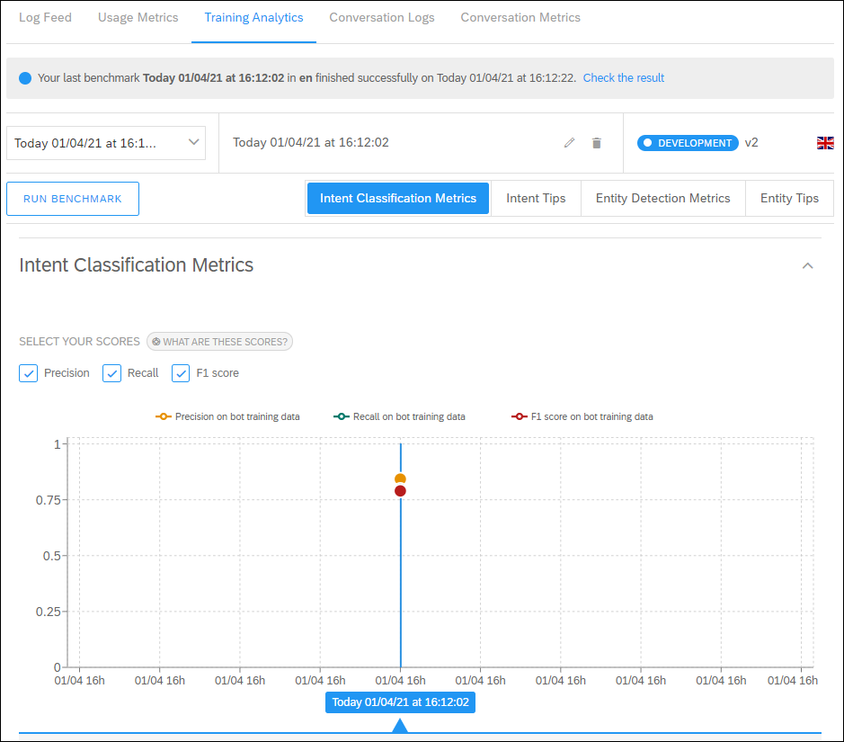

> ### What do I learn with Training Analytics?

>- **Precision:** Out of all the times my bot predicted this intent, how many times was it
correct?

>     Low precision usually signifies the relevant intent needs cleaning, which means removing sentences that don't belong to this intent.

>- **Recall:** Out of all the times my bot was supposed to detect this intent, how
many times did it do so?

>      Low recall usually signifies the relevant intent needs more training (for example, by adding more sentences to enrich the training).

>- **Intent Confusion Matrix:** For each intent that was supposed to be detected, which other intent is usually selected instead?

>      Intents that are confused may share similar expressions, or may have an imbalance in the number of expressions, or they may need to be merged.

>More tips for improving your intents/entities based on Training Analytics can be found at [Training Analytics](https://help.sap.com/viewer/a4522a393d2b4643812b7caadfe90c18/latest/en-US/814005371d4b48fb8a8eaf297526e6f2.html).

[DONE]
[ACCORDION-END]

[ACCORDION-BEGIN [Step 5: ](Review Conversation Log)]
You can browse the conversations that users are having with your bot -- every utterance and bot reply -- to get some idea if conversations are going smoothly.

For more information, see [Conversation Logs](https://help.sap.com/viewer/a4522a393d2b4643812b7caadfe90c18/latest/en-US/2237433a47f04fba8fa3e75cd3b01736.html).

1. Under the **Monitor** tab, click **Conversation Logs**.

2. On the left side, you can filter which conversations to view.

    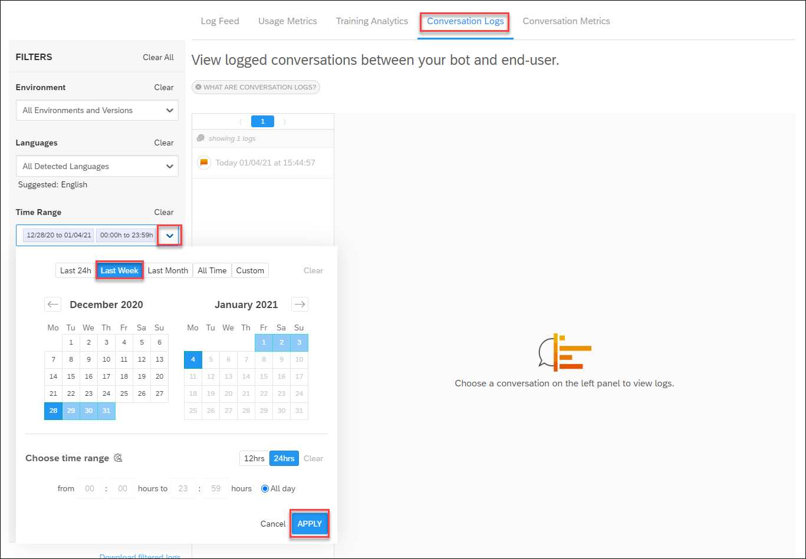

    Next to **Time Range**, click the dropdown button, select **Last Month** and click **Apply**.

    You will now see all conversations for the last month.

3. Open one of the conversations in the list to view all the utterances and bot responses for the conversation.

    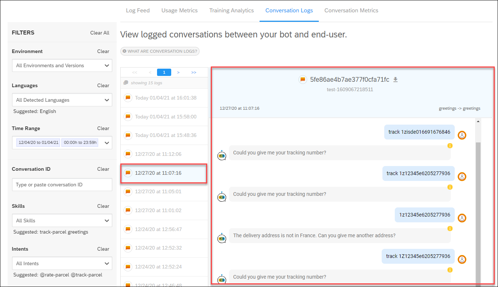

[DONE]
[ACCORDION-END]

[ACCORDION-BEGIN [Step 6: ](Update your chatbot)]

After reviewing all the monitoring information, you can make changes to the chatbot. Here are some tips:

#### Intent classification
You want to make sure your bot understands the user's intents, so:

- Remove useless expressions
- Avoid duplicates
- Add new expressions
- Merge intents
- Split an intent

#### Entity detection

- Remove bad values (for restricted entities)
- Add good values (for restricted entities)
- Remove mis-tagging errors (in intent expressions)

#### Entity performance

- Missing entity tagging should be fixed.
- Ensure consistency in usage of entity values.
- Avoid repetitive names. Train the bot with a variety of names or values.
- Analyze entities overlap in the confusion matrix.
- Ensure that precision is minimum 90% and the F1 score is 70% and above.

Review info from openSAP course

[DONE]
[ACCORDION-END]

[ACCORDION-BEGIN [Step 6: ](Test yourself)]

[VALIDATE_7]
[ACCORDION-END]

---
