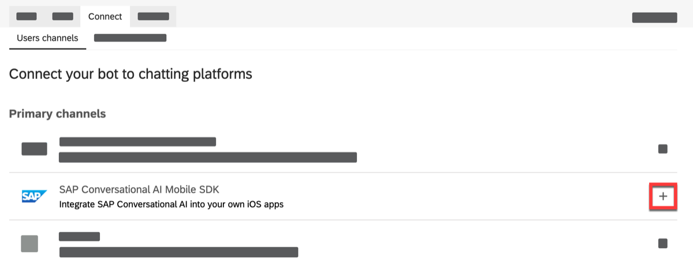
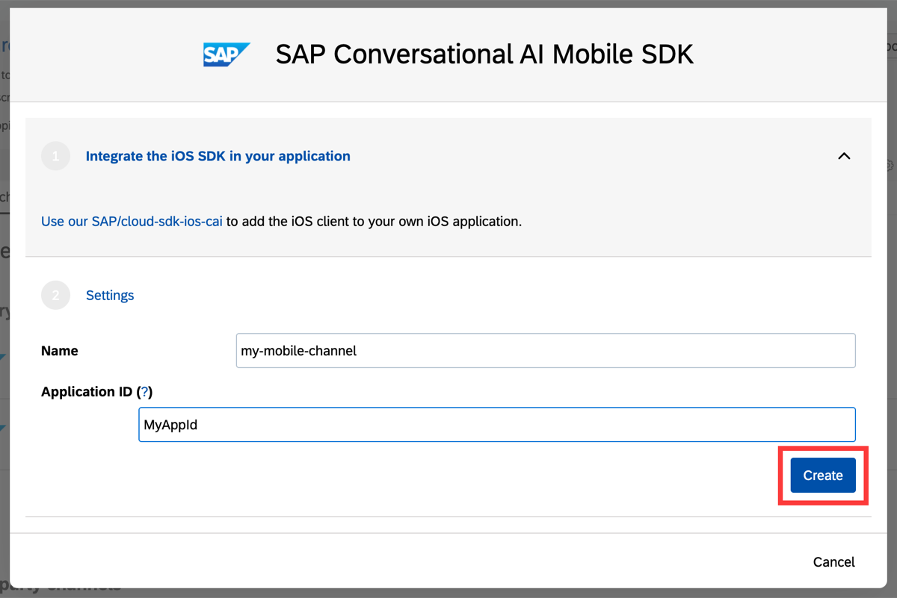
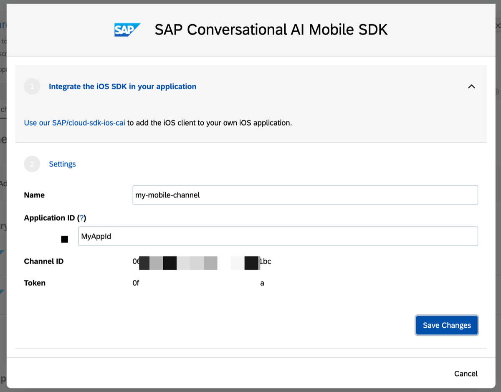
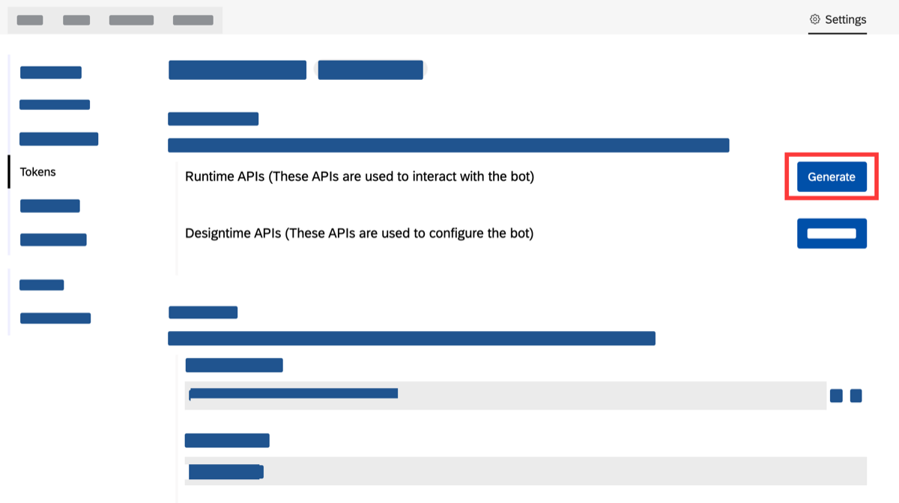
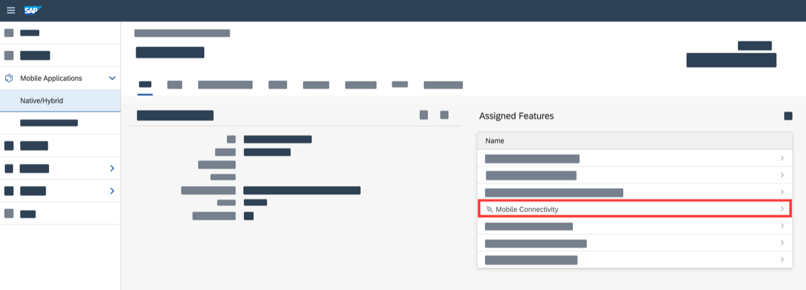
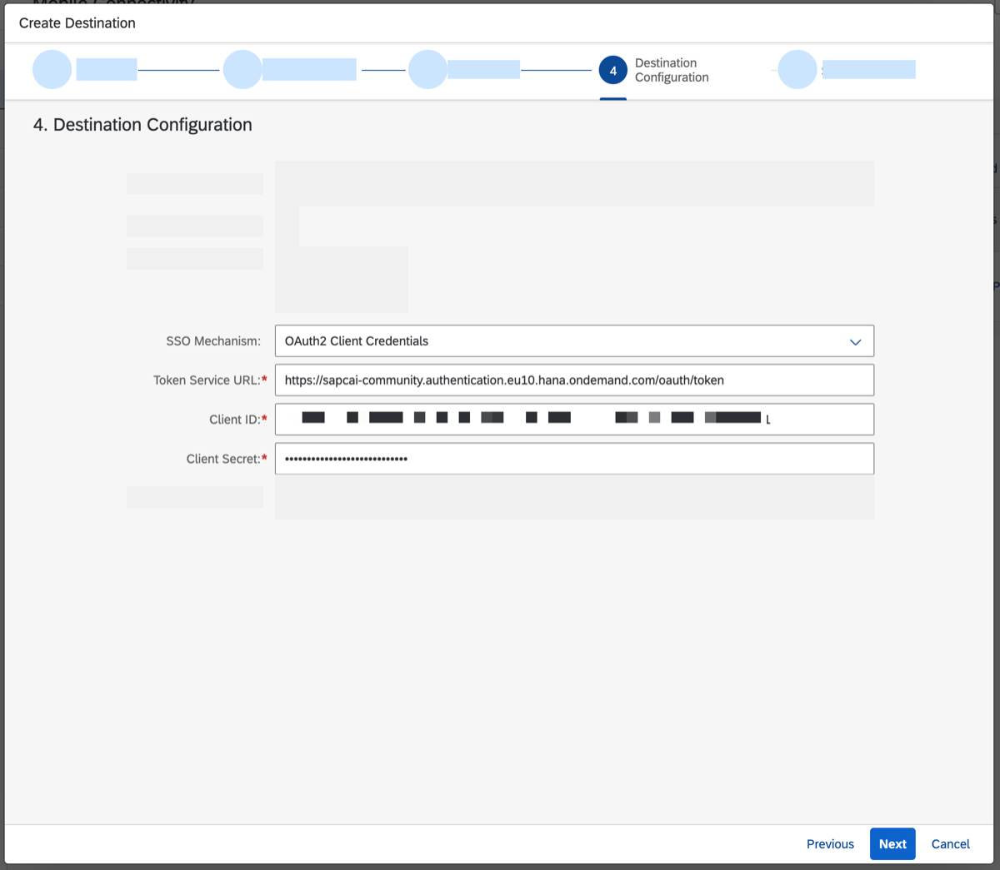
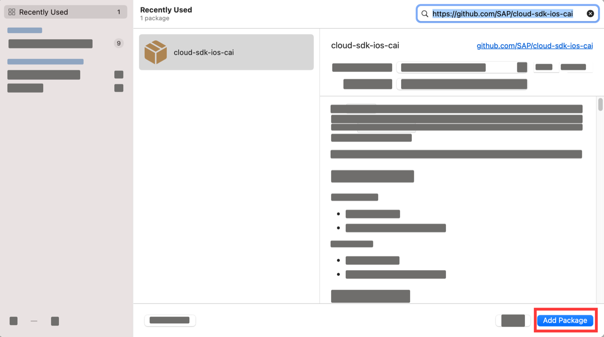
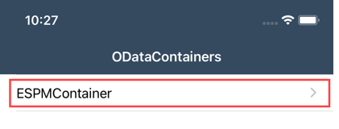
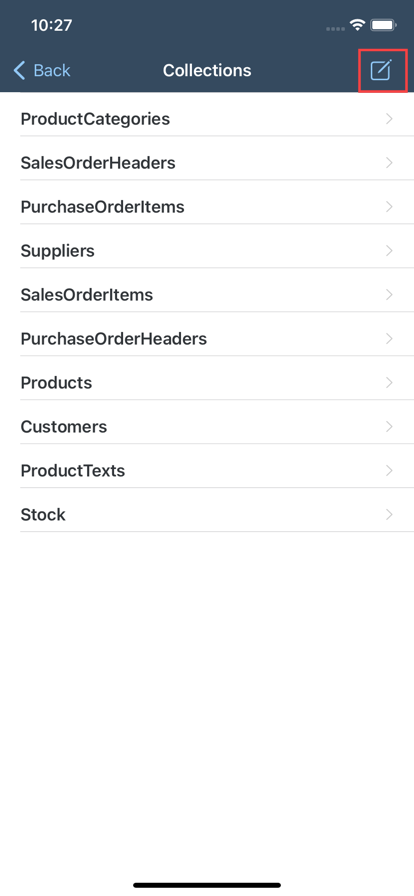
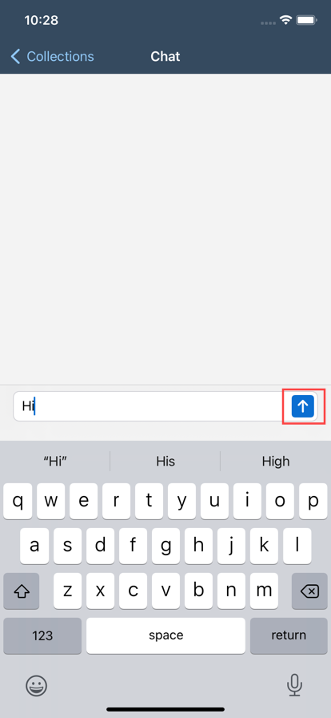

# Integrate SAP Conversational AI Chatbot into your iOS application
<!-- description --> Bring your chatbot to your mobile users with native controls provided by the open-source SAP Conversational AI SDK for iOS.

## Prerequisites
 - You have created a SAP Conversational AI chatbot, for example, as described in the tutorial [Build Your First Chatbot with SAP Conversational AI](https://bit.ly/3srXE1F)
 - You have generated a sample iOS application as described in the tutorial [Create a Sample iOS App](fiori-ios-scpms-create-sample-app)

## You will learn
  - How to create a mobile channel for your chatbot in SAP Conversational AI
  - How to create a destination in SAP Mobile Services to proxy requests from your iOS application to your chatbot in SAP Conversational AI
  - How to integrate the open-source [SAP Conversational AI SDK for iOS](https://github.com/SAP/cloud-sdk-ios-cai) into an existing iOS application generated with the SAP BTP SDK for iOS Assistant

---

### Create a Mobile Channel in SAP Conversational AI


Sign-in to your bot on [https://cai.tools.sap/](https://cai.tools.sap/) and perform the following steps in the **Connect** tab:

1. Click the `+` button.

    <!-- border -->

    A modal popup opens.

2. Enter `Name` and `Application ID`.

    <!-- border -->

3. Click `Create`, then copy `Name` and the generated `Channel ID` and `Token` to reuse later.

    


### Create OAuth2 Client in SAP Conversational AI


1. Access `Tokens` through your bot's `Settings`.

    <!-- border -->

2. Click `Generate` to create the OAuth client Runtime API.

3. Choose `Client Credentials`.

    

4. Close the confirmation dialog.

    

5. Copy the generated `Auth URL`, `Client ID` and `Client Secret` to reuse later.

    <!-- border -->


### Create a destination in SAP Mobile Services


1. Click on `Mobile Connectivity` in your application definition.

    <!-- border -->

2. Click the `+` button to start the destination create wizard.

    <!-- border -->

3. In **Basic Info** enter the required `Destination Name` and `URL`.

    | Field        | Value           |
    | ------------- | ------------- |
    | Destination Name      |  `CAI`
    | URL      | `https://sapcai-community.sapcai.eu10.hana.ondemand.com/public/api` |


    > Note: Outside of this tutorial, you are free to choose any name for your destination. The URL is different and tenant-specific if you use SAP Conversational AI *Enterprise Edition* but the suffix `/public/api` is always needed.

    Click **Next**.

4. Click **Next** on **Custom Headers**.

5. Click **Next** on **Annotations**.

6. In **Destination Configuration** select `OAuth2 Client Credentials` for SSO mechanism.

    > Note: Destination and SSO Mechanism depend on the edition type of SAP Conversational AI as well as the deployment scenario. Read [Enterprise Configuration](https://github.com/SAP/cloud-sdk-ios-cai/blob/main/ENTERPRISE_CONFIG.md) guide to understand when to use other SSO mechanism types.

    Enter the required `Token Service URL`, `Client ID` and `Client Secret` by reusing the information from Step 2.

    | Field        | Value           |
    | ------------- | ------------- |
    | SSO Mechanism      |  `OAuth2 Client Credentials`
    | Token Service URL      | `https://sapcai-community.authentication.eu10.hana.ondemand.com/oauth/token` |
    | Client ID      | `Your bot's Client ID (generated in Step 2)` |
    | Client Secret      | `Your bot's Client Secret (generated in Step 2)` |

    

    > Note: `Token Service URL` is named `Auth URL` in SAP Conversational AI.

    Click **Next**.

7. Click **Finish**.

8. Click `Ping` to test if the destination can reach its target.

    <!-- border -->


### Add SAP Conversational AI SDK for iOS to your Xcode project


1. Open your Xcode project.

2. In Xcode menu select <kbd>File</kbd> >  <kbd>Add Packages...</kbd> which opens a modal dialog.

3. Paste the following URL into the search field: `https://github.com/SAP/cloud-sdk-ios-cai`

    <!-- border -->

4. Click "Add Package".

5. Select Package Product `SAPCAI-requiresToEmbedXCFrameworks`.

6. Click "Add Package".

> Note: You chose Package Product `SAPCAI-requiresToEmbedXCFrameworks` because your app already embeds `SAPCommon` and `SAPFoundation` binary frameworks. You would select package product `SAPCAI` if you did not already embed binary frameworks from SAP BTP SDK for iOS.


### Use SAP Conversational AI SDK for iOS in your Xcode project


It is finally time to use APIs from the SAP Conversational AI SDK for iOS. Let's create a new file named `AssistantViewManager.swift`.

Copy & paste the following code into the newly created file.

```Swift
import SAPCAI
import SAPFoundation
import SAPFioriFlows
import SwiftUI

class AssistantViewManager {

    static let shared = AssistantViewManager()

    var viewModel: MessagingViewModel?
    var dataPublisher: CAIConversation?

    func createDemoBotAssistantView() -> UIViewController {
        let serviceConfig = CAIServiceConfig(
            urlSession: OnboardingSessionManager.shared.onboardingSession!.sapURLSession,
            host: OnboardingSessionManager.shared.onboardingSession!.settingsParameters!.backendURL.appendingPathComponent("CAI") // name of your destination created in Step 3
        )
        let caiChannel = CAIChannel(
            id: "Replace with Channel ID from Step 1",
            token: "Replace with Token from Step 1",
            slug: "Replace with Name from Step 1")

        self.dataPublisher = CAIConversation(
            config: serviceConfig,
            channel: caiChannel,
            messageDelivery: PollMessageDelivery(channelToken: caiChannel.token, channelId: caiChannel.id, serviceConfig: serviceConfig))

        self.viewModel = MessagingViewModel(publisher: dataPublisher!)

        return UIHostingController(rootView: AssistantView()
                                .navigationBarTitle(Text("Chat"), displayMode: .inline)
                                .environmentObject(viewModel!)
                                .environmentObject(ThemeManager.shared))
    }

    func cleanup() {
        viewModel?.cancelSubscriptions()
        dataPublisher?.resetConversation()

        viewModel = nil
        dataPublisher = nil
    }
}
```

You created class `AssistantViewManager` which is accessible as a singleton through its `shared` property.

Some explanations about the code:

- You imported the `SAPCAI` module because this is the module of the added Swift Package.
- You imported the `SwiftUI` framework because you will use SwiftUI view(s) provided by the added Swift Package.
- You imported `SAPFoundation` and `SAPFioriFlows` because you are reusing its classes, especially `SAPURLSession` which is fully configured to make network requests towards your SAP Mobile Service account once the user onboarded in the app.
- You initialized `CAIServiceConfig` so that SAP Conversational SDK for iOS can make network requests to the destination in SAP Mobile Services created in Step 3.
- You **need to replace the initializer parameters of `CAIChannel` with the actual values from Step 1 !**
- You used `AssistantView` which is the main reusable SwiftUI component provided by the added Swift Package. The SwiftUI view will render messages of your user's conversation with your chatbot.
- You are wrapping `AssistantView` with `UIHostingController` to use it in your UIKit-based application.

Next, in `ESPMContainerCollectionsViewController.swift` add the following code at the end of function `viewDidLoad`.

```Swift
self.navigationItem.setRightBarButton(UIBarButtonItem(barButtonSystemItem: .compose, target: self, action: #selector(self.startConversation)), animated: true)
```

This code adds a right bar button to invoke a function `startConversation` which you will create now. Add the following functions to class `ESPMContainerCollectionsViewController`.

```Swift
// MARK: - SAPCAI integration

@objc func startConversation() {
    present(vc: AssistantViewManager.shared.createDemoBotAssistantView())
}

func present(vc: UIViewController) {
    let mainStoryBoard = UIStoryboard(name: "Main", bundle: nil)
    let rightNavigationController = mainStoryBoard.instantiateViewController(withIdentifier: "RightNavigationController") as! UINavigationController
    rightNavigationController.viewControllers = [vc]
    self.splitViewController?.showDetailViewController(rightNavigationController, sender: nil)
}
```

Add the following code at the end of function `viewDidAppear(_ animated: Bool)`.

```Swift
AssistantViewManager.shared.cleanup()
```

That code ensures that polling of conversation updates will stop once the user navigates away from the `AssistantView`.


### Test your iOS application


You are now ready to test your iOS application and initiate a conversation with your chatbot.

1. In Xcode, press `⌘R` to run your application in the iOS simulator.

2. Touch on the row in the `ODataContainers` view.

    <!-- border -->

3. Touch on the right bar button.

    <!-- border -->

4. Touch the input field on the bottom to open the keyboard.

    

5. Enter a message and touch the send button on the bottom right.

    

6. Verify that your chatbot responded appropriately.

    


---
