## Prerequisites
 - A [SAP Business Technology Platform trial account](hcp-create-trial-account). If you create a new trial account you should have the necessary entitlements, but check the tutorial [Manage Entitlements on SAP BTP Trial](cp-trial-entitlements), if needed.
 - You understand the basics of creating a chatbot, as described in the tutorial [Build Your First Chatbot with SAP Conversational AI](cai-bot-getting-started).
 - [Python](https://www.python.org/downloads/)
 - [VS Code](https://code.visualstudio.com/) with the [Python extension by Microsoft](https://code.visualstudio.com/docs/languages/python), though you can use any Python development environment. See [Getting Started with Python in VS Code](https://code.visualstudio.com/docs/python/python-tutorial).
 - [Flask](https://flask.palletsprojects.com/) and [requests](https://pypi.org/project/requests/) packages for Python
 - [Cloud Foundry CLI](https://docs.cloudfoundry.org/cf-cli/install-go-cli.html)


## Details
### You will learn
  - How to create a Python endpoint in SAP BTP, using Flask
  - How to read POST data from a chatbot
  - How to send back data to a chatbot
  - How to deploy a Python script to SAP BTP (using Cloud Foundry CLI)
  - How to connect the webhook to the chatbot

You will create a very simple chatbot that asks the user to pick an animal, and then have the chatbot call a webhook, which will then call an API to retrieve a "fun fact" about the animal via the [`cat-facts`](https://alexwohlbruck.github.io/cat-facts/docs/endpoints/facts.html) API. The webhook will also update the memory variable that keeps track of how many times the user requested a fun fact.

The point of the tutorial is to show you how the webhook reads the request data from the chatbot, and to show you the format of the data that must be returned to the chatbot.

As an added bonus, we will show how to deploy a Python script to SAP BTP. Special thanks to [Yohei Fukuhara](https://people.sap.com/fukuhara) for his blog [Create simple Flask REST API using Cloud Foundry](https://blogs.sap.com/2018/12/12/create-simple-flask-rest-api-using-cloud-foundry/).

>**IMPORTANT:** The focus of this tutorial is the response an application (API) must return in order to work with SAP Conversational AI. The requirements for Python on SAP BTP changes from time to time -- e.g., quota, runtime -- so you are encouraged to check the documentation for how to deploy Python scripts: [Developing Python in the Cloud Foundry Environment](https://help.sap.com/viewer/65de2977205c403bbc107264b8eccf4b/Cloud/en-US/acf8f49356d047fbb1a4d04dcec3fd36.html)  

---

[ACCORDION-BEGIN [Step 1: ](Create a simple chatbot)]

Create a bot that asks the user to select an animal to get a fun fact about.

1. Create a new bot and call it `webhookdemo`. Use the following values:

    |  Field Name     | Value
    |  :------------- | :-------------
    |  1. What do you want your chatbot to do?           | **Perform Actions**
    |  2. Predefined Skills           | None
    |  3. Create your bot     | <ul><li>Name: **`webhookdemo`**</li><li>Description: **A bot to test creation of webhooks**</li><li>Language: **English**</li></ul>
    |  4. Data Policy  | **Non-personal** and **Non-vulnerable**
    |  5. Bot Visibility | **Public**

    Click **Create Bot**.

2. In the **Train** tab, create an intent called `ask`, and add the expression **I'm interested in**.

    >Since you define only one intent, this intent will always be triggered when the user types in a message.

3. In the **Train** tab, create a restricted entity called `animal` and add 4 valid values: **cat**, **horse**, **snail**, **dog**.

    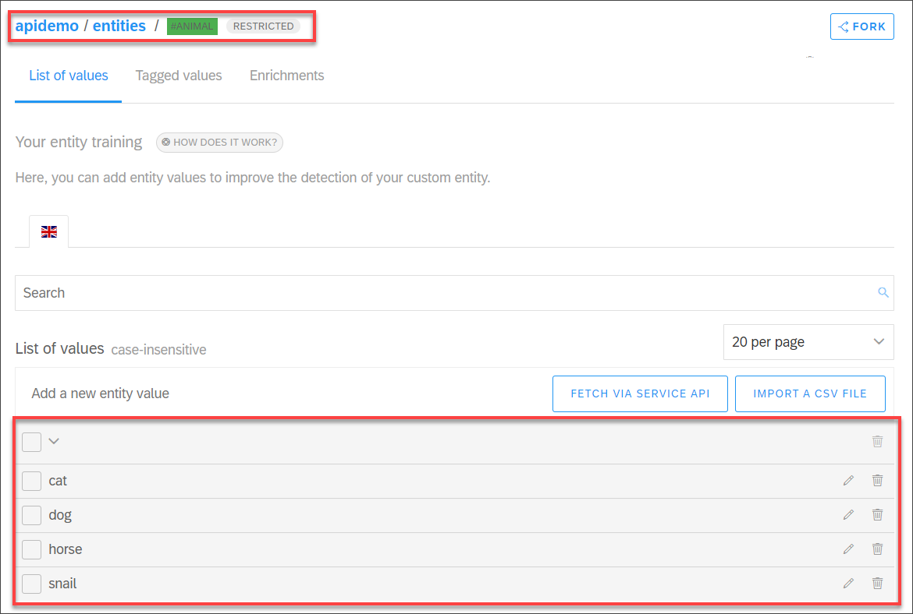

4. In the **Build** tab, create a skill called **answer**, and open it.

    Under **Triggers**, set the condition to: `If @ask is-present`.

    Under **Requirements**, specify `#animal as animal`.

    Expand the requirement and click **New Replies -- If #animal is missing**, add the following text message, and then click **Save** and **Back**:

    ```Message
    Type an animal and I will get you a fun fact about it.

    But I am only familiar with certain animals.
    ```

[DONE]
[ACCORDION-END]

[ACCORDION-BEGIN [Step 2: ](Test the bot without webhook)]

1. First, open the **Test** tab and test the bot. No matter what you type the intent will be `ask`.

    Enter `dog` and it will recognize the `animal` entity, too.

    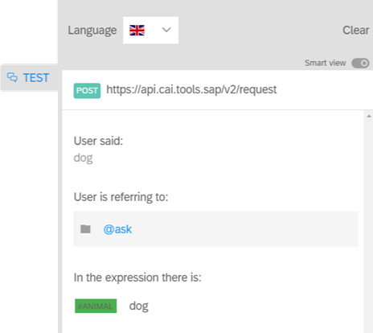

2. Now open **Chat With Your Bot**.  

    If you enter anything that does not match the animals, a short message is displayed and it asks you to enter an animal.

    Enter one of the animals. Now the requirement is met but you did not define a reply so the default **No reply** is sent.

    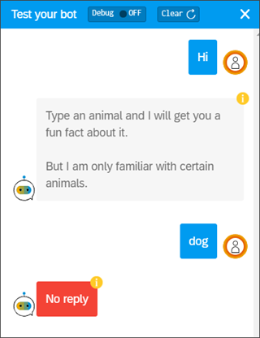

[DONE]
[ACCORDION-END]


[ACCORDION-BEGIN [Step 3: ](Create Python project)]

1. In the file explorer, create a new folder for the project and call it `chatbot-webhook`.

2. Open VS Code.

    >Make sure you have installed the Microsoft extension for Python, as well as Python and the Flask and requests packages.

3. Go to **File > Add Folder to Workspace**, and select the project folder.

    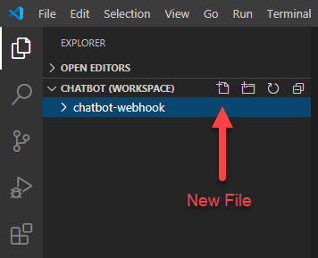

4. Inside the folder, create the helper files for the project

    #### `manifest.yml`

    You must change the host name below to a unique name. The rest of the tutorial assumes the host name below, but everywhere you must change it (e.g., URL to API).

    ```Text
    applications:
    - name: dbw-catfacts
      memory: 128M
      command: python chatbot-webhook-test.py
    ```

    #### `Procfile`

    ```Text
    web: python chatbot-webhook.py
    ```

    #### `requirements.txt`

    This file contains dependencies in our project: Flask to create endpoints and requests to call other APIs from within our app.

    ```Text
    Flask
    requests
    ```

    #### `runtime.txt`

    Make sure to use a version currently supported by SAP BTP. At the time of the writing of this tutorial (December 2020), the version below worked.

    ```Text
    python-3.8.5
    ```

    #### `static` (folder)
    Create the folder `static`. Download the SAP Conversational AI [icon](https://www.sap.com/content/dam/application/imagelibrary/pictograms/283000/283370-pictogram-purple.svg) and place it in the folder.

Your project should look like this:

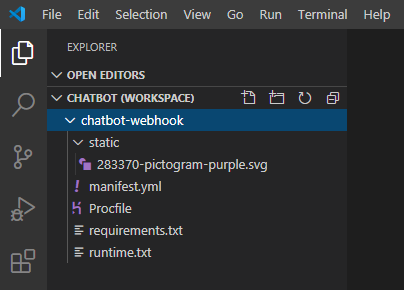

[DONE]
[ACCORDION-END]

[ACCORDION-BEGIN [Step 4: ](Write Python endpoints)]

Now we will write the main part of the app, which creates the endpoints.

1. In your project, create a new file called `chatbot-webhook.py`.

2. Add the following code -- which adds dependencies and creates a default endpoint, which returns a nice HTML page with a cool image, so you will be able to make sure the deployment was successful.

    ```Python
    from flask import Flask, request, jsonify
    import os
    import json
    import datetime
    import requests

    app = Flask(__name__)
    cf_port = os.getenv("PORT")

    # Only get method by default
    @app.route('/')
    def hello():
        return '<h1>SAP Conversational AI</h1><body>The animal facts webhook for use in SAP Conversational AI chatbots.<br></body>'

    if __name__ == '__main__':
    	if cf_port is None:
    		app.run(host='0.0.0.0', port=5000, debug=True)
    	else:
    		app.run(host='0.0.0.0', port=int(cf_port), debug=True)

    ```

    Save the file.

    If you want, you can test this in VS Code by running the `.py` file -- either by right-clicking the file and choosing **Run Python File in Terminal** or clicking the green arrow  in the upper right. You will get the following:

    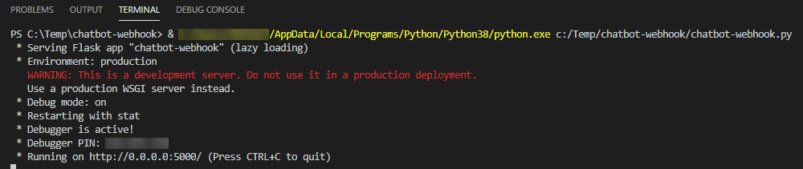

    You can then open a browser to the default endpoint.

    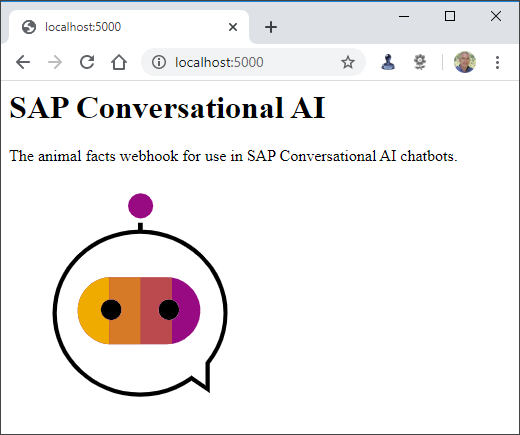

3. Add the following code for the main endpoint right after the default one -- and before the `if __name__ == '__main__':` line.

    This endpoint takes the data from the chatbot, makes the call to the API to get the fun fact, and then returns the next message to the chatbot.

    ```Python
    @app.route('/bot', methods=['POST'])
    def bot():
      # Get the request body, and determine the dog and memory
      try:
        bot_data = json.loads(request.get_data())
        animal = bot_data['conversation']['memory']['animal']['raw']
        memory = bot_data['conversation']['memory']
      except:
        animal = "dog"
        memory = json.loads("{}")

      # Get the fun fact
      url = "https://cat-fact.herokuapp.com/facts/random?animal_type=" + animal + "&amount=1"
      r = requests.get(url)
      fact_data = json.loads(r.content)

      # Increment the # of times this has been called
      if 'funfacts' in memory:
         memory['funfacts'] += 1
      else:
         memory['funfacts'] = 1

      # Return message to display (replies) and update memory
      return jsonify(
        status=200,
        replies=[
        {
          'type': 'text',
          'content': fact_data['text']
        }
        ],
        conversation={
          'memory': memory
        }

      )
    ```

    Save the file.

    You can test this by opening Postman, and calling the endpoint `localhost:5000/bot` (with **POST** method and no body).

    

    Test it again but this time sending the following (raw) body, to simulate as if the chatbot were sending the request:

    ```JSON
    {
      "conversation": {
        "memory": {
          "animal" : {"raw" : "snail"},
          "funfacts": 1
        }
      }
    }
    ```

    Now, the API call uses the animal from the body (i.e., snail) and updates the `funfacts` variable in the memory.

    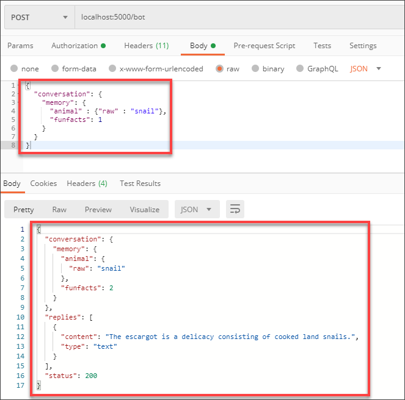

[DONE]
[ACCORDION-END]


[ACCORDION-BEGIN [Step 5: ](Push Python script to SAP BTP)]

Use the Cloud Foundry CLI to deploy the script to SAP BTP.

You will need your SAP BTP Cloud Foundry endpoint and org name, which you can see when you open your subaccount **Overview** page.

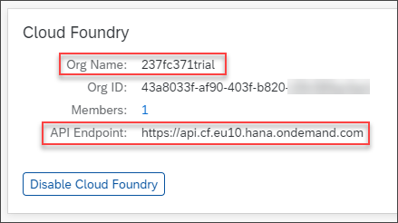

1. Open a command prompt in the folder containing your Python project, and set the Cloud Foundry API URL.

    ```CLI
    cf api https://api.cf.eu10.hana.ondemand.com
    ```

    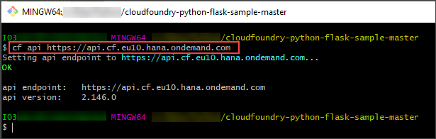

2. Log in by entering the following command and entering your credentials:

    ```CLI
    cf login
    ```

3. Select your CF org.

    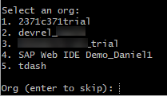

4. Now push the application, and call it `catfacts`:

    ```CLI
    cf push catfacts
    ```

This should about a minute, with a lot of output in the command screen. Once finished, you should now have the application deployed. Go to your Cloud Foundry space, under **Applications**.

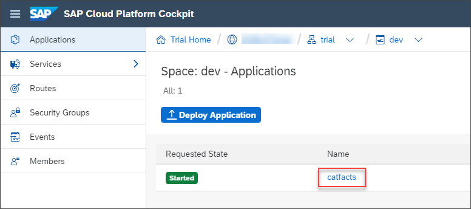

If you click the app, you will get the endpoint link.

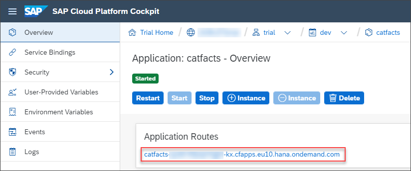

And if you click the link (and open it in browser), you will be making a `GET` call to the default endpoint.

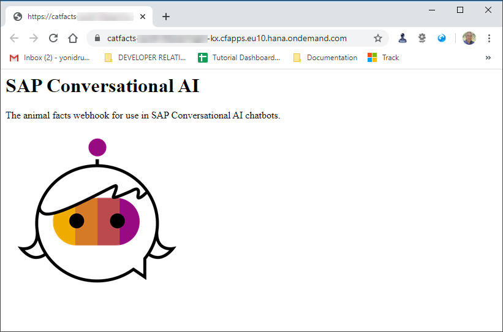

[DONE]
[ACCORDION-END]

[ACCORDION-BEGIN [Step 6: ](Point chatbot to webhook)]

Now that you deployed your webhook, let's attach it to the chatbot.

1. In the **Build** tab, open the `answer` skill.

2. In the **Actions** tab, click **Add New Message Group**, and then click **Connect External Service > Call Webhook**.

    - For the URL, enter the name of your endpoint with `/bot` at the end. Make sure the method is **POST**.

        For example, mine is: `https://catfacts-quiet-klipspringer-kx.cfapps.eu10.hana.ondemand.com/bot`

    - Click **Save**.

3. Click **Update Conversation > Edit Memory**, and then set the **Unset memory field** to `animal`.

    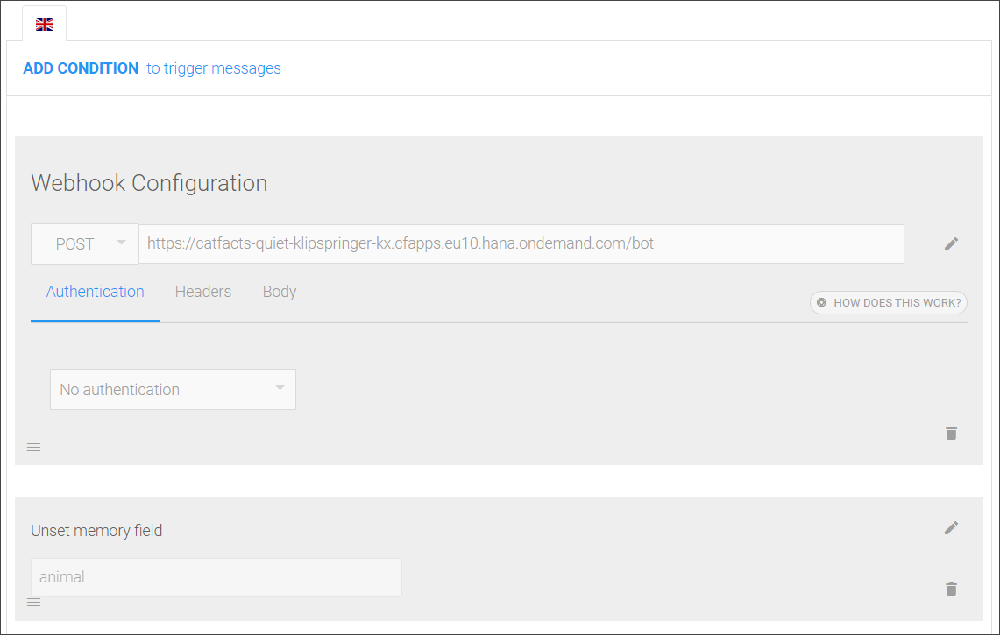

4. Click **Add New Message Group**.

    >This message group is to display a message when the user has requested 3 or more fun facts. Our webhook is keeping track of the number of calls, and then passing the results via the memory.

    - Set the condition to `If _memory.funfacts is 3`.

    - Add a text message that says: **WOW!! You sure like these fun facts!!**

[DONE]
[ACCORDION-END]

[ACCORDION-BEGIN [Step 7: ](Test chatbot)]

Open a conversation with the bot, by entering **Hi**. The message when an animal is missing is displayed.

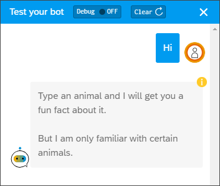

Then enter an animal, and the webhook is triggered and a fun fact is displayed.


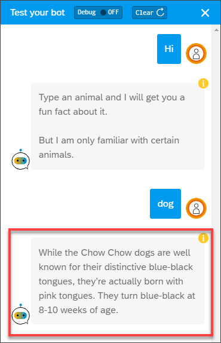

Enter an animal 2 more times -- must be cat, dog, snail, or horse. The extra message is displayed for when the user repeatedly asks for fun facts.

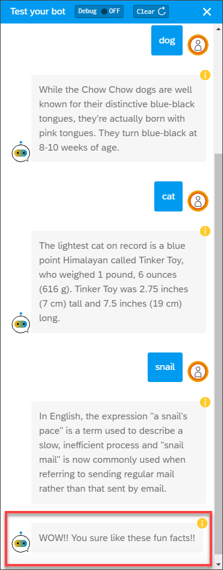

Click on the yellow **i** icon to see the JSON of the conversation. Scroll down and you can see that the webhook added to the memory the value for `funfacts`.

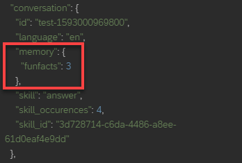

>You demonstrated the way to return information to the memory from the webhook, so you kept track via a custom memory variable  `_memory.funfacts` of how many times the current user requested a fun fact.

>You could have instead used the built-in variable `_skill_occurences` to keep track of how many times you executed the `answer` skill.

>For information on built-in variables, see [Runtime Data Accessible](https://help.sap.com/viewer/a4522a393d2b4643812b7caadfe90c18/latest/en-US/858ae05dc3f743998ecc7d299e03f1b8.html?q=skill_occurrences).

[DONE]
[ACCORDION-END]

[ACCORDION-BEGIN [Step 8: ](Test yourself)]


[VALIDATE_1]
[ACCORDION-END]
