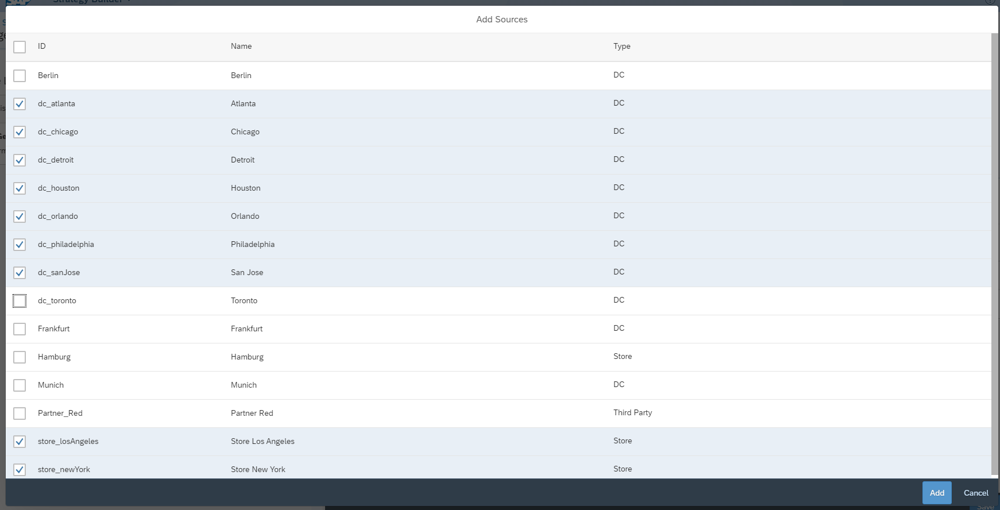
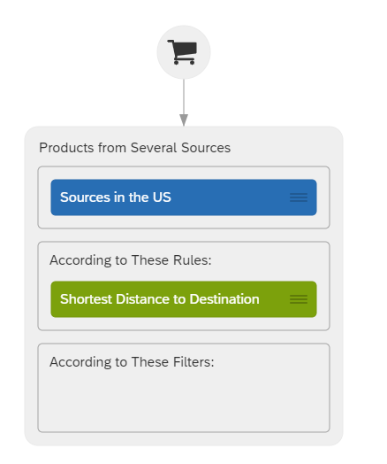
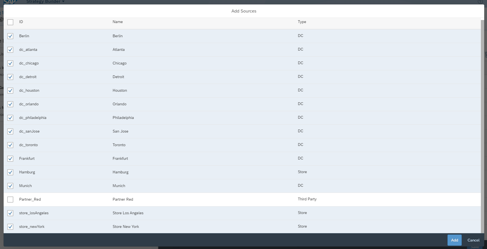
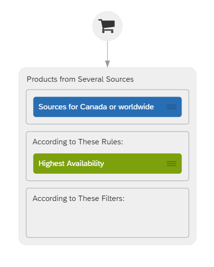
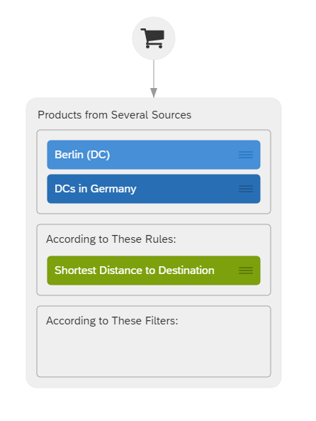
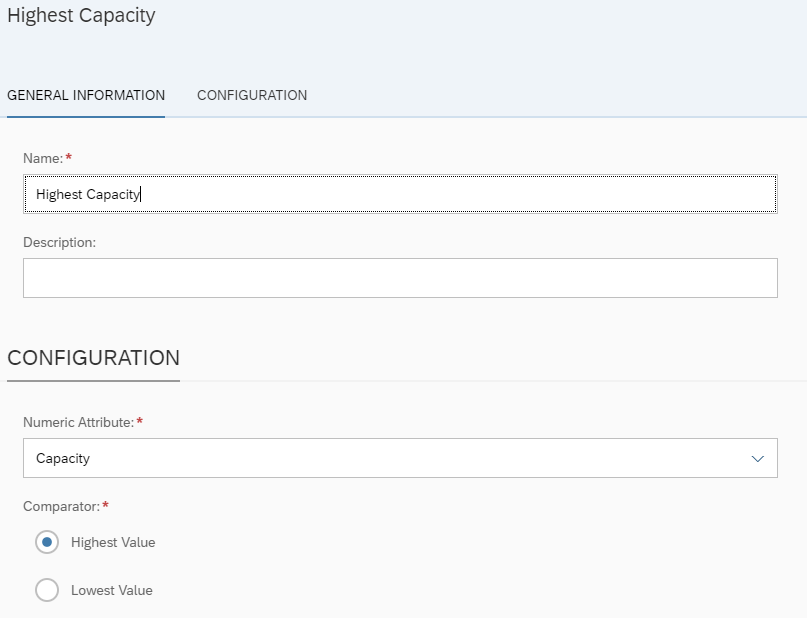
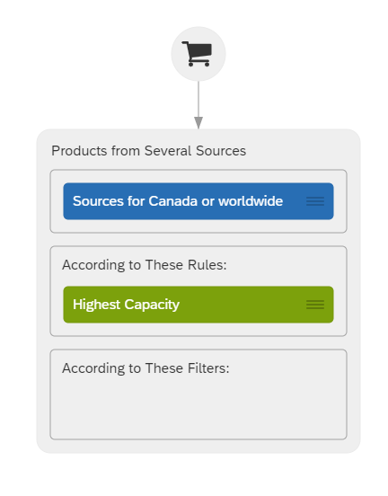
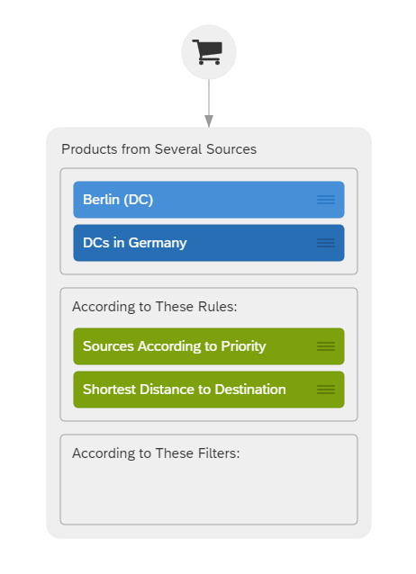

## Prerequisites
 - You have completed the tutorial [Create a Personalized Sourcing Strategy with SAP Customer Order Sourcing](https://developers.sap.com/tutorials/cos-getting-started-trial.html).
 - You have registered for a trial account on [SAP Cloud Platform](https://cloudplatform.sap.com/index.html).
 - You are familiar with the SAP Cloud Platform trial landscape [Get Started with SAP Cloud Platform Trial](https://developers.sap.com/tutorials/cp-trial-quick-onboarding.html).
 - You have a subaccount in the **Cloud Foundry** environment, with **Amazon Web Services (AWS)** as provider and the **Europe (Frankfurt)** region.


## Details
### You will learn
  - How to check availability raw data already included in your service
  - How to create source lists
  - How to create custom rules from custom attributes
  - How to create and change sourcing strategies
  - How different rules affect the sourcing algorithm

---

[ACCORDION-BEGIN [Step 1: ](Get to know the business scenario)]
You are the owner of an e-commerce business or an online shop in the fashion industry with the following characteristics:

**Sources**:

  You own several stores and distribution centers in Germany (Distribution centers in Berlin, Frankfurt and Munich and a store in Hamburg), the US (Distribution centers in Atlanta, Chicago, Houston, Philadelphia, Detroit, Orlando, San Jose and stores New York and Los Angeles) and Canada (Distribution center in Toronto).

**Products**:

  You have several products available:

|                | Grey Sports Shoe                    | White Sports Shoe                        | Black Sports Trouser     |
| :------------- | :-------------                      | :-------------                           | :-------------           |
| Product Id     | `grey_sports_shoe`                  | `white_sports_shoe`                      | `black_sports_trouser`   |
| Product Image  |   |      |  |


**Business Goal**:

  As a business owner, you want to create different sourcing strategies for different customers:

  - Customers in the US want their products as fast as possible, which means in a country as big as the United States that products should be sourced from the source with the **shortest distance to the destination**.

  - For Canada, there is only one distribution center available, no store or third party organization. Customers should get their products not only from Canada, but also from the US or Germany. Products should be sourced from the source with the **highest product availability**.

  - In Germany the sourcing strategy changes:
      - At first the goal was to serve the Customers from the source with the **shortest distance to the destination**.
      - As the distribution center in Berlin got renovated and now is the biggest one in Germany it is the number one priority source. To achieve this, the rule **sources according to priority** will be added on top of the already existing rule for Germany.
  - Customer who are not located in Germany, Canada or the US should be served by the DC or store with the **highest capacity**.


[DONE]
[ACCORDION-END]

[ACCORDION-BEGIN [Step 2: ](Check which sources are already included in your trial)]
You check the master data from the API Business Hub.

1. Select the environment you have created in the previous tutorial: Create a Personalized Sourcing Strategy with SAP Customer Order Sourcing.

2. On the left side choose Sources.

3. Open `GET/sources` and choose try out.

4. You don't have to enter anything, just choose Execute.

[VALIDATE_0]
[ACCORDION-END]

[ACCORDION-BEGIN [Step 3: ](Check which availability raw data is already included in your trial)]
You check the master data from the API Business Hub.

1. Select the environment you have created in the previous tutorial: Create a Personalized Sourcing Strategy with SAP Customer Order Sourcing.

2. On the left side choose Availability Raw Data.

3. Open `GET/availabilityRawData` and choose try out.

4. As product Id enter `black_sports_shoe`.

5. Choose Execute.

[DONE]
[ACCORDION-END]

[ACCORDION-BEGIN [Step 4: ](Upload Sources)]

You upload any master data from the API Business Hub. Since there are only sources in Germany included in the trial, you need to add sources in the US and in Canada:

1. Open [SAP Customer Order Sourcing on SAP API Business Hub](https://api.sap.com/api/Sourcing_API/resource), and login with your email address.

2. Select the environment you have created in the [previous tutorial](https://developers.sap.com/tutorials/cos-getting-started-trial.html), named `trial_test`.

3. On the left side choose **Sources**.

4. Open `POST/sources` and choose try out.

5. Copy the following source master data and paste it into the body:

    [`Sources.json`](`https://raw.githubusercontent.com/SAPDocuments/Tutorials/master/tutorials/tutorials/cos-advanced-sourcing/Sources.json`)


6. Click **Execute**.

[VALIDATE_2]
[ACCORDION-END]


[ACCORDION-BEGIN [Step 5: ](Upload availability raw data)]

You upload any master data from the API Business Hub. Since you have now all the needed sources included in your SAP Customer Order Sourcing trial, you need to upload availability raw data.

1. Open [SAP Customer Order Sourcing on SAP API Business Hub](https://api.sap.com/api/Sourcing_API/resource).

2. Select the environment you have created in the [previous tutorial](https://developers.sap.com/tutorials/cos-getting-started-trial.html), named `trial_test`.

3. On the left side choose **Availability Raw Data**.

4. Open `POST/availabilityRawData` and choose try out.

5. Copy the following availability raw data and paste it into the body:

    [`Availability_raw_data.json`](`https://raw.githubusercontent.com/SAPDocuments/Tutorials/master/tutorials/tutorials/cos-advanced-sourcing/Availability_raw_data.json`)


6. Click **Execute**.

 As you might have noticed with the sources you just uploaded, there was a attribute called **Capacity** included.

This is a custom numeric attribute, you can extend your service with. To make it easier for you, we have already included the attribute for you and provided capacities for the sources you got when signing up for the trial.

If you want to create your own custom attribute you can do that with the `POST/attributes` endpoint on the [SAP API Business Hub](https://api.sap.com/api/Sourcing_API/resource).

For more information on how to create Custom Attributes, see [Help Portal documentation on Custom Attributes](https://help.sap.com/viewer/0e899d665ec840908ddb3eba9a6c25dc/Cloud/en-US).

[DONE]
[ACCORDION-END]   

[ACCORDION-BEGIN [Step 6: ](Create a Sourcing Strategy for the US)]

If you want to learn how to create a sourcing strategy in a short and effective way, here's a short [video](https://video.sap.com/media/t/1_b510ofkl/149361851) for you to watch.

1. In the Strategy Builder app create a new strategy. As Strategy ID use `UnitedStates`. This is important for the Sourcing to work properly.

2. Open your newly created strategy.

To make things easier create a source list for the US, which includes the following sources: Atlanta, Chicago, Houston, Philadelphia, Detroit, Orlando, San Jose, Store New York, Store Los Angeles.

**To create a source list, follow these steps:**

1. On the Building Block, Source Lists, click **Manage**.

2. In the Manage Source Lists view, create a new source list by clicking "+".

3. As ID enter `US_Sources` and as name enter **Sources in the US**.

4. In the sources section, click "+" to add sources to your source list.

5. Search for and add the sources listed above to your list.

6. Save your source list.



**To build your strategy, do the following:**

1. Go back to your strategy creation UI.

2. Under Objectives, drag and drop the objective **Products from Several Sources** onto the canvas for modeling your strategy, under the shopping cart.

3. Drag and drop the source list **Sources in the US** into the first box.

4. Drag and drop the rule **Shortest Distance to Destination** into the second box.

5. Save your strategy.



[DONE]
[ACCORDION-END]

[ACCORDION-BEGIN [Step 7: ](Create a Sourcing Strategy for Canada)]

1. In the Strategy Builder app create a new strategy. As Strategy ID use ``Canada``. This is important for the Sourcing to work properly.

2. Open your newly created strategy.

To make things easier create a source list for Canada, which includes the following sources: Toronto, Atlanta, Chicago, Houston, Philadelphia, Detroit, Orlando, San Jose, Store New York, Store Los Angeles, Berlin, Frankfurt, Munich, Hamburg Store.  

**To create a source list, follow these steps:**

1. On the Building Block, Source Lists, click **Manage**.

2. In the Manage Source Lists view, create a new source list by clicking "+".

3. As ID enter `All_Sources` and as name enter **Sources for Canada or worldwide**.

4. In the sources section, click "+" to add sources to your source list.

5. Search for and add the sources listed above to your list.

6. Save your source list.



**To build your strategy, do the following:**

1. Go back to your strategy creation UI.

2. Under Objectives, drag and drop the objective **Products from Several Sources** onto the canvas for modeling your strategy, under the shopping cart.

3. Drag and drop the source list **Sources for Canada or worldwide** into the first box.

4. Drag and drop the rule **Highest Availability** into the second box.

5. Save your strategy.




[DONE]
[ACCORDION-END]

[ACCORDION-BEGIN [Step 8: ](Create the first Sourcing Strategy for Germany)]

In Germany the sourcing strategy will change. This change will take place after we have looked at the sourcing result for this strategy.


1. In the Strategy Builder app create a new strategy. As Strategy ID use ``Germany``. This is important for the Sourcing to work properly.

2. Open your newly created strategy.

3. Under Objectives, drag and drop the objective **Products from Several Sources** onto the canvas for modeling your strategy, under the shopping cart.

4. Drag and drop the source list **DCs in Germany** into the first box. Additionally to that add the source **Berlin** as well. Make sure, that Berlin is at the first position in the box.

5. Drag and drop the rule **Shortest Distance to Destination** into the second box.

6. Save your strategy.



[DONE]
[ACCORDION-END]

[ACCORDION-BEGIN [Step 9: ](Create a Sourcing Strategy for Customers not located in Germany, Canada or the US)]

1. In the Strategy Builder app create a new strategy. As Strategy ID use ``Worldwide``. This is important for the Sourcing to work properly.

2. Open your newly created strategy.

**Now we will create a custom rule, which will be used in this strategy:**

1. Go to **Rules > Manage** to open the Manage Rules UI

2. Create a new Rule by clicking the '+' in the top right corner.

3. As Name insert **Highest Capacity**.

4. As Numeric Attribute choose **Capacity**.

5. As Comparator choose Highest Value.

6. Save your rule.



**To build your strategy, do the following:**

1. Go back to your strategy creation UI.

2. Under Objectives, drag and drop the objective **Products from Several Sources** onto the canvas for modeling your strategy, under the shopping cart.

3. Drag and drop source list **Sources for Canada or worldwide** into the first box.

4. Drag and drop the rule **Highest Capacity** into the second box.

5. Save your strategy.



[DONE]
[ACCORDION-END]

[ACCORDION-BEGIN [Step 10: ](Test your US Strategy)]

**Scenario:** A customer located in the city of New York orders a `grey_sports_shoe`.

Let's check where the products are sourced from:

1. Open SAP Customer Order Sourcing on SAP API Business Hub in a new window.

2. Select the environment you have created in the previous tutorial, probably named `trial_test`.

3. On the left-hand side, choose Sourcing.

4. In `POST/sourcing` choose Try out.

5. Post the following sourcing request:

```JSON
{
  "strategyId": "UnitedStates",
  "items": [
      {
          "productId": "grey_sports_shoe",
          "quantity": 1
      }
  ],
  "destinationCoordinates": {
      "latitude": 40.8240,
      "longitude": -73.9448
  }
}
```

[VALIDATE_3]
[ACCORDION-END]

[ACCORDION-BEGIN [Step 11: ](Test your Strategy for Canada)]

**Scenario:** A small retailer in Vancouver wants to sell your products in his shop and therefore orders 50 `grey_sports_shoe`, 50 `white_sports_shoe` and 60 `black_sports_trouser`.

Let's check where the products are sourced from:

1. Open SAP Customer Order Sourcing on SAP API Business Hub in a new window.

2. Select the environment you have created in the previous tutorial, probably named `trial_test`.

3. On the left-hand side, choose Sourcing.

4. In `POST/sourcing` choose Try out.

5. Post the following sourcing request:

```JSON
{
    "strategyId": "Canada",
    "items": [
        {
            "productId": "grey_sports_shoe",
            "quantity": 50
        },
        {
            "productId": "white_sports_shoe",
            "quantity": 50
        },
        {
            "productId": "black_sports_trouser",
            "quantity": 60
        }
    ],
    "destinationCoordinates": {
        "latitude": 49.2827,
        "longitude": -123.1207
    }
}
```


[VALIDATE_4]
[ACCORDION-END]

[ACCORDION-BEGIN [Step 12: ](Test your Strategy for Germany )]

**Scenario:** A customer located in Berlin orders a `grey_sports_shoe` and a `black_sports_trouser`. One month later he orders the same again. The sourcing strategy for Germany changed before his second order.

Let's check where the products are sourced from:

1. Open SAP Customer Order Sourcing on SAP API Business Hub in a new window.

2. Select the environment you have created in the previous tutorial, probably named `trial_test`.

3. On the left-hand side, choose Sourcing.

4. In `POST/sourcing` choose Try out.

5. Post the following sourcing request:

```JSON
{
    "strategyId": "Germany",
    "items": [
        {
            "productId": "grey_sports_shoe",
            "quantity": 1
        },
        {
            "productId": "black_sports_trouser",
            "quantity": 1
        }
    ],
    "destinationCoordinates": {
        "latitude": 52.5200,
        "longitude": 13.4050
    }
}

```

[VALIDATE_5]
[ACCORDION-END]

[ACCORDION-BEGIN [Step 13: ](Change your Strategy for Germany and test again)]

1. In the Strategy Builder open the strategy with the Strategy ID **Germany**.

2. Drag and drop the rule **Sources according to Priority** above the rule **Shortest Distance to Destination** into the second box.

3. Save your strategy.



Let's check where the products are sourced from for the second order:

1. Open SAP Customer Order Sourcing on SAP API Business Hub in a new window.

2. Select the environment you have created in the previous tutorial, probably named `trial_test`.

3. On the left-hand side, choose Sourcing.

4. In `POST/sourcing` choose Try out.

5. Post the following sourcing request:

```JSON
{
    "strategyId": "Germany",
    "items": [
        {
            "productId": "grey_sports_shoe",
            "quantity": 1
        },
        {
            "productId": "black_sports_trouser",
            "quantity": 1
        }
    ],
    "destinationCoordinates": {
        "latitude": 52.5200,
        "longitude": 13.4050
    }
}

```

[VALIDATE_6]
[ACCORDION-END]

[ACCORDION-BEGIN [Step 14: ](Test your Strategy for Customers not located in Germany, Canada or the US)]

**Scenario:** A customer located in Rome orders a `grey_sports_shoe` and two `black_sports_trousers`.

Let's check where the products are sourced from:

1. Open SAP Customer Order Sourcing on SAP API Business Hub in a new window.

2. Select the environment you have created in the previous tutorial, probably named `trial_test`.

3. On the left-hand side, choose Sourcing.

4. In `POST/sourcing` choose Try out.

5. Post the following sourcing request:

```JSON
{
    "strategyId": "Worldwide",
    "items": [
        {
            "productId": "grey_sports_shoe",
            "quantity": 1
        },
        {
            "productId": "black_sports_trouser",
            "quantity": 2
        }
    ],
    "destinationCoordinates": {
        "latitude": 41.9028,
        "longitude": 12.4964
    }
}
```


[VALIDATE_7]
[ACCORDION-END]

## Congratulations

You have successfully completed this tutorial!

## Additional Information

- [Official Product Documentation](https://help.sap.com/viewer/product/SAP_CUSTOMER_ORDER_SOURCING/Cloud/en-US)
- [Trial Documentation](https://help.sap.com/viewer/DRAFT/cd03af1a94a440f1b5dbc0dc50a0989b/Cloud/en-US)
- [How do the Rules work?](https://help.sap.com/viewer/a8094e21e0ed43b39ad79ade28eefabb/Cloud/en-US/a96a37284b5142ee968e9c9392304920.html#loiob368d40ba4a7438b857d394ab6e6c7a6)
- [API Reference Documentation](https://help.sap.com/viewer/59d653d22328437c9e0817340181b896/Cloud/en-US)
- [SAP Customer Order Sourcing on the SAP API Business Hub](https://api.sap.com/package/CustomerOrderSourcing?section=Artifacts)
- [Additional information on how to configure Environments on the API Business Hub](https://help.sap.com/viewer/84b35b9c39b247e3ba2a31f02beee46d/Cloud/en-US/f7796baaef6a48e9867298827f5028ff.html)
- [**Video:** SAP Customer Order Sourcing in a nutshell](https://youtu.be/novFLk35X2I)
- [**Video:** How to create a Sourcing Strategy](https://video.sap.com/media/t/1_b510ofkl/149361851)

---
