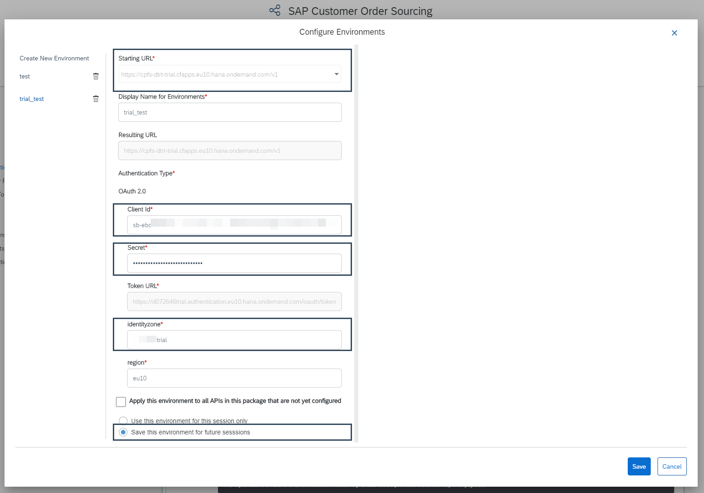
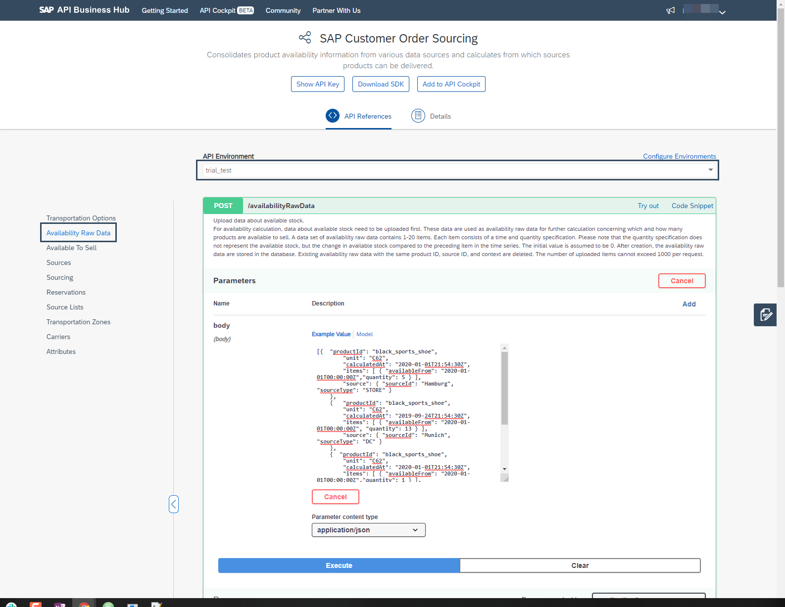
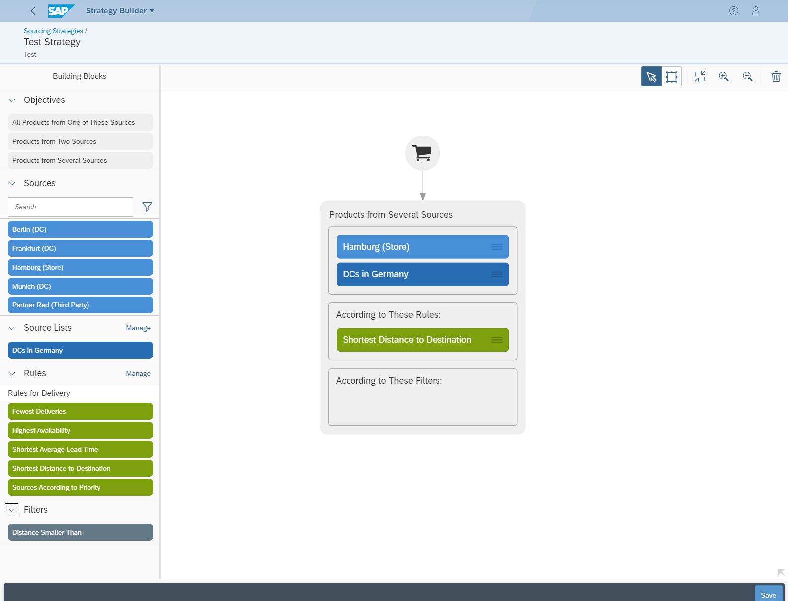
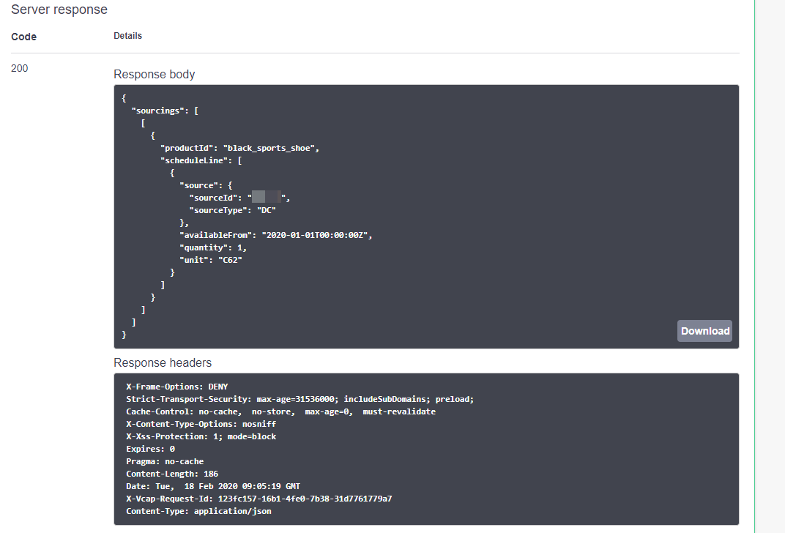

## Prerequisites
 - You have registered for a trial account on [SAP Business Technology Platform](https://cloudplatform.sap.com/index.html).
 - You should be familiar with the SAP Business Technology Platform trial landscape (see [Get Started with SAP Business Technology Platform Trial](cp-trial-quick-onboarding)).
 - You have a subaccount in the **Cloud Foundry** environment, with **Amazon Web Services (AWS)** as provider and the **Europe (Frankfurt)** region.

## Details
### You will learn
  - How to use the SAP Customer Order Sourcing trial
  - How to upload master data using the API Business Hub
  - How to create a sourcing strategy
  - How to create a sourcing request to test your sourcing strategy

 If you're interested in the demo data included in every **SAP Customer Order Sourcing** trial system, you can learn more [here](https://help.sap.com/viewer/cd03af1a94a440f1b5dbc0dc50a0989b/Cloud/en-US/227454caf28d47aa94683a6a0d749ebd.html).

---

[ACCORDION-BEGIN [Step 1: ](Get to know the business scenario)]

You are the owner of an e-commerce business or a web shop in the fashion industry with the following characteristics:

  - **Sources**: You own several stores and distribution centers in Germany.

  - **Products**: You only have one product available (`black_sports_shoe`).

  - **Business Goal**: As a business owner, you want to reduce delivery cost of each order and therefore decide for the following sourcing strategy:
      - The products in the shopping cart should be delivered from the source with the shortest distance to the customer.

[DONE]
[ACCORDION-END]

[ACCORDION-BEGIN [Step 2: ](Set up SAP Customer Order Sourcing via Booster)]

1. Log on to the **SAP Business Technology Platform trial** cockpit and open your global account for the Cloud Foundry environment.

2. In the navigation pane of the SAP Business Technology Platform cockpit, choose **Boosters**.

3. Choose the booster **Prepare an Account for SAP Customer Order Sourcing**.

4. Choose **Start**.

>In case you are not able to subscribe to **SAP Customer Order Sourcing**, you need to [assign quota to a Subaccount](https://help.sap.com/viewer/cd03af1a94a440f1b5dbc0dc50a0989b/Cloud/en-US/bdf64a959a5249cf88b414a7c01391df.html).

The configuration and set-up of your new **SAP Customer Order Sourcing** trial system starts and finishes automatically.

You want to learn how to setup SAP Customer Order Sourcing yourself? This tutorial can help: [Set Up SAP Customer Order Sourcing Manually](cos-manual-setup).

[DONE]
[ACCORDION-END]

[ACCORDION-BEGIN [Step 3: ](Create a new environment)]

Having created a service instance and the corresponding credentials, you can now upload master data into SAP Customer Order Sourcing. You do this via a REST API.

1. Open a new browser window, navigate to [SAP Customer Order Sourcing on SAP API Business Hub](https://api.sap.com/api/Sourcing_API/resource), and login with your email address.

2. Choose **Configure Environments** and then click **Create New Environment**.

3. As your starting URL choose `https://cpfs-dtrt-trial.cfapps.eu10.hana.ondemand.com/v1`.

4. Enter a name for your environment, for example `trial_test`.

5. In your **SAP Business Technology Platform trial** **Subaccount** open **Spaces** and your already existing space, probably called `dev`.

6. In the navigation pane, open **Services > Service Marketplace**.

7. Search for **SAP Customer Order Souring** and click on the tile.

8. In the navigation pane, open **Instances** and open the already existing instance, probably called `default_customer-order-sourcing-trial`.

9. From your instance copy the following fields to your new environment in the API Business Hub:

    - `clientid`
    - `clientsecret` (called just **Secret** in environment)
    - `identityzone`

10. Scroll down and choose the **Save this environment for future sessions** radio button.

11. Click **Save**.



[DONE]
[ACCORDION-END]

[ACCORDION-BEGIN [Step 4: ](Upload master data)]

You upload master data from the API Business Hub. Since there are already sources included in the trial, you only need to add availability raw data:

1. Select the newly created environment.

2. On the left side choose **Availability Raw Data**.

    !

3. Open `POST/availabilityRawData` and choose try out.

4. Copy the following availability raw data and paste it into the body:

    ```JSON
    [{  "productId": "black_sports_shoe",
        "unit": "C62",
        "calculatedAt": "2020-01-01T21:54:30Z",
        "items": [ { "availableFrom": "2020-01-01T00:00:00Z","quantity": 5 } ],
        "source": { "sourceId": "Hamburg", "sourceType": "STORE" }
    },
    {   "productId": "black_sports_shoe",
        "unit": "C62",
        "calculatedAt": "2019-09-24T21:54:30Z",
        "items": [ { "availableFrom": "2020-01-01T00:00:00Z", "quantity": 13 } ],
        "source": { "sourceId": "Munich", "sourceType": "DC" }
    },
    {  "productId": "black_sports_shoe",
        "unit": "C62",
        "calculatedAt": "2020-01-01T21:54:30Z",
        "items": [ { "availableFrom": "2020-01-01T00:00:00Z","quantity": 1 } ],
        "source": { "sourceId": "Berlin", "sourceType": "DC" }
    },
    {  "productId": "black_sports_shoe",
        "unit": "C62",
        "calculatedAt": "2020-01-01T21:54:30Z",
        "items": [ { "availableFrom": "2020-01-01T00:00:00Z","quantity": 1 } ],
        "source": { "sourceId": "Frankfurt", "sourceType": "DC" }
    }]
    ```

5. Click **Execute**.

6. Make sure you get the HTTP response **201**.

[DONE]
[ACCORDION-END]

[ACCORDION-BEGIN [Step 5: ](Model your sourcing strategy)]

Those were a lot of steps already and you didn't get the chance to do anything with SAP Customer Order Sourcing yet.

But don't worry -- just one more step and then you can play around with it.

1. Go back to your Subaccount.

2. In the navigation pane, open **Service Marketplace**.

    Search for **SAP Customer Order Sourcing**.

3. Open the SAP Customer Order Service tile, choose **Go to Application**, and log in.

4. Open the Strategy Builder app and create a new strategy. As **Strategy ID** use **Test**. This is important for the Sourcing to work properly.

5. Open your newly created strategy.

6. Under **Templates**, drag and drop the template **Products from Several Sources** onto the canvas for modeling your strategy, under the shopping cart.

7. Drag and drop the source **Hamburg (Store)** and the Source List **DCs in Germany** into the first box.
The order of the sources determines their priority within the sourcing. That means the source with the highest priority is the store in Hamburg. Depending on goals or filters this prioritization can change.

8. Drag and drop the goal **Shortest Distance to Destination** into the second box.

9. Save your strategy.

!

[DONE]
[ACCORDION-END]

[ACCORDION-BEGIN [Step 6: ](Test your strategy)]

**Scenario**: A customer located in a suburb of Munich orders a `black_sports_shoe`.

**Desired Sourcing Result**: `black_sports_shoe` should be sourced from Munich since it is the shortest destination to the customer.

Let's check if this is the case:

1. Open [SAP Customer Order Sourcing on SAP API Business Hub](https://api.sap.com/api/Sourcing_API/resource) in a new window.

2. Select the environment you created earlier.

3. On the left-hand side, choose **Sourcing**.

4. In POST/sourcing choose **Try out**.

5. Post the following sourcing request:

    ```JSON
    {
      "strategyId": "Test",
      "items": [ { "productId": "black_sports_shoe", "quantity": 1 } ],
      "destinationCoordinates": { "latitude": 48.1500,"longitude": 11.5736 }
    }
    ```

    This is the response you should get:

    !

[VALIDATE_2]
[ACCORDION-END]

### Additional Information

- [Official Product Documentation](https://help.sap.com/viewer/product/SAP_CUSTOMER_ORDER_SOURCING/Cloud/en-US)
- [Trial Documentation](https://help.sap.com/viewer/DRAFT/cd03af1a94a440f1b5dbc0dc50a0989b/Cloud/en-US)
- [How does the Goal "Shortest Distance to Destination" work?](https://help.sap.com/viewer/a8094e21e0ed43b39ad79ade28eefabb/Cloud/en-US/a96a37284b5142ee968e9c9392304920.html)
- [API Reference Documentation](https://help.sap.com/viewer/59d653d22328437c9e0817340181b896/Cloud/en-US)
- [SAP Customer Order Sourcing on the SAP API Business Hub](https://api.sap.com/package/CustomerOrderSourcing?section=Artifacts)
- [Additional information on how to configure Environments on the API Business Hub](https://help.sap.com/viewer/84b35b9c39b247e3ba2a31f02beee46d/Cloud/en-US/f7796baaef6a48e9867298827f5028ff.html)
- [**Video:** SAP Customer Order Sourcing in a nutshell](https://www.youtube.com/watch?v=novFLk35X2I)

---
