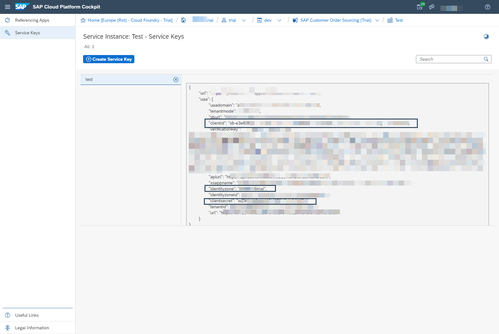

## Prerequisites
 - You have registered for a trial account on [SAP Cloud Platform](https://cloudplatform.sap.com/index.html).
 - You should be familiar with the SAP Cloud Platform trial landscape (see [Get Started with SAP Cloud Platform Trial](cp-trial-quick-onboarding)).

## Details
### You will learn
  - How to use the SAP Customer Order Sourcing trial
  - How to upload master data using the API Business Hub
  - How to create a sourcing strategy
  - How to create a sourcing request to test your sourcing strategy
---

[ACCORDION-BEGIN [Step 1: ](Get to know the business scenario)]

You are the owner of an e-commerce business or a web shop in the fashion industry with the following characteristics:

  - **Sources**: You own several stores and distribution centers in Germany.

  - **Products**: You only have one product available (`black_sports_shoe`).

  - **Business Goal**: As a business owner, you want to reduce delivery cost of each order and therefore decide for the following sourcing strategy:
      - The products in the shopping cart should be delivered from the source with the shortest distance to the customer.

[DONE]
[ACCORDION-END]

[ACCORDION-BEGIN [Step 2: ](Subscribe to SAP Customer Order Sourcing)]


1. In the [SAP Cloud Platform trial space](https://account.hanatrial.ondemand.com), enter your trial account.

2. Navigate to your subaccount named `trial`.

3. In the navigation pane, open **Subscriptions**.

4. Search for **SAP Customer Order Sourcing** and click on it to open the **Overview** page.

5. Subscribe to the service.

    **Go to Application** will be available once the subscription is activated. Later in this post, you can use this link to access the Strategy Builder.

!

[DONE]
[ACCORDION-END]


[ACCORDION-BEGIN [Step 3: ](Assign read/write permissions to your user)]

You have successfully subscribed to SAP Customer Order Sourcing, but to be able to use it you have to assign read and write permissions to your user:

1. Navigate back to your subaccount.

2. In the navigation pane, open **Security > Trust Configuration**.

3. Open the **SAP ID Service**.

4. Enter your email address (the one you used to register for a SAP Cloud Platform trial account) and search for already existing assignments via **Show Assignments**.

5. Choose **Assign Role Collection** and assign the role collection `StrategyBuilder_ReadWrite`.


[DONE]
[ACCORDION-END]

[ACCORDION-BEGIN [Step 4: ](Create a service instance)]

1. Navigate to your subaccount.

2. In the navigation pane, open **Spaces**.

3. Open your already existing space.

4. In the navigation pane, open **Services > Service Marketplace**.

5. Search for **SAP Customer Order Souring** and click on the tile.

6. In the navigation pane, open **Instances**.

7. Create a new instance by clicking **New Instance** and then **Next** three times and inserting an instance name on the last page. Click **Finish**.

[DONE]
[ACCORDION-END]

[ACCORDION-BEGIN [Step 5: ](Create credentials)]

1. Open your newly created service instance.

2. In the navigation pane, open **Service Keys**.

3. Click **Create Service Key**. In the pop-up window, just enter a name for your service key. Click **Save**.

Your service key will look something like this. Important for the next step are `clientid`, `identityzone` and `clientsecret`.

!

[DONE]
[ACCORDION-END]


[ACCORDION-BEGIN [Step 6: ](Create a new environment)]

Having created a service instance and the corresponding credentials, you can now upload master data into SAP Customer Order Sourcing. You do this via a REST API.

1. Open a new browser window, navigate to [SAP Customer Order Sourcing on SAP API Business Hub](https://api.sap.com/api/Sourcing_API/resource), and login with your email address.

2. Choose **Configure Environments** and then click **Create New Environment**.

3. As your starting URL choose `https://cpfs-dtrt-trial.cfapps.eu10.hana.ondemand.com/v1`.

4. Enter a name for your environment.

5. Go back to your recently created service key in your trial space of SAP Cloud Platform, and copy the following fields to your new environment:

    - `clientid`
    - `clientsecret` (called just **Secret** in environment)
    - `identityzone`

9. Scroll down and choose the **Save this environment for future sessions** radio button.

10. Click **Save**.


[DONE]
[ACCORDION-END]

[ACCORDION-BEGIN [Step 7: ](Upload master data)]

You upload master data from the API Business Hub. Since there are already sources included in the trial, you only need to add availability raw data:

1. Select the newly created environment.

2. On the left side choose **Availability Raw Data**.

    !

3. Open `POST/availabilityRawData` and choose try out.

4. Copy the following availability raw data and paste it into the body:

    ```JSON
    [{  "productId": "black_sports_shoe",
        "unit": "C62",
        "calculatedAt": "2020-01-01T21:54:30Z",
        "items": [ { "availableFrom": "2020-01-01T00:00:00Z","quantity": 5 } ],
        "source": { "sourceId": "Hamburg", "sourceType": "STORE" }
    },
    {   "productId": "black_sports_shoe",
        "unit": "C62",
        "calculatedAt": "2019-09-24T21:54:30Z",
        "items": [ { "availableFrom": "2020-01-01T00:00:00Z", "quantity": 13 } ],
        "source": { "sourceId": "Munich", "sourceType": "DC" }
    },
    {  "productId": "black_sports_shoe",
        "unit": "C62",
        "calculatedAt": "2020-01-01T21:54:30Z",
        "items": [ { "availableFrom": "2020-01-01T00:00:00Z","quantity": 1 } ],
        "source": { "sourceId": "Berlin", "sourceType": "DC" }
    },
    {  "productId": "black_sports_shoe",
        "unit": "C62",
        "calculatedAt": "2020-01-01T21:54:30Z",
        "items": [ { "availableFrom": "2020-01-01T00:00:00Z","quantity": 1 } ],
        "source": { "sourceId": "Frankfurt", "sourceType": "DC" }
    }]
    ```

5. Click **Execute**.

6. Make sure you get the HTTP response **201**.

[DONE]
[ACCORDION-END]

[ACCORDION-BEGIN [Step 8: ](Model your sourcing strategy)]

Those were a lot of steps already and you didn't get the chance to do anything with SAP Customer Order Sourcing yet.

But don't worry -- just one more step and then you can play around with it.

1. Go back to your Subaccount and navigate to **Subscriptions** on the SAP Cloud Platform trial landscape.

2. In the SAP Customer Order Service Overview page, choose **Go to Application** and login.

3. Open the Strategy Builder app and create a new strategy. As **Strategy ID** use **Test**. This is important for the Sourcing to work properly.

4. Open your newly created strategy.

5. Under **Objectives**, drag and drop the objective **Products from Several Sources** onto the canvas for modeling your strategy, under the shopping cart.

6. Drag and drop the source **Hamburg (Store)** and the Source List **DCs in Germany** into the first box.
The order of the sources determines their priority within the sourcing. That means the source with the highest priority is the store in Hamburg. Depending on rules or filters this prioritization can change.

7. Drag and drop the rule **Shortest Distance to Destination** into the second box.

8. Save your strategy.

!

[DONE]
[ACCORDION-END]

[ACCORDION-BEGIN [Step 9: ](Test your strategy)]

**Scenario**: A customer located in a suburb of Munich orders a `black_sports_shoe`.

**Desired Sourcing Result**: `black_sports_shoe` should be sourced from Munich since it is the shortest destination to the customer.

Let's check if this is the case:

1. Open [SAP Customer Order Sourcing on SAP API Business Hub](https://api.sap.com/api/Sourcing_API/resource) in a new window.

2. On the left-hand side, choose **Sourcing** and **Try out**.

3. Post the following sourcing request:

```JSON
{
  "strategyId": "Test",
  "items": [ { "productId": "black_sports_shoe", "quantity": 1 } ],
  "destinationCoordinates": { "latitude": 48.1500,"longitude": 11.5736 }
}
```
This is the response you should get:

!

[VALIDATE_2]
[ACCORDION-END]

## Additional Information

- [Official Product Documentation](https://help.sap.com/viewer/product/SAP_CUSTOMER_ORDER_SOURCING/Cloud/en-US)
- [Trial Documentation](https://help.sap.com/viewer/DRAFT/cd03af1a94a440f1b5dbc0dc50a0989b/Cloud/en-US)
- [How does the Rule "Shortest Distance to Destination" work?](https://help.sap.com/viewer/a8094e21e0ed43b39ad79ade28eefabb/Cloud/en-US/a96a37284b5142ee968e9c9392304920.html)
- [API Reference Documentation](https://help.sap.com/viewer/59d653d22328437c9e0817340181b896/Cloud/en-US)
- [SAP Customer Order Sourcing on the SAP API Business Hub](https://api.sap.com/package/CustomerOrderSourcing?section=Artifacts)
- [Additional information on how to configure Environments on the API Business Hub](https://help.sap.com/viewer/84b35b9c39b247e3ba2a31f02beee46d/Cloud/en-US/f7796baaef6a48e9867298827f5028ff.html)
- [**Video:** SAP Customer Order Sourcing in a nutshell](https://www.youtube.com/watch?v=novFLk35X2I)

---
