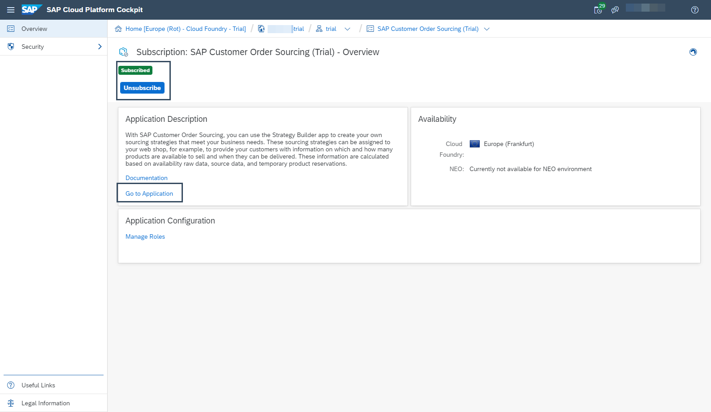
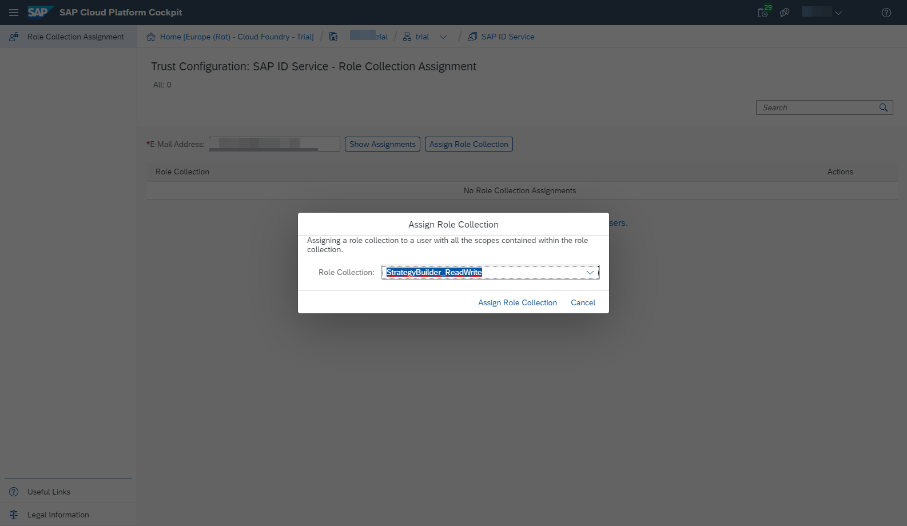

## Prerequisites
- You have registered for a trial account on [SAP Cloud Platform](https://cloudplatform.sap.com/index.html).
- You should be familiar with the SAP Cloud Platform trial landscape (see [Get Started with SAP Cloud Platform Trial](cp-trial-quick-onboarding)).
- You have a subaccount in the **Cloud Foundry** environment, with **Amazon Web Services (AWS)** as provider and the **Europe (Frankfurt)** region.

## Details
### You will learn
  - How to manually set up SAP Customer Order Sourcing

In this tutorial you learn how to set up SAP Customer Order Sourcing from start to finish.

This might help you in getting a better understanding on how the service works and shows you the options you have, when working with it.

With this you'll learn exactly what you have to do to add Users to your service and how to give them the appropriate permissions.

But if you want an easy and quick way to setup SAP Customer Order Sourcing, use this tutorial: [Create a Personalized Sourcing Strategy with SAP Customer Order Sourcing](cos-getting-started-trial).

---

[ACCORDION-BEGIN [Step 1: ](Subscribe to SAP Customer Order Sourcing)]

1. In the [SAP Cloud Platform trial space](https://account.hanatrial.ondemand.com), enter your trial account.

2. Navigate to your subaccount, probably named `trial`.

3. In the navigation pane, open **Subscriptions**.

4. Search for **SAP Customer Order Sourcing** and click on it to open the **Overview** page.

5. **Subscribe** to the service.

    **Go to Application** will be available once the subscription is activated. Later in this post, you can use this link to access the Strategy Builder.

    !

[VALIDATE_1]
[ACCORDION-END]

[ACCORDION-BEGIN [Step 2: ](Assign read/write permissions to your user)]

You have successfully subscribed to SAP Customer Order Sourcing, but to be able to use it you have to assign read and write permissions to your user:

1. Navigate back to your subaccount.

2. In the navigation pane, open **Security > Trust Configuration**.

3. Open the default identity provider, named `sap.default`.

4. Enter your email address (the one you used to register for a SAP Cloud Platform trial account) and search for already existing assignments via **Show Assignments**.

5. Choose **Assign Role Collection** and assign the role collection `StrategyBuilder_ReadWrite`.

!

[DONE]
[ACCORDION-END]

[ACCORDION-BEGIN [Step 3: ](Create a service instance)]

1. Navigate to your subaccount.

2. In the navigation pane, open **Services > Service Marketplace**.

3. Search for **SAP Customer Order Sourcing** and click on the tile.

4. Choose **Create Instance**, insert a name for the instance and finish the creating by clicking **Create Instance**.

[DONE]
[ACCORDION-END]

[ACCORDION-BEGIN [Step 4: ](Create credentials)]

1. Open your newly created service instance via the **View Instance** button in the pop up or via **Services > Service Instances**.

2. Click on the **Actions** button and from the dropdown menu choose **Create Service Key**.

    !

3. In the pop-up window, just enter a name for your service key. Click **Create**.

Your service key will look something like this.

If you navigate back to SAP Customer Order Sourcing under **Subscriptions** you can use the **Go to Application** link to enter your SAP Customer Order Sourcing trial account

!

[DONE]
[ACCORDION-END]

---
