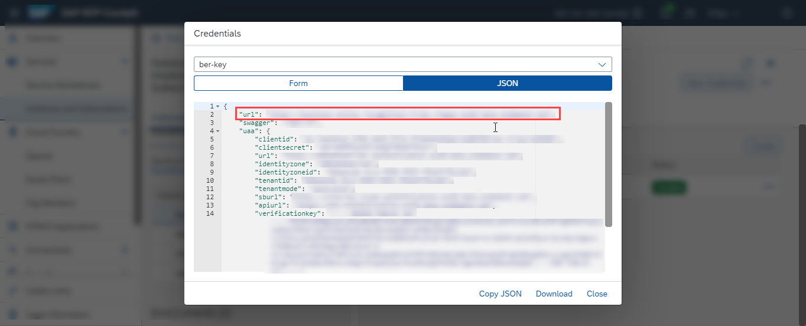
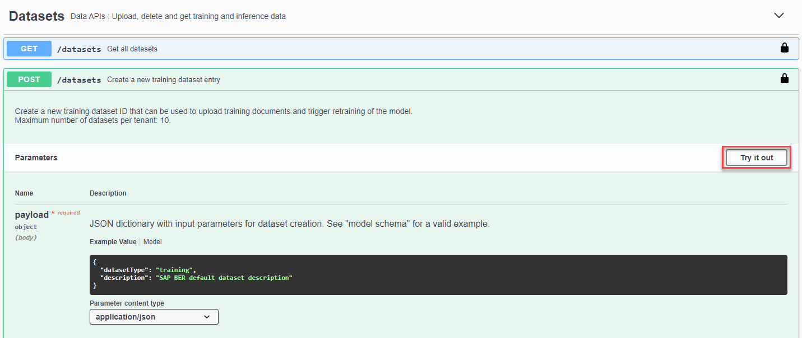
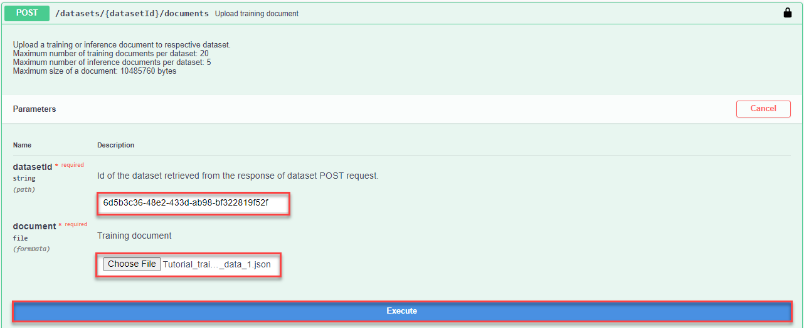
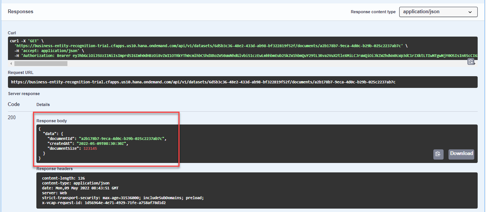
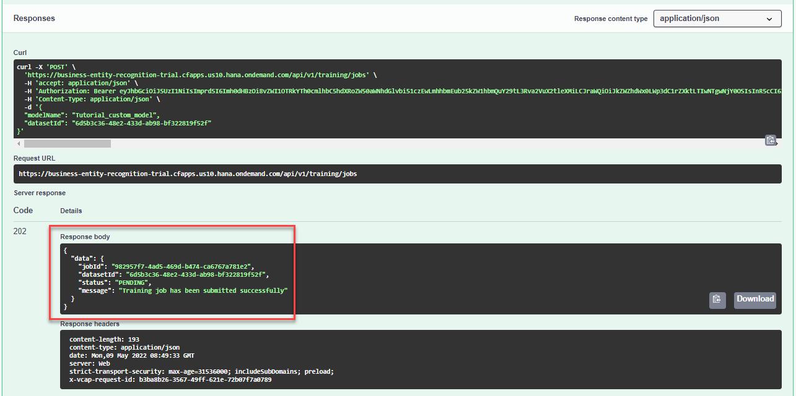

## Details
### You will learn
  - How to call and test Business Entity Recognition
  - How to access and use the Business Entity Recognition Swagger UI (User Interface)
  - How to create a dataset, upload training data and submit a training job

The core functionality of Business Entity Recognition is to automatically detect and highlight any given type of named entity in unstructured text and classify it in accordance with predefined categories.

In this tutorial, you will learn how to use the service APIs to create a dataset, upload training data, and submit a training job to finally create your own custom machine learning model to classify any given type of named entity, such as mobile number, first name, last name and address, in the texts you will submit to the service in the next tutorial: [Deploy Model and Get Prediction Results](cp-aibus-ber-custom-deploy).

---

[ACCORDION-BEGIN [Step 1: ](Authorize Swagger UI)]

You will use Swagger UI, via any web browser, to call the Business Entity Recognition APIs. Swagger UI allows developers to effortlessly interact and try out every single operation an API exposes for easy consumption. For more information, see [Swagger UI](https://swagger.io/tools/swagger-ui/).  

In the service key you created for Business Entity Recognition in the previous tutorial: [Create Service Instance for Business Entity Recognition](cp-aibus-ber-service-instance), you should find (outside the `uaa` section of the service key) an entry called `url` (as highlighted in the image below).

1. To access the Business Entity Recognition Swagger UI, add **`/api/v1`** to the `url` value, paste it into any web browser and press **Enter**.

    !

2. To be able to use the Swagger UI endpoints, you need to authorize yourself. In the top right corner, click **Authorize**.

    !

3. Get the `access_token` value created in the previous tutorial: [Get OAuth Access Token for Business Entity Recognition Using Any Web Browser](cp-aibus-ber-web-oauth-token), then add **bearer** in front of it, and enter in the **Value** field.

    ```
    bearer <access_token>
    ```

    !

4. Click **Authorize** and then click **Close**.

    !

[DONE]
[ACCORDION-END]


[ACCORDION-BEGIN [Step 2: ](Create dataset)]

Use the **POST /datasets** endpoint to create a dataset that will be used to train a custom model to extract entities from unstructured text.

1. Click the endpoint name to expand it.

2. Click **Try it out**.

    !

3. In **payload**, enter a `description` for your dataset, `"Tutorial dataset"`, for example.

4. Click **Execute**.

    !

5. Copy the **`datasetId`** from the **Response body**.

    !

[DONE]
[ACCORDION-END]


[ACCORDION-BEGIN [Step 3: ](See dataset details)]

To see the details of your newly created dataset, use the **GET /datasets/{`datasetId`}** endpoint.

1. Click the endpoint name to expand it.

2. Click **Try it out**.

3. Enter the **`datasetId`** obtained in the previous step and click **Execute**.

    !

You receive a response like below. Among the `datasetId` and the `description`, you see the number of documents. Those documents include your training data and you upload some in the following step.

!

[DONE]
[ACCORDION-END]


[ACCORDION-BEGIN [Step 4: ](Upload training data)]

To upload training documents to your dataset, use the **POST /datasets/{`datasetId`}/documents**. You may repeat this step to upload multiple documents.

Please bear in mind that Business Entity Recognition requires your data to be in a specific format to train a model. See data format prerequisites in [Training Data Format](https://help.sap.com/viewer/b43f8f61368d455793a241d2b10baeb2/SHIP/en-US/a1df156894ed4df7810d0a5abcce8d92.html).

>As an alternative to uploading your own JSON file to the service, you can use the following sample files (right click on the link, then click ***Save link as*** to download the files locally):

>- [Sample Training Data 1](https://raw.githubusercontent.com/SAPDocuments/Tutorials/master/tutorials/cp-aibus-ber-swagger-ui-custom/data/Tutorial_training_data_1.json)

>- [Sample Training Data 2](https://raw.githubusercontent.com/SAPDocuments/Tutorials/master/tutorials/cp-aibus-ber-swagger-ui-custom/data/Tutorial_training_data_2.json)

>Please repeat this step twice and upload one document each time. The more data is available the better predictions the model can give you.


To upload documents, do the following:

1. Click the **POST /datasets/{`datasetId`}/documents** endpoint name to expand it.

2. Click **Try it out**.

3. Enter the **`datasetId`** obtained in step 2 and select one training document for the upload.

4. Click **Execute**.

    !

5. Copy the **`documentId`** from the **Response body**.

    !

[DONE]
[ACCORDION-END]


[ACCORDION-BEGIN [Step 5: ](See document details)]

Using the `datasetId` obtained in the previous step, you can obtain the details of your training documents using the **GET /datasets/{`datasetId`}/documents/{`documentId`}** endpoint.

1. Click the endpoint name to expand it.

2. Click **Try it out**.

3. Enter the **`datasetId`** obtained in step 2.

4. Enter the **`documentId`** obtained in step 4.

5. Click **Execute**.

    !

You should receive a response, with the document details, like below. This shows you the size of the document in bytes.

!

[DONE]
[ACCORDION-END]


[ACCORDION-BEGIN [Step 6: ](Submit training job)]

Once the training documents are uploaded, you can submit a training job. This triggers the training of a machine learning model based on your uploaded data. For that, use the **POST /training/jobs** endpoint.

1. Click the endpoint name to expand it.

2. Click **Try it out**.

3. In **payload**, enter a **`modelName`** for your custom model, `"Tutorial_custom_model"`, for example, and the **`datasetId`** obtained in step 2.

    >**CAUTION:**

    >Be aware of the following **`modelName`** guidelines:​

    >- You cannot use the same name as a Business Entity Recognition pre-trained model (`sap_email_business_entity` and `sap_invoice_header`)

    >- You cannot use `"sap_"` as a prefix

    >- Start with an alphanumeric character

    >- You can include the special characters `"-"` and `"_"`

    >- You can use a maximum of 64 characters

4. Click **Execute**.

    !

5. Copy the **`jobId`** from the **Response body**. This allows you to check the status of the training.

    !

This indicates that your training job has been successfully submitted.

[VALIDATE_1]
[ACCORDION-END]


[ACCORDION-BEGIN [Step 7: ](See training job status)]

To check whether your training already succeeded, you can use the **GET /training/jobs/{`jobId`}** endpoint to see the current status of the job.

>**CAUTION:**

>In the Trial version of the service, only one training job with `SUCCEEDED` status is allowed. See [Trial Account Input Limits](https://help.sap.com/viewer/b43f8f61368d455793a241d2b10baeb2/SHIP/en-US/c80a45cc7416409eb9bf64667487c375.html). Use the endpoint **DELETE /training/jobs/{`jobId`}** to delete a training job before its status changes to `SUCCEEDED`.

1. Click the endpoint name to expand it.

2. Click **Try it out**.

3. Enter the **`jobId`** obtained in step 6.

4. Click **Execute**.

    !

You should receive a response like below. The status `RUNNING` indicates that the training is still in progress. In case the status is `PENDING`, then the training has not started yet.

!

You may check the status now and then. Please note that the training may take up to 5 hours. Afterwards, the training status changes to `SUCCEEDED`. Along with that, you receive all the capabilities of the model, that are the entities the model can recognize.

!

[DONE]
[ACCORDION-END]
