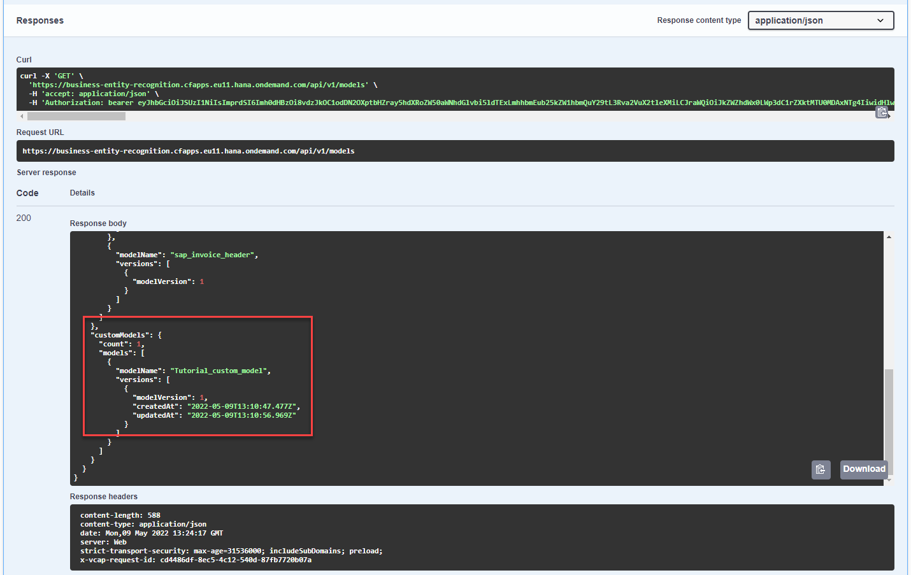
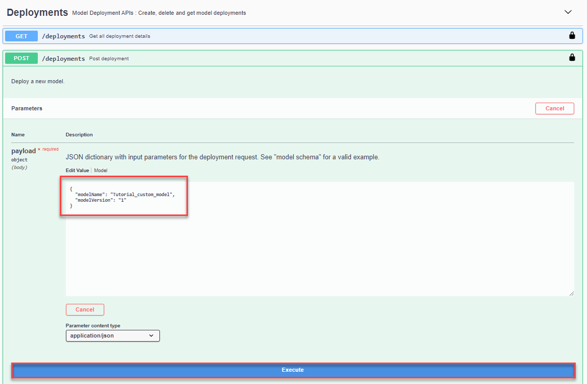
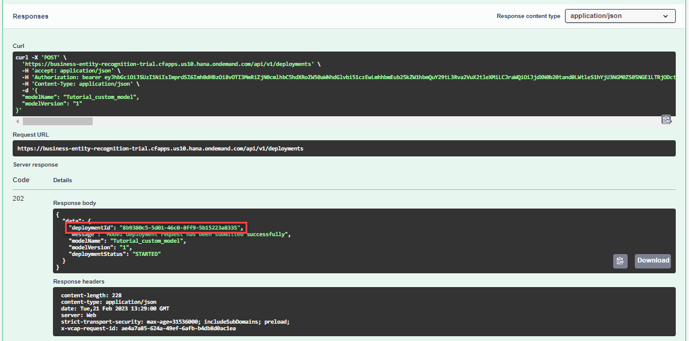
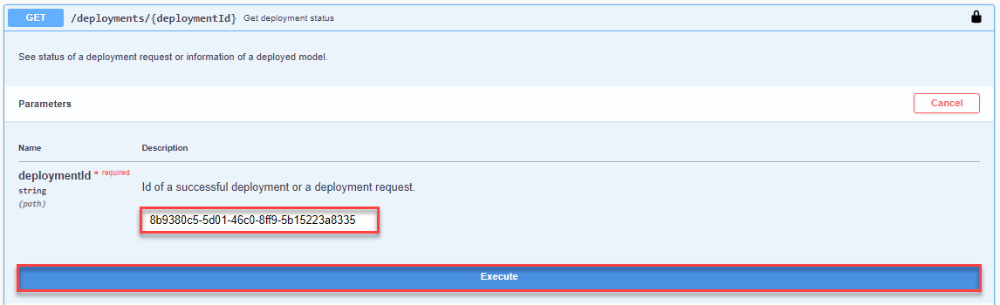
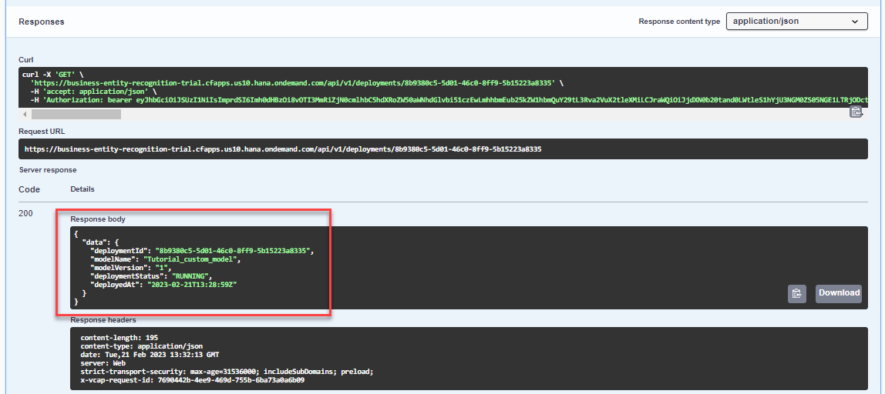
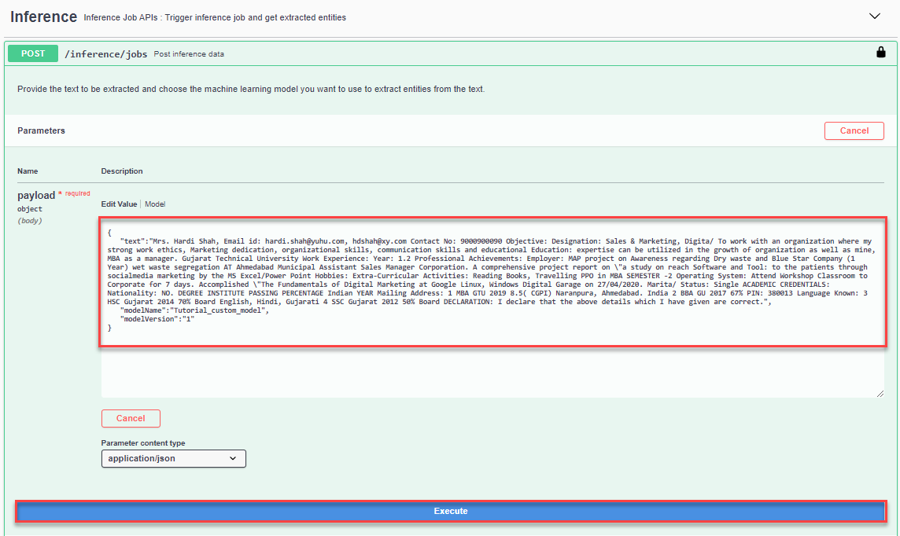
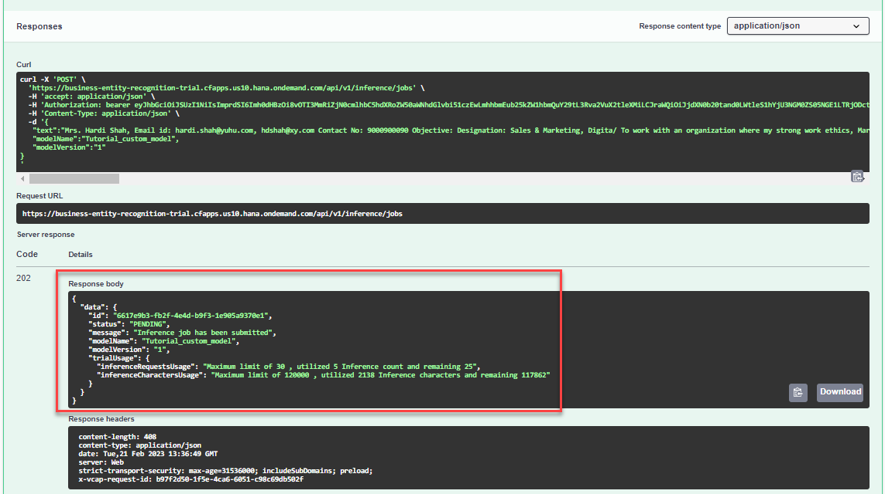
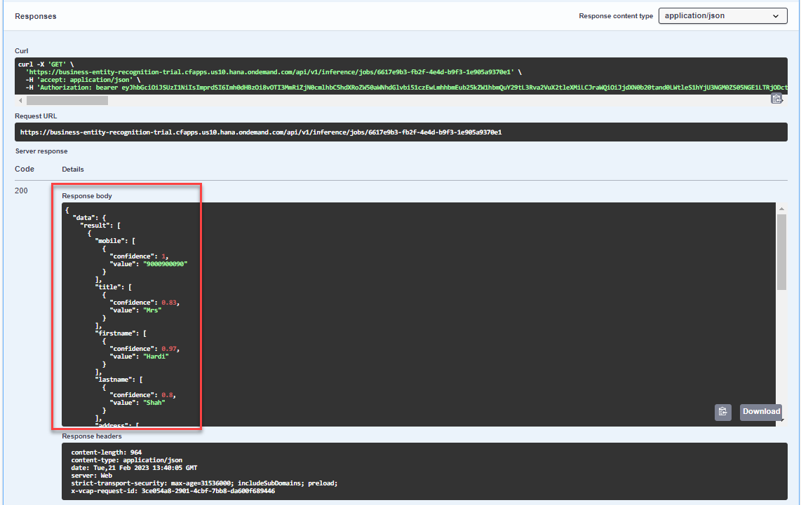

# Deploy Model and Get Prediction Results
<!-- description --> Perform the final steps to train your own Business Entity Recognition custom model to get machine learning entity predictions for the text you submit to the service.

## You will learn
  - How to deploy your own Business Entity Recognition machine learning model
  - How to send an inference request to the service and get machine learning entity predictions for unstructured text

## Intro
The core functionality of Business Entity Recognition is to automatically detect and highlight any given type of named entity in unstructured text and classify it in accordance with predefined categories. In this tutorial, you will learn how to use the service APIs to deploy your own machine learning model to get named entity predictions for the texts you submit to the service.

---

### List models


Use the **GET /models** endpoint to see all the available models (pre-trained and custom) including the one you've created.

1. Click the endpoint name to expand it.

2. Click **Try it out**.

3. Click **Execute**.

You should receive a response like the following:

<!-- border -->

The response includes the Business Entity Recognition pre-trained machine learning models (`sap_email_business_entity` and `sap_invoice_header`), and the new custom model you have created, in this case, `Tutorial_custom_model`.


### List model versions


Use the **GET /models/{`modelName`}/versions** endpoint to see the available versions and other details about the custom model you've created.

1. Click the endpoint name to expand it.

2. Click **Try it out**.

3. Enter the **`modelName`** (`Tutorial_custom_model` in this case).

4. Click **Execute**.

    <!-- border -->

    You should receive a response like the following:

    <!-- border -->


### Deploy model


Finally, to make actual predictions, you have to deploy your model. You can do so by using the **POST /deployments** endpoint.

1. Click the endpoint name to expand it.

2. Click **Try it out**.

3. In **payload**, enter the **`modelName`** (`Tutorial_custom_model` in this case.), and the **`modelVersion`** (`1` in this case).

4. Click **Execute**.

    <!-- border -->

5. Copy the **`deploymentId`** from the **Response body** to check the status of the deployment in the next step.

    <!-- border -->


### See deployment status


As with training jobs, you can now check the status of the deployment every now and then. Use the **GET /deployments/{`deploymentId`}** endpoint to do so.

1. Click the endpoint name to expand it.

2. Click **Try it out**.

3. Enter the **`deploymentId`** obtained in the previous step.

4. Click **Execute**.

    <!-- border -->

    You should receive a response like below. Note that, compared to training jobs, deployments do not have a status `SUCCEEDED`. The status `RUNNING` indicates that the deployment is live and the model can be used for predictions.

    <!-- border -->


### Enter inference text


To make a prediction, or in machine learning terms an inference, you use the **POST /inference/jobs** endpoint to submit a text from which your model should extract entities.

1. Click the endpoint name to expand it.

2. Click **Try it out**.

3. In **payload**, enter the `text` you want to extract named entities from, `modelName`, and `modelVersion`. You may use the following example:

    ```JSON
    {
       "text":"Mrs. Hardi Shah, Email id: hardi.shah@yuhu.com, hdshah@xy.com Contact No: 9000900090 Objective: Designation: Sales & Marketing, Digita/ To work with an organization where my strong work ethics, Marketing dedication, organizational skills, communication skills and educational Education: expertise can be utilized in the growth of organization as well as mine, MBA as a manager. Gujarat Technical University Work Experience: Year: 1.2 Professional Achievements: Employer: MAP project on Awareness regarding Dry waste and Blue Star Company (1 Year) wet waste segregation AT Ahmedabad Municipal Assistant Sales Manager Corporation. A comprehensive project report on \"a study on reach Software and Tool: to the patients through socialmedia marketing by the MS Excel/Power Point Hobbies: Extra-Curricular Activities: Reading Books, Travelling PPO in MBA SEMESTER -2 Operating System: Attend Workshop Classroom to Corporate for 7 days. Accomplished \"The Fundamentals of Digital Marketing at Google Linux, Windows Digital Garage on 27/04/2020. Marita/ Status: Single ACADEMIC CREDENTIALS: Nationality: NO. DEGREE INSTITUTE PASSING PERCENTAGE Indian YEAR Mailing Address: 1 MBA GTU 2019 8.5( CGPI) Naranpura, Ahmedabad. India 2 BBA GU 2017 67% PIN: 380013 Language Known: 3 HSC Gujarat 2014 70% Board English, Hindi, Gujarati 4 SSC Gujarat 2012 50% Board DECLARATION: I declare that the above details which I have given are correct.",
       "modelName":"Tutorial_custom_model",
       "modelVersion":"1"
    }
    ```    

4. Click **Execute**.

    <!-- border -->

5. Copy the **`id`** from the **Response body** to see the result of the extraction in the next step. Please also note the remark regarding free tier technical limits. See [Free Tier Option Technical Constraints](https://help.sap.com/viewer/b43f8f61368d455793a241d2b10baeb2/SHIP/en-US/c80a45cc7416409eb9bf64667487c375.html).

    <!-- border -->


### Get extraction results


Use the **GET /inference/jobs/{`jobId`}** endpoint to see the text extraction results and the confidence level of the `Tutorial_custom_model` custom model.

1. Click the endpoint name to expand it.

2. Click **Try it out**.

3. Enter the `jobId` obtained in the previous step and click **Execute**.

<!-- border -->

You should receive a response like the following:

<!-- border -->

In the response, you will find the prediction for the extracted entities. The prediction is made with a probability indicated by the **confidence** field which represents how certain the model is about the value provided. A confidence of 1 means that the model is 100% sure about its prediction. The model tries to provide a value for all its capabilities. Thus, you may see a different result depending on your model's capabilities. In case the model cannot identify an entity in the text, it returns an empty value.

Below, you find an example of a full prediction:

```JSON
{
  "data": {
    "result": [
      {
        "mobile": [
          {
            "confidence": 1,
            "value": "9000900090"
          }
        ],
        "title": [
          {
            "confidence": 0.83,
            "value": "Mrs"
          }
        ],
        "firstname": [
          {
            "confidence": 0.97,
            "value": "Hardi"
          }
        ],
        "lastname": [
          {
            "confidence": 0.8,
            "value": "Shah"
          }
        ],
        "address": [
          {
            "confidence": 0.9,
            "value": "Naranpura"
          }
        ],
        "zip": [
          {
            "confidence": 1,
            "value": "380013"
          }
        ],
        "city": [
          {
            "confidence": 0.9,
            "value": "Ahmedabad"
          }
        ],
        "country": [
          {
            "confidence": 1,
            "value": "India"
          }
        ],
        "emailID": [
          {
            "confidence": 0.97,
            "value": "hardi.shah@yuhu.com, hdshah@xy.com"
          }
        ],
        "designation": [
          {
            "confidence": 0.97,
            "value": "Sales & Marketing"
          }
        ]
      }
    ],
    "trialUsage": {
      "inferenceRequestsUsage": "Maximum limit of 30 , utilized 5 Inference count and remaining 25",
      "inferenceCharactersUsage": "Maximum limit of 120000 , utilized 2138 Inference characters and remaining 117862"
    },
    "id": "6617e9b3-fb2f-4e4d-b9f3-1e905a9370e1",
    "status": "SUCCESS",
    "createdAt": "2023-02-21T13:36:49Z",
    "modifiedAt": "2023-02-21T13:36:57Z"
  }
}
```    

You have now successfully used your own custom model to get text entity predictions for the unstructured text you submitted to Business Entity Recognition.