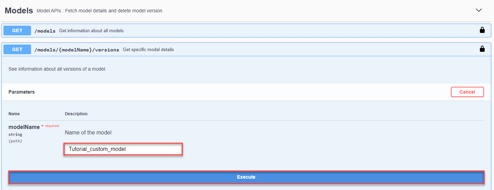

## Details
### You will learn
  - How to deploy your own Business Entity Recognition machine learning model
  - How to send an inference request to the service and get machine learning entity predictions for unstructured text

The core functionality of Business Entity Recognition is to automatically detect and highlight any given type of named entity in unstructured text and classify it in accordance with predefined categories. In this tutorial, you will learn how to use the service APIs to deploy your own machine learning model to get named entity predictions for the texts you submit to the service.

---

[ACCORDION-BEGIN [Step 1: ](List models)]

To see all your models, you can use the **GET /models** endpoint to see the list of them.

1. Click the endpoint name to expand it.

2. Click **Try it out**.

3. Click **Execute**.

You should receive a response like the following:

!

The response includes the Business Entity Recognition pre-trained machine learning models (`sap_email_business_entity` and `sap_invoice_header`), and the new custom model you have created, in this case, `Tutorial_custom_model`.

[DONE]
[ACCORDION-END]


[ACCORDION-BEGIN [Step 2: ](List model versions)]

Use the **GET /models/{`modelName`}/versions** endpoint to see the available versions and other details about a specific model.

1. Click the endpoint name to expand it.

2. Click **Try it out**.

3. Enter the **`modelName`** (`Tutorial_custom_model` in this case).

4. Click **Execute**.

    !

You should receive a response like the following:

!

[DONE]
[ACCORDION-END]


[ACCORDION-BEGIN [Step 3: ](Deploy model)]

Finally, to make actual predictions, you have to deploy your model. You can do so by using the **POST /deployments** endpoint.

1. Click the endpoint name to expand it.

2. Click **Try it out**.

3. In **payload**, enter the **`modelName`** (`Tutorial_custom_model` in this case.), and the **`modelVersion`** (`1` in this case).

4. Click **Execute**.

    !

5. Copy the **`deploymentId`** from the **Response body** to check the status of the deployment in the next step.

    !

[DONE]
[ACCORDION-END]


[ACCORDION-BEGIN [Step 4: ](See deployment status)]

As with training jobs, you now have to check the status of the deployment every now and then. Use the **GET /deployments/{`deploymentId`}** endpoint to do so.

1. Click the endpoint name to expand it.

2. Click **Try it out**.

3. Enter the **`deploymentId`** obtained in the previous step.

4. Click **Execute**.

    !

You should receive a response like below. Note that, compared to training jobs, deployments do not have a status `SUCCEEDED`. The status `RUNNING` indicates that the deployment is live and the model can be used for predictions.

!

[VALIDATE_1]
[ACCORDION-END]


[ACCORDION-BEGIN [Step 5: ](Enter inference text)]

To make a prediction, or in machine learning terms an inference, you use the **POST /inference/jobs** endpoint to submit a text from which your model should extract entities.

1. Click the endpoint name to expand it.

2. Click **Try it out**.

3. In **payload**, enter the `text` you want to extract named entities from, `modelName`, and `modelVersion`. You may use the following example:

    ```JSON
    {
       "text":"Von: lena nova <office@scomputercenter.bg> Gesendet: Montag, 21. Januar 2019, 19:13 Uhr An: canu, ana <ana.canu@company.com>; office@computercenter-bg.com Betreff: RE: M & B EOOD 2639710315 Sehr geehrter Kunde, ich sende Ihnen Informationen für unsere Zahlung. Proforma 198305906 ist ein Teil der Rechnung 4830476570 / 11.01.2019. Rechnungsdatum Betrag in EUR 4830473772 14.12.2018 9,28 € 4830474632 21.12.2018 29,16 € 4830475244 28.12.2018 46,19 € 4830475919 4.1.2019 9,28 € 198305906 10.1.2019 9,29 € 103,20 € 4830476570 11.1.2019 37,13 198305906 10.1.2019 -9,29 € 27,84 Einen schönen Tag noch! Mit freundlichen Grüßen, lena lena nova Verkaufsleiterin M & B EOOD-Computer Center 11, Angel Kanchev Str; 1000, Sofia, Bulgarien Tel.: + 359 2 981 58 57; Mobil: + 359 889 61 13 21 E-Mail: office@scomputercenter.bg Besuchen Sie uns unter: www.computercenter.bg",
       "modelName":"Tutorial_custom_model",
       "modelVersion":1
    }
    ```    

4. Click **Execute**.

    !

5. Copy the **`id`** from the **Response body** to see the result of the extraction in the next step. Please also note the remark regarding limits in Trial. See [Trial Account Input Limits](https://help.sap.com/viewer/b43f8f61368d455793a241d2b10baeb2/SHIP/en-US/c80a45cc7416409eb9bf64667487c375.html).

    !

[DONE]
[ACCORDION-END]


[ACCORDION-BEGIN [Step 6: ](Get extraction results)]

Use the **GET /inference/jobs/{`jobId`}** endpoint to see the text extraction results and the confidence level of the `Tutorial_custom_model` custom model.

1. Click the endpoint name to expand it.

2. Click **Try it out**.

3. Enter the `jobId` obtained in the previous step and click **Execute**.

      !

You should receive a response like the following:

!

In the response, you will find the prediction for the extracted entities. The prediction is made with a probability indicated by the **confidence** field which represents how certain the model is about the value provided. A confidence of 1 means that the model is 100% sure about its prediction. The model tries to provide a value for all its capabilities. Thus, you may see a different result depending on your model's capabilities. In case the model cannot identify an entity in the text, it returns an empty value.

You have now successfully used your own custom model to get text entity predictions for the unstructured text you submitted to Business Entity Recognition.

[DONE]
[ACCORDION-END]
