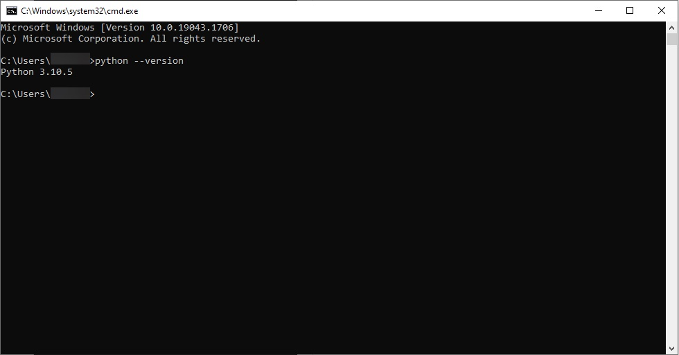
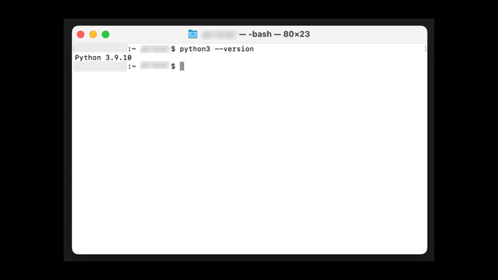
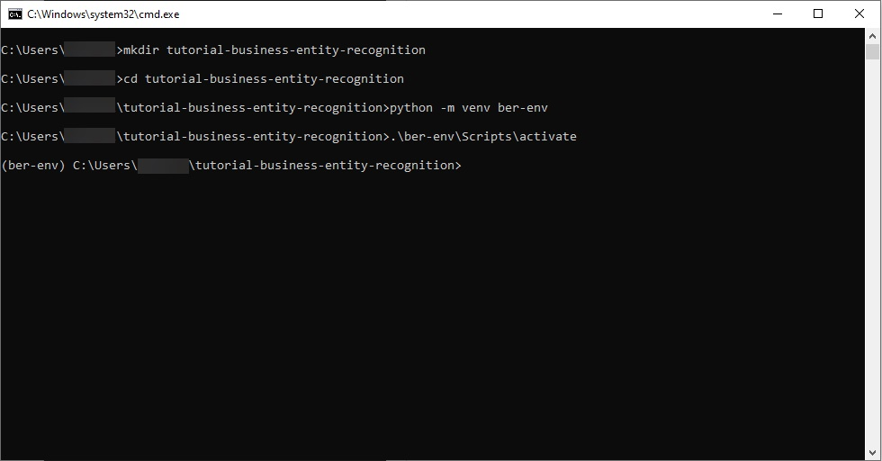
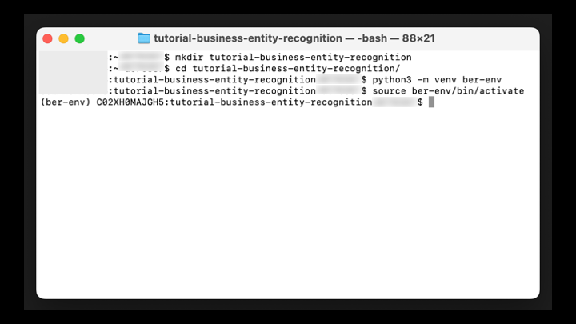
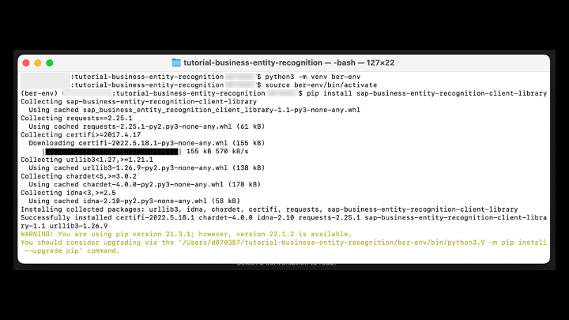
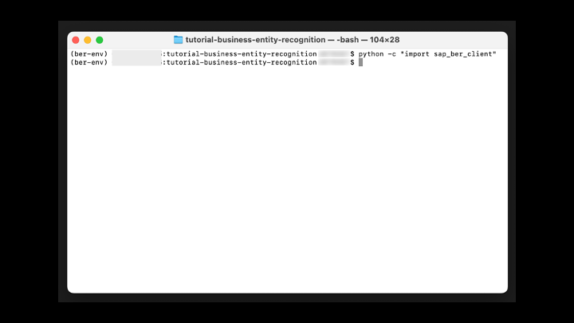

# Set Up the Python SDK for Business Entity Recognition
<!-- description --> Create a virtual environment and install the Python SDK (Software Development Kit) for Business Entity Recognition.

## You will learn
  - How to set up a virtual environment  
  - How to install the Python SDK for Business Entity Recognition

## Intro
Use Business Entity Recognition (one of the [SAP AI Business Services](https://help.sap.com/docs/SAP_AI_BUS) in SAP Business Technology Platform) to identify and extract named entities from your text data. For more information, see [Business Entity Recognition help portal documentation](https://help.sap.com/docs/Business_Entity_Recognition).

The Python SDK is available in [GitHub](https://github.com/SAP/business-entity-recognition-client-library).

---

### Install Python

First, you need to make sure that you have Python 3 installed. You need a Python version 3 or higher in order for the SDK to work!

[OPTION BEGIN [Windows]]

Open up a command prompt and enter `python --version` to check the version that you have installed.

[OPTION END]

[OPTION BEGIN [Mac and Linux]]

Open up a terminal and enter `python3 --version` to check the version that you have installed.

[OPTION END]

In case you have a Python installation, it will output the version.

In case `command not found` is printed, you do not have Python installed. Head over [here](https://www.python.org/downloads/) and install an up-to-date version. Then, close down and open up a new command prompt or terminal and run the command `python --version` again to check if the installation was successful.

### Set up virtual environment

Next, you will set up a virtual environment using the Python package `venv`. With this package you avoid installing Python packages globally which could break system tools or other projects.

[OPTION BEGIN [Windows]]

First, you will create a new directory in which you work throughout the tutorial.

In a command prompt or terminal, enter `mkdir tutorial-business-entity-recognition` to create this new directory. Next, navigate into it by using the command `cd tutorial-business-entity-recognition`.

Within this directory, you will create a new virtual environment.

In a command prompt, enter `python -m venv ber-env` to create a new virtual environment and run `.\ber-env\Scripts\activate` right afterwards to activate the environment.

[OPTION END]

[OPTION BEGIN [Mac and Linux]]

First, you will create a new directory in which you work throughout the tutorial.

In a command prompt or terminal, enter `mkdir tutorial-business-entity-recognition` to create this new directory. Next, navigate into it by using the command `cd tutorial-business-entity-recognition`.

Within this directory, you will create a new virtual environment.

In a terminal, enter `python3 -m venv ber-env` to create a new virtual environment and run `source ber-env/bin/activate` right afterwards to activate the environment.

[OPTION END]

You can tell that the environment is activated as it is added to your current path.

### Install SDK

Finally, you can install the SDK of Business Entity Recognition.

Within your virtual environment, run the command `pip install sap-business-entity-recognition-client-library` to install the SDK.

You will then receive a similar output as above.

As a first test, enter the command `python -c "import sap_ber_client"` to import the SDK. If there is no error the installation was successful and you can move onto the next tutorial.

### Test yourself

