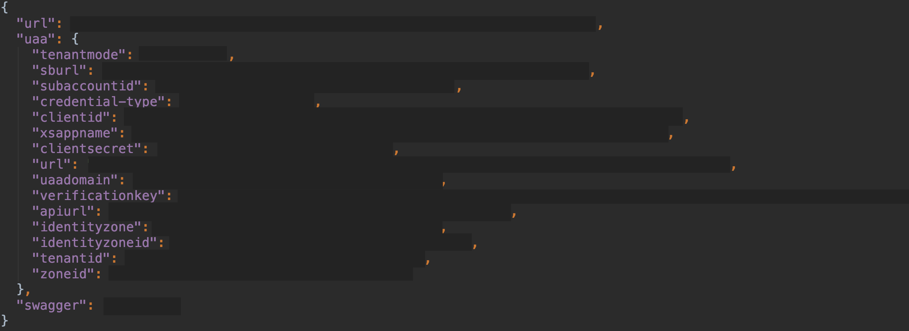
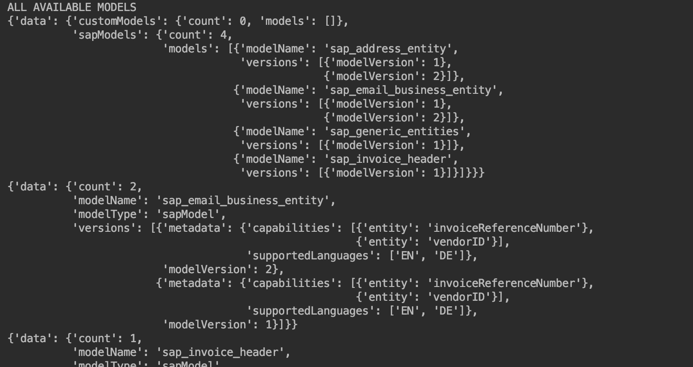
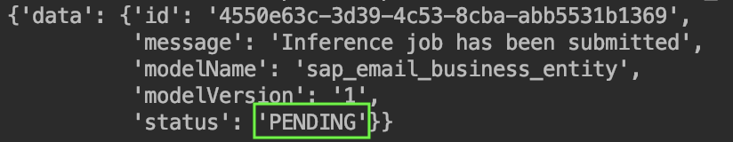
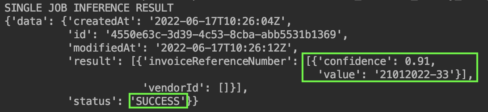
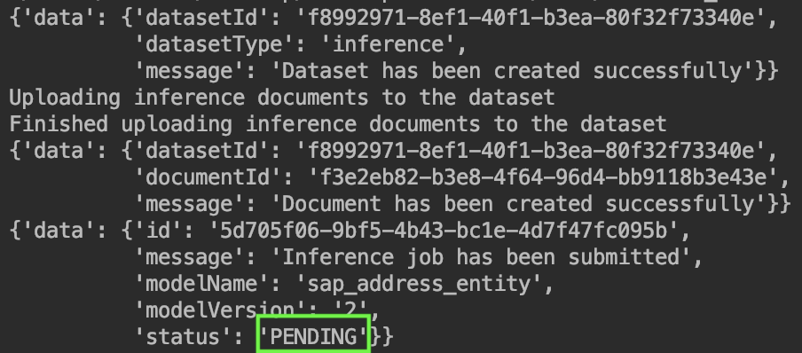
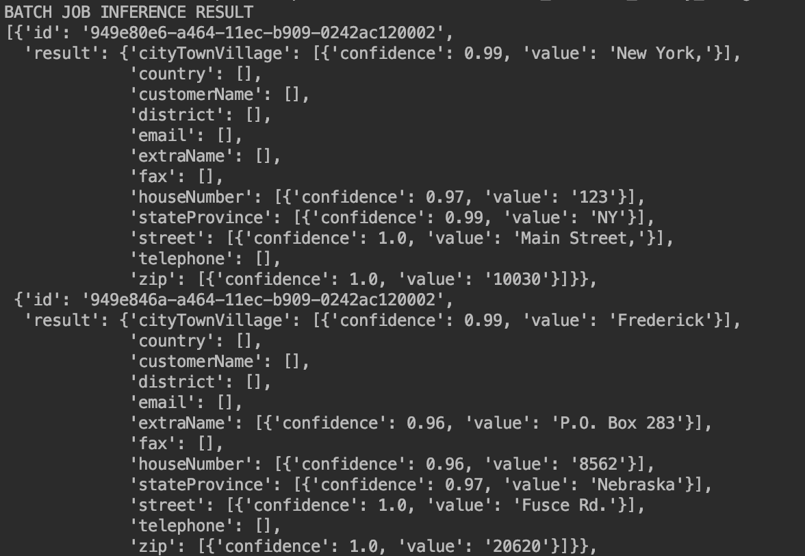
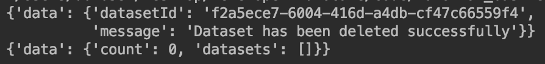

## Details
### You will learn
  - How to use your service instance of Business Entity Recognition for authentication
  - How to do a single inference using a pre-trained model
  - How to upload data and do a batch inference using a pre-trained model

The repository, initial setup documentation and example code of the Python SDK can be found [here](https://github.com/SAP/business-entity-recognition-client-library). The pre-trained models and the entities you can extract can be found [here](https://help.sap.com/docs/Business_Entity_Recognition/b43f8f61368d455793a241d2b10baeb2/7eb1408001564d679adcd3bc4796800f.html).

---

[ACCORDION-BEGIN [Step 1: ](Create service key)]

First, you need to make the service key of your service instance available to the Python SDK so that it can be used for authorization when communicating with your service instance. The service key will be saved in a file named `ber_service_key.json`.

[OPTION BEGIN [Windows]]

Enter `echo > ber_service_key.json` to create an empty JSON file.

[OPTION END]

[OPTION BEGIN [Mac and Linux]]

Enter `touch ber_service_key.json` to create an empty JSON file.

[OPTION END]

Go ahead and open the newly created file in a simple text editor. Then, paste the complete service key that you created in [Use Free Tier to Set Up Account for Business Entity Recognition and Get Service Key](cp-aibus-ber-booster-free-key) into the file and save it.



Now you are all set to start using the service.

[DONE]
[ACCORDION-END]


[ACCORDION-BEGIN [Step 2: ](List all pre-trained models)]

Open your preferred Python IDE in the same directory as you created the service key in and make sure your virtual environment from [Set Up the Python SDK for Business Entity Recommendation](cp-aibus-ber-python-sdk-setup) is activated. Create a new Python file and call it `list_models.py`.

Copy the below code into the file and save it:
```Python
from sap_ber_client import ber_api_client
from pprint import pprint
import json

# Read service key from file
with open('ber_service_key.json', 'r') as sk_file:
    sk_data = sk_file.read()

# Load from file
config_json = json.loads(sk_data)

# Assign authentication info
url = config_json['url']
uaa_clientid = config_json['uaa']['clientid']
uaa_clientsecret = config_json['uaa']['clientsecret']
uaa_url = config_json['uaa']['url']

my_ber_client = ber_api_client.BER_API_Client(url, uaa_clientid, uaa_clientsecret, uaa_url)

# List all available models trained and pretrained
response = my_ber_client.get_trained_models()
print("ALL AVAILABLE MODELS")
pprint(response.json())

# Get model details
model_name = "sap_email_business_entity"
pprint(my_ber_client.get_trained_model_versions(model_name).json())

model_name = "sap_invoice_header"
pprint(my_ber_client.get_trained_model_versions(model_name).json())

model_name = "sap_address_entity"
pprint(my_ber_client.get_trained_model_versions(model_name).json())

model_name = "sap_generic_entities"
pprint(my_ber_client.get_trained_model_versions(model_name).json())
```

The above code first opens the file containing your service key and reads its values. It then creates an instance of the `BER_API_Client` using your service key.

Afterwards it lists all models that exist in your subaccount. If you have not used this service before and have not done any retraining, only the four pre-trained models `sap_address_entity`, `sap_email_business_entity`, `sap_generic_entities` and `sap_invoice_header` should be listed.

Finally, each model is listed with it's version, supported languages, and capabilities (i.e. entities to be extracted).

Now enter `python list_models.py` in your command line to run the file. The beginning of your output will look like this (but for all pre-trained models):



[DONE]
[ACCORDION-END]

[ACCORDION-BEGIN [Step 3: ](Post inference job)]

Create a new Python file `post_inference.py` to post your first inference.

Copy the below code into the file and save it:
```Python
from sap_ber_client import ber_api_client
from pprint import pprint
import json

# Read service key from file
with open('ber_service_key.json', 'r') as sk_file:
    sk_data = sk_file.read()

# Load from file
config_json = json.loads(sk_data)

# Assign authentication info
url = config_json['url']
uaa_clientid = config_json['uaa']['clientid']
uaa_clientsecret = config_json['uaa']['clientsecret']
uaa_url = config_json['uaa']['url']

my_ber_client = ber_api_client.BER_API_Client(url, uaa_clientid, uaa_clientsecret, uaa_url)

# Post single inference job using the sap_email_business_entity model

# Define pretrained model to use
model_name = "sap_email_business_entity"
model_version = 1

text = 'Dear Stephanie, ' \
       'I hope you are well.' \
       'Please see attached the invoice 21012022-33. The invoice is due by the 29th of March 2022.' \
       'Please do not hesitate to get in touch if you have any questions or need clarifications.' \
       'Best regards,' \
       'Melanie'
response = my_ber_client.post_inference_job(text, model_name, model_version)
pprint(response.json())

# Write response of submitted inference job to file
with open('inference_response.json', 'w') as f:
    json.dump(response.json(), f)
```

As in the previous code snippet, the above code first opens the file containing your service key and reads its values. Then, it creates an instance of the `BER_API_Client` using your service key.

Afterwards, it posts an inference job to the business entity recognition service specifying the `sap_email_business_entity` model and version 1 of that model.
If you want to use a different pre-trained model or one of your own models simply change the variables `model_name` and `model_version` to your preferred values.

Finally it saves the response of your inference job to the `inference_response.json`.

Now enter `python post_inference.py` in your command line to run the file. Your output should show a JSON file with an ID and the status should be "PENDING":



You posted your first inference successfully!

[DONE]
[ACCORDION-END]

[ACCORDION-BEGIN [Step 4: ](Access the inference response)]

Now, you need to access the inference result by specifying the id of your inference job from the previous step.

Create a new Python file and call it `get_inference.py`.

Copy the below code into the file and save it:
```Python
from sap_ber_client import ber_api_client
from pprint import pprint
import json

# Read service key from file
with open('ber_service_key.json', 'r') as sk_file:
    sk_data = sk_file.read()

# Load from file
config_json = json.loads(sk_data)

# Assign authentication info
url = config_json['url']
uaa_clientid = config_json['uaa']['clientid']
uaa_clientsecret = config_json['uaa']['clientsecret']
uaa_url = config_json['uaa']['url']

my_ber_client = ber_api_client.BER_API_Client(url, uaa_clientid, uaa_clientsecret, uaa_url)

# Get response of single inference job

# Read file with inference job id
with open('inference_response.json', 'r') as inference_response_file:
    inference_response = json.loads(inference_response_file.read())

inference_job_id = inference_response["data"]["id"]
# Get single inference result
response = my_ber_client.get_inference_job(inference_job_id)
print("SINGLE JOB INFERENCE RESULT")
pprint(response.json())
```

The above code first reads your service key and then creates a new instance of the `BER_API_Client`. Next, the code reads the job id from your inference job response that you saved in a JSON file in the previous step. It then accesses the response of your inference job using your job id.

Now enter `python get_inference.py` in your command line to run the file. If you receive an error, the inference might not be finished yet, just wait for 15 seconds and try again. The output should show the result as well as the status "SUCCESS":



In this case, with a confidence of over 90% the correct value was extracted from our example email. Now you have successfully run your first inference using a pre-trained model of the Business Entity Recognition Service.

[DONE]
[ACCORDION-END]


[ACCORDION-BEGIN [Step 5: ](Post a batch inference job)]

Posting a batch inference is almost the same as a single inference job. The only difference is that you need to first upload your dataset.

Create a new JSON file and call it `data_batch_inference.json`.

Copy the below data into the file and save it:
```JSON
[{"id":"949e80e6-a464-11ec-b909-0242ac120002","text":"123 Main Street, New York, NY 10030"},
  {"id":"949e846a-a464-11ec-b909-0242ac120002","text":"Iris Watson P.O. Box 283 8562 Fusce Rd. Frederick Nebraska 20620"},
  {"id":"949e8636-a464-11ec-b909-0242ac120002","text":"Bücherei Hamburg, Hühnerposten 1 (Eingang: Arno-Schmidt-Platz) 20097 Hamburg"},
  {"id":"949e87e4-a464-11ec-b909-0242ac120002","text":"Bilkent Univerity, Üniversiteler, 06800 Çankaya/Ankara, Turkey"},
  {"id":"949e8cda-a464-11ec-b909-0242ac120002","text":"University of Milan, Via Festa del Perdono, 7, 20122 Milano MI, Italy"},
  {"id":"949e92ca-a464-11ec-b909-0242ac120002","text":"Lee Preston 981 Eget Rd. Clemson GA 04645 (221) 156-5026"},
  {"id":"949e9478-a464-11ec-b909-0242ac120002","text":"Eleanor Jennings 9631 Semper Ave Astoria NJ 66309 (906) 217-1470"},
  {"id":"949e9608-a464-11ec-b909-0242ac120002","text":"Bücherhalle Hamburg, Sülldorfer Kirchenweg 1b\n22587 Hamburg"},
  {"id":"949e9798-a464-11ec-b909-0242ac120002","text":"Remedios Hester 487-5787 Mollis St. City of Industry Louisiana 67973 (614) 514-1269"},
  {"id":"949e9928-a464-11ec-b909-0242ac120002","text":"Jasper Carney 1195 Lobortis Rd. New Orleans New Hampshire 71983 (763) 409-5446"}]
```

Now, create a new Python file and call it `post_batch_inference.py`.

Copy the below code into the file and save it:
```Python
from sap_ber_client import ber_api_client
from pprint import pprint
import json

# Read service key from file
with open('ber_service_key.json', 'r') as sk_file:
    sk_data = sk_file.read()

# Load from file
config_json = json.loads(sk_data)

# Assign authentication info
url = config_json['url']
uaa_clientid = config_json['uaa']['clientid']
uaa_clientsecret = config_json['uaa']['clientsecret']
uaa_url = config_json['uaa']['url']

my_ber_client = ber_api_client.BER_API_Client(url, uaa_clientid, uaa_clientsecret, uaa_url)

# Post a batch inference job using the sap_address_entity model

# Define pretrained model to use
model_name = "sap_address_entity"
model_version = 2

# Create and upload inference dataset
response = my_ber_client.create_dataset("inference")
pprint(response.json())
inference_dataset_id = response.json()["data"]["datasetId"]
print(inference_dataset_id)
# Write dataset id to file
with open('dataset_id.txt', 'w') as f:
    f.write(inference_dataset_id)

inference_dataset_folder = 'data_batch_inference.json'
print("Uploading inference documents to the dataset")
response = my_ber_client.upload_document_to_dataset(inference_dataset_id, inference_dataset_folder)
print("Finished uploading inference documents to the dataset")
pprint(response.json())

# Post batch inference job
response = my_ber_client.post_batch_inference_job(inference_dataset_id, model_name, model_version)
pprint(response.json())

# Write response of submitted batch inference job to file
with open('batch_inference_response.json', 'w') as f:
    json.dump(response.json(), f)
```

The above code first reads your service key and then creates a new instance of the `BER_API_Client`. Next, your JSON file `data_batch_inference.json` containing your data will be uploaded. After that, the batch inference job is posted by handing over the dataset id, model name and model version.

Now enter `python post_batch_inference.py` in your command line to run the file. The output should give you an id and the status of the inference job should be "PENDING":



You posted your first batch inference successfully!

[DONE]
[ACCORDION-END]


[ACCORDION-BEGIN [Step 6: ](Access batch inference result)]

Now, you need to access the batch inference result by specifying the id of your batch inference job from the previous step.

Create a new Python file and call it `get_batch_inference.py`.

Copy the below code into the file and save it:
```Python
from sap_ber_client import ber_api_client
from pprint import pprint
import json

# Read service key from file
with open('ber_service_key.json', 'r') as sk_file:
    sk_data = sk_file.read()

# Load from file
config_json = json.loads(sk_data)

# Assign authentication info
url = config_json['url']
uaa_clientid = config_json['uaa']['clientid']
uaa_clientsecret = config_json['uaa']['clientsecret']
uaa_url = config_json['uaa']['url']

my_ber_client = ber_api_client.BER_API_Client(url, uaa_clientid, uaa_clientsecret, uaa_url)

# Get response of batch  inference job

# Read file with batch inference job id
with open('batch_inference_response.json', 'r') as batch_inference_response_file:
    batch_inference_response = json.loads(batch_inference_response_file.read())

batch_inference_job_id = batch_inference_response["data"]["id"]
# Get batch inference result
response = my_ber_client.get_batch_inference_job_result(batch_inference_job_id)
print("BATCH JOB INFERENCE RESULT")
pprint(response.json())
```

The above code first reads your service key and then creates a new instance of the `BER_API_Client`. Next, the code reads the job id from your batch inference job that you saved in a JSON file in the previous step. It then accesses the response of your batch inference job using your job id.

Now enter `python get_batch_inference.py` in your command line to run the file. If you receive an error, the inference might not be finished yet, depending on the size of your dataset you might have to wait a minute and try again. The output should show the results like this, but for all data points:



Now you have successfully run your first batch inference using a pre-trained model of the Business Entity Recognition Service.

[DONE]
[ACCORDION-END]

[ACCORDION-BEGIN [Step 7: ](Delete dataset)]

Now, you need to delete the dataset that you used during the batch inference job.

Create a new Python file and call it `delete_datasets.py`.

Copy the below code into the file and save it:
```Python
from sap_ber_client import ber_api_client
from pprint import pprint
import json
# Read service key from file
with open('ber_service_key.json', 'r') as sk_file:
    sk_data = sk_file.read()

# Load from file
config_json = json.loads(sk_data)

# Assign authentication info
url = config_json['url']
uaa_clientid = config_json['uaa']['clientid']
uaa_clientsecret = config_json['uaa']['clientsecret']
uaa_url = config_json['uaa']['url']

my_ber_client = ber_api_client.BER_API_Client(url, uaa_clientid, uaa_clientsecret, uaa_url)

# Read file with dataset id and delete file
with open('dataset_id.txt', 'r') as dataset_id_file:
    dataset_id = dataset_id_file.read()
response = my_ber_client.delete_dataset(dataset_id)
pprint(response.json())

# List all datasets
response = my_ber_client.get_datasets()
pprint(response.json())
```

The above code first reads your service key and then creates a new instance of the `BER_API_Client`. Next, the code reads the dataset id from the text file that you saved it in (Step 5). It then deletes the dataset and prints out the response as well as your datasets (hopefully none at this point).

Now enter `python delete_datasets.py` in your command line to run the file. The output should look like this:



Now you have successfully deleted your dataset.

[DONE]
[ACCORDION-END]

[ACCORDION-BEGIN [Step 8: ](Test yourself)]

[VALIDATE_1]
[ACCORDION-END]

---
