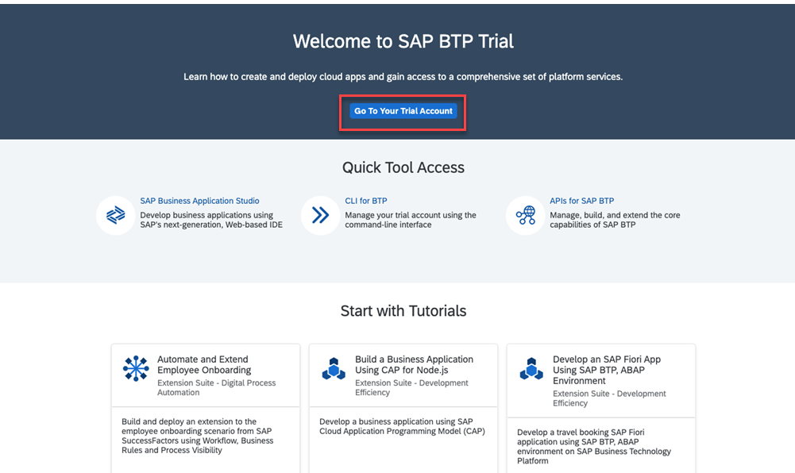
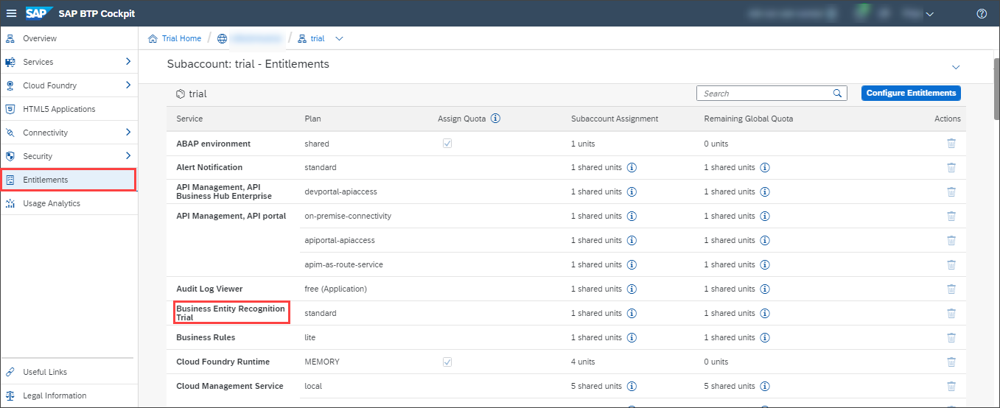
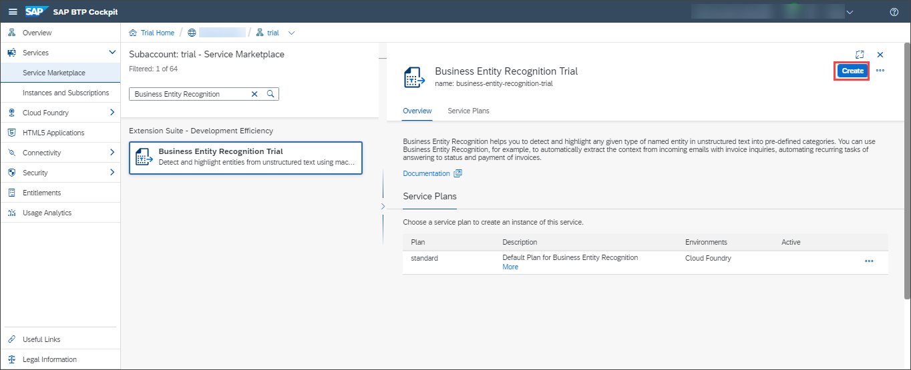
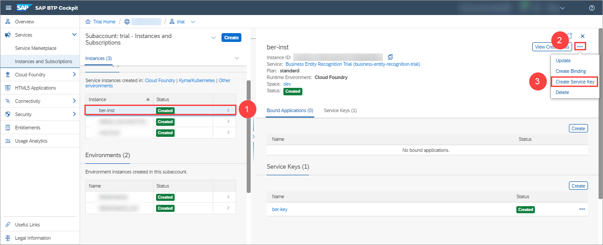
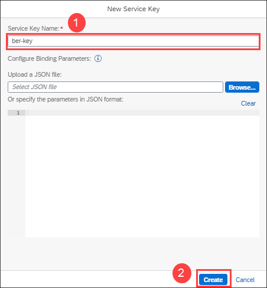

## Prerequisites
- You have created a trial account on SAP Cloud Platform: [Get a Free Trial Account on SAP Cloud Platform](hcp-create-trial-account)
- You have a subaccount and dev space with **Europe (Frankfurt)** as region: [Manage Entitlements on SAP Cloud Platform Trial](cp-trial-entitlements). See also [Create a Subaccount](https://help.sap.com/viewer/65de2977205c403bbc107264b8eccf4b/Cloud/en-US/261ba9ca868f469baf64c22257324a75.html).

## Details
### You will learn
  - How to check your Business Entity Recognition entitlements
  - How to create a service instance of Business Entity Recognition
  - How to create service keys for your service instance
---

[ACCORDION-BEGIN [Step 1: ](Enter your trial account)]

1. In your web browser, open the [SAP Cloud Platform trial cockpit](https://cockpit.hanatrial.ondemand.com/).

2. Navigate to the trial global account by clicking **Enter Your Trial Account**.

    

    >If this is your first time accessing your trial account, you'll have to configure your account by choosing a region. **Please select Europe (Frankfurt)**. Your user profile will be set up for you automatically.

    >Wait till your account is set up and ready to go. Your global account, your subaccount, your organization, and your space are launched. This may take a couple of minutes.

    >Choose **Continue**.

    >!

3. From your global account page, choose the `trial` tile to access your subaccount.

    

[DONE]
[ACCORDION-END]

[ACCORDION-BEGIN [Step 2: ](Check entitlements)]

To try out Business Entity Recognition, you need to make sure that your subaccount is properly configured.

1. On the navigation side bar, click **Entitlements** to see a list of all eligible services. You are entitled to use every service in this list according to the assigned service plan.

2. Search for **Business Entity Recognition Trial**. If you find the service in the list, you are entitled to use it. Now you can set this step to **Done** and go to step 3.

    

If you do not find the service in your list, proceed as follows:

  1. Click **Configure Entitlements**.

    

  2. Click **Add Service Plans**.

    

  3. Select **Business Entity Recognition Trial**, and choose the **standard** service plan. Click **Add 1 Service Plan**.

    

  4. **Save** your **Entitlements** changes.

        

You are now entitled to use Business Entity Recognition and create instances of the service.

>For more details on how to configure entitlements, quotas, subaccounts and service plans on SAP Cloud Platform Trial, see [Manage Entitlements on SAP Cloud Platform Trial](cp-trial-entitlements).

[DONE]
[ACCORDION-END]

[ACCORDION-BEGIN [Step 3: ](Access space)]

You will find all applications and services in spaces. By default, trial accounts only have the **dev** space available.

Click **Spaces** on the navigation side bar and select the **dev** space to open it.

[DONE]
[ACCORDION-END]

[ACCORDION-BEGIN [Step 4: ](Access service via Service Marketplace)]

The **Service Marketplace** is where you find all the services available on SAP Cloud Platform.

1. To access it, click **Service Marketplace** on the navigation side bar.

    

2. Next, search for **Business Entity Recognition** and click the tile to access the service.

    

[DONE]
[ACCORDION-END]

[ACCORDION-BEGIN [Step 5: ](Create service instance)]

You will now create an instance of your service.

Click **Create Instance** to start the creation dialog.

In the dialog, leave the default value for the service and the service plan. Enter a name for your new instance as `ber-inst` and click **Create Instance** to skip the other steps and create the instance.

In the following dialog, click on **View Instance** to be navigated to the list of your service instances.

You have successfully created a service instance for Business Entity Recognition.

[DONE]
[ACCORDION-END]

[ACCORDION-BEGIN [Step 6: ](Create service keys)]

You are now able to create service keys for your new service instance. Service keys are used to generate credentials to enable apps to access and communicate with the service instance.

  1. Click the navigation arrow to open the details of your service instance. Then, click the dots to open the menu and select **Create Service Key**.

      

  2. In the dialog, enter `ber-key` as the name of your service key. Click **Create** to create the service key.

      

You have successfully created service keys for your service instance. You can now either view the service key in the browser or download it.

You will need the service keys values to create your `access_token` in the next tutorial: [Get OAuth Access Token for Business Entity Recognition Using Any Web Browser](cp-aibus-ber-web-oauth-token).

[VALIDATE_1]
[ACCORDION-END]
