## Details
### You will learn
  - How to call and test Business Entity Recognition
  - How to access and use the Business Entity Recognition Swagger UI (User Interface)
  - How to train a custom machine learning model to extract entities from unstructured text

The core functionality of Business Entity Recognition is to automatically detect and highlight any given type of named entity in unstructured text and classify it in accordance with predefined categories. In this tutorial, you will learn how to use the service APIs to train your own machine learning model to get named entity predictions for the texts you submit to the service.

---

[ACCORDION-BEGIN [Step 1: ](Create dataset)]

After performing step 1 of the tutorial [Detect and Highlight Entities from Unstructured Text with Pre-trained Models](cp-aibus-ber-swagger-ui) to access and authorize the Business Entity Recognition Swagger UI, use the **POST /datasets** endpoint to create a dataset that will be used to train a custom model to extract entities from the text.

1. Click the endpoint name to expand it. 

2. Click **Try it out**.

    !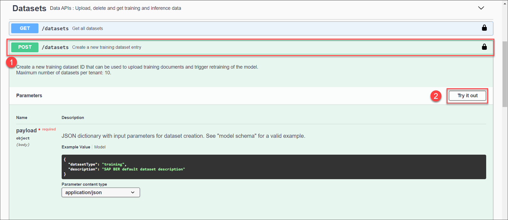

3. In **payload**, enter a `description` for your dataset, `"Tutorial dataset"`, for example.

4. Click **Execute**.

    !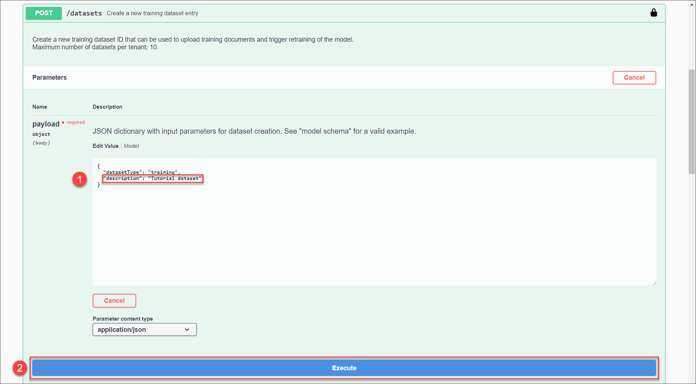

5. Copy the **`datasetId`** from the **Response body**.

    !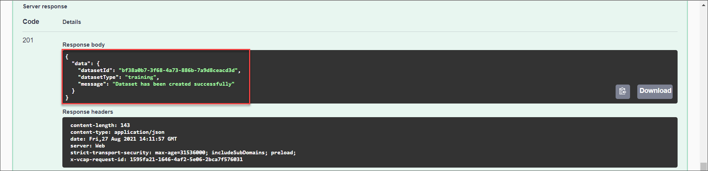

[DONE]
[ACCORDION-END]


[ACCORDION-BEGIN [Step 2: ](See dataset details)]

To see the details of your newly created dataset, use the **GET /datasets/{`datasetId`}** endpoint.

1. Click the endpoint name to expand it.

2. Click **Try it out**.

3. Enter the **`datasetId`** obtained in the previous step and click **Execute**.

    !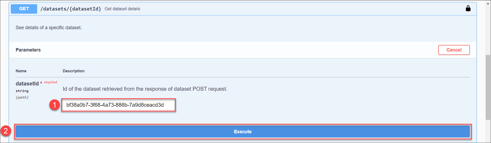

You receive a response like below. Among the `datasetId` and the `description`, you see the number of documents. Those documents include your training data and you upload some in the following step.

!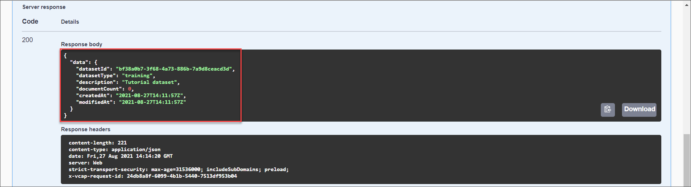

[DONE]
[ACCORDION-END]


[ACCORDION-BEGIN [Step 3: ](Upload training document)]

To upload training documents to your dataset, use the **POST /datasets/{`datasetId`}/documents**. You may repeat this step to upload multiple documents.

Please bear in mind that Business Entity Recognition requires your data to be in a specific format to train a model. See data format prerequisites in [Training Data Format](https://help.sap.com/viewer/b43f8f61368d455793a241d2b10baeb2/SHIP/en-US/a1df156894ed4df7810d0a5abcce8d92.html).

>As an alternative to uploading your own JSON file to the service, you can use the following sample files (right click on the link, then click ***Save link as*** to download the files locally):

>- [Sample Training Data 1](https://raw.githubusercontent.com/SAPDocuments/Tutorials/master/tutorials/cp-aibus-ber-swagger-ui-custom/data/Tutorial_training_data_1.json)

>- [Sample Training Data 2](https://raw.githubusercontent.com/SAPDocuments/Tutorials/master/tutorials/cp-aibus-ber-swagger-ui-custom/data/Tutorial_training_data_2.json)

>Please repeat this step twice and upload one document each time. The more data is available the better predictions the model can give you.


To upload documents, do the following:

1. Click the **POST /datasets/{`datasetId`}/documents** endpoint name to expand it.

2. Click **Try it out**.

3. Enter the **`datasetId`** obtained in step 1 and select one training document for the upload.

4. Click **Execute**.

    !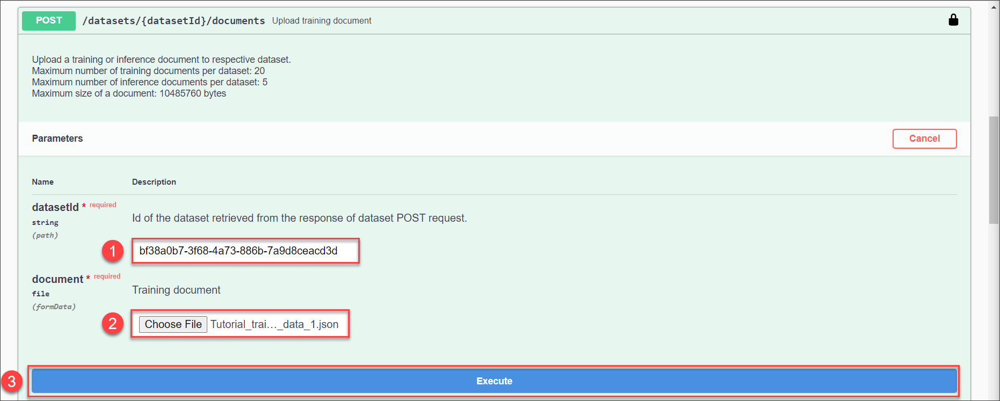

5. Copy the **`documentId`** from the **Response body**.

    !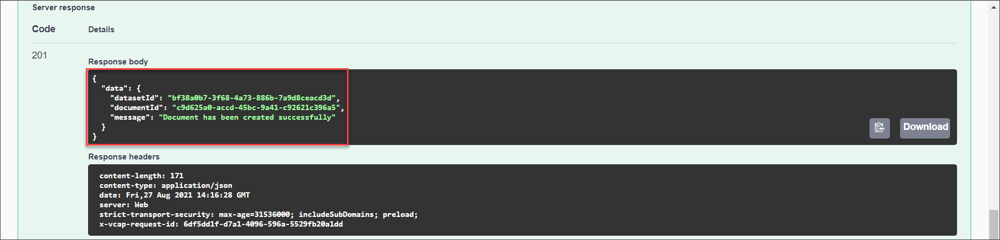

[DONE]
[ACCORDION-END]


[ACCORDION-BEGIN [Step 4: ](See document details)]

Using the `datasetId` obtained in the previous step, you can obtain the details of your training documents using the **GET /datasets/{`datasetId`}/documents/{`documentId`}** endpoint.

1. Click the endpoint name to expand it.

2. Click **Try it out**.

3. Enter the **`datasetId`** obtained in step 1.

4. Enter the **`documentId`** obtained in step 3.

5. Click **Execute**.

    !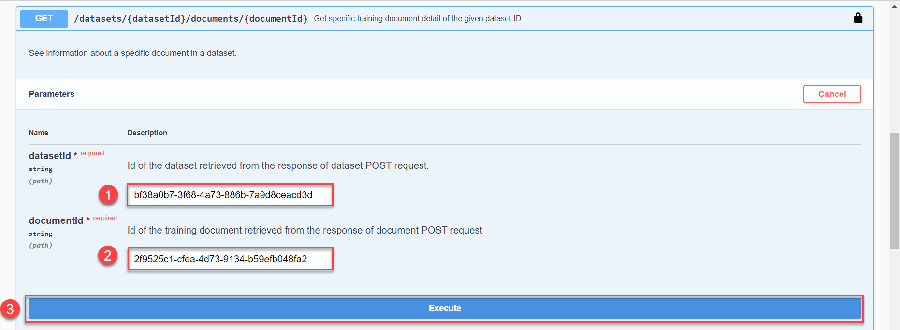

You should receive a response, with the document details, like below. This shows you the size of the document in bytes.

!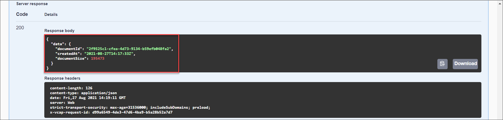

[DONE]
[ACCORDION-END]


[ACCORDION-BEGIN [Step 5: ](Submit training job)]

Once the training documents are uploaded, you can submit a training job. This triggers the training of a machine learning model based on your uploaded data. For that, use the **POST /training/jobs** endpoint.

1. Click the endpoint name to expand it.

2. Click **Try it out**.

3. In **payload**, enter a **`modelName`** for your custom model, `"Tutorial_custom_model"`, for example, and the **`datasetId`** obtained in step 2.

    >**CAUTION:**

    >Be aware of the following **`modelName`** guidelines:​

    >- You cannot use the same name as a Business Entity Recognition pre-trained model (`sap_email_business_entity` and `sap_invoice_header`)

    >- You cannot use `"sap_"` as a prefix

    >- Start with an alphanumeric character

    >- You can include the special characters `"-"` and `"_"`

    >- You can use a maximum of 64 characters

4. Click **Execute**.

    !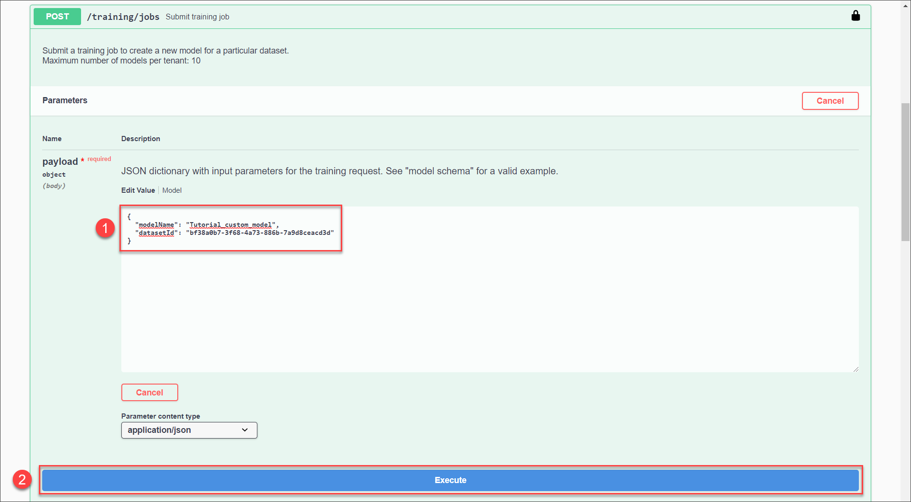

5. Copy the **`jobId`** from the **Response body**. This allows you to check the status of the training.

    !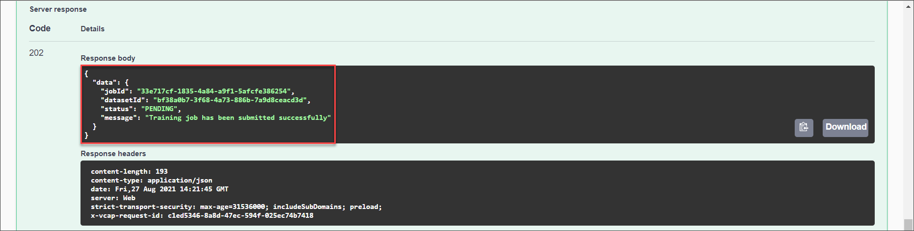

This indicates that your training job has been successfully submitted.

[VALIDATE_1]
[ACCORDION-END]


[ACCORDION-BEGIN [Step 6: ](Get training job status)]

To check whether your training already succeeded, you can use the **GET /training/jobs/{`jobId`}** endpoint to see the current status of the job.

1. Click the endpoint name to expand it.

2. Click **Try it out**.

3. Enter the **`jobId`** obtained in step 5.

4. Click **Execute**.

    !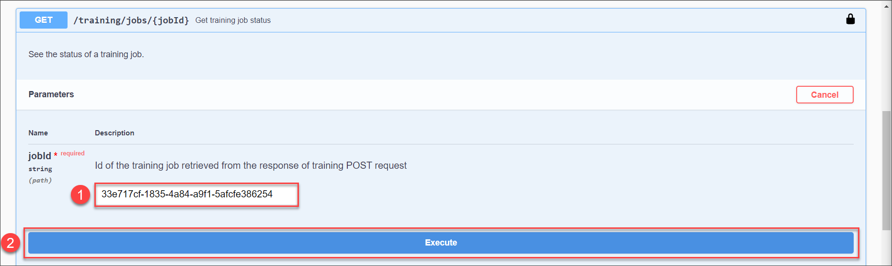

You should receive a response like below. The status `RUNNING` indicates that the training is still in progress. In case the status is `PENDING`, then the training has not started yet.

!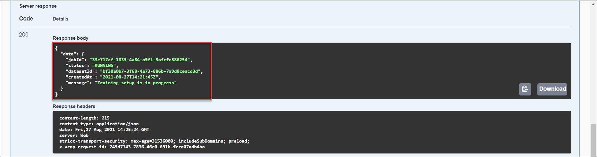

You may check the status now and then. Please note that the training may take up to 5 hours. Afterwards, the training succeeds and the status switches to `SUCCEEDED`. Along with that, you receive all the `capabilities` of the model, i.e. the things that the model can recognize.

!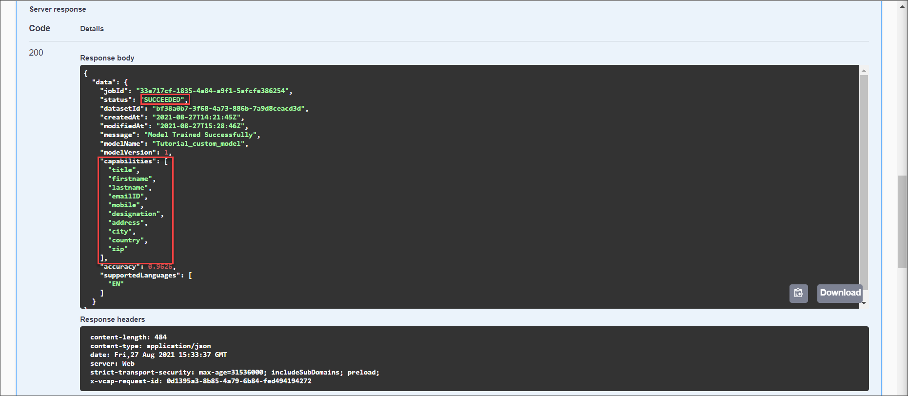

[DONE]
[ACCORDION-END]


[ACCORDION-BEGIN [Step 7: ](Delete training job)]

In some cases it makes sense to delete the training job. For example, in the Trial version of the service, only one training job is allowed. See [Trial Account Input Limits](https://help.sap.com/viewer/b43f8f61368d455793a241d2b10baeb2/SHIP/en-US/c80a45cc7416409eb9bf64667487c375.html). Use the endpoint **DELETE /training/jobs/{`jobId`}** to delete a training job.

1.  Click the endpoint name to expand it.

2.  Click **Try it out**.

3.  Enter the **`jobId`** obtained in step 6.

4.  Click **Execute**.

    

This triggers the deletion of the training job.

[DONE]
[ACCORDION-END]


[ACCORDION-BEGIN [Step 8: ](List models)]

To see all your models, you can use the **GET /models** endpoint to see the list of them.

1. Click the endpoint name to expand it.

2. Click **Try it out**.

3. Click **Execute**.

You should receive a response like the following:

!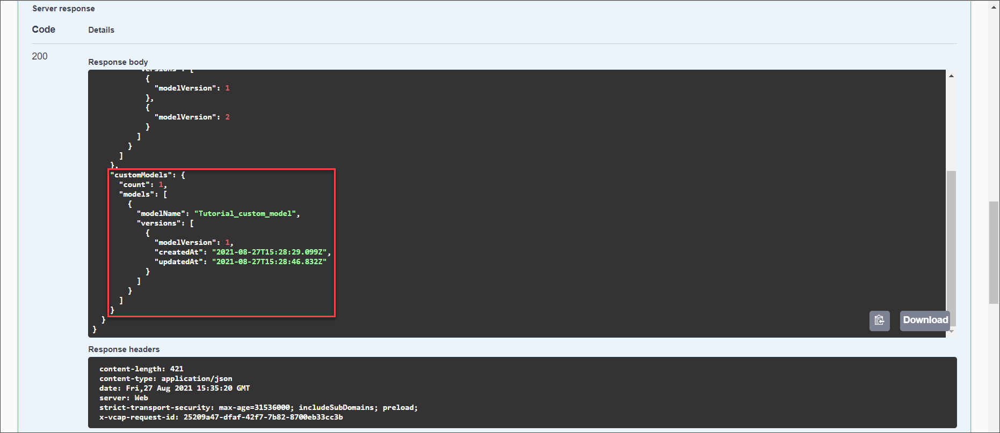

The response includes the Business Entity Recognition pre-trained machine learning models (`sap_email_business_entity` and `sap_invoice_header`), and the new custom model you have created, in this case, `Tutorial_custom_model`.


[DONE]
[ACCORDION-END]

[ACCORDION-BEGIN [Step 9: ](List model versions)]

Use the **GET /models/{`modelName`}/versions** endpoint to see the available versions and other details about a specific model.

1. Click the endpoint name to expand it.

2. Click **Try it out**.

3. Enter the **`modelName`** from step 5.

4. Click **Execute**.

    !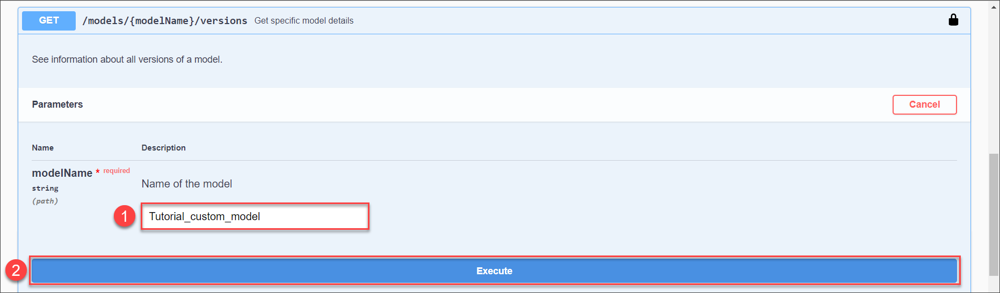

You should receive a response like the following:

!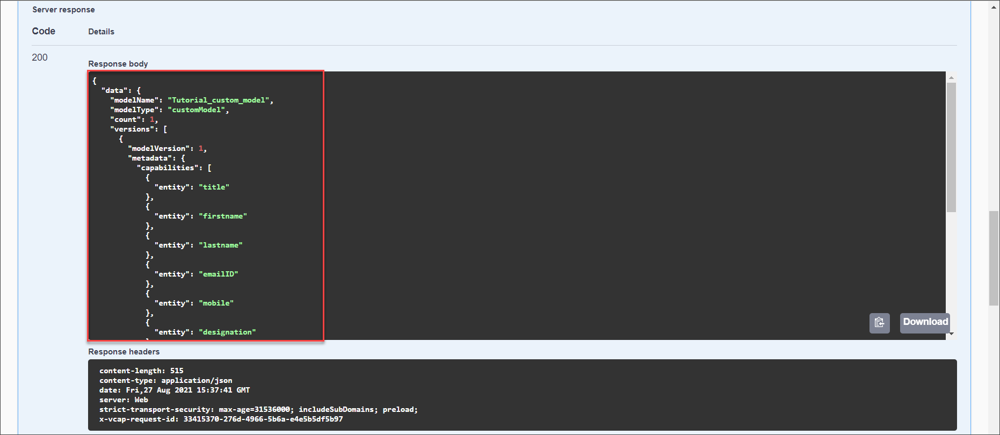

[DONE]
[ACCORDION-END]


[ACCORDION-BEGIN [Step 10: ](Deploy model)]

Finally, to make actual predictions, you have to deploy your model. You can do so by using the **POST /deployments** endpoint.

1. Click the endpoint name to expand it.

2. Click **Try it out**.

3. In **payload**, enter the **`modelName`** from step 5, and the **`modelVersion`**.

4. Click **Execute**.

    !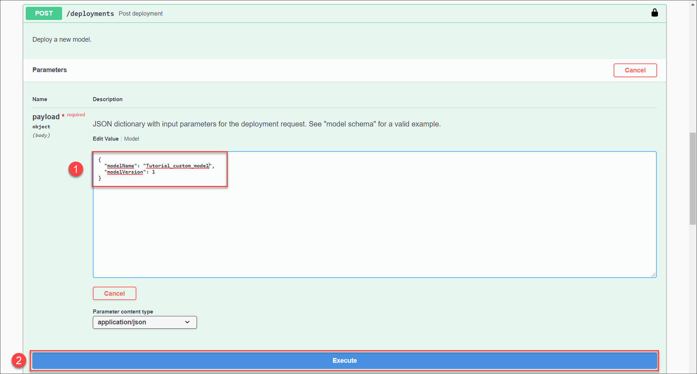

5. Copy the **`deploymentId`** from the **Response body** to check the status of the deployment in the next step.

    !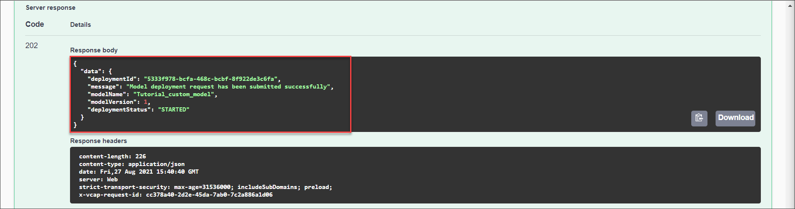

[DONE]
[ACCORDION-END]


[ACCORDION-BEGIN [Step 11: ](See deployment status)]

As with training jobs, you now have to check the status of the deployment every now and then. Use the **GET /deployments/{`deploymentId`}** endpoint to do so.

1. Click the endpoint name to expand it.

2. Click **Try it out**.

3. Enter the **`deploymentId`** obtained in step 9.

4. Click **Execute**.

    !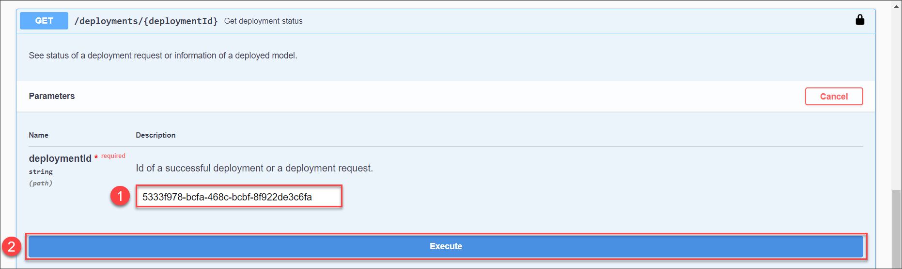

You should receive a response like below. Please note that compared to training jobs deployments do not have a status `SUCCEEDED`. The status `RUNNING` rather indicates that the deployment is live and the model can be used for predictions.

!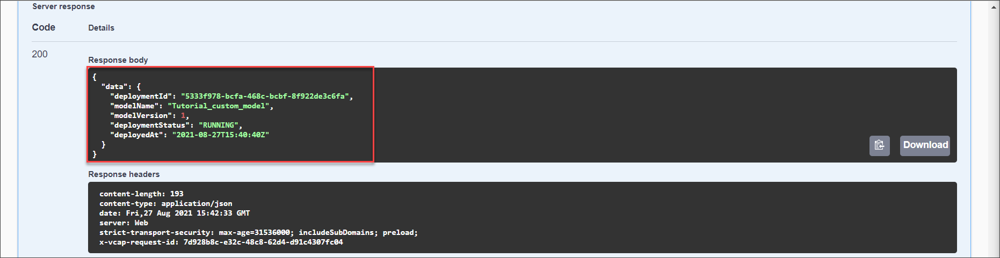

[DONE]
[ACCORDION-END]


[ACCORDION-BEGIN [Step 12: ](Enter inference text)]

To make a prediction, or in machine learning terms an inference, you use the **POST /inference/jobs** endpoint to submit a text from which your model should extract entities.

1. Click the endpoint name to expand it.

2. Click **Try it out**.

3. In **payload**, enter the `text` you want to extract named entities from, `modelName`, and `modelVersion`. You may use the following example:

    ```JSON
    {
       "text":"Von: lena nova <office@scomputercenter.bg> Gesendet: Montag, 21. Januar 2019, 19:13 Uhr An: canu, ana <ana.canu@company.com>; office@computercenter-bg.com Betreff: RE: M & B EOOD 2639710315 Sehr geehrter Kunde, ich sende Ihnen Informationen für unsere Zahlung. Proforma 198305906 ist ein Teil der Rechnung 4830476570 / 11.01.2019. Rechnungsdatum Betrag in EUR 4830473772 14.12.2018 9,28 € 4830474632 21.12.2018 29,16 € 4830475244 28.12.2018 46,19 € 4830475919 4.1.2019 9,28 € 198305906 10.1.2019 9,29 € 103,20 € 4830476570 11.1.2019 37,13 198305906 10.1.2019 -9,29 € 27,84 Einen schönen Tag noch! Mit freundlichen Grüßen, lena lena nova Verkaufsleiterin M & B EOOD-Computer Center 11, Angel Kanchev Str; 1000, Sofia, Bulgarien Tel.: + 359 2 981 58 57; Mobil: + 359 889 61 13 21 E-Mail: office@scomputercenter.bg Besuchen Sie uns unter: www.computercenter.bg",
       "modelName":"Tutorial_custom_model",
       "modelVersion":1
    }
    ```    

4. Click **Execute**.

    !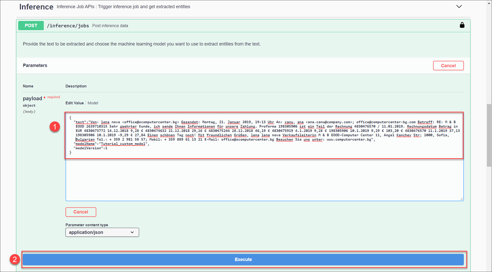

5. Copy the **`id`** from the **Response body** to see the result of the extraction in the next step. Please also note the remark regarding limits in Trial. You may refer to the limits [here](https://help.sap.com/viewer/b43f8f61368d455793a241d2b10baeb2/SHIP/en-US/c80a45cc7416409eb9bf64667487c375.html).

    !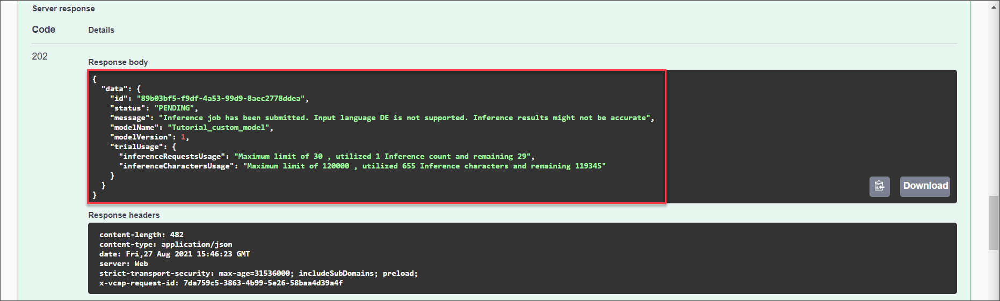

[DONE]
[ACCORDION-END]


[ACCORDION-BEGIN [Step 13: ](Get extraction results)]

Use the **GET /inference/jobs/{`jobId`}** endpoint to see the text extraction results and the confidence level of the `Tutorial_custom_model` custom model.

1. Click the endpoint name to expand it.

2. Click **Try it out**.

3. Enter the `jobId` obtained in the previous step and click **Execute**.

      !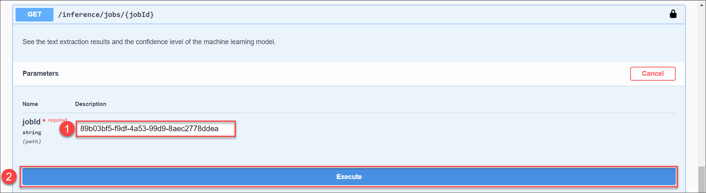

You should receive a response like the following:

!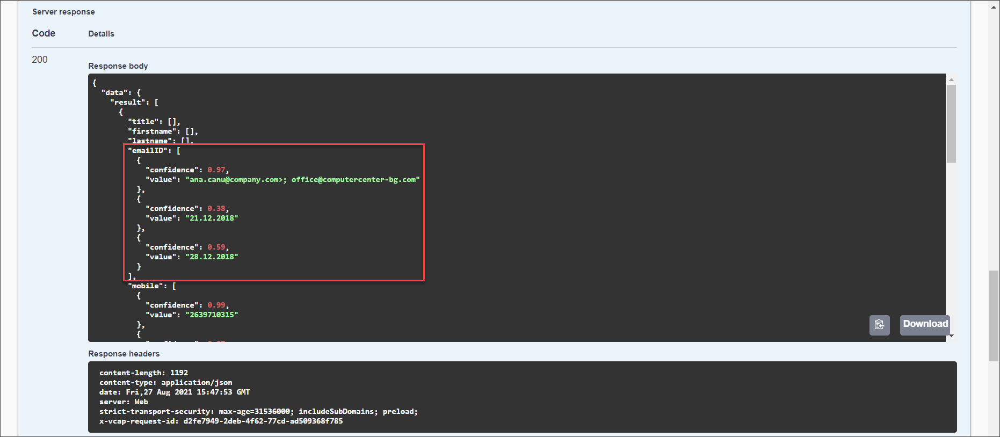

In the response, you will find the prediction for the extracted entities. The prediction is made with a probability indicated by the **confidence** field which represents how certain the model is about the value provided. A confidence of 1 means that the model is 100% sure about its prediction. The model tries to provide a value for all its capabilities. Thus, you may see a different result depending on your model's capabilities. In case the model cannot identify an entity in the text, it returns empty for it.

You have now successfully used your own custom model to get text entity predictions for the unstructured text you submitted to Business Entity Recognition.

[DONE]
[ACCORDION-END]
