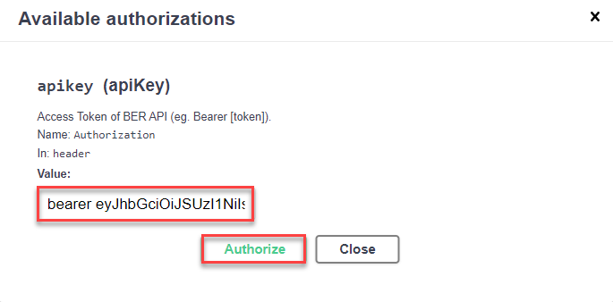

## Details
### You will learn
  - How to call and test Business Entity Recognition
  - How to access and use the Business Entity Recognition Swagger UI (User Interface)
  - How to use the Business Entity Recognition pre-trained models to extract entities from unstructured text

The core functionality of Business Entity Recognition is to automatically detect and highlight any given type of named entity in unstructured text and classify it in accordance with predefined categories. When you finish this tutorial, you will get named entity predictions for the texts you submit to the service.

Business Entity Recognition is a customizable machine learning service, but you can also use the following pre-trained machine learning models:

- `sap_email_business_entity`
- `sap_invoice_header`

See [Extracted Entities by Pre-trained Model](https://help.sap.com/viewer/b43f8f61368d455793a241d2b10baeb2/SHIP/en-US/7eb1408001564d679adcd3bc4796800f.html)

This tutorial gives you an introduction to the service using a trial account and the available pre-trained machine learning models. If you want to try out the Business Entity Recognition training endpoints to create your own model, go to the next tutorial [Detect and Highlight Entities from Unstructured Text with Custom Models](cp-aibus-ber-swagger-ui-custom).  

---

[ACCORDION-BEGIN [Step 1: ](Authorize Swagger UI)]

You will use Swagger UI, via any web browser, to call the Business Entity Recognition APIs. Swagger UI allows developers to effortlessly interact and try out every single operation an API exposes for easy consumption. For more information, see [Swagger UI](https://swagger.io/tools/swagger-ui/).  

In the service key you created for Business Entity Recognition in the previous tutorial: [Create Service Instance for Business Entity Recognition](cp-aibus-ber-service-instance), you should find (outside the `uaa` section of the service key) an entry called `url` (as highlighted in the image below).

1. To access the Business Entity Recognition Swagger UI, add **`/api/v1`** to the `url` value, paste it into any web browser and press **Enter**.

    !

2. To be able to use the Swagger UI endpoints, you need to authorize yourself. In the top right corner, click **Authorize**. 

    !

3. Get the `access_token` value created in the previous tutorial: [Get OAuth Access Token for Business Entity Recognition Using Any Web Browser](cp-aibus-ber-web-oauth-token), then add **bearer** in front of it, and enter in the **Value** field.

    ```
    bearer <access_token>
    ```

    !

4. Click **Authorize** and then click **Close**.

    !

[VALIDATE_1]
[ACCORDION-END]


[ACCORDION-BEGIN [Step 2: ](Post inference result with sap_email_business_entity)]

Use the **POST /inference/jobs** endpoint to submit the text to be extracted and choose the pre-trained machine learning model you want to use to extract entities from the text.

1. Click the endpoint name to expand it.

2. Click **Try it out**.

    !

3. In **payload**, enter the `text` you want to extract named entities from, `modelName`, and `modelVersion`. In this `sap_email_business_entity` pre-trained model example, you can use the following:

    ```JSON
    {
      "text":"11577210 - FAGOR EDERLAN MEXICO § Dear colleagues, there any way to identify which procurement division has transmitted 1339846 this payment to ABC Ltd. as there is no identification number. Are you able to help? Thank you: Doe, Jane <jane.doe@doe-company.com>: 15 May 2019 15:25 To: Doe, John <john.doe@doe-company.com>Cc: Smith, John <john.smith@doe-company.com>: /432216153 328,439.24 Thanks and best Jane. Doe, Jane. Accountant, Procurement Department, Doe Company, S. L. P.Phone+52 444 880 2300. 1114 Doe Company<doe-company.com>",
      "modelName":"sap_email_business_entity",
      "modelVersion":1
    }
    ```

4. Click **Execute**.

    !

5. Copy the **`id`** from the **Response body** to see the result of the extraction in the next step.

    !

[DONE]
[ACCORDION-END]


[ACCORDION-BEGIN [Step 3: ](Get inference result with sap_email_business_entity)]

Use the **GET /inference/jobs/{`jobId`}** endpoint to see the text extraction results and the confidence level of the `sap_email_business_entity` model.

1. Click the endpoint name to expand it.

2. Click **Try it out**.

    !

3. Enter the `jobId` obtained in the previous step and click **Execute**.

    !

You should receive a response like the following:

!

In the response, you will find the prediction for the extracted entities. The prediction is made with a probability indicated by the **confidence** field which represents how certain the model is about the value provided. A confidence of 1 means that the model is 100% sure about its prediction.

You have now successfully used the `sap_email_business_entity` model to get text entity predictions for the unstructured text you submitted to Business Entity Recognition.

You can also use the following **payload** example with the `sap_email_business_entity` model:

```JSON
{
   "text":"Von: lena nova <office@scomputercenter.bg> Gesendet: Montag, 21. Januar 2019, 19:13 Uhr An: canu, ana <ana.canu@company.com>; office@computercenter-bg.com Betreff: RE: M & B EOOD 2639710315 Sehr geehrter Kunde, ich sende Ihnen Informationen für unsere Zahlung. Proforma 198305906 ist ein Teil der Rechnung 4830476570 / 11.01.2019. Rechnungsdatum Betrag in EUR 4830473772 14.12.2018 9,28 € 4830474632 21.12.2018 29,16 € 4830475244 28.12.2018 46,19 € 4830475919 4.1.2019 9,28 € 198305906 10.1.2019 9,29 € 103,20 € 4830476570 11.1.2019 37,13 198305906 10.1.2019 -9,29 € 27,84 Einen schönen Tag noch! Mit freundlichen Grüßen, lena lena nova Verkaufsleiterin M & B EOOD-Computer Center 11, Angel Kanchev Str; 1000, Sofia, Bulgarien Tel.: + 359 2 981 58 57; Mobil: + 359 889 61 13 21 E-Mail: office@scomputercenter.bg Besuchen Sie uns unter: www.computercenter.bg",
   "modelName":"sap_email_business_entity",
   "modelVersion":1
}
```

To try out the `sap_email_business_entity` model with your own unstructured text, keep in mind the model scope and supported languages, as detailed in [Extracted Entities by Pre-trained Model](https://help.sap.com/viewer/b43f8f61368d455793a241d2b10baeb2/SHIP/en-US/7eb1408001564d679adcd3bc4796800f.html).

[DONE]
[ACCORDION-END]


[ACCORDION-BEGIN [Step 4: ](Post inference result with sap_invoice_header)]

Use the **POST /inference/jobs** endpoint to submit the text to be extracted and choose the pre-trained machine learning model you want to use to extract entities from the text.

1. Click the endpoint name to expand it.

2. Click **Try it out**.

    !

3. In **payload**, enter the `text` you want to extract named entities from, `modelName`, and `modelVersion`. In this `sap_invoice_header` pre-trained model example, you can use the following:

    ```JSON
    {
       "text":"-----Original Message----- From: Duma Trunchi, Regina <DumaTrunchi@company.com>  Sent: Thursday, December 20, 2018 4:33 PM To: Dubey, Ashish <Ashish.Dubey@company.com> Cc: Grc, Sony <grcsony@eu.company.com> Subject: CLEARING//226.530,63eur//phoxdistri  Hi Ashish,  Please do the clearing as per the attachment.  Thank you,  Duma-Trunchi Regina  Accounts Receivable Finance company Pvt Ltd F&A services operated by AKAI Pvt Ltd Registered office:  The Heights, 116  Glenurquhart Road, BALLAUGH, Surrey. KT27 0XW. UK Registered Company Number: 2522874",
       "modelName":"sap_invoice_header",
       "modelVersion":1
    }
    ```

4. Click **Execute**.

    !

5. Copy the **`id`** from the **Response body** to see the result of the extraction in the next step.

    !

[DONE]
[ACCORDION-END]


[ACCORDION-BEGIN [Step 5: ](Get inference result with sap_invoice_header)]

Use the **GET /inference/jobs/{`jobId`}** endpoint to see the text extraction results and the confidence level of the `sap_invoice_header` model.

1. Click the endpoint name to expand it.

2. Click **Try it out**.

    !

3. Enter the `jobId` obtained in the previous step and click **Execute**.

    !

You should receive a response like the following:

!

You have now successfully used the `sap_invoice_header` model to get text entity predictions for the unstructured text you submitted to Business Entity Recognition.

You can also use the following **payload** example with the `sap_invoice_header` model:

```JSON
{
   "text":"Order number 12345678 Order type Sales Force Order abcdef Date 01/01/2001 Customer number 9876543 Customer service 123/ 456 6789 E-mail eshop@gmail.com  Your Reference: Order receipt confirmation Customer address 508 W. St Margarets St. Brooklyn, NY 11228 Billing address 508 W. St Margarets St. Brooklyn, NY 11228 Ordered by Fenton Moon Shipping type: UPS 2nd Day Air PM Terms of payment: 30 Days Net due  Your message: Item Material   Description Qty.        Price per Unit Net  steel        gray / Length 12 mm / 1 35.00         35.00  Gross Amount USD 35.00 Freight/ packaging USD 15.00 Tax 2 % USD 1 Tax 4 % USD 2 Total amount USD 53",
   "modelName":"sap_invoice_header",
   "modelVersion":1
}
```

To try out the `sap_invoice_header` model with your own unstructured text, keep in mind the model scope and supported languages, as detailed in [Extracted Entities by Pre-trained Model](https://help.sap.com/viewer/b43f8f61368d455793a241d2b10baeb2/SHIP/en-US/7eb1408001564d679adcd3bc4796800f.html).

Congratulations, you have completed this tutorial.

[DONE]
[ACCORDION-END]
