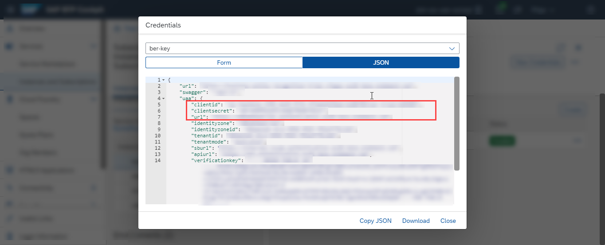
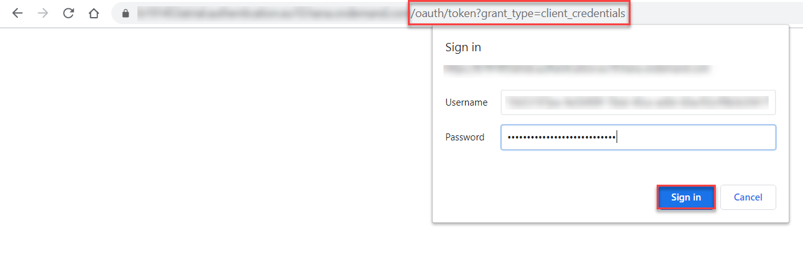

## Details
### You will learn
  - How to use your service key values to get an OAuth access token via any web browser

---

[ACCORDION-BEGIN [Step 1: ](Get OAuth access token details)]

To get your OAuth access token you will need the values listed below from the service key you created in the previous tutorial: [Create Service Instance for Business Entity Recognition](cp-aibus-ber-service-instance).

!

[VALIDATE_1]
[ACCORDION-END]


[ACCORDION-BEGIN [Step 2: ](Get OAuth access token)]

1. Add **`/oauth/token?grant_type=client_credentials`** to the `url` value (from inside the `uaa` section of the service key), paste it in any web browser and choose **Enter**.

2. Enter the **`clientid`** value from your service key as **Username**.

3. Enter the **`clientsecret`** value from your service key as **Password**.

4. Click **Sign in** or **OK** (depending on the web browser you work with).

!

You should receive a response like the following:

```JSON
{
    "access_token": "<< your access token >>",
    "token_type": "bearer",
    "expires_in": 43199,
    "scope": "uaa.resource ner-trial!b49985.default",
    "jti": "ab76a0adefbc4ddda6da2e5f382862d1"
}
```

You have successfully generated your OAuth access token for the service and you are now all set to [Detect and Highlight Entities from Unstructured Text with Pre-trained Models](cp-aibus-ber-swagger-ui), and [Create Dataset and Upload Training Data](cp-aibus-ber-custom-data) followed by [Deploy Model and Get Prediction Results](cp-aibus-ber-custom-deploy).

[DONE]
[ACCORDION-END]
