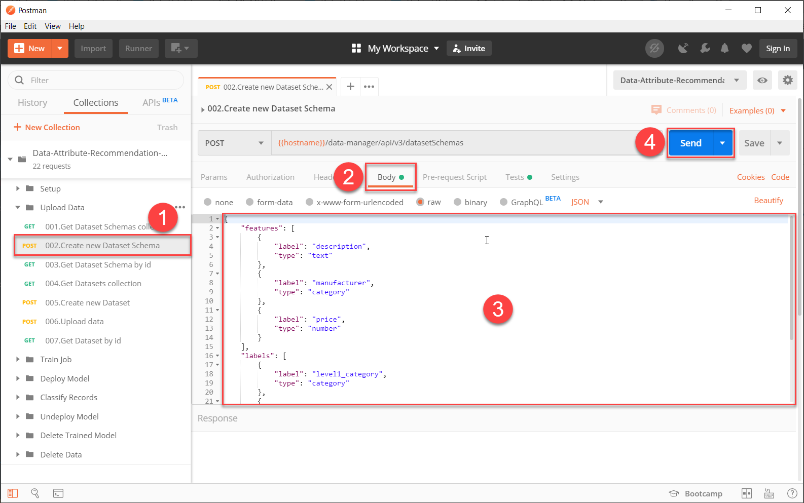
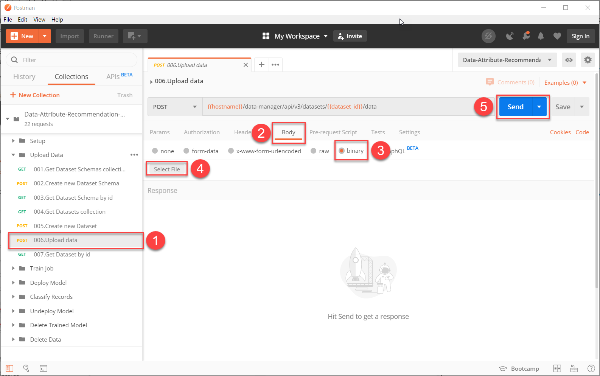
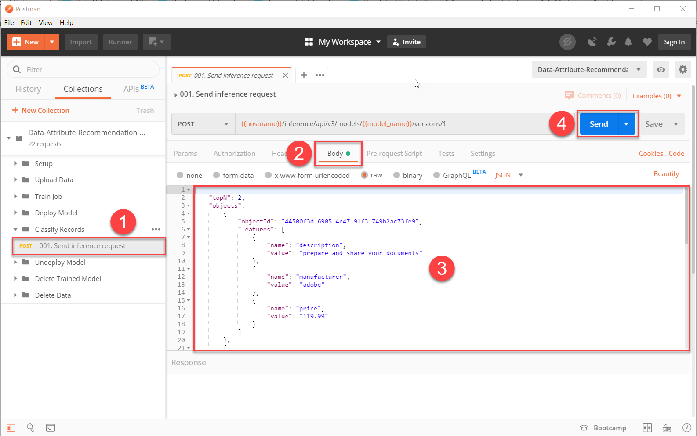

## Details
### You will learn
  - How to define a custom dataset schema
  - How to prepare your data for upload
  - How to classify your own data records using your Data Attribute Recommendation machine learning model

In this tutorial, you will use machine learning to classify your own data records and prepare a corresponding dataset schema. The steps that you have already learned in the previous tutorials will be once again needed to perform this tutorial. You will be given instructions, but if you need more details for each task, please review the respective tutorial.

Please note that trial mode has limits on number of schemas, datasets and models. In order to be able to run this tutorial end-to-end without hitting limits, it is recommended to perform a cleanup as described [here](cp-aibus-dar-classify-delete) or just re-create the service instance in SAP BTP Trial as described below.

---

[ACCORDION-BEGIN [Step 1: ](Prepare your data)]

In order to use your own dataset, you need to define a dataset schema that fits your dataset.

In your dataset, you need to decide which columns will be `features`, for example the inputs for the machine learning model and which columns will be `labels`, for example the fields that will be predicted by the machine learning model. For further definition of specific terms, see [Concepts](https://help.sap.com/viewer/105bcfd88921418e8c29b24a7a402ec3/SHIP/en-US/fe501df6d9f94361bfea066f9a6f6712.html).

After you have defined the features and the labels, you will need to note down your dataset schema. Paste the example below into a text file and adapt it to your needs.

Each column in your dataset is represented by a `label` (that is not a label in machine learning sense but rather a field name) and a `type`. The available types are `category`, `text` and `number`. Assign the correct type to each of your features and labels. Please find further description on each type in the [FAQ](https://help.sap.com/viewer/105bcfd88921418e8c29b24a7a402ec3/SHIP/en-US/f7683574a792413faff6f82055152c91.html) under `What kinds of training data can be processed by Data Attribute Recommendation?`

Note that in `labels` section only `category` types are allowed.

Now that you have created your dataset schema, make sure that you save the file.

```JSON
{
  "features": [
      {
          "label": "description",
          "type": "text"
      },
      {
          "label": "manufacturer",
          "type": "category"
      },
      {
          "label": "price",
          "type": "number"
      }
  ],
  "labels": [
      {
          "label": "level1_category",
          "type": "category"
      },
      {
          "label": "level2_category",
          "type": "category"
      },
      {
          "label": "level3_category",
          "type": "category"
      }
  ],
  "name": "my-dataset-schema"
}
```

Last but not least, you have to make sure that your dataset meets the [prerequisites](https://help.sap.com/viewer/105bcfd88921418e8c29b24a7a402ec3/SHIP/en-US/dbfbd4a0bd2a4a7a8ed9aa25bace7d91.html). The dataset has to:

  - be in the CSV format

  - use comma "," as delimiter

  - use UTF-8 encoding

  - include all the features and labels you have defined in your dataset schema as data columns

  - include no fields that are not used in your dataset schema

You can use this [dataset](https://github.com/SAP-samples/data-attribute-recommendation-postman-tutorial/blob/main/Tutorial_Example_Dataset.csv) as a reference.

[VALIDATE_1]
[ACCORDION-END]


[ACCORDION-BEGIN [Step 2: ](Create new dataset schema)]

Now that you have done the preparation, you can create a new dataset based on your dataset schema. Please refer to this [tutorial](cp-aibus-dar-upload-data) for more details.

First, open Postman and make sure that your `Data Attribute Recommendation environment` is selected. Now expand the `Data Attribute Recommendation collection` and open the subfolder `Setup`. Select the request `Get Authorization` and send the request to receive a new access token.

To create the dataset schema, expand the folder `Upload Data` and select the request `Create new Dataset Schema`. Now, make sure to move into the `Body` tab and paste in your previously created dataset schema. Then click **Send** to create the schema.



You have now successfully created a dataset schema.

[DONE]
[ACCORDION-END]


[ACCORDION-BEGIN [Step 3: ](Create new dataset)]

After you have created a dataset schema, you can go now ahead and create a dataset. Select the request `Create new Dataset` in the folder `Upload Data` and send the request to create the dataset.

You have now successfully created a dataset based on previously defined dataset schema.

[DONE]
[ACCORDION-END]


[ACCORDION-BEGIN [Step 4: ](Upload your data)]

Now, you can upload data to your dataset. Keep in mind that your data has to meet the requirements in order to be used. Please review this [tutorial](cp-aibus-dar-upload-data) for more details.

Select the request `Upload data` in the subfolder `Upload Data`. Move to the `Body` tab, select type as `Binary` and click **Select File** in order to select the CSV file that contains your data. click **Send**.



As you already know, the status of the dataset now changes to `VALIDATING` while the service validates your data.

> ### What just happened?
>
> The application now checks if the data that you have uploaded is a valid CSV file and if it has all the necessary fields that are specified within the schema.

Make sure to check the status of the dataset and the validation process by using the request `Get Dataset by id`. If the status changes to `SUCCEEDED`, your data is valid and you can move on with the next steps. If the status changes to `INVALID_DATA`, please review the requirements that your dataset has to meet. In this case, the response of the request will contain a tip why validation has failed.

[DONE]
[ACCORDION-END]


[ACCORDION-BEGIN [Step 5: ](Create training job and deploy your model)]

You can now go ahead and create a training job to train a machine learning model based on your data. Please see this [tutorial](cp-aibus-dar-model) for more details.

Expand the subfolder `Train Job` and select the request `Create new Job`. Send the request to trigger the creation of a training job.

The status of the training job is `PENDING` immediately after creation and will change to `RUNNING` once the training starts. Check the status of your training job by using the request `Get Job by id`. Once the status changes to `SUCCEEDED` you can proceed with the deployment of your model.

To deploy the machine learning model, expand the subfolder `Deploy Model` and select the request `Deploy Model by name`. Send the request to start the deployment.

The status of the deployment is `PENDING` after the start of the deployment. It will change to `SUCCEEDED` once the model is successfully deployed. Make sure to check the status of your deployment by using the request `Get Deployment by id` and move on when the deployment is done.

> ### What just happened?
>
> You have created a virtual container on SAP BTP that is awake and has the trained instance of the machine learning model uploaded into the memory and ready to serve inference (prediction) requests.

[DONE]
[ACCORDION-END]


[ACCORDION-BEGIN [Step 6: ](Classify records)]

Now you can finally classify your own data records. For more details, review this [tutorial](cp-aibus-dar-classify-delete).

Expand the subfolder `Classify Records` and select the request `Send inference request`. Next, move to the `Body` tab. In the text area, you now have to replace the body of the request with one that is in accordance with your dataset schema. Paste in the example below and adapt it to your needs.

You need to ensure that values for all features in your dataset schema are provided. Additionally, you can set the `topN`-parameter which defines how many options will be predicted.

```JSON
{
	"topN": 2,
	"objects": [
		{
			"objectId": "44500f3d-6905-4c47-91f3-749b2ac73fe9",
			"features": [
				{
					"name": "description",
					"value": "prepare and share your documents"
				},
				{
					"name": "manufacturer",
					"value": "adobe"
				},
				{
					"name": "price",
					"value": "119.99"
				}
			]
		}
  ]
}
```

When you have adapted the body of the request to your needs, click **Send** to send the request.



In the response, you find the values that the model predicted. This includes the value that is predicted and the probability. The probability describes how certain the model is about its prediction. If the probability is close to 1, the model is very certain.

> ### What just happened?
>
> You have successfully classified your own data records using the model that you have trained with your own custom data.

[DONE]
[ACCORDION-END]
