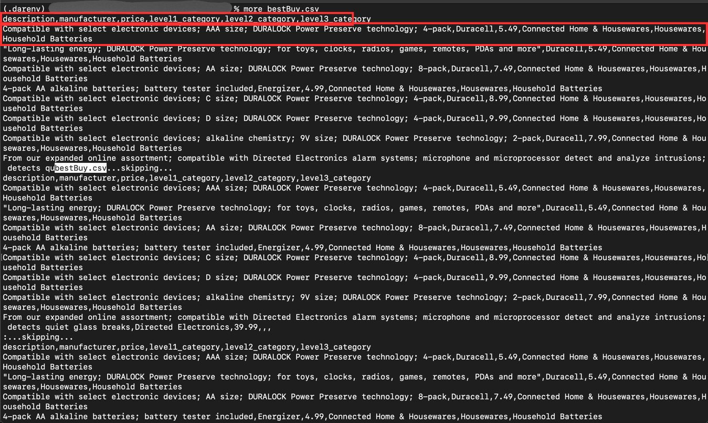
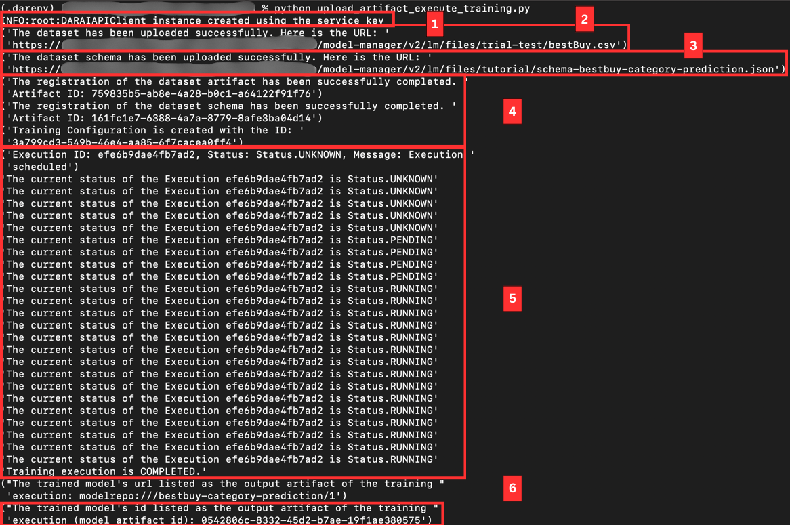
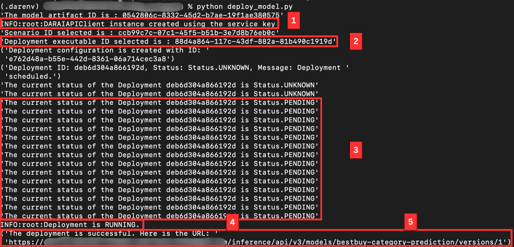
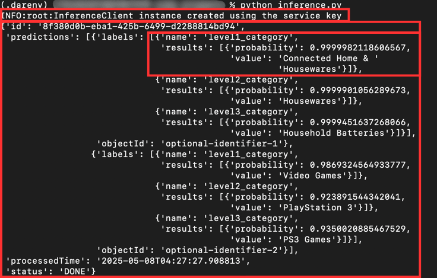
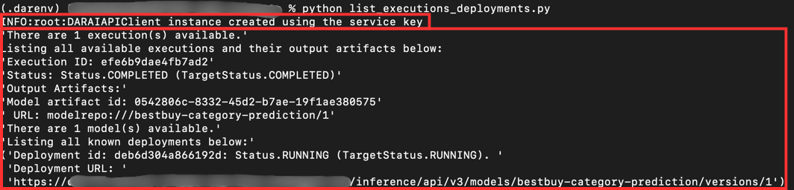
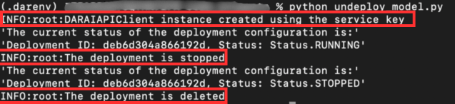

# Consume the SDK for Data Attribute Recommendation using the AI API from SAP AI Core
<!-- description --> Use the Python SDK to train machine learning models and run inference requests.

## You will learn
  - How to authenticate with your service instance of Data Attribute Recommendation using the AI API from SAP AI Core
  - How to upload data and train a machine learning model
  - How to make inference requests

## Intro
The repository and initial setup documentation of the SDK can be found [here](https://github.com/SAP/data-attribute-recommendation-python-sdk). A complete documentation, including API reference, can be found [here](https://data-attribute-recommendation-python-sdk.readthedocs.io/en/latest/index.html). See also the Help Portal documentation: [AI API Reference](https://help.sap.com/docs/data-attribute-recommendation/data-attribute-recommendation/consuming-service-via-ai-api). You can use this tutorial as the first point of contact with the SDK. Make sure to check the documentation since you can use the SDK to do much more than what is covered here.

---

### Get the dataset


First, you need to download the dataset used in this tutorial. The dataset can be found [here](https://github.com/SAP-samples/data-attribute-recommendation-postman-tutorial?tab=readme-ov-file#data-and-license) and includes data from the retail company Best Buy.

Make sure that you are in your virtual environment as explained in [Setup SDK for Data Attribute Recommendation](cp-aibus-dar-sdk-setup). Now, enter the following command to download the dataset from the repository:
```shell
curl -o bestBuy.csv "https://raw.githubusercontent.com/SAP-samples/data-attribute-recommendation-postman-tutorial/main/Tutorial_Example_Dataset.csv"
```

The dataset is then saved as `bestBuy.csv`.

[OPTION BEGIN [Windows]]

Enter `more bestBuy.csv` to take a look at the first few lines of the dataset. Exit the command with CTRL + C.

[OPTION END]

[OPTION BEGIN [Mac and Linux]]

Enter `head -n2 bestBuy.csv` to take a look at the first two lines of the dataset.

[OPTION END]



The first line of the output represents the head of the dataset, for example, the column names. The dataset contains product information, including a description, a price and three levels of categories the product belongs to. The other lines are actual rows in the dataset, representing a product.


### Provide service key


Next, you need to make the service key of your service instance available to the SDK so that it can authorize when communicating with your service instance. The service key will be saved in a file named `dar_service_key.json`.

[OPTION BEGIN [Windows]]

Enter `type nul > dar_service_key.json` to create an empty JSON file.

[OPTION END]

[OPTION BEGIN [Mac and Linux]]

Enter `touch dar_service_key.json` to create an empty JSON file.

[OPTION END]

Go ahead and open the newly created file in a text editor. Then, paste the complete service key that you created in [Use Free Tier to Set Up Account for Data Attribute Recommendation and Get Service Key](cp-aibus-dar-booster-free-key) or [Use Trial to Set Up Account for Data Attribute Recommendation and Get Service Key](cp-aibus-dar-booster-key) into the file and save it.


You are now all set to start using the service.


### Upload and register training data 


The first step is to upload dataset and dataset schema, and create artifact registration for both artifacts.

[OPTION BEGIN [Windows]]

Use the command `type nul > upload_artifact_execute_training.py` to create a new Python file.

[OPTION END]

[OPTION BEGIN [Mac and Linux]]

Use the command `touch upload_artifact_execute_training.py` to create a new Python file.

[OPTION END]

Now, open the newly created file in your preferred IDE or code editor, such as Visual Studio Code.

>When using Visual Studio Code, you can use the command `code .` to enter the directory in Visual Studio Code right from the command line.

Copy the below code into the file and save it:

```Python
import json
import pprint
from sap.aibus.dar.client.aiapi.dar_ai_api_client import DARAIAPIClient
from ai_api_client_sdk.models.artifact_create_response import ArtifactCreateResponse
from ai_api_client_sdk.models.artifact import Artifact

# Read file with service key and load from file
with open("dar_service_key.json") as file_handle:
    service_key = json.load(file_handle)

# Extract the credentials
url = service_key['url']
client_id = service_key['uaa']['clientid']
client_secret = service_key['uaa']['clientsecret']
auth_url = service_key['uaa']['url']

# Create a DAR AI API Client instance by extracting the credentials from the service key
dar_ai_api_client = DARAIAPIClient(
    base_url=url + '/model-manager/v2/lm',
    auth_url=auth_url + '/oauth/token',
    client_id=client_id,
    client_secret=client_secret
)

pprint.pprint("DARAIAPIClient instance created using the service key")


def upload_and_register_training_data():
    # Upload Dataset
    dataset_upload_response = dar_ai_api_client.file_upload_client.put_file(
        local_path='bestBuy.csv',
        remote_path='/trial-test/bestBuy.csv',
        overwrite=True,
    )

    dataset_url = dataset_upload_response.json()["url"]
    pprint.pprint(f"The dataset has been uploaded successfully. Here is the URL: {dataset_url}")

    # Define the DatasetSchema which describes the CSV layout and save as json file.
    new_schema = {
        "features": [
            {"label": "manufacturer", "type": "CATEGORY"},
            {"label": "description", "type": "TEXT"},
            {"label": "price", "type": "NUMBER"},
        ],
        "labels": [
            {"label": "level1_category", "type": "CATEGORY"},
            {"label": "level2_category", "type": "CATEGORY"},
            {"label": "level3_category", "type": "CATEGORY"},

        ],
        "name": "schema-bestbuy-category-prediction",
    }

    with open("schema-bestbuy-category-prediction.json", "w") as json_file:
        json.dump(new_schema, json_file, indent=4)

    # Upload DatasetSchema
    schema_upload_response = dar_ai_api_client.file_upload_client.put_file(
        local_path='schema-bestbuy-category-prediction.json',
        remote_path='/tutorial/schema-bestbuy-category-prediction.json',
        overwrite=True,
    )

    schema_url = schema_upload_response.json()["url"]
    pprint.pprint(f"The dataset schema has been uploaded successfully. "
                  f"Here is the URL: {schema_url}")

    # We select the ID of the "Generic model template" scenario
    SCENARIO_ID = "ccb99c7c-07c1-45f5-b51b-3e7d8b76eb0c"

    # The uploaded Dataset and DatasetSchema files are registered as artifacts
    artifact_response: ArtifactCreateResponse = dar_ai_api_client.artifact.create(
        name="bestbuy-dataset",
        kind=Artifact.Kind.DATASET,
        url=dataset_url,
        scenario_id=SCENARIO_ID,
        description="Best Buy dataset")

    dataset_artifact_id = artifact_response.id
    pprint.pprint(f"The registration of the dataset artifact has been successfully completed."
                  f" Artifact ID: {artifact_response.id}")

    artifact_response: ArtifactCreateResponse = dar_ai_api_client.artifact.create(
        name="bestbuy-datasetschema",
        kind=Artifact.Kind.OTHER,
        url=schema_url,
        scenario_id=SCENARIO_ID,
        description="Best Buy dataset schema")

    datasetschema_artifact_id = artifact_response.id
    pprint.pprint(f"The registration of the dataset schema has been successfully completed."
                  f" Artifact ID: {artifact_response.id}")
    return dataset_artifact_id, datasetschema_artifact_id

```

The above code first opens the file containing your service key and reads its values. It then creates an instance of the `DARAIAPIClient` using your service key.

Afterwards, `upload_and_register_training_data()` defines a dataset schema for the dataset that is used in this tutorial. A schema defines the structure of a dataset and determines which columns of the dataset are used as inputs (features) for the machine learning model and which columns should be predicted by the model (labels). In this case, general product information are provided and product categories should be predicted by the model.

Finally, the dataset and dataset schema are uploaded and registered as artifacts. The same file is used to create a training configuration and training execution, as detailed in the next step.


### Configure and execute model training 


A training configuration and a training execution are created to train a machine learning model based on the previously uploaded and registered data.

Now, open the already existing file `upload_artifact_execute_training.py` in your preferred IDE or code editor, such as Visual Studio Code.

>When using Visual Studio Code, you can use the command `code .` to enter the directory in Visual Studio Code right from the command line.

Copy the imports from the code snippet given below and append them to the existing imports in the file `upload_artifact_execute_training.py`, grouping them appropriately. Then, append the provided `configure_and_execute_training()` function to the end of the file, followed by the execution block including the `main()` function and the script entry point and save the changes:

```Python
import time
from ai_api_client_sdk.models.input_artifact_binding import InputArtifactBinding
from ai_api_client_sdk.models.parameter_binding import ParameterBinding
from ai_api_client_sdk.models.execution_create_response import ExecutionCreateResponse
from ai_api_client_sdk.models.execution import Execution

MODEL_NAME = "bestbuy-category-prediction"

def configure_and_execute_training(datasetschema_artifact_id, dataset_artifact_id):
    # We select the ID of the "Generic model template" scenario
    SCENARIO_ID = "ccb99c7c-07c1-45f5-b51b-3e7d8b76eb0c"

    # We select the ID of the "Generic Training Executable"
    TRAINING_EXECUTABLE_ID = "40dcde13-ce0f-45cc-aac0-74da78175305"

    # Create input artifact bindings
    input_artifact_bindings = [
        InputArtifactBinding(key="dataset", artifact_id=dataset_artifact_id),
        InputArtifactBinding(key="datasetSchema", artifact_id=datasetschema_artifact_id)
    ]

    parameter_bindings = [
        ParameterBinding(key="modelName", value=MODEL_NAME)
    ]

    training_configuration = dar_ai_api_client.configuration.create(
        name="bestbuy_category_prediction_training_config",
        scenario_id=SCENARIO_ID,
        executable_id=TRAINING_EXECUTABLE_ID,
        input_artifact_bindings=input_artifact_bindings,
        parameter_bindings=parameter_bindings,
    )
    pprint.pprint(f"Training Configuration is created with the ID: {training_configuration.id}")

    execution_response: ExecutionCreateResponse = dar_ai_api_client.execution.create(
        configuration_id=training_configuration.id)
    pprint.pprint(f"Execution ID: {execution_response.id}, "
                  f"Status: {execution_response.status},"
                  f" Message: {execution_response.message}")

    # Create a Training Execution and wait until the training is completed
    while True:
        training_execution: Execution = dar_ai_api_client.execution.get(
            execution_id=execution_response.id)
        if training_execution.status.name == "COMPLETED":
            pprint.pprint("Training execution is COMPLETED.")
            break

        pprint.pprint(f"The current status of the Execution {execution_response.id} is "
                      f"{training_execution.status}")
        time.sleep(20)

    pprint.pprint(
        f"The trained model's url listed as the output artifact of the training execution: "
        f"{training_execution.output_artifacts[0].url}")

    pprint.pprint(
        f"The trained model's id listed as the output artifact of the training execution "
        f"(model_artifact_id): {training_execution.output_artifacts[0].id}")

# Executing both the functions
def main():
    dataset_artifact_id, datasetschema_artifact_id = upload_and_register_training_data()
    configure_and_execute_training(datasetschema_artifact_id=datasetschema_artifact_id,
                               dataset_artifact_id=dataset_artifact_id)

if __name__ == "__main__":
     main()

```

In the function `configure_and_execute_training()` the training configuration is created first with the chosen `scenario_id` and `training_executable_id` and then the training execution is created to train the model on the uploaded data. While creating the training configuration please note that the `MODEL_NAME` must be unique. In case you are not running this sample for the first time you need to change the constant `MODEL_NAME`.

Both the functions `upload_and_register_training_data()` and `configure_and_execute_training()` are executed to initiate the process of uploading the data, registering the artifacts and then training the machine learning model.

Now, go back into the command prompt and use the command `python upload_artifact_execute_training.py` to run the code.

The execution of the code might take a while, but you can easily follow the process by reading the outputs:



  1.  The SDK retrieves an authentication token using your service key. It automatically retrieves a new one once the current one is expired.

  2.  The dataset schema is created and saved as a JSON, ready to be uploaded along with the dataset, which serves as a container for the training data.

  3.  The dataset (along with the dataset schema) is uploaded, the scenario is selected and the uploaded dataset and dataset schema are registered as artifacts.

  4.  Once the artifacts are registered, the training configuration is created using the scenario and training executable is selected.

  5.  After the training execution is created and until the training is completed, the status of the training is printed.

  6.  Finally, the trained model is listed as an output artifact of the training execution. Save the model artifact ID for later.

Now, you have successfully uploaded the training dataset and dataset schema, registered the artifacts and trained your machine learning model.


### Deploy model


Next, the machine learning model must be deployed. That means, the model becomes available for productive usage and can serve inference requests, for example, to make predictions.

Please note that deploying models can incur costs. See [Free Tier Option and Trial Account Technical Constraints](https://help.sap.com/docs/data-attribute-recommendation/data-attribute-recommendation/free-tier-option-and-trial-account-technical-constraints) and [Metering and Pricing](https://help.sap.com/docs/data-attribute-recommendation/data-attribute-recommendation/metering-and-pricing).

[OPTION BEGIN [Windows]]

Use the command `type nul > deploy_model.py` to create a new Python file.

[OPTION END]

[OPTION BEGIN [Mac and Linux]]

Use the command `touch deploy_model.py` to create a new Python file.

[OPTION END]

Now, open the newly created file in your preferred IDE or code editor, such as Visual Studio Code.

Copy the below code into the file, replace `MODEL_ARTIFACT_ID` with `training_execution.output_artifacts[0].id`, which is the ID of the trained model, and save it:

```Python
import json
import pprint
import time
from sap.aibus.dar.client.aiapi.dar_ai_api_client import DARAIAPIClient
from ai_api_client_sdk.models.input_artifact_binding import InputArtifactBinding
from ai_api_client_sdk.models.deployment_create_response import DeploymentCreateResponse
from ai_api_client_sdk.models.deployment import Deployment


# Replace the trained model's id using training execution's output artifacts.
MODEL_ARTIFACT_ID = 'XXXXXXXX-XXXX-XXXX-XXXX-XXXXXXXXXXXX'
pprint.pprint(f"The model artifact ID is : {MODEL_ARTIFACT_ID}")

# Read file with service key and load from file
with open("dar_service_key.json") as file_handle:
    service_key = json.load(file_handle)

# Extract the credentials
url = service_key['url']
client_id = service_key['uaa']['clientid']
client_secret = service_key['uaa']['clientsecret']
auth_url = service_key['uaa']['url']

# Create a DAR AI API Client instance by extracting the credentials from the service key
dar_ai_api_client = DARAIAPIClient(
    base_url=url + '/model-manager/v2/lm',
    auth_url=auth_url + '/oauth/token',
    client_id=client_id,
    client_secret=client_secret
)
pprint.pprint("DARAIAPIClient instance created using the service key")


# Scenario ID of Generic model template is selected
SCENARIO_ID = "ccb99c7c-07c1-45f5-b51b-3e7d8b76eb0c"
pprint.pprint(f"Scenario ID selected is : {SCENARIO_ID}")

# Deployment Executable is selected
DEPLOYMENT_EXECUTABLE_ID = "88d4a864-117c-43df-882a-81b490c1919d"
pprint.pprint(f"Deployment executable ID selected is : {DEPLOYMENT_EXECUTABLE_ID}")

# Create a deployment Configuration
input_artifact_bindings = [
    InputArtifactBinding(key="model", artifact_id=MODEL_ARTIFACT_ID)
]

deployment_configuration = dar_ai_api_client.configuration.create(
    name="bestbuy_category_prediction_deployment_config",
    scenario_id=SCENARIO_ID,
    executable_id=DEPLOYMENT_EXECUTABLE_ID,
    input_artifact_bindings=input_artifact_bindings,
)

pprint.pprint(f"Deployment configuration is created with ID: {deployment_configuration.id}")

# Create a Deployment
deployment_response: DeploymentCreateResponse = dar_ai_api_client.deployment.create(
    configuration_id=deployment_configuration.id)
pprint.pprint(f"Deployment ID: {deployment_response.id}, "
      f"Status: {deployment_response.status}, "
      f"Message: {deployment_response.message}")

while True:
    deployment_execution: Deployment = dar_ai_api_client.deployment.get(
        deployment_id=deployment_response.id)
    if deployment_execution.status.name == "RUNNING":
        pprint.pprint("Deployment is RUNNING.")
        break

    pprint.pprint(f"The current status of the Deployment {deployment_response.id} "
                  f"is {deployment_execution.status}")
    time.sleep(20)

pprint.pprint(f"The deployment is successful. "
              f"Here is the URL: {deployment_execution.deployment_url}")

```

As in the previous code snippet, the above code first opens the file containing your service key and reads its values. Then, it creates an instance of `DARAIAPIClient ` using your service key.

Afterwards, the deployment executable is selected, deployment configuration is created and the deployment of your machine learning model gets triggered and the code waits for the deployment to succeed.

Now, go back into the command prompt and use the command `python deploy_model.py` to run the code.

You can observe the current status of the deployment in the outputs:



  1. The SDK retrieves a new authentication token using your service key.

  2. The deployment executable corresponding to the scenario is selected.

  3. After creating the deployment configuration and starting the deployment, you can note that the status of the deployment is now `PENDING`.
   
  4. The code is now waiting for the deployment to finish and once it is done the status of the deployment changes to `RUNNING`.
   
  5. The deployment URL is printed. Save it for later.

Your machine learning model is now deployed and ready to make predictions.


### Make inference requests


Now, the model can be used to make predictions. To do so, you need to provide the inputs (features) which include the `manufacturer`, `description` and `price` of the product. The model will then predict three levels of categories.

[OPTION BEGIN [Windows]]

Use the command `type nul > inference.py` to create a new Python file.

[OPTION END]

[OPTION BEGIN [Mac and Linux]]

Use the command `touch inference.py` to create a new Python file.

[OPTION END]

Now, open the newly created file in your preferred IDE or code editor, such as Visual Studio Code.

Copy the below code into the file, replace `DEPLOYMENT_URL` with `deployment_execution.deployment_url`, which is the URL of the deployed model, and save it:

```Python
import json
import pprint
from sap.aibus.dar.client.inference_client import InferenceClient


# Replace the deployment URL with your model's URL
DEPLOYMENT_URL = "XXXXXXXXXXXX"

# Read file with service key
with open("dar_service_key.json") as file_handle:
    service_key = json.load(file_handle)

# Extract the credentials
url = service_key['url']
client_id = service_key['uaa']['clientid']
client_secret = service_key['uaa']['clientsecret']
auth_url = service_key['uaa']['url']

inference_client = InferenceClient.construct_from_credentials(
    dar_url=url,
    clientid=client_id,
    clientsecret=client_secret,
    uaa_url=auth_url,
)

pprint.pprint("InferenceClient instance created using the service key")

# The code passes two objects to be classified, each matching the training DatasetSchema.
objects_to_be_classified = [
    {
        "objectId": "optional-identifier-1",
        "features": [
            {"name": "manufacturer", "value": "Energizer"},
            {"name": "description", "value": "Alkaline batteries; 1.5V"},
            {"name": "price", "value": "5.99"},
        ],
    },
    {
        "objectId": "optional-identifier-2",
        "features": [
            {"name": "manufacturer", "value": "Eidos"},
            {"name": "description", "value": "Unravel a grim conspiracy at the brink of Revolution"},
            {"name": "price", "value": "19.99"},
        ],
    },
]
inference_response = inference_client.create_inference_request_with_url(
    url=DEPLOYMENT_URL,
    objects=objects_to_be_classified
)

pprint.pprint(inference_response)

```

The above code first reads your service key and then creates a new instance of the `InferenceClient`. Next, two objects are created, which will be classified by the model. Feel free to modify the values or to add more objects. Please keep in mind that an object must include all inputs (features) that were defined in the dataset schema. Last but not least, the objects are sent to the model to be classified.

Now, go back into the command prompt and use the command `python inference.py` to run the code.

The results of the classification are printed into the console:



For each object a prediction is made for all the outputs (labels) which are defined in the dataset schema. Each prediction includes the label `name` and the prediction result which is comprised of the `probability` and the predicted `value`. The probability represents how certain the model is about its prediction whereas 1 represents 100%.

For the first object, the model is very certain about its predictions as it even predicts the third level of category with a probability of 0.99.

For the second object, the model is very certain that the first level is `Video Games` but it is not so sure whether it is actually about `PlayStation 3`.

Please note that a high probability doesn't necessarily mean that the predicted value is correct. Whether the predicted values are correct or not largely depends on the quality of the training data.

You have now successfully gone through the whole process of uploading data, training a machine learning model, and using the model to make predictions.


### List all executions and deployments


It is worth to know how to list all the executions with model artifacts and deployments that you currently have, especially if you want to work with multiple models.

[OPTION BEGIN [Windows]]

Use the command `type nul > list_executions_deployments.py` to create a new Python file.

[OPTION END]

[OPTION BEGIN [Mac and Linux]]

Use the command `touch list_executions_deployments.py` to create a new Python file.

[OPTION END]

Now, open the newly created file in your preferred IDE or code editor, such as Visual Studio Code.

Copy the below code into the file and save it:

```Python
import json
import pprint
from sap.aibus.dar.client.aiapi.dar_ai_api_client import DARAIAPIClient


# Read file with service key and load from file
with open("dar_service_key.json") as file_handle:
    service_key = json.load(file_handle)

# Extract the credentials
url = service_key['url']
client_id = service_key['uaa']['clientid']
client_secret = service_key['uaa']['clientsecret']
auth_url = service_key['uaa']['url']

# Create a DAR AI API Client instance by extracting the credentials from the service key
dar_ai_api_client = DARAIAPIClient(
    base_url=url + '/model-manager/v2/lm',
    auth_url=auth_url + '/oauth/token',
    client_id=client_id,
    client_secret=client_secret
)

pprint.pprint("DARAIAPIClient instance created using the service key")

# Read all executions
executions = dar_ai_api_client.execution.query()
pprint.pprint("There are %s execution(s) available." % len(executions.resources))

if len(executions.resources) > 0:
    print("Listing all available executions and their output artifacts below:")
    for e in executions.resources:
        pprint.pprint(f"Execution ID: {e.id}")
        pprint.pprint(f"Status: {e.status} ({e.target_status})")

        if e.output_artifacts:
            pprint.pprint("Output Artifacts:")
            for artifact in e.output_artifacts:
                pprint.pprint(f"Model artifact id: {artifact.id}")
                pprint.pprint(f" URL: {artifact.url}")
        else:
            pprint.pprint("  No output artifacts found.")

# Read all deployments
deployments = dar_ai_api_client.deployment.query()
pprint.pprint("There are %s model(s) available." % len(deployments.resources))

# Print all the existing models along with their status
if len(deployments.resources) > 0:
    pprint.pprint("Listing all known deployments below:")
    for d in deployments.resources:
        pprint.pprint(f"{d}: {d.status} ({d.target_status}). Deployment URL: {d.deployment_url}")

```

The above code will retrieve the available executions along with the details including the status and output artifacts and also collection of models you currently have in status `RUNNING`.

Now, go back into the command prompt and use the command `python list_executions_deployments.py` to run the code.

This outputs the details of all the available models:



You can use this output to further manage your models, for example, to delete deployments, as described in the next step.


### Delete deployment


Finally, it is important to know how to delete a deployment, especially in productive accounts as unused deployments still incur costs.

[OPTION BEGIN [Windows]]

Use the command `type nul > undeploy_model.py` to create a new Python file.

[OPTION END]

[OPTION BEGIN [Mac and Linux]]

Use the command `touch undeploy_model.py` to create a new Python file.

[OPTION END]

Now, open the newly created file in your preferred IDE or code editor, such as Visual Studio Code.

Copy the below code into the file, replace `DEPLOYMENT_ID` with the ID of the deployment that needs to be deleted and save it:

```Python
import json
import pprint
import time
from ai_api_client_sdk.exception import AIAPINotFoundException
from ai_api_client_sdk.models.deployment_get_status_response import DeploymentGetStatusResponse
from ai_api_client_sdk.models.target_status import TargetStatus
from sap.aibus.dar.client.aiapi.dar_ai_api_client import DARAIAPIClient


# Replace with the DEPLOYMENT_ID that needs to be deleted
DEPLOYMENT_ID = "XXXXXXXXXXXXXXX"

# Read file with service key and load from file
with open("dar_service_key.json") as file_handle:
    service_key = json.load(file_handle)

# Extract the credentials
url = service_key['url']
client_id = service_key['uaa']['clientid']
client_secret = service_key['uaa']['clientsecret']
auth_url = service_key['uaa']['url']

# Create a DAR AI API Client instance by extracting the credentials from the service key
dar_ai_api_client = DARAIAPIClient(
    base_url=url + '/model-manager/v2/lm',
    auth_url=auth_url + '/oauth/token',
    client_id=client_id,
    client_secret=client_secret
)
pprint.pprint("DARAIAPIClient instance created using the service key")

deployment_response = dar_ai_api_client.deployment.get(deployment_id=DEPLOYMENT_ID)
pprint.pprint("The current status of the deployment configuration is:")
pprint.pprint(f"Deployment ID: {deployment_response.id}, Status: {deployment_response.status}")

def stop_deployment(deployment_id, timeout=300, poll_interval=10):
    dar_ai_api_client.deployment.modify(deployment_id=deployment_id,
                                        target_status=TargetStatus.STOPPED)
    start_time = time.time()
    while time.time() - start_time < timeout:
        if dar_ai_api_client.deployment.get(deployment_id=deployment_id).status.name == "STOPPED":
            pprint.pprint("The deployment is stopped")
            return
        time.sleep(poll_interval)
    raise TimeoutError("Stopping the deployment timed out")


def delete_deployment(deployment_id, timeout=300, poll_interval=5):
    dar_ai_api_client.execution.delete(execution_id=deployment_id)
    start_time = time.time()
    while time.time() - start_time < timeout:
        try:
            dar_ai_api_client.deployment.get(deployment_id=deployment_id)
            time.sleep(poll_interval)
        except AIAPINotFoundException:
            pprint.pprint("The deployment is deleted")
            return
    raise TimeoutError("Deleting the deployment timed out")

if deployment_response.status.name in ('STOPPED', 'UNKNOWN'):
    delete_deployment(DEPLOYMENT_ID)
else:
    stop_deployment(DEPLOYMENT_ID)
    pprint.pprint("The current status of the deployment configuration is:")
    deployment_response: DeploymentGetStatusResponse = dar_ai_api_client.deployment.get(
        deployment_id=DEPLOYMENT_ID)
    pprint.pprint(f"Deployment ID: {deployment_response.id}, Status: {deployment_response.status}")
    delete_deployment(DEPLOYMENT_ID)

```

The above code will make sure that the specified model is `undeployed`. Make sure to provide deployment IDs that exist or are in `RUNNING` status.

Now, go back into the command prompt and use the command `python undeploy_model.py` to run the code.

From the output, you can see the actions that have been taken. Once the deployment has been found, the current status of the deployment is checked and, if it is either `STOPPED` or `UNKNOWN`, the deployment is deleted directly. If the deployment is in `RUNNING` status, then it is `STOPPED` and later `DELETED`, as shown in the output.



You are now familiar with the basics of the AI API SDK and how to use the Data Attribute Recommendation service. Please have a look at the [documentation](https://data-attribute-recommendation-python-sdk.readthedocs.io/en/latest/index.html) if you want to dive deeper into the possibilities of the SDK.

---